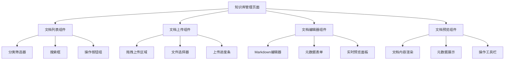
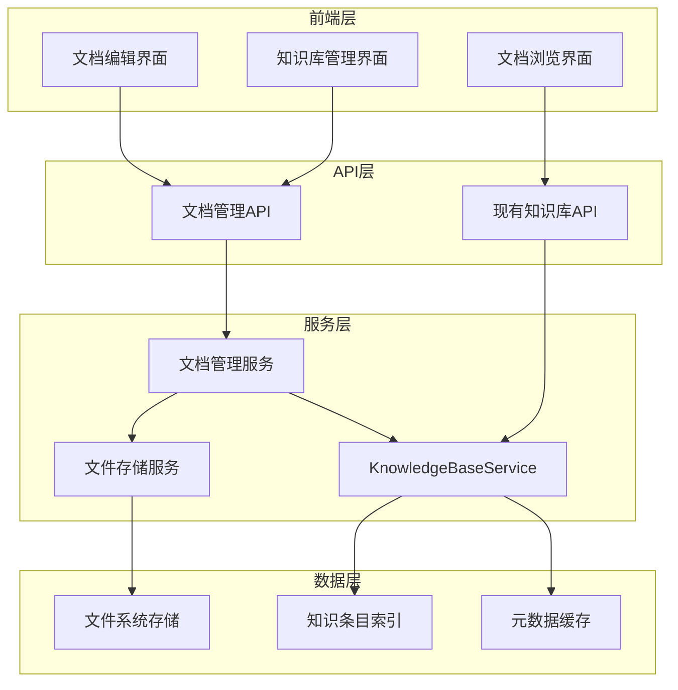
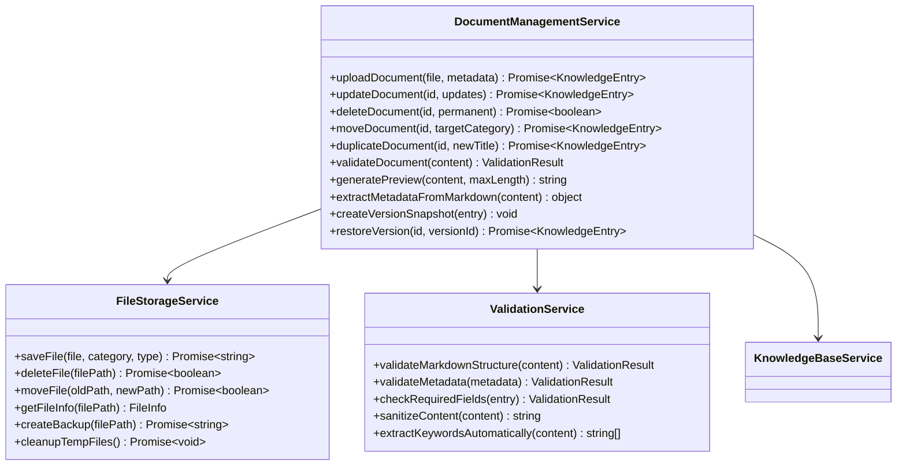
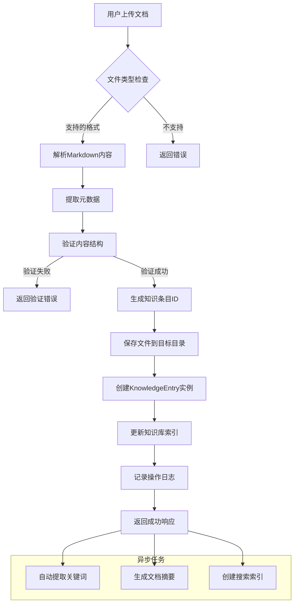
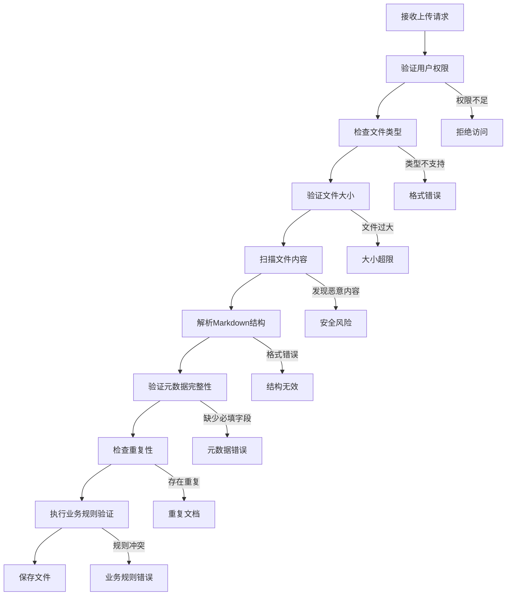
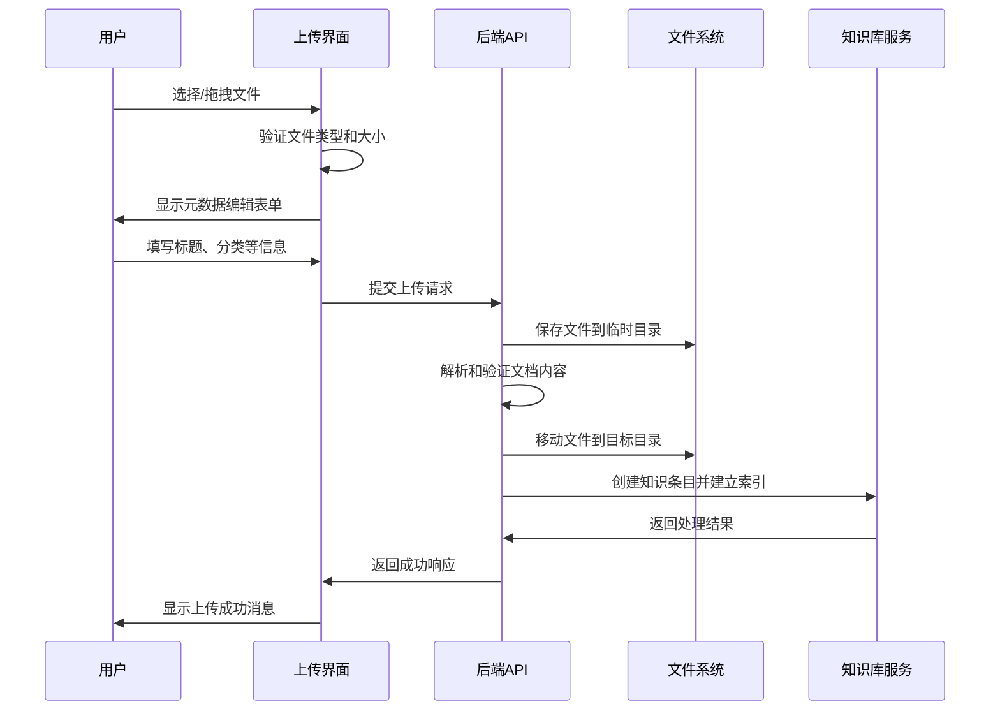
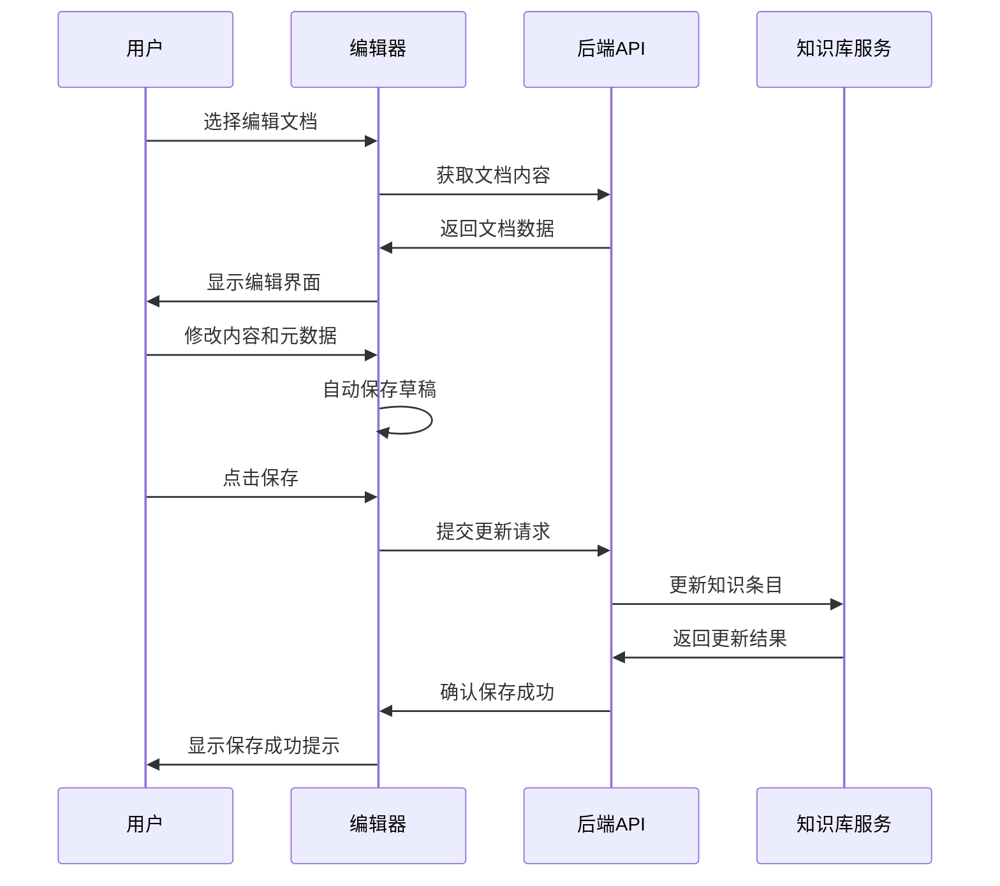
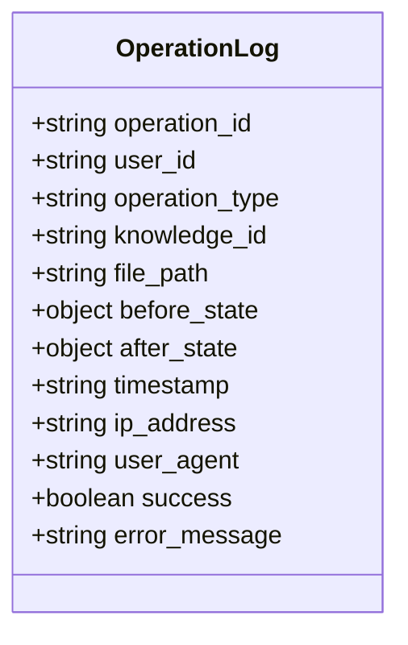

# 知识库管理模块设计

## 概述

知识库管理模块为智能运维助手系统提供完整的文档管理功能，允许用户上传、下载、查看、删除和管理运维知识文档。该模块基于现有的知识库服务架构进行扩展，支持操作规程和设备API两类知识文档的全生命周期管理。

系统当前已具备基础的知识检索和浏览功能，新增的管理模块将为运维人员提供更灵活的知识库维护能力，确保知识库内容的及时性和准确性。

## 技术栈与依赖

### 后端技术栈
- Node.js + Express.js 框架
- 文件系统操作：fs/promises
- 文档解析：markdown-it 或类似库  
- 文件上传：multer 中间件
- UUID生成：uuid v4
- 文件类型检测：file-type

### 前端技术栈  
- React + TypeScript
- 状态管理：Zustand
- 文件上传组件：React文件拖拽组件
- 文档预览：Markdown渲染器
- UI组件库：基于当前系统UI风格

## 架构设计

### 组件架构



### 系统集成架构



## 数据模型扩展

### 文档管理元数据模型

基于现有KnowledgeEntry模型，扩展管理相关的元数据：

| 字段名 | 数据类型 | 描述 |
|--------|----------|------|
| file_name | string | 原始文件名 |
| file_size | number | 文件大小（字节） |
| mime_type | string | MIME类型 |
| upload_time | string | 上传时间戳 |
| last_modified | string | 最后修改时间 |
| uploader | string | 上传者标识 |
| status | string | 文档状态（draft/published/archived） |
| version_history | array | 版本历史记录 |
| tags | array | 用户自定义标签 |
| is_locked | boolean | 是否被锁定编辑 |

### 目录结构管理

```
knowledge-base/
├── operation-procedures/
│   ├── performance/
│   ├── network/
│   ├── security/
│   └── maintenance/
├── device-apis/
│   ├── database/
│   ├── monitoring/
│   └── network/
├── uploads/
│   └── temp/
└── archived/
```

## API接口设计

### 文档上传接口

**POST /api/knowledge/upload**

请求参数：
- `file`: 上传的文件（multipart/form-data）
- `category`: 文档分类
- `knowledge_type`: 知识类型（operation-procedure/device-api）
- `metadata`: 可选的元数据JSON

响应格式：
```json
{
  "success": true,
  "data": {
    "knowledge_id": "uuid",
    "title": "文档标题",
    "file_name": "原始文件名",
    "file_path": "存储路径"
  }
}
```

### 文档更新接口

**PUT /api/knowledge/:id**

请求参数：
- `title`: 文档标题
- `content`: 文档内容
- `category`: 分类
- `keywords`: 关键词数组
- `priority`: 优先级

### 文档删除接口

**DELETE /api/knowledge/:id**

支持软删除和硬删除：
- 查询参数 `permanent=true` 进行硬删除
- 默认为软删除，移动到archived目录

### 文档下载接口

**GET /api/knowledge/:id/download**

返回原始Markdown文件下载流，包含完整的元数据和内容。

### 批量操作接口

**POST /api/knowledge/batch**

支持批量操作：
- `action`: 操作类型（delete/archive/publish/move）
- `ids`: 文档ID数组
- `target_category`: 目标分类（move操作用）

## 业务逻辑层设计

### 文档管理服务



### 文档处理流程



## 前端组件设计

### 知识库管理主页面

组件结构包含：
- 文档列表区域：支持网格和列表两种视图
- 分类导航树：按知识类型和分类组织
- 搜索和筛选工具栏
- 批量操作工具栏
- 文档状态统计面板

### 文档上传组件

功能特性：
- 拖拽上传支持
- 多文件批量上传
- 实时上传进度显示
- 支持的格式：.md, .markdown, .txt
- 文件大小限制：单文件最大5MB
- 自动元数据提取和编辑

### 文档编辑器组件

编辑器特性：
- 分屏式Markdown编辑器
- 实时预览功能
- 语法高亮
- 元数据表单编辑
- 自动保存草稿
- 版本历史对比

### 状态管理

基于Zustand实现的状态管理：

```typescript
interface DocumentStore {
  documents: KnowledgeEntry[]
  categories: string[]
  selectedCategory: string
  searchQuery: string
  uploading: boolean
  selectedDocuments: string[]
  
  // Actions
  loadDocuments: () => Promise<void>
  uploadDocument: (file: File, metadata: any) => Promise<void>
  updateDocument: (id: string, updates: any) => Promise<void>
  deleteDocument: (id: string, permanent?: boolean) => Promise<void>
  setSelectedCategory: (category: string) => void
  setSearchQuery: (query: string) => void
  toggleDocumentSelection: (id: string) => void
}
```

## 安全与权限控制

### 文件上传安全

- 文件类型白名单验证
- 文件内容恶意代码扫描
- 文件大小限制控制
- 上传频率限制
- 临时文件清理机制

### 权限控制设计

基于角色的权限控制：

| 角色 | 查看 | 上传 | 编辑 | 删除 | 管理 |
|------|------|------|------|------|------|
| 普通用户 | ✓ | - | - | - | - |
| 运维人员 | ✓ | ✓ | ✓ | 自己的文档 | - |
| 管理员 | ✓ | ✓ | ✓ | ✓ | ✓ |

### 数据验证



## 用户界面流程

### 文档上传流程



### 文档编辑流程



## 性能优化策略

### 文件处理优化

- 大文件分块上传
- 异步文档解析处理
- 临时文件定期清理
- 缩略图/预览缓存
- CDN静态资源分发

### 搜索性能优化

- 文档内容索引缓存
- 搜索结果分页加载
- 关键词高亮预计算
- 热门文档缓存优先级

### 前端性能优化

- 文档列表虚拟滚动
- 图片懒加载
- 编辑器按需加载
- 状态更新批量处理

## 错误处理与日志

### 错误分类处理

| 错误类型 | 处理策略 | 用户提示 |
|----------|----------|----------|
| 文件格式错误 | 拒绝上传，返回格式要求 | "不支持的文件格式，请上传.md文件" |
| 文件过大 | 拒绝上传，建议压缩 | "文件大小超过5MB限制" |
| 网络错误 | 自动重试，显示进度 | "上传中断，正在重试..." |
| 权限错误 | 重定向登录，记录尝试 | "权限不足，请联系管理员" |
| 服务器错误 | 记录详细日志，通用提示 | "服务暂时不可用，请稍后重试" |

### 操作日志记录



## 测试策略

### 单元测试覆盖

- 文档上传服务测试
- 文件验证逻辑测试
- 元数据解析测试
- 权限控制测试
- 错误处理测试

### 集成测试场景

- 完整的文档上传流程
- 文档编辑和更新流程
- 批量操作功能测试
- 并发上传测试
- 文件系统故障恢复测试

### 用户体验测试

- 不同浏览器兼容性测试
- 移动端响应式测试
- 大文件上传性能测试
- 网络异常情况测试
- 可访问性测试