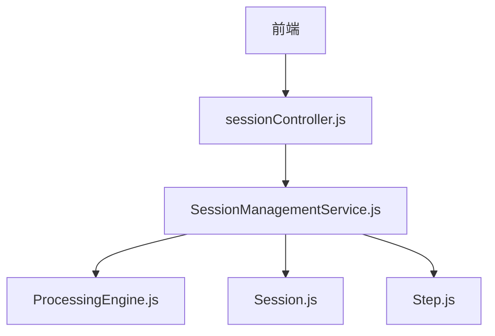
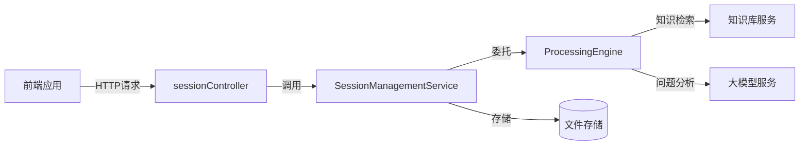
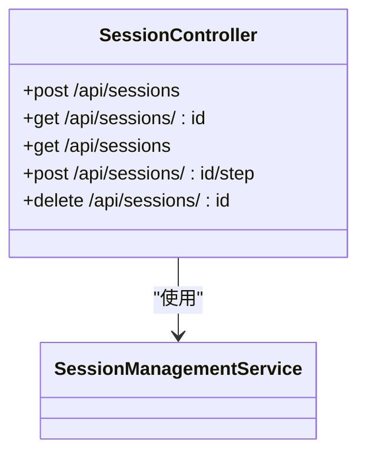
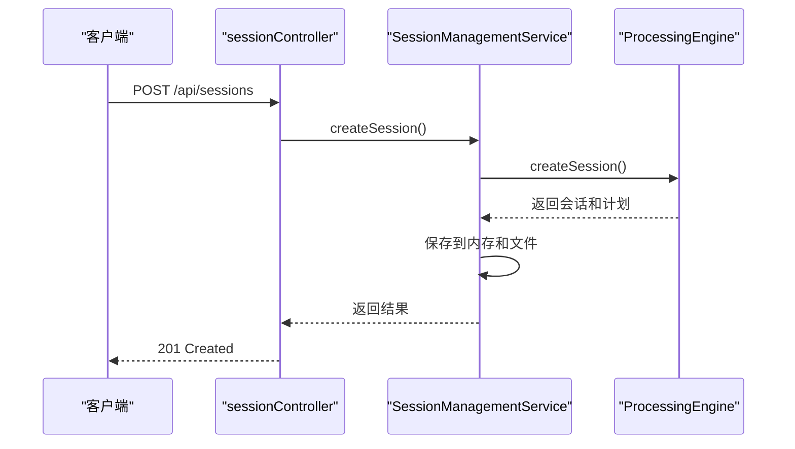
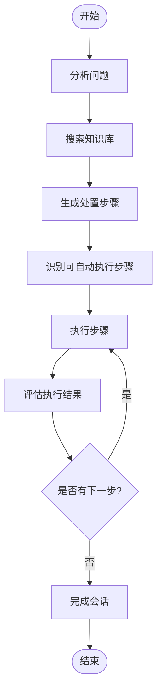
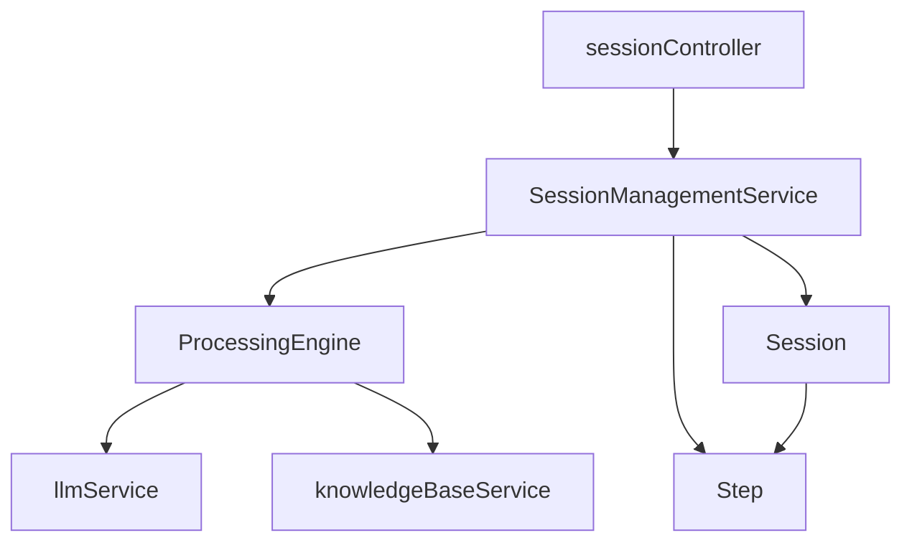

# 会话API

<cite>
**本文档引用的文件**
- [sessionController.js](file://backend/src/controllers/sessionController.js)
- [SessionManagementService.js](file://backend/src/services/SessionManagementService.js)
- [ProcessingEngine.js](file://backend/src/services/ProcessingEngine.js)
- [Session.js](file://backend/src/models/Session.js)
- [Step.js](file://backend/src/models/Step.js)
</cite>

## 目录
1. [简介](#简介)
2. [项目结构](#项目结构)
3. [核心组件](#核心组件)
4. [架构概述](#架构概述)
5. [详细组件分析](#详细组件分析)
6. [依赖分析](#依赖分析)
7. [性能考虑](#性能考虑)
8. [故障排除指南](#故障排除指南)
9. [结论](#结论)

## 简介
本API文档详细描述了智能运维系统中的会话管理功能。该系统通过RESTful API接口实现对问题处置会话的全生命周期管理，包括创建、执行、监控和完成等操作。会话管理服务与核心处置引擎协同工作，利用大模型分析问题并生成处置方案，支持自动和手动步骤的混合执行模式。

## 项目结构
后端会话管理相关代码主要位于`backend/src`目录下，包含控制器、服务、模型三个核心层级。控制器层处理HTTP请求，服务层实现业务逻辑，模型层定义数据结构。

**Diagram sources**
- [sessionController.js](file://backend/src/controllers/sessionController.js)
- [SessionManagementService.js](file://backend/src/services/SessionManagementService.js)
- [ProcessingEngine.js](file://backend/src/services/ProcessingEngine.js)

**Section sources**
- [sessionController.js](file://backend/src/controllers/sessionController.js)
- [SessionManagementService.js](file://backend/src/services/SessionManagementService.js)

## 核心组件
会话管理系统由五个核心组件构成：会话控制器负责接收HTTP请求；会话管理服务协调会话的生命周期；处置引擎驱动状态流转；会话模型定义会话数据结构；步骤模型管理单个处置步骤的状态。

**Section sources**
- [sessionController.js](file://backend/src/controllers/sessionController.js)
- [SessionManagementService.js](file://backend/src/services/SessionManagementService.js)
- [ProcessingEngine.js](file://backend/src/services/ProcessingEngine.js)
- [Session.js](file://backend/src/models/Session.js)
- [Step.js](file://backend/src/models/Step.js)

## 架构概述
系统采用分层架构设计，前端通过API与后端交互，后端各组件职责分明。会话控制器作为入口点，调用会话管理服务，后者又依赖于处置引擎来执行核心逻辑。

**Diagram sources**
- [sessionController.js](file://backend/src/controllers/sessionController.js)
- [SessionManagementService.js](file://backend/src/services/SessionManagementService.js)
- [ProcessingEngine.js](file://backend/src/services/ProcessingEngine.js)

## 详细组件分析
### 会话控制器分析
会话控制器实现了RESTful API端点，处理与会话相关的所有HTTP请求。每个端点都配备了相应的中间件进行参数验证和错误处理。

#### 控制器类图

**Diagram sources**
- [sessionController.js](file://backend/src/controllers/sessionController.js)

**Section sources**
- [sessionController.js](file://backend/src/controllers/sessionController.js)

### 会话管理服务分析
会话管理服务是系统的核心业务逻辑层，负责会话的创建、查询、更新和删除操作，并与处置引擎紧密协作。

#### 服务序列图

**Diagram sources**
- [SessionManagementService.js](file://backend/src/services/SessionManagementService.js)
- [ProcessingEngine.js](file://backend/src/services/ProcessingEngine.js)

**Section sources**
- [SessionManagementService.js](file://backend/src/services/SessionManagementService.js)

### 处置引擎分析
处置引擎负责驱动会话的状态流转，包括问题分析、方案生成、步骤执行和结果评估等关键流程。

#### 引擎工作流

**Diagram sources**
- [ProcessingEngine.js](file://backend/src/services/ProcessingEngine.js)

**Section sources**
- [ProcessingEngine.js](file://backend/src/services/ProcessingEngine.js)

## 依赖分析
系统各组件之间存在明确的依赖关系，形成了清晰的调用链路。

**Diagram sources**
- [sessionController.js](file://backend/src/controllers/sessionController.js)
- [SessionManagementService.js](file://backend/src/services/SessionManagementService.js)
- [ProcessingEngine.js](file://backend/src/services/ProcessingEngine.js)
- [Session.js](file://backend/src/models/Session.js)
- [Step.js](file://backend/src/models/Step.js)

**Section sources**
- [sessionController.js](file://backend/src/controllers/sessionController.js)
- [SessionManagementService.js](file://backend/src/services/SessionManagementService.js)
- [ProcessingEngine.js](file://backend/src/services/ProcessingEngine.js)

## 性能考虑
会话管理服务采用了内存+文件的双重存储策略，在保证性能的同时确保数据持久化。服务还实现了会话驱逐机制，当内存中会话数量达到上限时，会自动驱逐最旧的会话以释放内存。

## 故障排除指南
常见错误码包括404（会话未找到）和422（输入验证失败）。404错误通常发生在尝试访问不存在的会话ID时，而422错误则表示请求体中的数据不符合验证规则。

**Section sources**
- [sessionController.js](file://backend/src/controllers/sessionController.js)
- [SessionManagementService.js](file://backend/src/services/SessionManagementService.js)

## 结论
会话API提供了一套完整的RESTful接口，用于管理智能运维系统中的问题处置会话。通过会话控制器、会话管理服务和处置引擎的协同工作，系统能够有效地处理从问题创建到解决的整个流程。