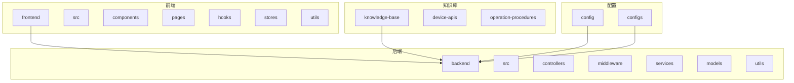
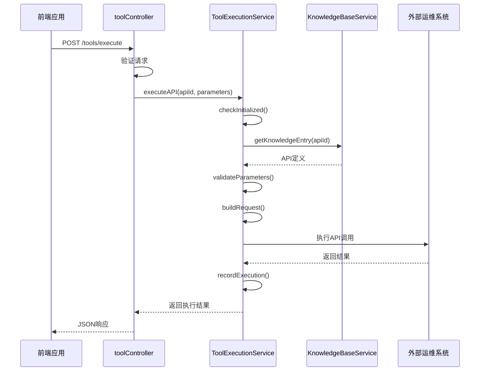
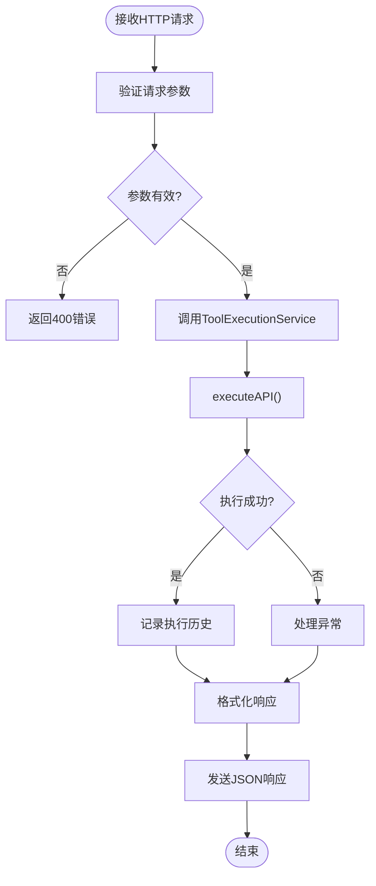
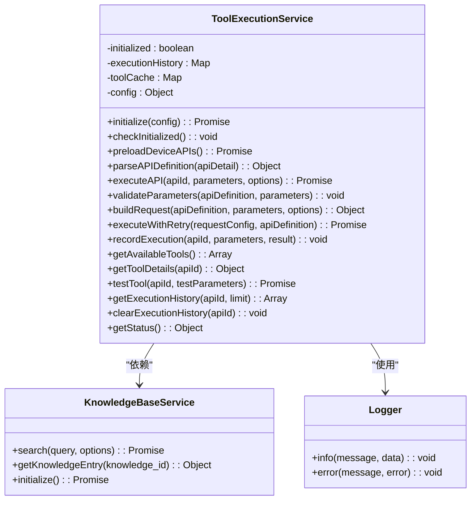
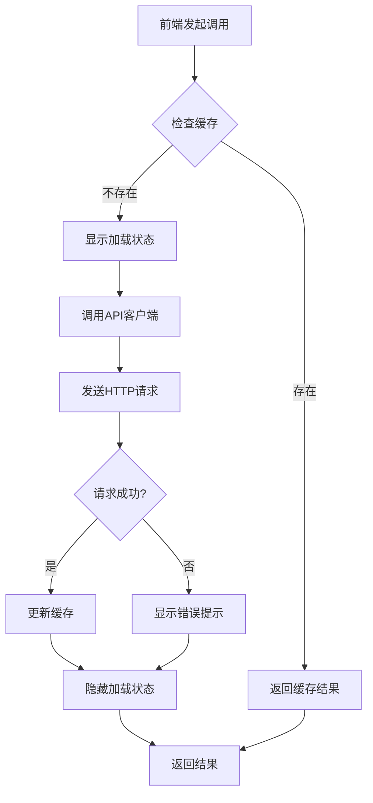
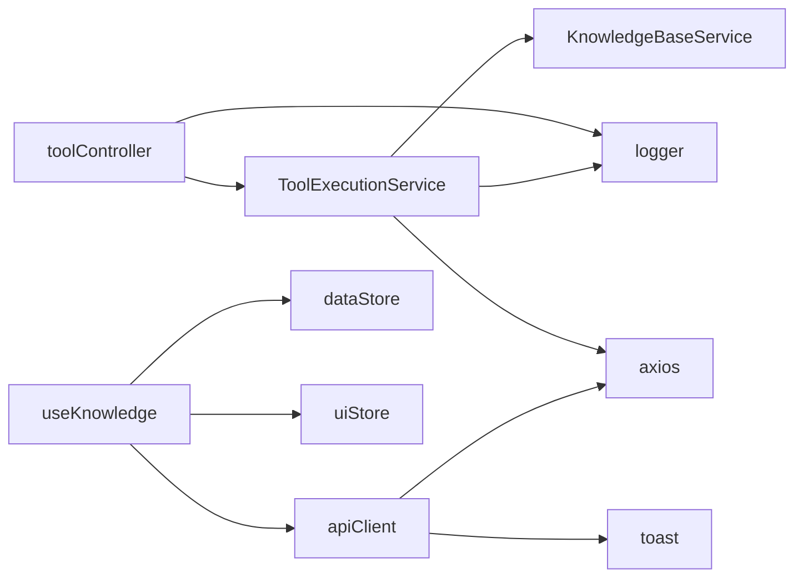

# 工具API

<cite>
**本文档引用的文件**
- [toolController.js](file://backend/src/controllers/toolController.js)
- [ToolExecutionService.js](file://backend/src/services/ToolExecutionService.js)
- [api.ts](file://frontend/src/utils/api.ts)
- [useKnowledge.ts](file://frontend/src/hooks/useKnowledge.ts)
- [database-management-api.md](file://knowledge-base/device-apis/database-management-api.md)
- [server-monitoring-api.md](file://knowledge-base/device-apis/server-monitoring-api.md)
- [app-config.json](file://configs/app-config.json)
</cite>

## 目录
1. [简介](#简介)
2. [项目结构](#项目结构)
3. [核心组件](#核心组件)
4. [架构概述](#架构概述)
5. [详细组件分析](#详细组件分析)
6. [依赖分析](#依赖分析)
7. [性能考虑](#性能考虑)
8. [故障排除指南](#故障排除指南)
9. [结论](#结论)

## 简介
本文档旨在为智能运维助手系统中的工具调用API提供全面的技术文档。重点描述了POST /api/tools/invoke接口，该接口用于触发预定义运维工具的执行。文档详细说明了请求体结构、同步/异步执行模式的区别、安全调度机制以及错误处理策略。通过本技术文档，开发人员和运维工程师可以深入了解如何使用该API来执行数据库管理、服务器监控等关键运维任务。

## 项目结构
智能运维助手系统的项目结构清晰地分为前端、后端和配置三个主要部分。后端服务位于`backend`目录中，包含控制器、中间件、服务和模型等核心组件。前端应用位于`frontend`目录中，采用React框架构建用户界面。知识库文档存储在`knowledge-base`目录中，包含了设备API和操作流程的详细说明。配置文件分布在`config`和`configs`目录中，用于管理系统参数和大模型配置。

**Diagram sources**
- [project_structure](file://README.md)

**Section sources**
- [project_structure](file://README.md)

## 核心组件
工具调用功能的核心组件包括`toolController.js`、`ToolExecutionService.js`和前端的`api.ts`。`toolController.js`负责处理HTTP请求并将其转发给服务层。`ToolExecutionService.js`是核心业务逻辑所在，它通过知识库服务加载API定义，并执行实际的工具调用。前端的`api.ts`提供了封装好的API客户端，简化了工具调用的前端实现。

**Section sources**
- [toolController.js](file://backend/src/controllers/toolController.js)
- [ToolExecutionService.js](file://backend/src/services/ToolExecutionService.js)
- [api.ts](file://frontend/src/utils/api.ts)

## 架构概述
工具调用API的架构设计遵循分层原则，确保了系统的可维护性和扩展性。前端通过API客户端发起请求，经过后端的路由和中间件处理后，由控制器将请求委托给工具执行服务。服务层从知识库中获取API定义，验证参数，构建请求并执行。整个过程支持重试机制和执行历史记录，保证了操作的可靠性和可追溯性。

**Diagram sources**
- [toolController.js](file://backend/src/controllers/toolController.js#L0-L55)
- [ToolExecutionService.js](file://backend/src/services/ToolExecutionService.js#L265-L320)

## 详细组件分析

### 工具控制器分析
工具控制器（toolController）是处理所有工具相关HTTP请求的入口点。它定义了多个路由，包括执行工具、获取工具列表、获取工具详情、测试工具连接、获取执行历史等功能。控制器的主要职责是解析HTTP请求，调用相应的服务方法，并格式化返回结果。

#### 对于API服务组件：

**Diagram sources**
- [toolController.js](file://backend/src/controllers/toolController.js#L0-L55)

**Section sources**
- [toolController.js](file://backend/src/controllers/toolController.js#L0-L149)

### 工具执行服务分析
工具执行服务（ToolExecutionService）是整个工具调用系统的核心。它负责初始化、预加载设备API信息、执行API调用、验证参数、构建请求、处理重试以及记录执行历史。服务通过单例模式实现，确保在整个应用程序生命周期内只有一个实例。

#### 对于对象导向组件：

**Diagram sources**
- [ToolExecutionService.js](file://backend/src/services/ToolExecutionService.js#L0-L53)

**Section sources**
- [ToolExecutionService.js](file://backend/src/services/ToolExecutionService.js#L0-L620)

### 前端工具调用分析
前端通过`useKnowledge`钩子和`apiClient`类实现了对工具API的调用。`apiClient`封装了所有的HTTP请求，提供了类型安全的接口。`useKnowledge`钩子则在React组件中提供了状态管理和缓存功能，优化了用户体验。

#### 对于复杂逻辑组件：

**Diagram sources**
- [useKnowledge.ts](file://frontend/src/hooks/useKnowledge.ts#L225-L269)
- [api.ts](file://frontend/src/utils/api.ts#L178-L210)

**Section sources**
- [useKnowledge.ts](file://frontend/src/hooks/useKnowledge.ts#L0-L338)
- [api.ts](file://frontend/src/utils/api.ts#L0-L234)

## 依赖分析
工具调用系统与其他组件之间存在明确的依赖关系。`toolController`依赖于`ToolExecutionService`和`logger`，而`ToolExecutionService`又依赖于`KnowledgeBaseService`来获取API定义。前端的`apiClient`依赖于axios进行HTTP通信，并使用react-hot-toast显示通知。这些依赖关系通过模块导入机制进行管理，确保了代码的解耦和可测试性。

**Diagram sources**
- [toolController.js](file://backend/src/controllers/toolController.js#L0-L55)
- [ToolExecutionService.js](file://backend/src/services/ToolExecutionService.js#L0-L53)
- [api.ts](file://frontend/src/utils/api.ts#L0-L234)

**Section sources**
- [toolController.js](file://backend/src/controllers/toolController.js#L0-L149)
- [ToolExecutionService.js](file://backend/src/services/ToolExecutionService.js#L0-L620)
- [api.ts](file://frontend/src/utils/api.ts#L0-L234)

## 性能考虑
工具执行服务在设计时充分考虑了性能因素。通过预加载设备API信息到内存缓存中，避免了每次调用时重复读取知识库的开销。服务配置了默认30秒的超时时间和最多3次的重试机制，平衡了可靠性与响应速度。执行历史记录限制为每个API最多100条，防止内存无限增长。此外，前端实现了缓存机制，减少了不必要的网络请求。

## 故障排除指南
当遇到工具调用问题