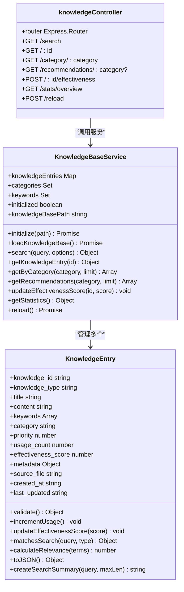
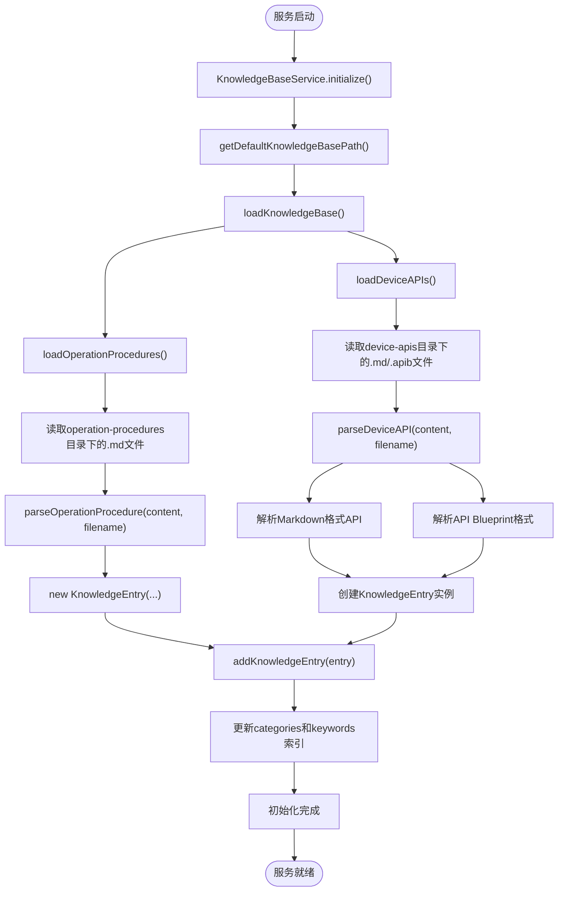
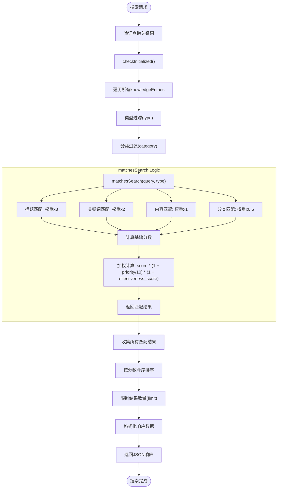

# 知识API

<cite>
**本文档引用的文件**
- [knowledgeController.js](file://backend/src/controllers/knowledgeController.js)
- [KnowledgeBaseService.js](file://backend/src/services/KnowledgeBaseService.js)
- [KnowledgeEntry.js](file://backend/src/models/KnowledgeEntry.js)
- [cpu-high-usage.md](file://knowledge-base/operation-procedures/cpu-high-usage.md)
- [database-management-api.md](file://knowledge-base/device-apis/database-management-api.md)
</cite>

## 目录
1. [简介](#简介)
2. [核心API接口](#核心api接口)
3. [知识条目结构](#知识条目结构)
4. [知识库服务架构](#知识库服务架构)
5. [知识库组织形式](#知识库组织形式)
6. [错误处理机制](#错误处理机制)
7. [前端集成建议](#前端集成建议)

## 简介
本API文档详细描述了智能运维助手应用程序中的知识检索与管理功能。系统通过`knowledgeController`控制器提供RESTful API接口，允许用户按关键词搜索知识条目、获取特定知识详情，并支持对知识库进行管理和统计分析。知识库服务从本地Markdown文件中加载和索引运维处置及设备操作API知识，实现高效快速的检索能力。

## 核心API接口

### 搜索知识条目 (GET /api/knowledge/search)
该接口用于根据关键词搜索知识库中的条目。

**请求参数：**
- `q` (必需): 搜索关键词
- `type`: 知识类型过滤（可选值：all, operation-procedure, device-api）
- `category`: 分类过滤（如performance, api等）
- `limit`: 返回结果数量限制（默认10）
- `minScore`: 最小匹配度评分（默认0.1）

**响应示例：**
```json
{
  "success": true,
  "data": {
    "query": "CPU",
    "options": {
      "type": "all",
      "category": null,
      "limit": 10,
      "minScore": 0.1
    },
    "total": 3,
    "results": [
      {
        "knowledge_id": "uuid-123",
        "title": "服务器高CPU使用率问题处置",
        "type": "operation-procedure",
        "category": "performance",
        "summary": "...服务器CPU使用率持续超过80%，可能导致系统响应缓慢...",
        "score": 8.5,
        "relevance": 0.9,
        "reasons": ["标题匹配: cpu", "关键词匹配: cpu, 高使用率"],
        "usage_count": 15,
        "effectiveness_score": 0.85
      }
    ]
  }
}
```

**Section sources**
- [knowledgeController.js](file://backend/src/controllers/knowledgeController.js#L1-L52)
- [KnowledgeBaseService.js](file://backend/src/services/KnowledgeBaseService.js#L394-L451)

### 获取知识详情 (GET /api/knowledge/:id)
该接口用于获取指定ID的知识条目详细信息。

**路径参数：**
- `id`: 知识条目唯一标识符

**响应示例：**
```json
{
  "success": true,
  "data": {
    "knowledge_id": "uuid-123",
    "knowledge_type": "operation-procedure",
    "title": "服务器高CPU使用率问题处置",
    "content": "# 服务器高CPU使用率问题处置\n\n<!-- metadata\n{...}\n-->\n\n## 问题现象\n...",
    "keywords": ["CPU", "高使用率", "性能", "服务器"],
    "category": "performance",
    "priority": 5,
    "usage_count": 16,
    "effectiveness_score": 0.85,
    "metadata": {
      "description": "服务器CPU使用率过高的诊断和处置方法",
      "fileSize": 1250,
      "lineCount": 97
    },
    "version": "1.0.0",
    "author": null,
    "source_file": "cpu-high-usage.md",
    "created_at": "2024-01-15T10:00:00Z",
    "last_updated": "2024-01-15T10:00:00Z"
  }
}
```

当请求的知识条目不存在时，返回404状态码：
```json
{
  "error": "知识条目不存在",
  "message": "知识条目 uuid-999 未找到"
}
```

**Section sources**
- [knowledgeController.js](file://backend/src/controllers/knowledgeController.js#L47-L108)
- [KnowledgeBaseService.js](file://backend/src/services/KnowledgeBaseService.js#L444-L451)

### 其他管理接口
系统还提供了以下辅助接口：

#### 按分类获取知识 (GET /api/knowledge/category/:category)
根据分类获取相关知识条目，结果按使用次数和有效性评分综合排序。

#### 获取推荐知识 (GET /api/knowledge/recommendations/:category?)
获取基于问题分类和流行度的推荐知识条目。

#### 更新有效性评分 (POST /api/knowledge/:id/effectiveness)
更新知识条目的有效性评分（0-1之间），用于优化搜索排名。

#### 获取统计信息 (GET /api/knowledge/stats/overview)
获取知识库的统计概览，包括总条目数、按类型/分类统计、最常用和最有效的知识条目等。

#### 重新加载知识库 (POST /api/knowledge/reload)
强制重新加载知识库，适用于知识库文件更新后同步变更。

**Section sources**
- [knowledgeController.js](file://backend/src/controllers/knowledgeController.js#L101-L166)
- [KnowledgeBaseService.js](file://backend/src/services/KnowledgeBaseService.js#L486-L582)

## 知识条目结构
每个知识条目包含以下核心属性：

| 属性 | 类型 | 描述 |
|------|------|------|
| knowledge_id | string | 知识条目唯一标识符（UUID） |
| knowledge_type | string | 知识类型（operation-procedure或device-api） |
| title | string | 知识标题 |
| content | string | 完整内容（Markdown格式） |
| keywords | array | 关键词列表 |
| category | string | 分类标签 |
| priority | number | 优先级（0-10） |
| usage_count | number | 使用次数（访问计数） |
| effectiveness_score | number | 有效性评分（0-1） |
| metadata | object | 元数据信息 |
| source_file | string | 来源文件路径 |
| created_at | string | 创建时间 |
| last_updated | string | 最后更新时间 |

在搜索结果中，除了基本属性外，还包括：
- `score`: 匹配度评分
- `relevance`: 相关性得分（0-1）
- `reasons`: 匹配原因说明
- `summary`: 基于查询关键词生成的内容摘要

**Section sources**
- [KnowledgeEntry.js](file://backend/src/models/KnowledgeEntry.js#L0-L50)
- [KnowledgeEntry.js](file://backend/src/models/KnowledgeEntry.js#L174-L226)

## 知识库服务架构
知识库服务采用分层架构设计，主要组件及其关系如下：



**Diagram sources**
- [KnowledgeBaseService.js](file://backend/src/services/KnowledgeBaseService.js#L0-L49)
- [KnowledgeEntry.js](file://backend/src/models/KnowledgeEntry.js#L0-L50)
- [knowledgeController.js](file://backend/src/controllers/knowledgeController.js#L0-L52)

### 初始化流程


**Diagram sources**
- [KnowledgeBaseService.js](file://backend/src/services/KnowledgeBaseService.js#L44-L94)
- [KnowledgeBaseService.js](file://backend/src/services/KnowledgeBaseService.js#L100-L200)

### 搜索匹配逻辑


**Diagram sources**
- [KnowledgeBaseService.js](file://backend/src/services/KnowledgeBaseService.js#L394-L451)
- [KnowledgeEntry.js](file://backend/src/models/KnowledgeEntry.js#L132-L177)

## 知识库组织形式
知识库采用文件系统目录结构进行组织，位于`knowledge-base`目录下，分为两个主要类别：

### 运维处置知识库 (operation-procedures)
存放各类运维问题的处置方案，以Markdown文件形式存储。

**示例文件：** `knowledge-base/operation-procedures/cpu-high-usage.md`
```markdown
# 服务器高CPU使用率问题处置

<!-- metadata
{
  "category": "performance",
  "keywords": ["CPU", "高使用率", "性能", "服务器"],
  "description": "服务器CPU使用率过高的诊断和处置方法"
}
-->

## 问题现象
服务器CPU使用率持续超过80%，可能导致：
- 系统响应缓慢
- 应用程序性能下降
- 用户访问超时
- 系统不稳定

## 处置步骤
### 1. 确认CPU使用率情况
首先使用系统命令查看当前CPU使用率：

```bash
top -bn1 | grep "Cpu(s)"
htop
vmstat 1 5
```

...
```

### 设备操作API知识库 (device-apis)
存放设备管理API的文档，支持Markdown和API Blueprint格式。

**示例文件：** `knowledge-base/device-apis/database-management-api.md`
```markdown
# 数据库管理API

## 数据库状态监控

### GET /api/database/status
获取数据库服务状态

**URL:** `http://db-manager:8080/api/database/status`

**Method:** GET

**Description:** 获取数据库服务的运行状态和基本性能指标

**Parameters:**

| 参数名 | 类型 | 是否必需 | 描述 |
|--------|------|----------|------|
| detailed | boolean | 否 | 是否返回详细状态信息 |

...
```

**Section sources**
- [cpu-high-usage.md](file://knowledge-base/operation-procedures/cpu-high-usage.md)
- [database-management-api.md](file://knowledge-base/device-apis/database-management-api.md)

## 错误处理机制
系统实现了完善的错误处理机制，确保API调用的健壮性和用户体验。

### 客户端输入验证
- **空查询关键词**: 返回400状态码，提示"查询关键词不能为空"
- **无效的有效性评分**: 返回400状态码，提示"有效性评分必须在0-1之间"
- **未知知识类型**: 在搜索时自动忽略或返回空结果集

### 服务端异常处理
- **知识条目不存在**: 返回404状态码，包含详细的错误信息
- **服务未初始化**: 抛出内部错误，记录日志并返回500状态码
- **文件读取失败**: 记录警告日志，跳过该文件继续处理其他文件

### 错误响应格式
统一的错误响应格式提高了客户端处理的一致性：
```json
{
  "error": "错误类型",
  "message": "详细的错误描述信息"
}
```

**Section sources**
- [knowledgeController.js](file://backend/src/controllers/knowledgeController.js#L1-L166)
- [KnowledgeEntry.js](file://backend/src/models/KnowledgeEntry.js#L47-L97)

## 前端集成建议
前端应用可以通过`useKnowledge`自定义Hook便捷地集成知识API功能。

### 主要功能方法
```typescript
const {
  // 状态
  searchResults,
  isKnowledgeLoading,
  knowledgeError,
  knowledgeStats,

  // 操作方法
  searchKnowledge,
  getKnowledgeEntry,
  getKnowledgeByCategory,
  getRecommendations,
  updateEffectivenessScore,
  loadKnowledgeStats,
  
  // 辅助方法
  searchWithDebounce,
  getSearchSuggestions
} = useKnowledge()
```

### 最佳实践
1. **防抖搜索**: 使用`searchWithDebounce`方法避免频繁请求
2. **缓存管理**: 利用数据存储(store)缓存搜索结果和知识详情
3. **错误提示**: 通过toast组件向用户展示友好的错误信息
4. **加载状态**: 显示加载指示器提升用户体验
5. **反馈循环**: 鼓励用户对知识条目进行评分，优化搜索质量

**Section sources**
- [useKnowledge.ts](file://frontend/src/hooks/useKnowledge.ts)
- [api.ts](file://frontend/src/utils/api.ts#L207-L234)