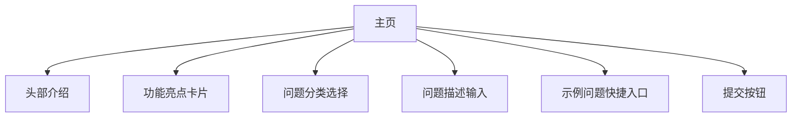
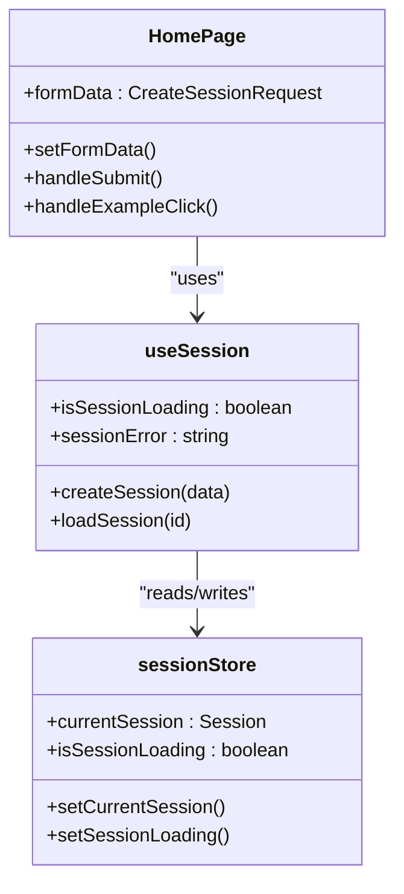
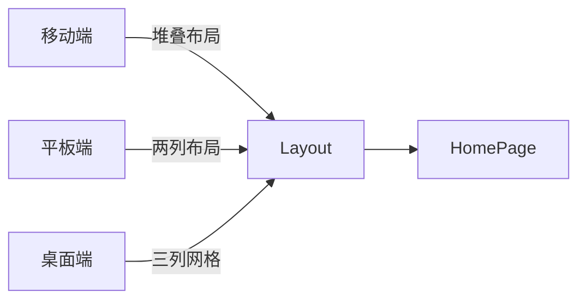
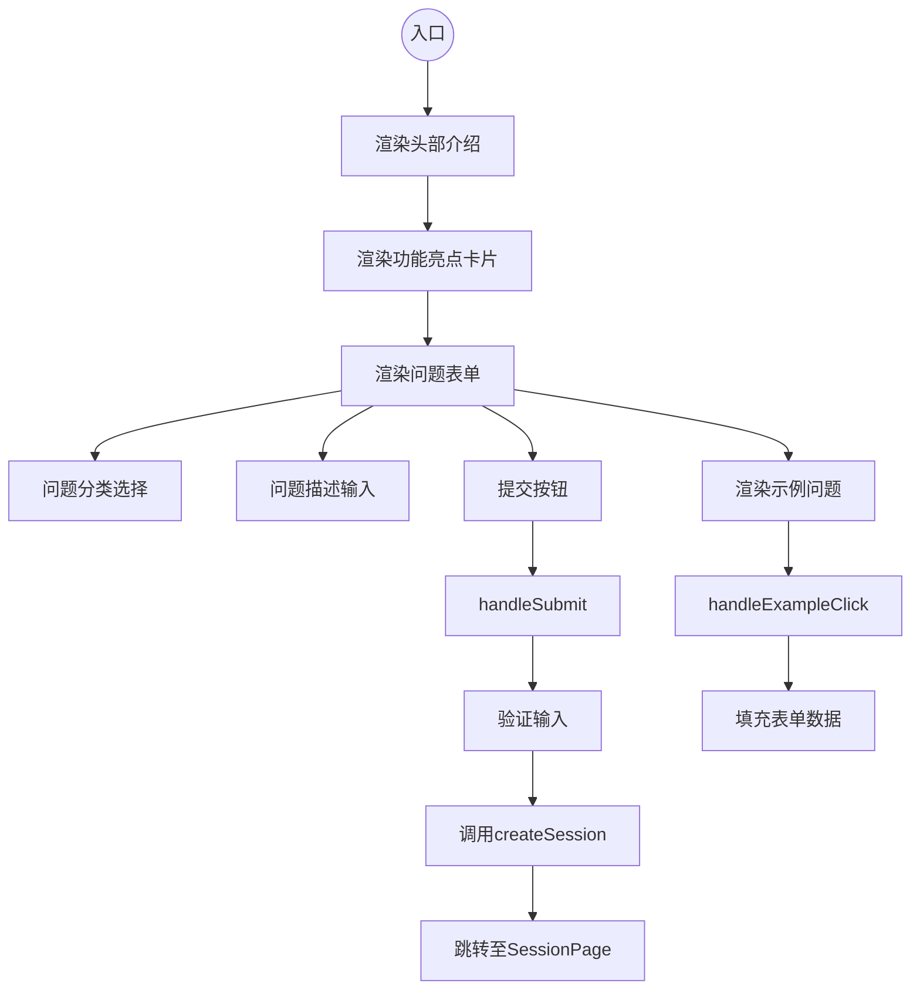

# 主页 (HomePage)

<cite>
**本文档中引用的文件**
- [HomePage.tsx](file://frontend/src/pages/HomePage.tsx)
- [useSession.ts](file://frontend/src/hooks/useSession.ts)
- [sessionStore.ts](file://frontend/src/stores/sessionStore.ts)
- [api.ts](file://frontend/src/utils/api.ts)
</cite>

## 目录
1. [简介](#简介)
2. [功能设计与交互逻辑](#功能设计与交互逻辑)
3. [UI元素构成分析](#ui元素构成分析)
4. [状态管理与数据流](#状态管理与数据流)
5. [路由跳转机制](#路由跳转机制)
6. [用户体验流程定位](#用户体验流程定位)
7. [响应式设计表现](#响应式设计表现)
8. [核心代码结构](#核心代码结构)

## 简介
`HomePage` 是智能运维助手系统的入口页面，承担着欢迎用户、引导操作和启动新会话的核心职责。作为系统的第一接触点，该页面通过清晰的信息架构和直观的操作界面，帮助用户快速理解系统能力并开始使用。

## 功能设计与交互逻辑

`HomePage` 页面主要实现三大核心功能：展示欢迎信息、提供问题提交表单以及预设示例问题引导。用户可通过选择问题分类、填写详细描述来发起一个新的诊断会话。页面内置验证机制确保必要字段完整后才允许提交。

当用户点击“开始分析”按钮时，页面调用 `useSession` 自定义 Hook 中的 `createSession` 方法创建新会话，并在成功后自动跳转至对应的 `SessionPage`。此外，页面还提供了多个典型问题示例，用户点击即可一键填充表单内容，降低使用门槛。

**Section sources**
- [HomePage.tsx](file://frontend/src/pages/HomePage.tsx#L7-L207)

## UI元素构成分析

页面采用模块化布局，包含以下关键UI组件：

1. **头部介绍区**：显示系统名称“智能运维助手”及简要说明文案，突出AI驱动的运维解决方案定位。
2. **统计信息卡片组**：三列布局展示“知识库驱动”、“智能分析”和“渐进式处置”三大特性，配合图标增强可视化效果。
3. **问题提交表单**：
   - 问题分类单选区域（支持六种运维问题类型）
   - 问题描述多行文本输入框（含占位提示）
   - 提交按钮（带加载状态反馈）
4. **示例问题列表**：展示三个典型场景供用户快速参考和复用。

所有UI元素均采用Tailwind CSS进行样式控制，具备良好的视觉层次和交互反馈。



**Diagram sources**
- [HomePage.tsx](file://frontend/src/pages/HomePage.tsx#L7-L207)

**Section sources**
- [HomePage.tsx](file://frontend/src/pages/HomePage.tsx#L7-L207)

## 状态管理与数据流

页面通过 React 的 `useState` 管理本地表单状态（`formData`），并与全局状态管理系统深度集成。具体数据流如下：

- 使用 `useSession` Hook 访问来自 `sessionStore` 的全局会话状态
- 表单变更通过 `setFormData` 实现受控组件更新
- 提交过程中依赖 `isSessionLoading` 状态控制按钮禁用与加载动画
- 错误处理由 `useSession` 内部统一捕获并通过 `toast` 组件提示用户

这种分层状态管理模式既保证了局部交互的响应性，又实现了跨页面的状态一致性。



**Diagram sources**
- [HomePage.tsx](file://frontend/src/pages/HomePage.tsx#L7-L207)
- [useSession.ts](file://frontend/src/hooks/useSession.ts#L7-L175)
- [sessionStore.ts](file://frontend/src/stores/sessionStore.ts#L50-L163)

**Section sources**
- [HomePage.tsx](file://frontend/src/pages/HomePage.tsx#L7-L207)
- [useSession.ts](file://frontend/src/hooks/useSession.ts#L7-L175)

## 路由跳转机制

页面通过 `react-router-dom` 提供的 `useNavigate` Hook 实现声明式导航。当会话创建成功后，执行以下跳转逻辑：

```typescript
navigate(`/session/${result.session.session_id}`)
```

此操作将用户引导至以会话ID为路径参数的 `SessionPage`，确保每个诊断过程都有独立且可分享的URL地址。整个流程无需刷新页面，提供流畅的单页应用体验。

**Section sources**
- [HomePage.tsx](file://frontend/src/pages/HomePage.tsx#L8-L8)
- [HomePage.tsx](file://frontend/src/pages/HomePage.tsx#L39-L54)

## 用户体验流程定位

`HomePage` 在整体用户体验流程中处于**起始节点**位置，其设计目标是最大限度降低用户启动成本。通过以下方式优化用户旅程：

- 清晰传达系统价值主张（AI+知识库驱动的智能运维）
- 提供结构化输入引导（分类+详细描述模板）
- 支持快速上手（示例问题一键填充）
- 即时反馈机制（表单验证、加载状态、错误提示）

该页面有效衔接了访客到使用者的身份转换，为后续复杂的诊断流程奠定良好基础。

## 响应式设计表现

页面充分考虑多设备访问需求，采用移动优先的响应式设计策略：

- 在移动端堆叠显示三列功能卡片
- 表单控件适配触屏操作尺寸
- 使用 `max-w-4xl mx-auto` 限制最大宽度，保证阅读舒适性
- 文字内容自动换行处理，避免水平滚动

结合 Tailwind CSS 的断点系统，确保从手机到桌面端均有良好视觉呈现。



**Diagram sources**
- [HomePage.tsx](file://frontend/src/pages/HomePage.tsx#L7-L207)

## 核心代码结构

以下是 `HomePage` 组件的关键JSX结构与事件处理器映射：



关键事件处理器包括：
- `handleSubmit`: 处理表单提交，触发会话创建
- `handleExampleClick`: 处理示例点击，自动填充表单

这些处理器共同构成了页面的核心交互逻辑闭环。

**Diagram sources**
- [HomePage.tsx](file://frontend/src/pages/HomePage.tsx#L7-L207)
- [HomePage.tsx](file://frontend/src/pages/HomePage.tsx#L39-L54)
- [HomePage.tsx](file://frontend/src/pages/HomePage.tsx#L56-L61)

**Section sources**
- [HomePage.tsx](file://frontend/src/pages/HomePage.tsx#L7-L207)