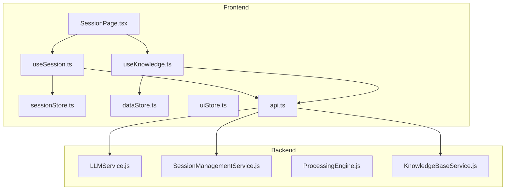
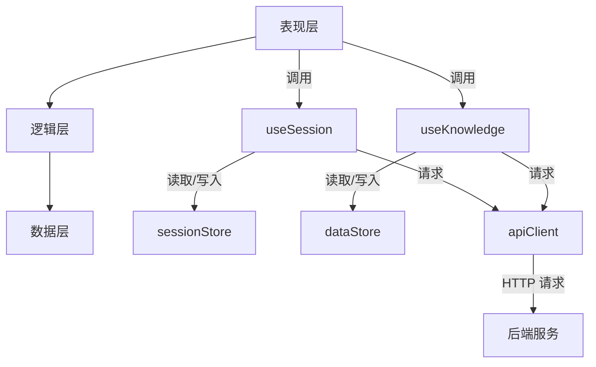
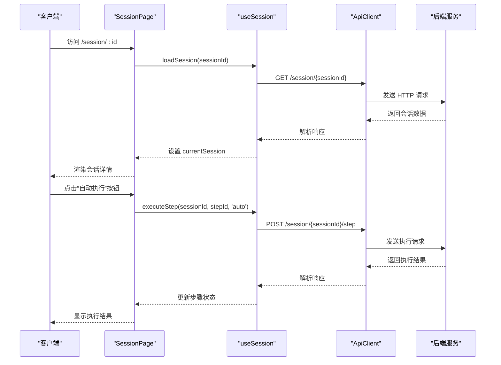
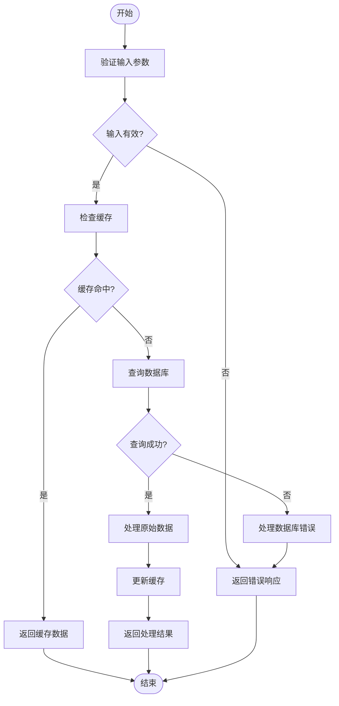
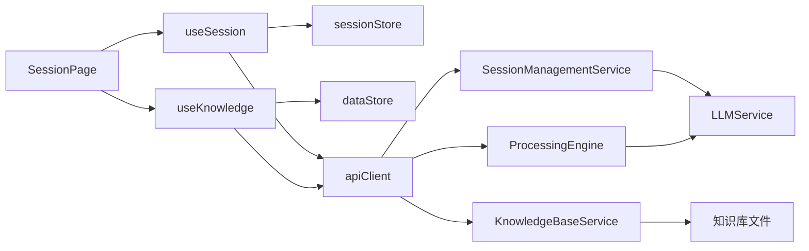

# 会话页面 (SessionPage)

<cite>
**本文档引用的文件**
- [SessionPage.tsx](file://frontend/src/pages/SessionPage.tsx)
- [useSession.ts](file://frontend/src/hooks/useSession.ts)
- [useKnowledge.ts](file://frontend/src/hooks/useKnowledge.ts)
- [sessionStore.ts](file://frontend/src/stores/sessionStore.ts)
- [dataStore.ts](file://frontend/src/stores/dataStore.ts)
- [uiStore.ts](file://frontend/src/stores/uiStore.ts)
- [api.ts](file://frontend/src/utils/api.ts)
- [LLMService.js](file://backend/src/services/LLMService.js)
- [SessionManagementService.js](file://backend/src/services/SessionManagementService.js)
- [ProcessingEngine.js](file://backend/src/services/ProcessingEngine.js)
- [KnowledgeBaseService.js](file://backend/src/services/KnowledgeBaseService.js)
</cite>

## 目录
1. [简介](#简介)
2. [项目结构](#项目结构)
3. [核心组件](#核心组件)
4. [架构概述](#架构概述)
5. [详细组件分析](#详细组件分析)
6. [依赖分析](#依赖分析)
7. [性能考虑](#性能考虑)
8. [故障排除指南](#故障排除指南)
9. [结论](#结论)

## 简介
`SessionPage` 是智能运维助手应用程序中的核心交互界面，负责展示和管理用户与AI之间的实时对话流程。该页面通过集成 `useSession` 和 `useKnowledge` 自定义 Hook，实现了对当前会话数据及知识库内容的动态获取，并支持用户输入提交、AI响应接收以及逐步流式输出的完整生命周期管理。

本页面不仅提供了清晰的处置步骤可视化，还集成了错误重试机制、加载状态管理和表单验证等关键功能，确保了用户体验的流畅性和系统的稳定性。此外，通过 WebSocket 或 HTTP 长轮询通信模式，`SessionPage` 能够实现实时更新会话状态，为用户提供即时反馈。

## 项目结构
`SessionPage` 位于前端项目的 `pages` 目录下，是整个应用的核心组成部分之一。其主要依赖于以下几个模块：

- **hooks**: 包含 `useSession` 和 `useKnowledge` 等自定义 Hook，用于封装复杂的业务逻辑。
- **stores**: 使用 Zustand 状态管理库来维护全局状态，如会话信息、知识库数据和UI状态。
- **utils**: 提供 API 客户端工具类，处理与后端服务的通信。
- **components**: 包含可复用的 UI 组件，如卡片、按钮和模态框。



**图示来源**
- [SessionPage.tsx](file://frontend/src/pages/SessionPage.tsx)
- [useSession.ts](file://frontend/src/hooks/useSession.ts)
- [useKnowledge.ts](file://frontend/src/hooks/useKnowledge.ts)
- [sessionStore.ts](file://frontend/src/stores/sessionStore.ts)
- [dataStore.ts](file://frontend/src/stores/dataStore.ts)
- [uiStore.ts](file://frontend/src/stores/uiStore.ts)
- [api.ts](file://frontend/src/utils/api.ts)
- [LLMService.js](file://backend/src/services/LLMService.js)
- [SessionManagementService.js](file://backend/src/services/SessionManagementService.js)
- [ProcessingEngine.js](file://backend/src/services/ProcessingEngine.js)
- [KnowledgeBaseService.js](file://backend/src/services/KnowledgeBaseService.js)

**章节来源**
- [SessionPage.tsx](file://frontend/src/pages/SessionPage.tsx)
- [useSession.ts](file://frontend/src/hooks/useSession.ts)
- [useKnowledge.ts](file://frontend/src/hooks/useKnowledge.ts)

## 核心组件
`SessionPage` 的核心在于其如何利用自定义 Hook 获取并渲染会话数据。通过 `useSession` Hook，页面能够访问当前会话的状态、执行步骤和提供反馈等功能；而 `useKnowledge` Hook 则允许页面搜索和获取相关的知识库条目，以辅助决策过程。

这些 Hook 内部依赖于 Zustand 存储（`sessionStore` 和 `dataStore`）来管理状态，并通过 `apiClient` 与后端服务进行通信。这种分层设计使得代码更加模块化和易于维护。

**章节来源**
- [useSession.ts](file://frontend/src/hooks/useSession.ts)
- [useKnowledge.ts](file://frontend/src/hooks/useKnowledge.ts)
- [sessionStore.ts](file://frontend/src/stores/sessionStore.ts)
- [dataStore.ts](file://frontend/src/stores/dataStore.ts)

## 架构概述
`SessionPage` 的整体架构可以分为三层：表现层、逻辑层和数据层。

- **表现层**：由 `SessionPage.tsx` 构成，负责展示用户界面和处理用户交互。
- **逻辑层**：包含 `useSession` 和 `useKnowledge` 自定义 Hook，封装了具体的业务逻辑。
- **数据层**：包括 Zustand 存储和 API 客户端，负责状态管理和与后端服务的通信。

这种分层架构确保了各部分职责明确，降低了耦合度，提高了代码的可测试性和可扩展性。



**图示来源**
- [SessionPage.tsx](file://frontend/src/pages/SessionPage.tsx)
- [useSession.ts](file://frontend/src/hooks/useSession.ts)
- [useKnowledge.ts](file://frontend/src/hooks/useKnowledge.ts)
- [sessionStore.ts](file://frontend/src/stores/sessionStore.ts)
- [dataStore.ts](file://frontend/src/stores/dataStore.ts)
- [api.ts](file://frontend/src/utils/api.ts)

## 详细组件分析

### 会话页面分析
`SessionPage` 组件通过 `useParams` 获取 URL 中的 `sessionId` 参数，并使用 `useNavigate` 进行路由导航。它依赖 `useSession` Hook 来加载会话详情、执行步骤和提供反馈。

当用户进入页面时，`useEffect` 钩子会触发 `handleLoadSession` 函数，尝试从后端加载指定 ID 的会话。如果加载失败，则显示错误消息并重定向到首页。

一旦成功加载会话，页面将根据会话状态渲染不同的 UI 元素，例如进度条、步骤列表和操作按钮。每个步骤都包含一个状态图标和标签，指示其当前执行状态。

#### 对象导向组件
```mermaid
classDiagram
class SessionPage {
+sessionId : string
+navigate : Function
+session : Session | null
+isLoading : boolean
+userInput : string
+isExecuting : boolean
+showFeedbackModal : boolean
+feedbackStep : Step | null
+feedback : string
+handleLoadSession() : Promise~void~
+handleExecuteStep(step : Step, executionType : 'auto' | 'manual') : Promise~void~
+handleFeedback() : Promise~void~
+getStepStatusIcon(step : Step) : JSX.Element
+getStepStatusBadge(step : Step) : JSX.Element
}
class useSession {
+currentSession : Session | null
+currentSessionStatus : SessionStatus | null
+isSessionLoading : boolean
+sessionError : string | null
+createSession(data : CreateSessionRequest) : Promise~{ session : Session; initialPlan : any }~
+loadSession(sessionId : string) : Promise~Session~
+loadSessionStatus(sessionId : string) : Promise~SessionStatus~
+executeStep(sessionId : string, stepId : string, executionType : 'auto' | 'manual', userInput? : string) : Promise~any~
+provideFeedback(sessionId : string, stepId : string, feedback : string) : Promise~any~
+completeSession(sessionId : string, summary? : string) : Promise~Session~
}
class useKnowledge {
+knowledgeEntries : KnowledgeEntry[]
+searchResults : SearchResult[]
+isKnowledgeLoading : boolean
+knowledgeError : string | null
+knowledgeStats : any
+searchKnowledge(query : string, options? : { type? : 'all' | 'operation-procedure' | 'device-api'; category? : string; limit? : number; minScore? : number }) : Promise~{ query : string; options : any; total : number; results : SearchResult[] }~
+getKnowledgeEntry(knowledgeId : string) : Promise~any~
+getKnowledgeByCategory(category : string, limit? : number) : Promise~{ category : string; entries : any[]; total : number }~
+getRecommendations(category? : string, limit? : number) : Promise~{ recommendations : any[]; total : number }~
+updateEffectivenessScore(knowledgeId : string, score : number) : Promise~void~
+loadKnowledgeStats(forceRefresh? : boolean) : Promise~any~
+searchWithDebounce(query : string, options? : any) : void
+getSearchSuggestions(query : string) : Promise~string[]~
}
SessionPage --> useSession : "uses"
SessionPage --> useKnowledge : "uses"
```

**图示来源**
- [SessionPage.tsx](file://frontend/src/pages/SessionPage.tsx)
- [useSession.ts](file://frontend/src/hooks/useSession.ts)
- [useKnowledge.ts](file://frontend/src/hooks/useKnowledge.ts)

**章节来源**
- [SessionPage.tsx](file://frontend/src/pages/SessionPage.tsx)
- [useSession.ts](file://frontend/src/hooks/useSession.ts)
- [useKnowledge.ts](file://frontend/src/hooks/useKnowledge.ts)

### 通信模式分析
`SessionPage` 与后端服务之间的通信主要通过 `apiClient` 实现。该客户端基于 Axios 构建，具备请求拦截器和响应拦截器，能够在发送请求前添加认证信息，并在接收到响应后统一处理错误。

对于实时性要求较高的场景，系统采用 WebSocket 或 HTTP 长轮询的方式保持连接。具体来说，`SessionManagementService` 在后端定期检查会话状态，并通过事件驱动机制通知前端更新。

#### API/服务组件


**图示来源**
- [SessionPage.tsx](file://frontend/src/pages/SessionPage.tsx)
- [useSession.ts](file://frontend/src/hooks/useSession.ts)
- [api.ts](file://frontend/src/utils/api.ts)
- [SessionManagementService.js](file://backend/src/services/SessionManagementService.js)

**章节来源**
- [SessionPage.tsx](file://frontend/src/pages/SessionPage.tsx)
- [useSession.ts](file://frontend/src/hooks/useSession.ts)
- [api.ts](file://frontend/src/utils/api.ts)

### 消息流处理分析
`SessionPage` 支持消息流的虚拟滚动优化方案，以提高长列表的渲染性能。通过 `react-window` 或类似库，仅渲染可视区域内的元素，从而减少 DOM 节点数量。

此外，页面还实现了防重复提交机制，防止用户在短时间内多次点击同一操作按钮导致重复请求。这通过设置 `isExecuting` 状态变量并在请求期间禁用相关按钮来实现。

#### 复杂逻辑组件


**图示来源**
- [SessionPage.tsx](file://frontend/src/pages/SessionPage.tsx)
- [useSession.ts](file://frontend/src/hooks/useSession.ts)
- [api.ts](file://frontend/src/utils/api.ts)

**章节来源**
- [SessionPage.tsx](file://frontend/src/pages/SessionPage.tsx)
- [useSession.ts](file://frontend/src/hooks/useSession.ts)

## 依赖分析
`SessionPage` 的正常运行依赖多个前后端组件和服务。前端方面，它直接依赖 `useSession` 和 `useKnowledge` 自定义 Hook，间接依赖 `sessionStore`、`dataStore` 和 `uiStore` 状态管理模块，以及 `apiClient` 工具类。

后端方面，`SessionPage` 通过 API 调用与 `SessionManagementService`、`ProcessingEngine` 和 `KnowledgeBaseService` 交互。其中，`LLMService` 提供了大模型推理能力，支撑了 AI 助手的核心功能。



**图示来源**
- [SessionPage.tsx](file://frontend/src/pages/SessionPage.tsx)
- [useSession.ts](file://frontend/src/hooks/useSession.ts)
- [useKnowledge.ts](file://frontend/src/hooks/useKnowledge.ts)
- [sessionStore.ts](file://frontend/src/stores/sessionStore.ts)
- [dataStore.ts](file://frontend/src/stores/dataStore.ts)
- [api.ts](file://frontend/src/utils/api.ts)
- [SessionManagementService.js](file://backend/src/services/SessionManagementService.js)
- [ProcessingEngine.js](file://backend/src/services/ProcessingEngine.js)
- [KnowledgeBaseService.js](file://backend/src/services/KnowledgeBaseService.js)
- [LLMService.js](file://backend/src/services/LLMService.js)

**章节来源**
- [SessionPage.tsx](file://frontend/src/pages/SessionPage.tsx)
- [useSession.ts](file://frontend/src/hooks/useSession.ts)
- [useKnowledge.ts](file://frontend/src/hooks/useKnowledge.ts)
- [sessionStore.ts](file://frontend/src/stores/sessionStore.ts)
- [dataStore.ts](file://frontend/src/stores