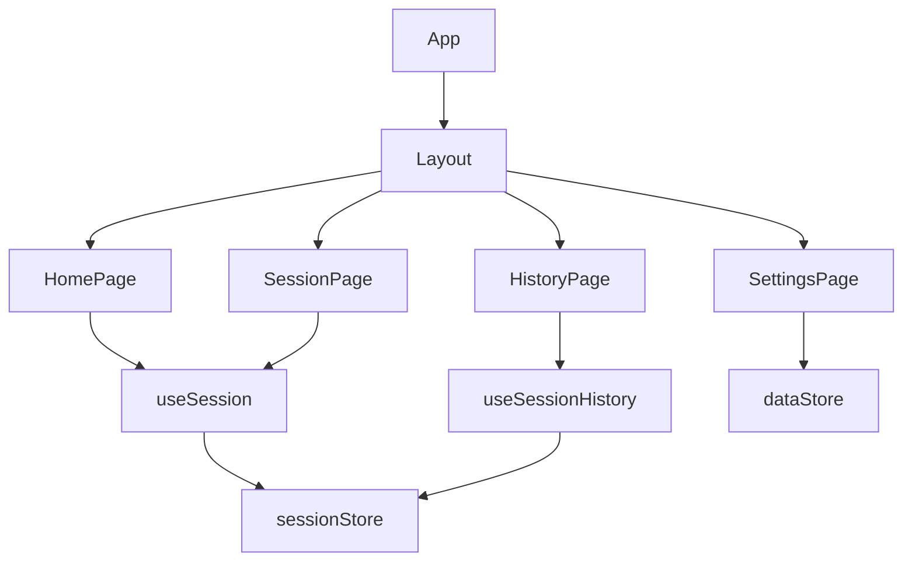

# 前端组件

<cite>
**本文档中引用的文件**
- [Layout.tsx](file://frontend/src/components/Layout.tsx)
- [HomePage.tsx](file://frontend/src/pages/HomePage.tsx)
- [SessionPage.tsx](file://frontend/src/pages/SessionPage.tsx)
- [HistoryPage.tsx](file://frontend/src/pages/HistoryPage.tsx)
- [SettingsPage.tsx](file://frontend/src/pages/SettingsPage.tsx)
- [sessionStore.ts](file://frontend/src/stores/sessionStore.ts)
- [dataStore.ts](file://frontend/src/stores/dataStore.ts)
- [useSession.ts](file://frontend/src/hooks/useSession.ts)
- [useKnowledge.ts](file://frontend/src/hooks/useKnowledge.ts)
- [useSessionHistory.ts](file://frontend/src/hooks/useSessionHistory.ts)
- [index.ts](file://frontend/src/types/index.ts)
- [api.ts](file://frontend/src/utils/api.ts)
- [App.tsx](file://frontend/src/App.tsx)
</cite>

## 目录
1. [简介](#简介)
2. [项目结构](#项目结构)
3. [核心组件](#核心组件)
4. [架构概览](#架构概览)
5. [详细组件分析](#详细组件分析)
6. [依赖关系分析](#依赖关系分析)
7. [性能考虑](#性能考虑)
8. [故障排除指南](#故障排除指南)
9. [结论](#结论)

## 简介
本系统为智能运维助手前端应用，基于React + TypeScript构建，采用Zustand进行状态管理。系统包含首页、会话页、历史记录页和设置页四大核心页面，通过统一布局组件提供一致的用户体验。各页面通过自定义Hook封装业务逻辑，并利用Zustand实现跨组件状态共享。

## 项目结构
前端项目遵循标准的模块化组织方式，主要目录包括：
- `components`：通用UI组件
- `pages`：页面级组件
- `stores`：Zustand状态存储
- `hooks`：自定义Hook
- `types`：TypeScript类型定义
- `utils`：工具函数



**图示来源**
- [App.tsx](file://frontend/src/App.tsx)
- [Layout.tsx](file://frontend/src/components/Layout.tsx)

## 核心组件
系统由多个核心组件构成，包括布局组件、四个主要页面组件以及配套的状态管理和自定义Hook。这些组件共同实现了完整的用户交互流程，从问题提交到处置执行再到历史查看和系统配置。

**组件来源**
- [Layout.tsx](file://frontend/src/components/Layout.tsx)
- [HomePage.tsx](file://frontend/src/pages/HomePage.tsx)
- [SessionPage.tsx](file://frontend/src/pages/SessionPage.tsx)
- [HistoryPage.tsx](file://frontend/src/pages/HistoryPage.tsx)
- [SettingsPage.tsx](file://frontend/src/pages/SettingsPage.tsx)

## 架构概览
系统采用分层架构设计，自上而下分为UI层、Hook层、Store层和API客户端层。UI组件不直接调用API，而是通过自定义Hook访问状态存储，实现了关注点分离和代码复用。

```mermaid
graph TD
    UI[UI Components] --> Hook[Custom Hooks]
    Hook --> Store[Zustand Stores]
    Store --> API[ApiClient]
    API --> Backend[Backend API]
    
    subgraph StateManagement
        Store
    end
    
    subgraph Data