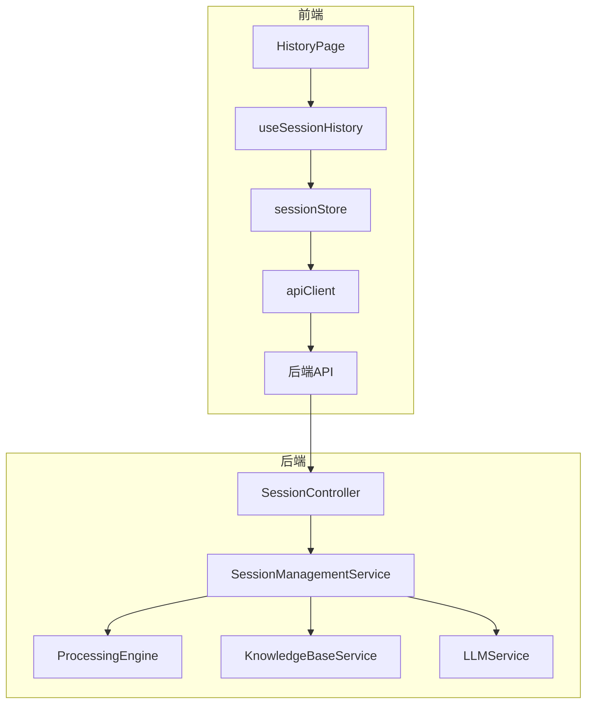

# 历史记录页面 (HistoryPage)

<cite>
**本文档中引用的文件**
- [HistoryPage.tsx](file://frontend/src/pages/HistoryPage.tsx)
- [useSessionHistory.ts](file://frontend/src/hooks/useSessionHistory.ts)
- [sessionStore.ts](file://frontend/src/stores/sessionStore.ts)
- [api.ts](file://frontend/src/utils/api.ts)
- [Session.js](file://backend/src/models/Session.js)
- [Step.js](file://backend/src/models/Step.js)
- [SessionManagementService.js](file://backend/src/services/SessionManagementService.js)
</cite>

## 目录
1. [简介](#简介)
2. [项目结构](#项目结构)
3. [核心组件](#核心组件)
4. [架构概述](#架构概述)
5. [详细组件分析](#详细组件分析)
6. [依赖分析](#依赖分析)
7. [性能考虑](#性能考虑)
8. [故障排除指南](#故障排除指南)
9. [结论](#结论)

## 简介
历史记录页面（HistoryPage）是智能运维助手应用程序中的关键功能模块，用于展示用户过往的会话记录。该页面通过 `useSessionHistory` Hook 从 `sessionStore` 中读取本地或远程存储的历史会话元数据，并以列表形式呈现。用户可以通过点击列表项恢复至指定会话上下文，重新加载对应 SessionPage 的状态。此外，页面支持分页加载、搜索过滤及删除操作等前端处理逻辑。

## 项目结构
本项目的目录结构清晰地划分了前后端代码和配置文件：

```
.
├── backend                    # 后端服务代码
│   ├── src
│   │   ├── controllers        # API 控制器
│   │   ├── middleware         # 中间件
│   │   ├── models             # 数据模型
│   │   ├── services           # 业务逻辑服务
│   │   └── utils              # 工具函数
│   └── tests                  # 测试用例
├── config                     # 配置文件
├── configs                    # 应用程序配置
├── frontend                   # 前端代码
│   ├── src
│   │   ├── components         # 公共组件
│   │   ├── hooks              # 自定义 Hook
│   │   ├── pages              # 页面组件
│   │   ├── stores             # 状态管理
│   │   ├── types              # 类型定义
│   │   ├── utils              # 工具函数
│   │   └── App.tsx            # 根组件
│   └── tests                  # 测试用例
├── knowledge-base             # 知识库文档
└── README.md                  # 项目说明
```

**Section sources**
- [README.md](file://README.md)

## 核心组件

### HistoryPage 组件
`HistoryPage` 是一个 React 函数组件，负责渲染历史会话列表界面。它使用 `useSessionHistory` Hook 获取会话数据，并提供搜索、过滤、分页和删除等功能。

```tsx
const HistoryPage: React.FC = () => {
  const {
    sessions,
    totalSessions,
    isLoading,
    searchSessions,
    deleteSession
  } = useSessionHistory()
  // ...
}
```

**Section sources**
- [HistoryPage.tsx](file://frontend/src/pages/HistoryPage.tsx#L17-L327)

### useSessionHistory Hook
`useSessionHistory` 是一个自定义 Hook，封装了与会话历史相关的所有业务逻辑。它从 `sessionStore` 中获取状态，并提供了加载、搜索、删除会话的方法。

```tsx
export const useSessionHistory = () => {
  const {
    sessions,
    setSessions,
    isSessionsLoading,
    setSessionsLoading,
    sessionsError,
    setSessionsError,
    totalSessions,
    setTotalSessions,
    currentPage,
    setCurrentPage,
    pageSize,
    searchQuery,
    setSearchQuery,
    statusFilter,
    setStatusFilter,
    categoryFilter,
    setCategoryFilter,
    removeSession
  } = useSessionStore()

  // 加载会话列表
  const loadSessions = useCallback(async (
    page = currentPage,
    query = searchQuery,
    status = statusFilter,
    category = categoryFilter
  ) => {
    // ...
  }, [
    currentPage,
    pageSize,
    searchQuery,
    statusFilter,
    categoryFilter,
    setSessions,
    setSessionsLoading,
    setSessionsError,
    setTotalSessions
  ])

  // 删除会话
  const deleteSession = useCallback(async (sessionId: string) => {
    // ...
  }, [removeSession, sessions.length, currentPage, setCurrentPage, loadSessions])

  return {
    sessions,
    isSessionsLoading,
    sessionsError,
    totalSessions,
    currentPage,
    pageSize,
    totalPages,
    hasNextPage,
    hasPrevPage,
    searchQuery,
    statusFilter,
    categoryFilter,
    loadSessions,
    deleteSession,
    exportSession,
    deleteMultipleSessions,
    handleSearch,
    handleStatusFilter,
    handleCategoryFilter,
    handlePageChange
  }
}
```

**Section sources**
- [useSessionHistory.ts](file://frontend/src/hooks/useSessionHistory.ts#L7-L245)

## 架构概述



**Diagram sources**
- [HistoryPage.tsx](file://frontend/src/pages/HistoryPage.tsx#L17-L327)
- [useSessionHistory.ts](file://frontend/src/hooks/useSessionHistory.ts#L7-L245)
- [sessionStore.ts](file://frontend/src/stores/sessionStore.ts#L50-L163)
- [api.ts](file://frontend/src/utils/api.ts#L15-L237)
- [SessionManagementService.js](file://backend/src/services/SessionManagementService.js#L16-L668)

## 详细组件分析

### HistoryPage 分析
`HistoryPage` 组件实现了以下主要功能：

1. **状态管理**：使用 `useState` 管理搜索查询、筛选条件和当前页码。
2. **数据加载**：通过 `useEffect` 在页面初始化和参数变化时加载会话数据。
3. **搜索防抖**：对搜索输入进行 500ms 防抖处理，避免频繁请求。
4. **UI 渲染**：以卡片形式展示会话列表，包含问题分类、状态、描述、创建时间和进度信息。
5. **交互操作**：支持查看、导出和删除会话。

#### 会话列表渲染
```tsx
{sessions.map((session) => (
  <div key={session.session_id} className="card card-hover">
    {/* 会话信息 */}
  </div>
))}
```

**Section sources**
- [HistoryPage.tsx](file://frontend/src/pages/HistoryPage.tsx#L17-L327)

### useSessionHistory 分析
`useSessionHistory` Hook 提供了完整的会话历史管理能力：

1. **状态同步**：与 `sessionStore` 双向绑定，保持状态一致性。
2. **数据获取**：调用 `apiClient` 获取用户会话或执行搜索。
3. **过滤机制**：支持按状态和分类过滤会话。
4. **分页控制**：维护当前页码和每页大小，计算总页数。
5. **错误处理**：捕获并提示 API 请求错误。

#### 搜索处理
```tsx
const handleSearch = useCallback((query: string) => {
  setSearchQuery(query)
  setCurrentPage(1) // 重置到第一页
}, [setSearchQuery, setCurrentPage])
```

**Section sources**
- [useSessionHistory.ts](file://frontend/src/hooks/useSessionHistory.ts#L7-L245)

### sessionStore 分析
`sessionStore` 使用 Zustand 创建全局状态管理，持久化部分状态到本地存储。

```tsx
export const useSessionStore = create<SessionState>()(
  persist(
    (set, get) => ({
      // 初始状态
      sessions: [],
      isSessionsLoading: false,
      sessionsError: null,
      totalSessions: 0,
      currentPage: 1,
      pageSize: 20,
      searchQuery: '',
      statusFilter: 'all',
      categoryFilter: 'all',

      // Actions
      setSessions: (sessions) => set({ sessions }),
      addSession: (session) => set((state) => ({
        sessions: [session, ...state.sessions],
        totalSessions: state.totalSessions + 1
      })),
      updateSession: (sessionId, updates) => set((state) => ({
        sessions: state.sessions.map(session =>
          session.session_id === sessionId
            ? { ...session, ...updates }
            : session
        ),
        currentSession: state.currentSession?.session_id === sessionId
          ? { ...state.currentSession, ...updates }
          : state.currentSession
      })),
      removeSession: (sessionId) => set((state) => ({
        sessions: state.sessions.filter(session => session.session_id !== sessionId),
        totalSessions: Math.max(0, state.totalSessions - 1),
        currentSession: state.currentSession?.session_id === sessionId
          ? null
          : state.currentSession
      })),
      // ...
    }),
    {
      name: 'session-storage',
      partialize: (state) => ({
        // 只持久化部分状态
        searchQuery: state.searchQuery,
        statusFilter: state.statusFilter,
        categoryFilter: state.categoryFilter,
        currentPage: state.currentPage,
        pageSize: state.pageSize
      })
    }
  )
)
```

**Section sources**
- [sessionStore.ts](file://frontend/src/stores/sessionStore.ts#L50-L163)

## 依赖分析

```mermaid
classDiagram
class HistoryPage {
+sessions : Session[]
+totalSessions : number
+isLoading : boolean
+searchQuery : string
+statusFilter : string
+categoryFilter : string
+currentPage : number
+pageSize : number
}
class useSessionHistory {
+loadSessions() : Promise~void~
+deleteSession(sessionId : string) : Promise~void~
+exportSession(sessionId : string, format : 'json' | 'csv') : Promise~void~
+handleSearch(query : string) : void
+handleStatusFilter(status : string) : void
+handleCategoryFilter(category : string) : void
+handlePageChange(page : number) : void
}
class sessionStore {
+sessions : Session[]
+isSessionsLoading : boolean
+sessionsError : string | null
+totalSessions : number
+currentPage : number
+pageSize : number
+searchQuery : string
+statusFilter : string
+categoryFilter : string
+setSessions(sessions : Session[]) : void
+addSession(session : Session) : void
+updateSession(sessionId : string, updates : Partial~Session~) : void
+removeSession(sessionId : string) : void
}
class apiClient {
+getUserSessions(userId? : string, limit : number, offset : number) : Promise~{ total : number; sessions : Session[] }~
+searchSessions(query : string, filters? : any) : Promise~{ total : number; results : Session[] }~
+deleteSession(sessionId : string) : Promise~void~
}
HistoryPage --> useSessionHistory : "使用"
useSessionHistory --> sessionStore : "读取/更新"
useSessionHistory --> apiClient : "调用"
```

**Diagram sources**
- [HistoryPage.tsx](file://frontend/src/pages/HistoryPage.tsx#L17-L327)
- [useSessionHistory.ts](file://frontend/src/hooks/useSessionHistory.ts#L7-L245)
- [sessionStore.ts](file://frontend/src/stores/sessionStore.ts#L50-L163)
- [api.ts](file://frontend/src/utils/api.ts#L15-L237)

## 性能考虑
1. **防抖优化**：搜索输入采用 500ms 防抖，减少不必要的 API 调用。
2. **分页加载**：每次只加载一页数据（默认 20 条），避免一次性加载过多数据。
3. **状态持久化**：将搜索条件和分页状态保存在本地存储中，提升用户体验。
4. **缓存策略**：虽然未显式实现，但可通过 React Query 或类似机制进一步优化数据缓存。

## 故障排除指南
1. **无法加载会话列表**：
   - 检查网络连接是否正常。
   - 查看浏览器控制台是否有错误信息。
   - 确认后端服务是否运行正常。

2. **搜索无结果**：
   - 确认搜索关键词是否正确。
   - 检查筛选条件是否过于严格。
   - 尝试清除搜索框内容以显示所有会话。

3. **删除会话失败**：
   - 确认会话 ID 是否存在。
   - 检查用户权限是否足够。
   - 查看服务器日志获取详细错误信息。

**Section sources**
- [HistoryPage.tsx](file://frontend/src/pages/HistoryPage.tsx#L17-L327)
- [useSessionHistory.ts](file://frontend/src/hooks/useSessionHistory.ts#L7-L245)

## 结论
历史记录页面通过 `useSessionHistory` Hook 和 `sessionStore` 实现了高效的历史会话管理功能。其设计充分考虑了用户体验和性能优化，支持分页、搜索和过滤等多种操作。未来可进一步集成 React Query 等数据缓存方案，提升应用的整体响应速度和离线可用性。