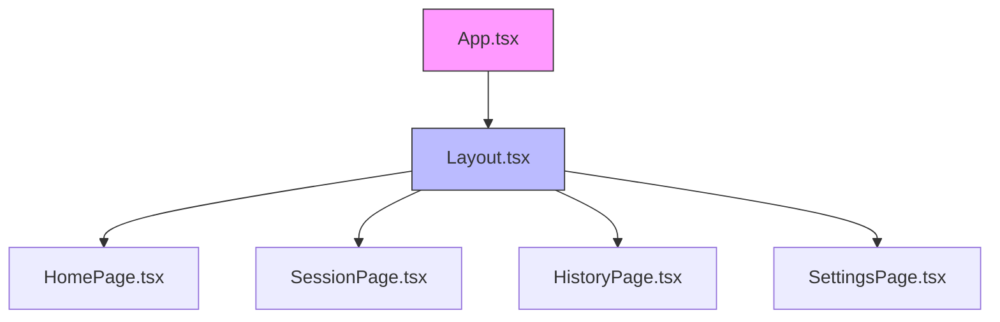
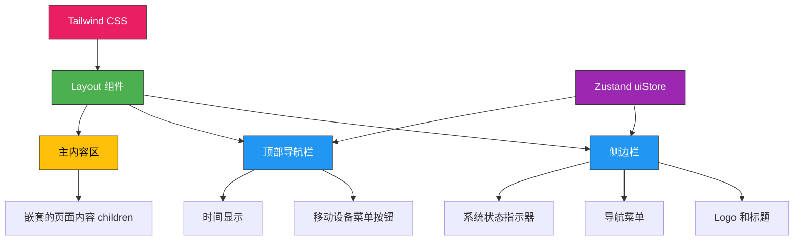
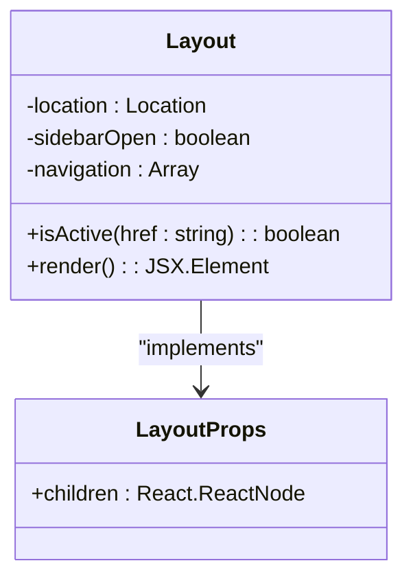
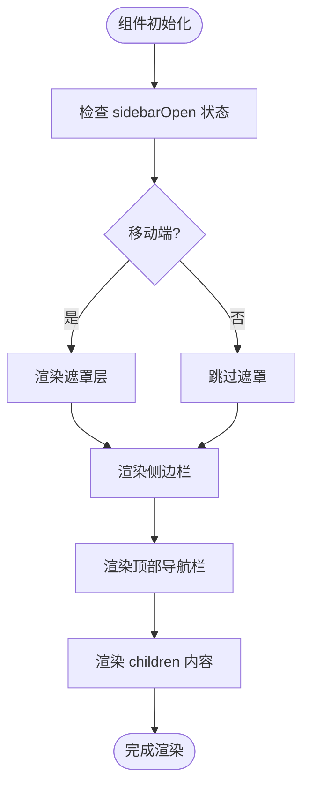
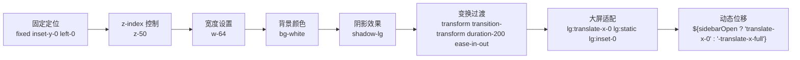
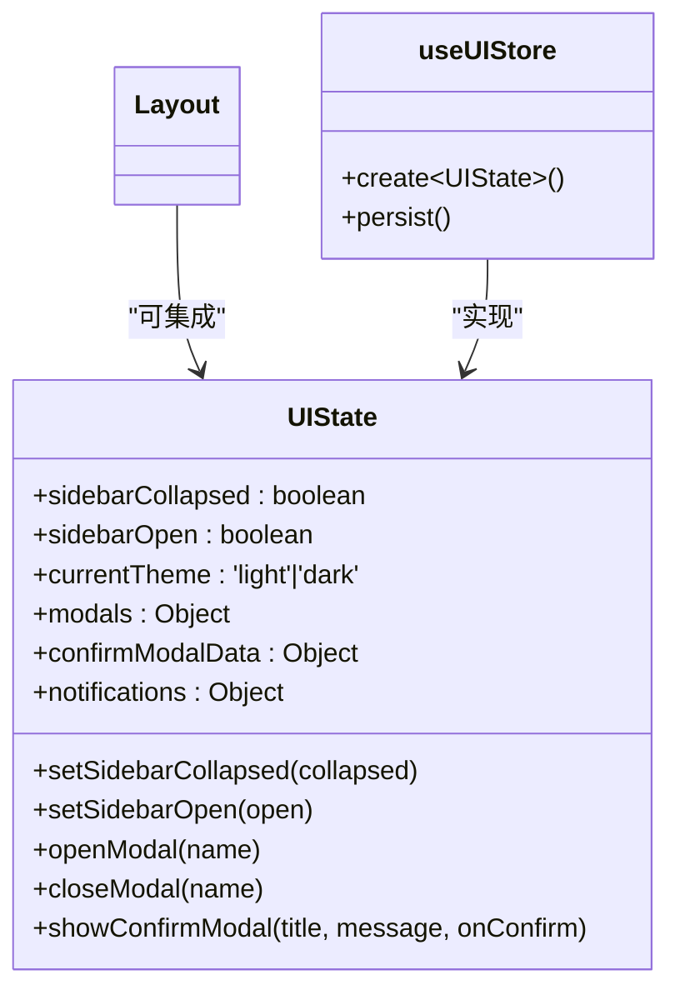
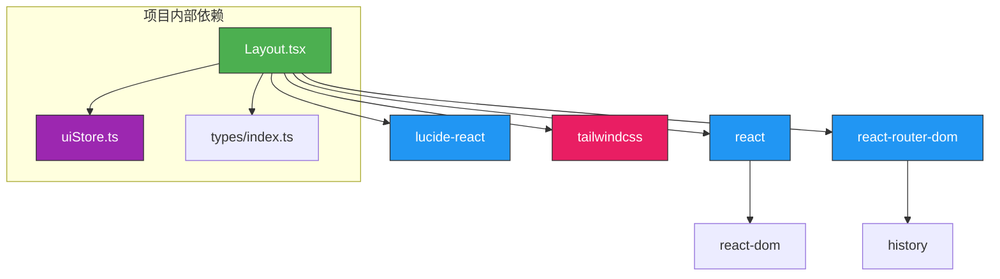

# 布局组件 (Layout)

<cite>
**Referenced Files in This Document **  
- [Layout.tsx](file://frontend/src/components/Layout.tsx)
- [uiStore.ts](file://frontend/src/stores/uiStore.ts)
- [tailwind.config.js](file://frontend/tailwind.config.js)
</cite>

## 目录
1. [简介](#简介)
2. [项目结构](#项目结构)
3. [核心组件](#核心组件)
4. [架构概述](#架构概述)
5. [详细组件分析](#详细组件分析)
6. [依赖分析](#依赖分析)
7. [性能考虑](#性能考虑)
8. [故障排除指南](#故障排除指南)
9. [结论](#结论)

## 简介
`Layout` 组件为智能运维助手前端应用提供统一的页面结构框架。该组件通过嵌套 `children` 实现不同页面内容的渲染，集成导航栏、页脚及响应式侧边栏功能。组件采用 Tailwind CSS 实现现代化 UI 布局，并通过 Zustand 的 `uiStore` 状态管理机制控制界面状态（如菜单折叠）。本文档详细记录该组件的设计与实现，包括 TypeScript 接口定义、JSX 结构示例、类名组织逻辑、断点适配策略、可访问性处理和 SEO 基础支持情况。

## 项目结构
`Layout` 组件位于前端源码的组件目录中，作为整个应用的顶层布局容器。该组件被 `App.tsx` 主组件引用，包裹所有路由页面，为整个应用提供一致的视觉框架和交互模式。

**Diagram sources**
- [App.tsx](file://frontend/src/App.tsx#L1-L20)
- [Layout.tsx](file://frontend/src/components/Layout.tsx#L1-L140)

**Section sources**
- [App.tsx](file://frontend/src/App.tsx#L1-L20)
- [Layout.tsx](file://frontend/src/components/Layout.tsx#L1-L140)

## 核心组件
`Layout` 组件是前端应用的核心骨架，负责提供统一的页面结构。它通过接收 `children` 属性来渲染不同的页面内容，同时集成了导航栏、响应式侧边栏和系统状态指示器。组件使用 React 的函数式组件语法和 TypeScript 类型定义，确保类型安全和开发体验。

**Section sources**
- [Layout.tsx](file://frontend/src/components/Layout.tsx#L1-L140)

## 架构概述
`Layout` 组件采用现代前端架构设计，结合了 React 组件化思想、Tailwind CSS 实用优先的样式系统以及 Zustand 状态管理库。组件分为三个主要区域：固定定位的侧边栏、顶部导航栏和主内容区。通过媒体查询和条件渲染实现响应式设计，在桌面端和移动端提供最佳用户体验。

**Diagram sources**
- [Layout.tsx](file://frontend/src/components/Layout.tsx#L1-L140)
- [uiStore.ts](file://frontend/src/stores/uiStore.ts#L1-L236)

## 详细组件分析

### 布局组件分析
`Layout` 组件实现了完整的页面框架，包含响应式侧边栏、顶部导航和主内容区域。组件通过 `useState` 管理侧边栏的打开状态，支持在移动设备上滑动展开/收起侧边栏的功能。

#### TypeScript 接口定义
组件定义了清晰的 TypeScript 接口，明确指定其接受一个 `children` 属性，该属性可以是任何 React 节点。这种设计模式使得组件具有高度的灵活性和可重用性。

**Diagram sources**
- [Layout.tsx](file://frontend/src/components/Layout.tsx#L10-L18)

#### JSX 结构与渲染逻辑
组件采用语义化的 HTML 结构，通过条件渲染实现移动端和桌面端的不同布局策略。在移动设备上，侧边栏默认隐藏，用户点击菜单按钮后以滑动动画形式展开；在桌面端，侧边栏始终可见并占据左侧固定宽度。

**Diagram sources**
- [Layout.tsx](file://frontend/src/components/Layout.tsx#L18-L137)

#### 类名组织逻辑与断点适配
组件充分利用 Tailwind CSS 的实用类系统，通过组合多个类名实现复杂的样式效果。特别值得注意的是其响应式设计策略，使用 `lg:` 前缀实现断点适配，在大屏幕设备上保持侧边栏常驻，在小屏幕设备上实现抽屉式导航。

**Diagram sources**
- [Layout.tsx](file://frontend/src/components/Layout.tsx#L45-L55)
- [tailwind.config.js](file://frontend/tailwind.config.js#L1-L89)

#### 与 Zustand uiStore 的集成
虽然当前 `Layout` 组件直接使用本地状态管理侧边栏的开合，但项目中已配置 `uiStore` 状态管理器，提供了更完善的界面状态控制能力，包括 `sidebarCollapsed`、`sidebarOpen` 等状态字段。这为未来将侧边栏状态提升到全局状态管理奠定了基础。

**Diagram sources**
- [uiStore.ts](file://frontend/src/stores/uiStore.ts#L1-L236)

#### 可访问性处理与 SEO 支持
通过对代码库的搜索分析，目前 `Layout` 组件尚未实现专门的可访问性（a11y）特性，如 ARIA 属性、角色定义或标签索引。同样，组件本身不直接提供 SEO 相关的元数据支持，这些功能通常由页面级组件或专门的 SEO 组件处理。

**Section sources**
- [Layout.tsx](file://frontend/src/components/Layout.tsx#L1-L140)
- [grep_code results for accessibility patterns](file://frontend/src/**/*.tsx#aria-,role=,tabindex)

## 依赖分析
`Layout` 组件依赖于多个外部库和内部模块，形成了清晰的依赖关系网络。组件直接依赖 React 生态系统、React Router 进行导航、Lucide 图标库提供视觉元素，并通过文件结构依赖于 Tailwind CSS 样式系统。

**Diagram sources**
- [Layout.tsx](file://frontend/src/components/Layout.tsx#L1-L140)
- [package.json](file://frontend/package.json)

**Section sources**
- [Layout.tsx](file://frontend/src/components/Layout.tsx#L1-L140)

## 性能考虑
`Layout` 组件在性能方面表现出色，采用了多项优化策略。组件使用函数式组件和 Hooks，避免了类组件的生命周期复杂性。通过 `useState` 精确管理局部状态，减少不必要的重新渲染。Tailwind CSS 的按需编译特性确保只包含实际使用的样式类，减小最终打包体积。

组件的响应式设计策略也体现了性能考量：在桌面端保持侧边栏