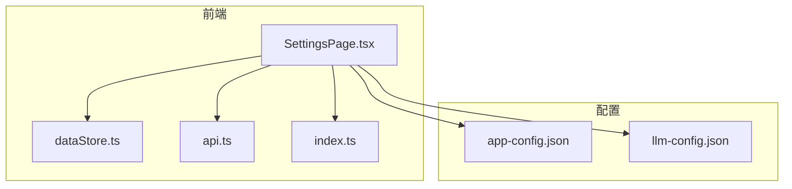
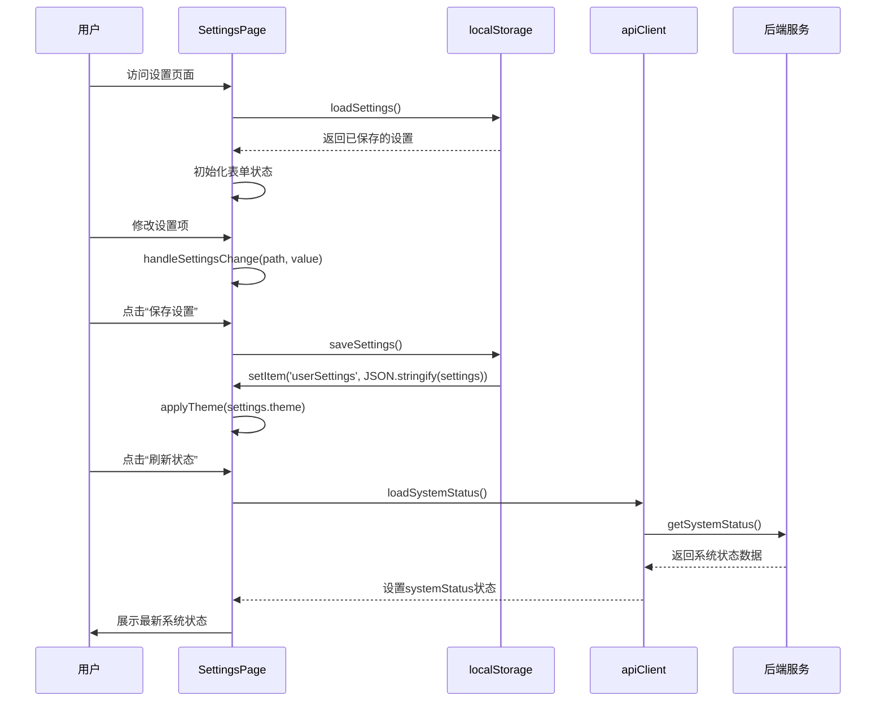
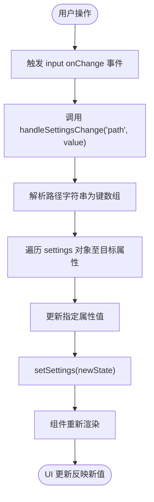

# 设置页面 (SettingsPage)

<cite>
**本文档引用的文件**  
- [SettingsPage.tsx](file://frontend/src/pages/SettingsPage.tsx)
- [app-config.json](file://configs/app-config.json)
- [llm-config.json](file://configs/llm-config.json)
- [dataStore.ts](file://frontend/src/stores/dataStore.ts)
- [api.ts](file://frontend/src/utils/api.ts)
- [index.ts](file://frontend/src/types/index.ts)
</cite>

## 目录
1. [简介](#简介)
2. [项目结构](#项目结构)
3. [核心组件](#核心组件)
4. [架构概述](#架构概述)
5. [详细组件分析](#详细组件分析)
6. [依赖分析](#依赖分析)
7. [性能考虑](#性能考虑)
8. [故障排除指南](#故障排除指南)
9. [结论](#结论)

## 简介
设置页面（SettingsPage）是智能运维助手应用程序中的关键配置界面，允许用户自定义系统行为和外观。该页面提供主题设置、通知偏好、语言选择等个性化选项，并实时展示系统各服务的运行状态。通过与`localStorage`交互实现用户设置的持久化存储，同时利用前端API客户端获取后端服务健康状况。页面采用React函数式组件构建，结合Zustand状态管理库实现高效的状态更新与响应。

## 项目结构
设置页面位于前端源码目录下的`pages`子目录中，作为独立路由组件存在。其功能实现依赖于类型定义、工具函数和全局状态管理模块，形成清晰的分层架构。

**图示来源**
- [SettingsPage.tsx](file://frontend/src/pages/SettingsPage.tsx)
- [dataStore.ts](file://frontend/src/stores/dataStore.ts)
- [api.ts](file://frontend/src/utils/api.ts)
- [app-config.json](file://configs/app-config.json)
- [llm-config.json](file://configs/llm-config.json)

## 核心组件
设置页面的核心在于其实现了用户偏好设置的完整生命周期管理：从初始化加载、动态修改到持久化保存。它不仅提供了直观的UI控件供用户调整主题模式、主色调、圆角大小等视觉属性，还集成了系统状态监控功能，可实时刷新并显示大模型服务、知识库、工具服务及会话管理模块的运行情况。所有用户设置均通过`localStorage`进行本地持久化，确保跨会话一致性。

**节段来源**
- [SettingsPage.tsx](file://frontend/src/pages/SettingsPage.tsx#L0-L358)

## 架构概述
整个设置页面遵循典型的React组件设计模式，使用函数式组件配合Hooks实现状态逻辑。初始设置通过`useEffect`从`localStorage`加载，用户交互触发`handleSettingsChange`方法更新状态，最终通过`saveSettings`方法将变更后的配置写回`localStorage`并应用主题变更。系统状态则通过`apiClient.getSystemStatus()`异步获取，体现了前后端分离的设计理念。

**图示来源**
- [SettingsPage.tsx](file://frontend/src/pages/SettingsPage.tsx#L0-L358)
- [api.ts](file://frontend/src/utils/api.ts#L15-L237)

## 详细组件分析

### 主题与通知设置分析
设置页面通过嵌套的对象结构组织用户配置，支持深度路径更新机制，使得复杂表单的数据绑定变得灵活而高效。

#### 表单结构与双向绑定
页面使用`useState`维护一个包含`theme`、`notifications`、`autoSave`和`language`字段的`settings`对象，这些字段直接映射到UI控件上，实现真正的双向数据绑定。当用户操作输入元素时，`onChange`事件处理器调用`handleSettingsChange`函数，传入形如`theme.mode`或`notifications.sound`的路径字符串，从而精确地定位并更新状态树中的对应值。

**图示来源**
- [SettingsPage.tsx](file://frontend/src/pages/SettingsPage.tsx#L88-L130)

#### 持久化处理机制
用户设置的持久化完全基于浏览器的`localStorage`完成。在页面加载时，`loadSettings`函数尝试从`localStorage`读取`userSettings`条目并合并到初始状态；当用户点击保存时，`saveSettings`函数将当前`settings`对象序列化为JSON字符串后存回`localStorage`。此外，敏感信息如API密钥并未在此页面直接暴露，而是由后端`llm-config.json`文件通过环境变量注入，保障了安全性。

**节段来源**
- [SettingsPage.tsx](file://frontend/src/pages/SettingsPage.tsx#L40-L91)

### 配置初始化与状态同步
系统默认配置来源于静态JSON文件，并在运行时动态解析，确保灵活性与可维护性。

####