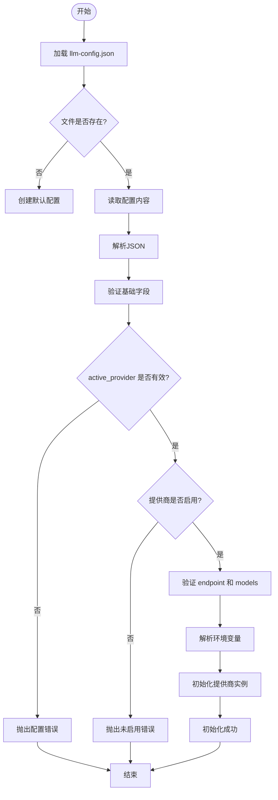
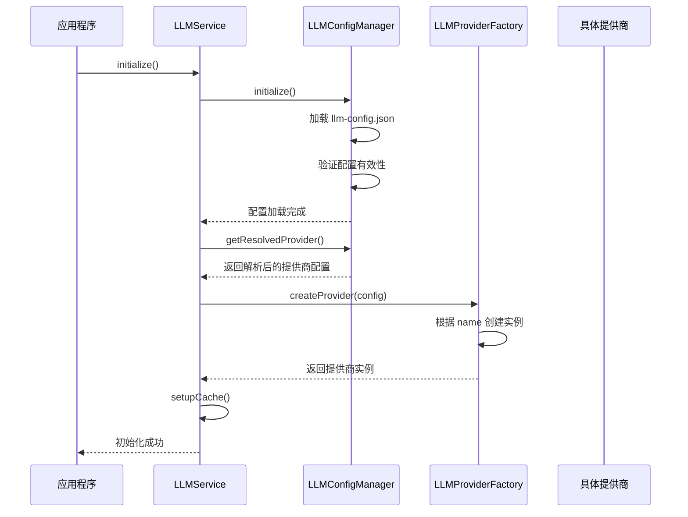
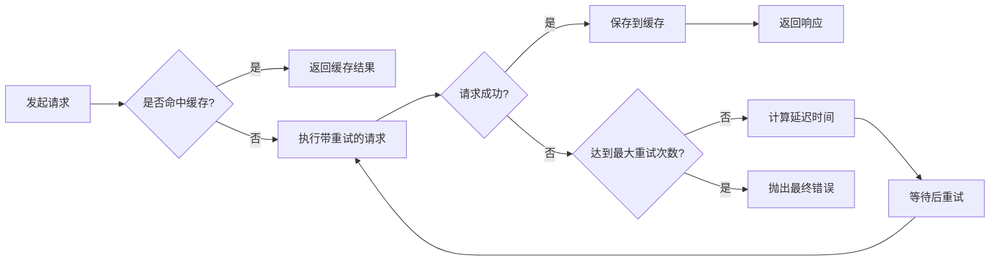

# LLM连接异常

<cite>
**本文档引用的文件**
- [LLMService.js](file://backend/src/services/LLMService.js)
- [LLMProvider.js](file://backend/src/services/LLMProvider.js)
- [LLMConfigManager.js](file://backend/src/services/LLMConfigManager.js)
- [llm-config.json](file://configs/llm-config.json)
</cite>

## 目录
1. [问题诊断与根本原因分析](#问题诊断与根本原因分析)
2. [配置验证与校验方法](#配置验证与校验方法)
3. [服务初始化流程](#服务初始化流程)
4. [重试机制与降级策略](#重试机制与降级策略)
5. [健康检查设计](#健康检查设计)
6. [日志排查与关键字搜索](#日志排查与关键字搜索)
7. [网络请求隔离测试](#网络请求隔离测试)

## 问题诊断与根本原因分析

大模型服务（LLMService）连接失败的根本原因主要分为以下四类：

1. **API密钥错误**：当使用远程提供商如OpenAI或Azure OpenAI时，若`api_key`字段为空或无效，会在初始化阶段抛出明确错误。例如OpenAIProvider在构造函数中会验证`config.api_key`是否存在。

2. **模型端点不可达**：`endpoint`配置错误或目标服务未运行会导致网络请求失败。LLMProvider基类的`validateConfig()`方法会检查`endpoint`字段是否存在，而实际请求通过axios客户端发起，超时或连接拒绝将触发错误处理。

3. **网络防火墙限制**：由于HTTP客户端设置了30秒超时（默认值），若请求被防火墙拦截或网络延迟过高，将导致`error.request`存在但无响应的情况，错误信息会标记为"网络请求失败"。

4. **请求频率超限**：虽然当前配置未显式设置速率限制，但外部提供商可能实施限制。此类错误会在响应中体现为HTTP 429状态码，并被`handleError`方法捕获并记录详细信息。

这些错误均通过统一的错误处理机制进行捕获和记录，确保问题可追溯。

**Section sources**
- [LLMProvider.js](file://backend/src/services/LLMProvider.js#L8-L97)
- [LLMService.js](file://backend/src/services/LLMService.js#L9-L366)

## 配置验证与校验方法

### llm-config.json 配置项说明

该文件位于`configs/llm-config.json`，核心字段包括：

- `active_provider`: 当前激活的服务提供商名称（如"ollama"、"openai"）
- `providers`: 各提供商的具体配置，包含：
  - `name`: 显示名称
  - `type`: 类型（local/remote）
  - `endpoint`: API端点URL
  - `api_key`: 认证密钥（仅远程服务需要）
  - `models`: 模型配置，含primary和fallback
  - `parameters`: 请求参数（temperature, max_tokens等）

### 配置校验流程

系统在初始化时执行多层验证：

1. **存在性检查**：确认`active_provider`字段存在且对应提供商已启用。
2. **必填字段验证**：对活跃提供商验证`endpoint`和`models`字段是否缺失。
3. **环境变量解析**：支持`${VAR_NAME}`格式的环境变量注入，如`${OPENAI_API_KEY}`。
4. **子类特定验证**：例如OpenAIProvider会额外检查`api_key`是否存在。

用户应确保`llm-config.json`中的`host`、`apiKey`、`model`等字段正确无误，特别是远程服务需保证环境变量已正确设置。



**Diagram sources**
- [LLMConfigManager.js](file://backend/src/services/LLMConfigManager.js#L13-L314)
- [llm-config.json](file://configs/llm-config.json)

**Section sources**
- [LLMConfigManager.js](file://backend/src/services/LLMConfigManager.js#L13-L314)
- [llm-config.json](file://configs/llm-config.json)

## 服务初始化流程

LLM服务的初始化是一个分步过程，涉及多个组件协同工作：

1. **LLMService.initialize()**: 主入口，依次调用配置初始化、提供商创建和缓存设置。
2. **LLMConfigManager.initialize()**: 负责加载并验证`llm-config.json`文件。
3. **LLMProviderFactory.createProvider()**: 根据配置动态创建具体提供商实例（Ollama/OpenAI/Azure）。
4. **缓存系统 setupCache()**: 基于配置启用响应缓存，提升性能。

整个流程采用链式调用，任一环节失败都会中断初始化并抛出异常，确保服务状态一致性。



**Diagram sources**
- [LLMService.js](file://backend/src/services/LLMService.js#L9-L366)
- [LLMConfigManager.js](file://backend/src/services/LLMConfigManager.js#L13-L314)

## 重试机制与降级策略

### 超时重试机制

系统实现了指数退避重试策略，配置位于`retry_config`字段：

- `max_retries`: 最大重试次数（默认3次）
- `retry_delay`: 初始延迟时间（1000ms）
- `backoff_factor`: 退避因子（2），即每次延迟翻倍

`executeWithRetry`方法封装了重试逻辑，在每次失败后按公式`delay * backoff_factor^(attempt-1)`计算等待时间。

### 降级策略

当前系统通过以下方式实现降级：

1. **缓存降级**：当请求成功后，响应会被保存到内存缓存中。后续相同请求优先返回缓存结果，减少对上游服务依赖。
2. **模型切换**：虽未直接实现自动fallback，但可通过`switchProvider`手动切换至备用提供商。
3. **服务隔离**：每个功能模块（如analyzeProblem、generateSteps）独立调用chat接口，局部故障不影响整体服务。

未来可扩展自动fallback机制，在主模型失败时尝试备用模型。



**Diagram sources**
- [LLMService.js](file://backend/src/services/LLMService.js#L103-L154)
- [llm-config.json](file://configs/llm-config.json)

## 健康检查设计

系统提供了两种健康检查机制：

### 内部健康检查（healthCheck）

由`LLMService.healthCheck()`实现，流程如下：

1. 发送一条测试消息："这是一个健康检查测试消息，请回复'OK'"
2. 使用`chat()`接口发送请求，设置低随机性和短输出长度
3. 成功则返回healthy=true及模型信息，失败则捕获异常并返回错误详情

此方法可用于定时任务或监控系统调用。

### 外部健康检查（/health端点）

通过HTTP GET `/health`端点暴露系统整体状态，返回JSON包含：

- `status`: 系统总体状态
- `services`: 各核心服务初始化状态（llm, knowledge, tools, sessions）

该端点不进行实际LLM调用，仅检查服务是否已初始化。

```mermaid
graph TB
subgraph "内部健康检查"
A[调用 healthCheck()] --> B[发送测试消息]
B --> C{收到响应?}
C --> |是| D[返回 healthy: true]
C --> |否| E[捕获错误]
E --> F[返回 healthy: false + 错误信息]
end
subgraph "外部健康检查"
G[GET /health] --> H[检查初始化标志]
H --> I[返回各服务状态]
end
```

**Diagram sources**
- [LLMService.js](file://backend/src/services/LLMService.js#L333-L371)
- [app.js](file://backend/src/app.js#L42-L91)

## 日志排查与关键字搜索

### 关键日志关键字

建议使用以下关键字进行日志搜索以快速定位问题：

- `'大模型服务初始化失败'`: 初始化阶段的任何错误
- `'创建大模型提供商失败'`: 提供商创建失败
- `'API调用失败'`: 所有请求级别的错误
- `'网络请求失败'`: 特指连接层面的问题
- `'缺少API密钥配置'`: 认证相关错误
- `'缺少端点配置'`: 配置缺失问题

### 日志级别说明

- `info`: 正常操作记录（如"已创建大模型提供商"）
- `warn`: 可恢复的警告（如重试尝试）
- `error`: 致命错误，需立即关注
- `debug`: 详细调试信息（如缓存命中）

推荐在排查时使用`error`和`warn`级别优先过滤关键信息。

**Section sources**
- [LLMService.js](file://backend/src/services/LLMService.js#L27-L41)
- [LLMProvider.js](file://backend/src/services/LLMProvider.js#L54-L113)

## 网络请求隔离测试

### 使用curl模拟请求

针对Ollama本地部署，可使用以下命令测试连通性：

```bash
curl http://localhost:11434/api/tags
```

预期返回可用模型列表。若无法访问，则说明服务未启动或端口被占用。

对于OpenAI兼容接口，可发送聊天请求：

```bash
curl -X POST http://localhost:11434/api/chat \
-H "Content-Type: application/json" \
-d '{
  "model": "llama2",
  "messages": [{"role": "user", "content": "你好"}],
  "stream": false
}'
```

### 使用Postman测试步骤

1. 设置请求方法为POST
2. URL填写目标endpoint（如`http://localhost:11434/api/chat`）
3. Headers中添加`Content-Type: application/json`
4. Body选择raw JSON格式，输入标准请求体
5. 发送请求并观察响应状态码和内容

通过直接调用底层API可以排除应用层代码影响，确认是网络/服务问题还是配置问题。

**Section sources**
- [LLMProvider.js](file://backend/src/services/LLMProvider.js#L102-L183)
- [llm-config.json](file://configs/llm-config.json)