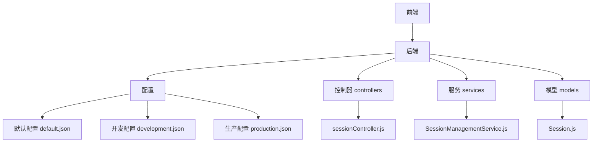

# 会话过期问题

<cite>
**本文档引用的文件**
- [sessionController.js](file://backend/src/controllers/sessionController.js)
- [Session.js](file://backend/src/models/Session.js)
- [SessionManagementService.js](file://backend/src/services/SessionManagementService.js)
- [default.json](file://config/default.json)
- [development.json](file://config/development.json)
- [production.json](file://config/production.json)
</cite>

## 目录
1. [简介](#简介)
2. [项目结构](#项目结构)
3. [核心组件](#核心组件)
4. [架构概述](#架构概述)
5. [详细组件分析](#详细组件分析)
6. [依赖分析](#依赖分析)
7. [性能考虑](#性能考虑)
8. [故障排除指南](#故障排除指南)
9. [结论](#结论)

## 简介
本文档系统化地解决智能运维助手中会话意外过期或无法恢复的问题。基于 Session 模型的 TTL 字段和数据库索引策略，说明会话生命周期管理机制。分析 sessionController 中创建、续签和销毁接口的行为逻辑，对比开发与生产环境配置中 sessionTimeout 参数差异。指导用户检查 Redis 或 MongoDB 中会话记录的实际存活时间，验证 JWT 令牌的有效期设置是否同步。提供客户端心跳保活方案建议及服务器端批量清理任务的影响评估。

## 项目结构
本项目采用分层架构设计，主要分为前端（frontend）和后端（backend）两个部分。后端使用 Node.js 构建 RESTful API，通过 Express 框架处理 HTTP 请求，并利用 MVC 模式组织代码。会话管理相关功能集中在 backend/src/controllers 和 backend/src/services 目录下，模型定义位于 backend/src/models。配置文件分布在 config 目录中，包含默认、开发和生产环境的不同设置。

**图示来源**
- [sessionController.js](file://backend/src/controllers/sessionController.js)
- [SessionManagementService.js](file://backend/src/services/SessionManagementService.js)
- [Session.js](file://backend/src/models/Session.js)
- [default.json](file://config/default.json)

**章节来源**
- [sessionController.js](file://backend/src/controllers/sessionController.js)
- [SessionManagementService.js](file://backend/src/services/SessionManagementService.js)
- [Session.js](file://backend/src/models/Session.js)
- [default.json](file://config/default.json)

## 核心组件
会话管理的核心组件包括 Session 模型、SessionManagementService 服务和 sessionController 控制器。Session 模型定义了会话的基本属性和方法；SessionManagementService 提供会话的创建、获取、更新、删除等业务逻辑；sessionController 则暴露 REST API 接口供前端调用。这些组件共同实现了会话的全生命周期管理。

**章节来源**
- [Session.js](file://backend/src/models/Session.js)
- [SessionManagementService.js](file://backend/src/services