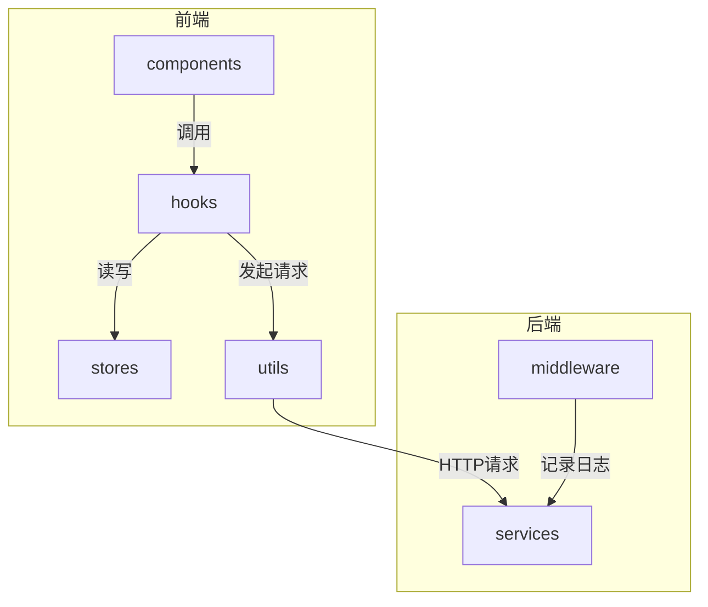
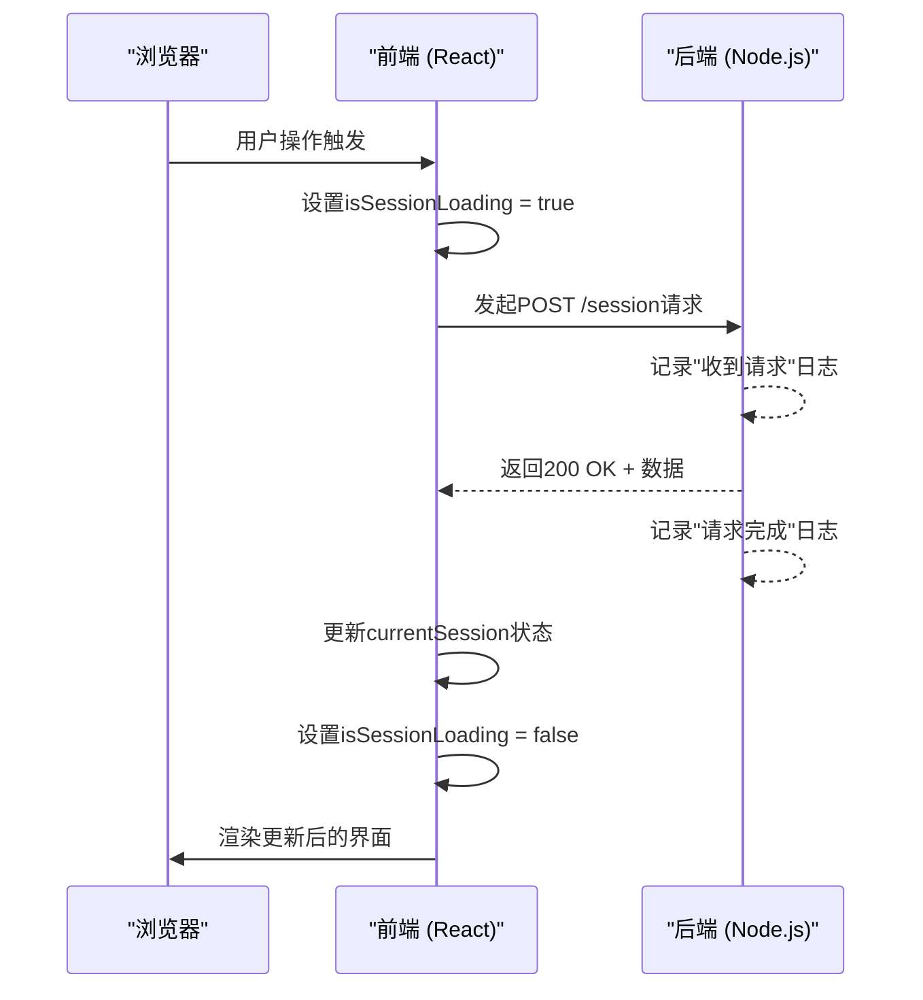
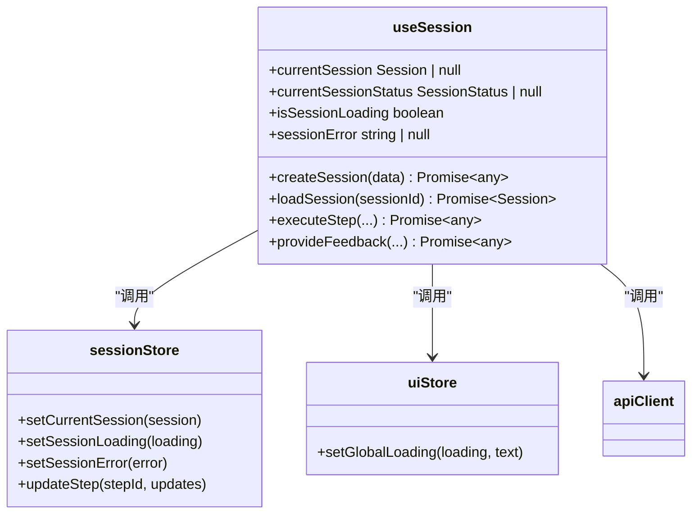
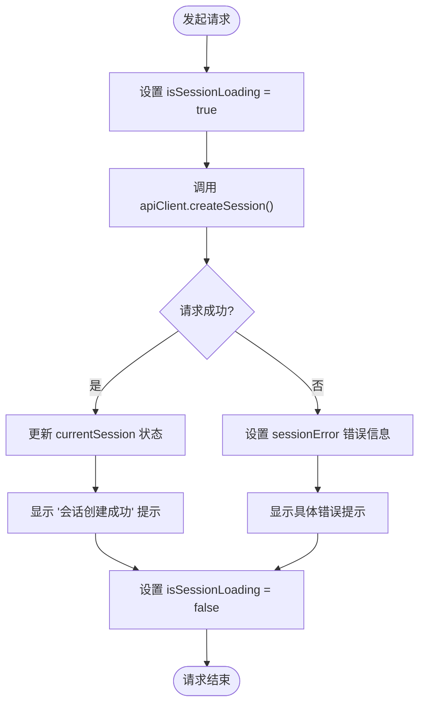
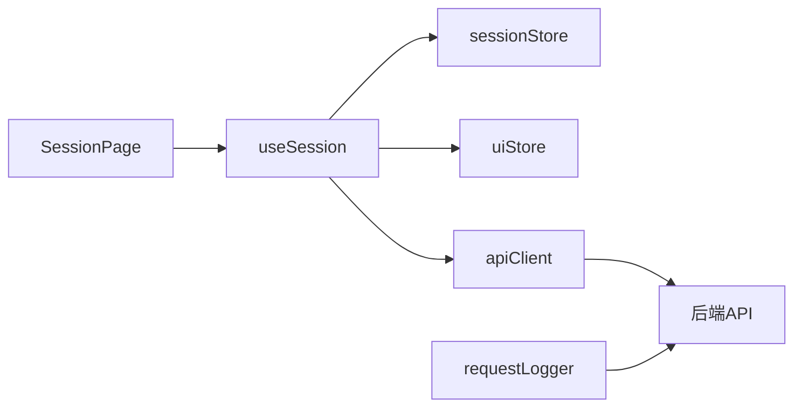

# 前端交互问题

<cite>
**本文档引用的文件**
- [useSession.ts](file://frontend/src/hooks/useSession.ts)
- [api.ts](file://frontend/src/utils/api.ts)
- [sessionStore.ts](file://frontend/src/stores/sessionStore.ts)
- [uiStore.ts](file://frontend/src/stores/uiStore.ts)
- [requestLogger.js](file://backend/src/middleware/requestLogger.js)
- [useSession.test.ts](file://frontend/tests/unit/hooks/useSession.test.ts)
</cite>

## 目录
1. [简介](#简介)
2. [项目结构](#项目结构)
3. [核心组件](#核心组件)
4. [架构概述](#架构概述)
5. [详细组件分析](#详细组件分析)
6. [依赖分析](#依赖分析)
7. [性能考虑](#性能考虑)
8. [故障排除指南](#故障排除指南)
9. [结论](#结论)

## 简介
本文档旨在为智能运维助手前端应用中常见的交互问题提供诊断和解决方案。重点分析API请求失败、状态更新异常、组件渲染卡顿等典型问题，指导开发者如何结合浏览器开发者工具与后端日志进行联动分析，并通过单元测试验证修复效果。

## 项目结构
前端代码采用TypeScript + React + Zustand架构，主要分为组件（components）、自定义Hook（hooks）、状态存储（stores）、类型定义（types）和工具函数（utils）等模块。后端使用Node.js中间件记录详细的请求日志，便于前后端协同排查问题。

**图示来源**
- [useSession.ts](file://frontend/src/hooks/useSession.ts)
- [api.ts](file://frontend/src/utils/api.ts)
- [requestLogger.js](file://backend/src/middleware/requestLogger.js)

**本节来源**
- [frontend/src/hooks/useSession.ts](file://frontend/src/hooks/useSession.ts)
- [backend/src/middleware/requestLogger.js](file://backend/src/middleware/requestLogger.js)

## 核心组件
核心功能由`useSession`自定义Hook驱动，负责管理会话的创建、加载、执行步骤等操作。该Hook依赖Zustand状态管理库维护当前会话状态，并通过`apiClient`与后端通信。全局UI状态（如加载提示）由`useUIStore`统一管理。

**本节来源**
- [useSession.ts](file://frontend/src/hooks/useSession.ts)
- [sessionStore.ts](file://frontend/src/stores/sessionStore.ts)
- [uiStore.ts](file://frontend/src/stores/uiStore.ts)

## 架构概述
系统采用前后端分离架构。前端通过Axios封装API客户端，自动注入认证令牌；后端通过`requestLogger`中间件记录每个请求的入参、响应码和耗时。当出现API错误时，前端根据HTTP状态码显示相应的用户提示。

**图示来源**
- [useSession.ts](file://frontend/src/hooks/useSession.ts)
- [api.ts](file://frontend/src/utils/api.ts)
- [requestLogger.js](file://backend/src/middleware/requestLogger.js)

## 详细组件分析

### useSession Hook 分析
`useSession`是管理会话生命周期的核心Hook，提供了创建、加载、执行等方法，并正确处理了加载状态和错误状态。

#### 状态管理逻辑

**图示来源**
- [useSession.ts](file://frontend/src/hooks/useSession.ts)
- [sessionStore.ts](file://frontend/src/stores/sessionStore.ts)
- [uiStore.ts](file://frontend/src/stores/uiStore.ts)

#### API 请求流程

**图示来源**
- [useSession.ts](file://frontend/src/hooks/useSession.ts)
- [api.ts](file://frontend/src/utils/api.ts)

**本节来源**
- [useSession.ts](file://frontend/src/hooks/useSession.ts)
- [sessionStore.ts](file://frontend/src/stores/sessionStore.ts)
- [uiStore.ts](file://frontend/src/stores/uiStore.ts)

### 故障场景与修复方法

#### API 请求失败
**现象**：网络面板显示请求状态为4xx/5xx。
**诊断**：
1. 在浏览器开发者工具的“网络”标签页中查看请求负载（Payload）和响应头（Headers）。
2. 检查后端`requestLogger`日志中对应时间戳的“请求完成”条目，确认`statusCode`和错误详情。
**常见原因与修复**：
- **跨域配置缺失**：确保后端CORS中间件已正确配置允许的源。
- **认证令牌未传递**：检查`api.ts`中的请求拦截器是否正确从localStorage读取并设置`Authorization`头。
- **请求超时**：调整`apiClient`实例的`timeout`值或优化后端处理逻辑。

#### 状态更新异常
**现象**：界面上的加载指示器一直旋转，但实际请求已完成。
**诊断**：
1. 检查`useSession`中相关操作的`try...catch...finally`块。
2. 确认在`finally`块中是否都调用了`setSessionLoading(false)`。
**修复**：参考`useSession.test.ts`中的测试用例，确保所有异步路径最终都能重置加载状态。

#### 组件渲染卡顿
**现象**：页面响应缓慢或出现卡顿。
**诊断**：
1. 使用React DevTools检查不必要的重新渲染。
2. 确认`useCallback`是否正确地缓存了回调函数，避免因引用变化导致子组件重渲染。
**修复**：确保`useSession`返回的所有函数都使用`useCallback`包裹，并正确声明依赖数组。

**本节来源**
- [useSession.ts](file://frontend/src/hooks/useSession.ts)
- [api.ts](file://frontend/src/utils/api.ts)
- [requestLogger.js](file://backend/src/middleware/requestLogger.js)

## 依赖分析
前端组件间存在清晰的依赖关系：UI组件调用`useSession` Hook，Hook内部依赖`sessionStore`和`uiStore`进行状态管理，并通过`apiClient`与后端服务通信。后端`requestLogger`独立于业务逻辑，作为中间件被所有路由共享。

**图示来源**
- [useSession.ts](file://frontend/src/hooks/useSession.ts)
- [sessionStore.ts](file://frontend/src/stores/sessionStore.ts)
- [uiStore.ts](file://frontend/src/stores/uiStore.ts)
- [api.ts](file://frontend/src/utils/api.ts)

**本节来源**
- [useSession.ts](file://frontend/src/hooks/useSession.ts)
- [api.ts](file://frontend/src/utils/api.ts)
- [requestLogger.js](file://backend/src/middleware/requestLogger.js)

## 性能考虑
- `useSession`中的异步操作均设置了合理的超时时间（默认30秒），防止请求无限挂起。
- 状态存储使用Zustand的`persist`插件，仅将搜索条件和分页信息持久化到localStorage，避免存储过多数据影响性能。
- 后端`requestLogger`记录了每个请求的耗时，可用于识别慢接口。

## 故障排除指南
当遇到前端交互问题时，请按以下步骤排查：

1. **复现问题**：明确操作步骤和预期/实际结果。
2. **检查网络请求**：打开浏览器开发者工具，观察相关API请求的状态码、请求体和响应体。
3. **核对后端日志**：根据请求时间戳，在后端日志中查找对应的“收到请求”和“请求完成”记录，确认服务端处理情况。
4. **验证状态管理**：检查`useSession`及相关store中的状态变更逻辑是否完整，特别是错误和加载状态的重置。
5. **编写测试用例**：参考`useSession.test.ts`，为修复的问题编写Vitest单元测试，确保问题不会再次发生。

**本节来源**
- [useSession.ts](file://frontend/src/hooks/useSession.ts)
- [useSession.test.ts](file://frontend/tests/unit/hooks/useSession.test.ts)
- [requestLogger.js](file://backend/src/middleware/requestLogger.js)

## 结论
通过结合前端开发者工具和后端请求日志，可以高效地诊断和解决API交互问题。关键在于理解`useSession`等自定义Hook如何管理状态生命周期，并利用单元测试来保障代码质量。遵循本文档的指导，开发者能够快速定位并修复常见的前端交互缺陷。