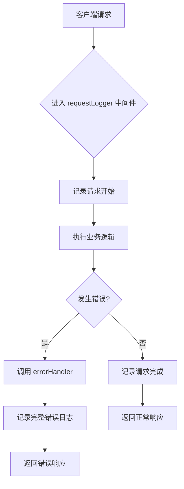

# 后端服务错误

<cite>
**本文档中引用的文件**
- [errorHandler.js](file://backend/src/middleware/errorHandler.js)
- [logger.js](file://backend/src/middleware/logger.js)
- [validation.js](file://backend/src/middleware/validation.js)
- [development.json](file://config/development.json)
- [production.json](file://config/production.json)
</cite>

## 目录
1. [简介](#简介)
2. [核心错误类型分析](#核心错误类型分析)
3. [日志系统与上下文追踪](#日志系统与上下文追踪)
4. [HTTP状态码与业务错误映射](#http状态码与业务错误映射)
5. [开发与生产环境错误策略](#开发与生产环境错误策略)
6. [常见问题修复示例](#常见问题修复示例)
7. [结论](#结论)

## 简介
本指南旨在为后端开发者提供一套完整的错误排查方案，重点围绕`errorHandler`中间件所捕获的各类异常展开。通过深入分析验证错误、类型转换错误、JWT相关错误等常见异常类型，并结合Winston日志系统的上下文信息（如requestId、IP、User-Agent），帮助开发者快速定位并解决系统运行中的问题。

## 核心错误类型分析

### ValidationError 字段验证失败
当请求数据不符合预定义规则时抛出此错误。触发条件包括：
- 必需字段缺失
- 数据类型不匹配
- 字符串长度超出限制
- 枚举值不在允许范围内

该错误由`validation.js`中的验证中间件触发，并传递给`errorHandler`进行统一处理。

**Section sources**
- [validation.js](file://backend/src/middleware/validation.js#L65-L93)
- [errorHandler.js](file://backend/src/middleware/errorHandler.js#L19-L25)

### CastError 无效ID格式
在尝试将字符串转换为MongoDB ObjectId时发生格式错误。典型场景是客户端传入了非标准UUID或非法字符组成的ID。

此类错误通常出现在路由参数解析过程中，例如访问 `/api/v1/session/:id` 时提供的 `id` 不符合规范。

**Section sources**
- [errorHandler.js](file://backend/src/middleware/errorHandler.js#L51-L111)

### JsonWebTokenError 无效令牌
表示JWT令牌本身存在结构性问题，如签名无效、格式错误或被篡改。这通常意味着客户端使用了伪造或损坏的token。

### TokenExpiredError 令牌过期
表明JWT已超过其有效期（exp字段）。系统会自动拒绝此类请求，要求用户重新登录获取新token。

以上两种JWT相关错误均由认证中间件检测到后抛出，并由`errorHandler`统一响应。

**Section sources**
- [errorHandler.js](file://backend/src/middleware/errorHandler.js#L51-L111)

### Duplicate Field Value 重复字段冲突
当数据库唯一索引约束被违反时触发（err.code === 11000）。例如创建会话时出现重复的会话ID或用户名冲突。

此错误直接来自MongoDB驱动层，经由Mongoose模型传播至错误处理链。

**Section sources**
- [errorHandler.js](file://backend/src/middleware/errorHandler.js#L51-L111)

## 日志系统与上下文追踪

### Winston日志输出格式
系统采用Winston作为日志记录工具，所有错误均以结构化JSON格式写入日志文件。关键字段包括：

```json
{
  "timestamp": "ISO时间戳",
  "level": "error",
  "message": "Application error",
  "meta": {
    "error": {
      "name": "错误名称",
      "message": "错误消息",
      "stack": "堆栈跟踪（仅开发环境）"
    },
    "request": {
      "method": "HTTP方法",
      "url": "请求URL",
      "ip": "客户端IP",
      "userAgent": "用户代理",
      "requestId": "请求唯一标识"
    }
  }
}
```

### 上下文信息定位问题源头
通过以下维度可精准定位错误来源：

| 上下文信息 | 用途说明 |
|----------|--------|
| requestId | 跨服务调用链追踪同一请求 |
| IP地址 | 判断是否来自特定客户端或攻击源 |
| User-Agent | 分析客户端类型及版本兼容性问题 |
| 请求方法与URL | 定位具体接口行为异常 |
| 时间戳 | 关联其他系统日志进行综合分析 |

这些信息由`requestLogger`中间件自动采集，并随错误一并记录。

**Diagram sources**
- [logger.js](file://backend/src/middleware/logger.js#L52-L109)



**Diagram sources**
- [logger.js](file://backend/src/middleware/logger.js#L0-L58)
- [errorHandler.js](file://backend/src/middleware/errorHandler.js#L51-L111)

## HTTP状态码与业务错误映射

| 错误类型 | HTTP状态码 | 业务含义 | 可恢复性 |
|--------|-----------|---------|--------|
| ValidationError | 400 | 请求数据格式错误 | 高（修正输入即可） |
| CastError | 400 | ID格式非法 | 高（检查ID生成逻辑） |
| Duplicate Field Value | 400 | 唯一键冲突 | 中（需去重或更新） |
| JsonWebTokenError | 401 | 认证令牌无效 | 高（重新登录） |
| TokenExpiredError | 401 | 令牌过期 | 高（刷新令牌） |
| NotFoundError | 404 | 资源不存在 | 视情况而定 |
| RateLimitError | 429 | 请求频率超限 | 高（等待冷却） |
| 默认错误 | 500 | 内部服务器错误 | 低（需排查代码） |

此映射关系由`errorHandler.js`中的条件判断实现，确保每种错误返回恰当的状态码。

**Section sources**
- [errorHandler.js](file://backend/src/middleware/errorHandler.js#L51-L111)

## 开发与生产环境错误策略

### 开发环境 (development)
配置文件位于 `config/development.json`，启用详细日志输出：

```json
{
  "logging": {
    "level": "debug",
    "console": {
      "enabled": true,
      "colorize": true
    },
    "file": {
      "enabled": false"
    }
  }
}
```

特点：
- 控制台彩色输出便于调试
- 错误响应中包含完整堆栈信息
- 所有级别的日志均记录

### 生产环境 (production)
配置文件位于 `config/production.json`，强调安全与性能：

```json
{
  "logging": {
    "level": "warn",
    "file": {
      "enabled": true,
      "path": "./logs",
      "maxSize": "100MB",
      "maxFiles": "10"
    },
    "console": {
      "enabled": false
    }
  }
}
```

特点：
- 仅记录警告及以上级别日志
- 日志写入文件并轮转管理
- 错误响应中不暴露堆栈信息
- 控制台无输出以减少I/O开销

环境差异体现在错误响应构造逻辑中：仅在`NODE_ENV === 'development'`时附加`stack`和`details`字段。

**Section sources**
- [development.json](file://config/development.json#L0-L45)
- [production.json](file://config/production.json#L0-L53)
- [errorHandler.js](file://backend/src/middleware/errorHandler.js#L105-L169)

## 常见问题修复示例

### 修复字段验证失败
当收到 `"缺少必需字段: problem_description"` 错误时，应检查请求体是否包含必要字段：

```javascript
// 正确示例
POST /api/v1/session
{
  "problem_category": "network",
  "problem_description": "网络连接超时，请检查DNS配置"
}
```

确保字段名拼写正确且值不为空字符串。

### 修复无效ID格式
若返回 `"Invalid ID format"`，请确认使用的ID符合UUID v4格式：

```text
正确: 550e8400-e29b-41d4-a716-446655440000
错误: abc123 或 550e8400-e29b-41d4-a716-44665544000
```

建议使用标准库生成UUID，避免手动构造。

### 解决重复字段冲突
遇到 `"Duplicate field value"` 时，可通过以下方式处理：

1. **前置查询**：先检查资源是否存在
2. **UPSERT操作**：使用`findOneAndUpdate`配合`upsert: true`
3. **幂等设计**：利用唯一键保证多次提交结果一致

例如更新会话状态时使用：

```javascript
Session.findOneAndUpdate(
  { session_id: id },
  { $set: updateData },
  { upsert: true, new: true }
)
```

**Section sources**
- [validation.js](file://backend/src/middleware/validation.js#L65-L93)
- [errorHandler.js](file://backend/src/middleware/errorHandler.js#L51-L111)

## 结论
通过对`errorHandler`中间件的全面分析，我们建立了从错误捕获、日志记录到响应返回的完整排查链条。结合Winston日志系统提供的丰富上下文信息，开发者可在不同环境下高效定位问题根源。遵循本文档提供的错误类型说明与修复建议，能够显著提升系统的稳定性和可维护性。