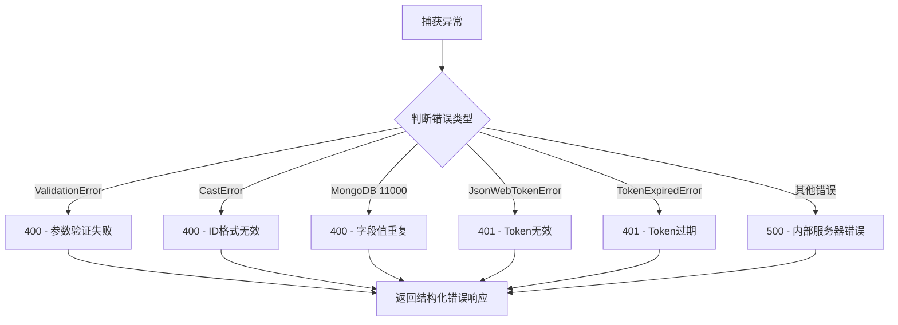
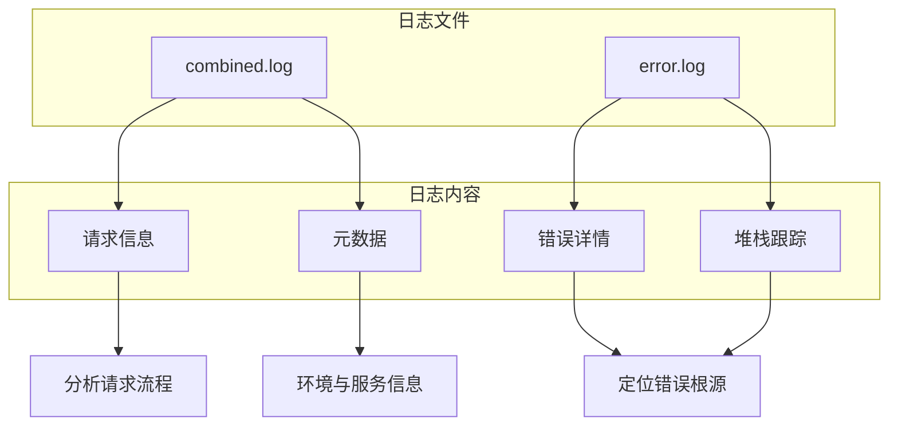
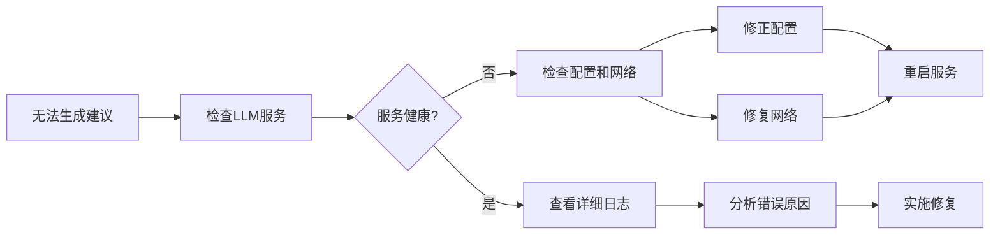

# 故障排除

<cite>
**本文档中引用的文件**
- [errorHandler.js](file://backend/src/middleware/errorHandler.js)
- [logger.js](file://backend/src/utils/logger.js)
- [LLMService.js](file://backend/src/services/LLMService.js)
- [KnowledgeBaseService.js](file://backend/src/services/KnowledgeBaseService.js)
- [SessionManagementService.js](file://backend/src/services/SessionManagementService.js)
- [validation-summary.txt](file://validation-summary.txt)
</cite>

## 目录
1. [简介](#简介)
2. [错误分类与处理机制](#错误分类与处理机制)
3. [日志分析方法](#日志分析方法)
4. [系统自检与验证结果](#系统自检与验证结果)
5. [典型问题排查流程](#典型问题排查流程)
6. [常见错误代码速查表](#常见错误代码速查表)

## 简介
本手册旨在为“智能运维助手”系统的用户提供一套完整的故障诊断和解决方案。基于系统`errorHandler`中间件捕获的异常类型，结合Winston日志记录机制和系统自检报告，帮助用户快速定位并解决运行过程中可能出现的问题。

**Section sources**
- [errorHandler.js](file://backend/src/middleware/errorHandler.js)
- [logger.js](file://backend/src/utils/logger.js)

## 错误分类与处理机制

系统通过统一的`errorHandler`中间件对所有异常进行分类处理，确保错误响应的一致性和可读性。该中间件能够识别多种预定义的错误类型，并返回相应的HTTP状态码和错误信息。



**Diagram sources**
- [errorHandler.js](file://backend/src/middleware/errorHandler.js#L49-L118)

**Section sources**
- [errorHandler.js](file://backend/src/middleware/errorHandler.js#L1-L170)

## 日志分析方法

系统使用Winston库进行日志记录，所有关键操作和错误事件都会被详细记录到日志文件中。日志文件位于`logs/`目录下，包含`combined.log`（综合日志）和`error.log`（错误日志）两个文件。

### 查看请求日志
在`combined.log`中可以找到详细的请求信息，包括：
- 请求时间戳
- HTTP方法和URL
- 客户端IP地址
- 用户代理
- 请求ID（用于追踪）

### 分析错误堆栈
当发生错误时，`errorHandler`会将完整的错误详情记录到日志中，包括：
- 错误名称和消息
- 错误堆栈跟踪
- 请求上下文信息
- 在开发环境下，还会包含完整的错误对象细节

建议使用文本搜索功能查找特定的`requestId`或错误关键词来快速定位问题。



**Diagram sources**
- [logger.js](file://backend/src/utils/logger.js#L19-L38)
- [errorHandler.js](file://backend/src/middleware/errorHandler.js#L55-L65)

**Section sources**
- [logger.js](file://backend/src/utils/logger.js#L1-L51)
- [errorHandler.js](file://backend/src/middleware/errorHandler.js#L49-L118)

## 系统自检与验证结果

系统提供了`validate-system.sh`脚本用于执行全面的自检，并生成`validation-summary.txt`报告文件。

当前系统验证报告显示：

```
智能运维助手系统验证报告
验证时间: Sat Sep 27 13:52:50 UTC 2025
验证状态: ✅ 通过
后端文件: 8 个
前端文件: 7 个
知识库文档: 0 个
测试文件: 8 个
系统状态: 🚀 准备就绪
```

### 验证要点说明
- **知识库文档数量为0**：这可能表示`knowledge-base`目录下的`.md`文件未被正确加载或解析。
- **后端和前端文件计数正常**：表明核心应用文件完整。
- **测试文件存在**：说明单元和集成测试已配置。

如果发现知识库无法加载，请检查`knowledge-base`目录是否存在以及文件格式是否正确。

**Section sources**
- [validation-summary.txt](file://validation-summary.txt)
- [KnowledgeBaseService.js](file://backend/src/services/KnowledgeBaseService.js#L14-L577)

## 典型问题排查流程

### 无法生成处置建议
当系统无法生成处置建议时，应按以下步骤进行排查：

1. **检查LLM服务状态**
   - 调用`LLMService.healthCheck()`接口确认大模型服务是否健康
   - 检查`llm-config.json`中的提供商配置是否正确
   - 确认网络能否访问指定的LLM端点

2. **验证网络连通性**
   - 使用`ping`或`curl`测试与LLM服务端点的连接
   - 检查防火墙设置是否阻止了出站请求
   - 确认API密钥等认证信息有效

3. **核对配置文件**
   - 检查`configs/llm-config.json`文件是否存在且格式正确
   - 验证`provider`、`endpoint`、`api_key`等关键字段的值
   - 确保`models.primary`指定了有效的模型名称

4. **查看相关日志**
   - 在`logs/error.log`中搜索"大模型服务初始化失败"或"API调用失败"
   - 检查是否有重试机制触发的警告信息



**Diagram sources**
- [LLMService.js](file://backend/src/services/LLMService.js#L9-L366)
- [LLMProvider.js](file://backend/src/services/LLMProvider.js#L8-L97)

**Section sources**
- [LLMService.js](file://backend/src/services/LLMService.js#L9-L366)
- [LLMProvider.js](file://backend/src/services/LLMProvider.js#L8-L97)

### 会话过期或丢失
当用户反映会话数据丢失或提示会话过期时，应执行以下检查：

1. **确认会话存储机制**
   - 检查`SessionManagementService`是否启用了文件存储
   - 确认`data/sessions`目录存在且有写入权限

2. **检查会话TTL设置**
   - 默认会话有效期为24小时，可在配置中调整
   - 过期会话会被定时清理任务自动删除

3. **排查内存限制**
   - 当内存中会话数量超过`maxSessionsInMemory`限制时，最旧的会话将被驱逐
   - 建议定期监控会话数量和内存使用情况

**Section sources**
- [SessionManagementService.js](file://backend/src/services/SessionManagementService.js#L16-L668)

## 常见错误代码速查表

| 错误类型 | HTTP状态码 | 可能原因 | 解决方案 |
|---------|-----------|--------|---------|
| ValidationError | 400 | 请求参数不符合验证规则 | 检查请求体格式和必填字段 |
| CastError | 400 | 提供的ID格式不正确 | 确保使用正确的ObjectId格式 |
| Duplicate field value | 400 | 尝试创建重复的唯一字段 | 修改字段值或先删除原有记录 |
| Invalid token | 401 | 提供的JWT令牌无效 | 重新登录获取新令牌 |
| Token expired | 401 | JWT令牌已过期 | 刷新令牌或重新认证 |
| Internal Server Error | 500 | 未预期的服务器内部错误 | 查看日志中的堆栈跟踪以定位问题 |

**Section sources**
- [errorHandler.js](file://backend/src/middleware/errorHandler.js#L75-L105)