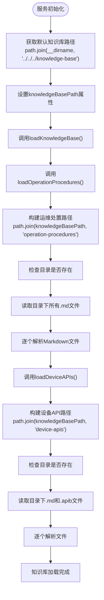
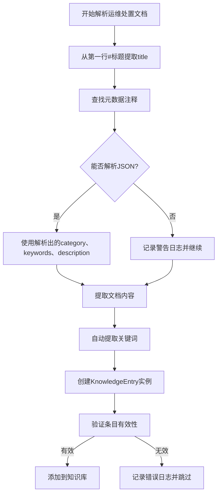
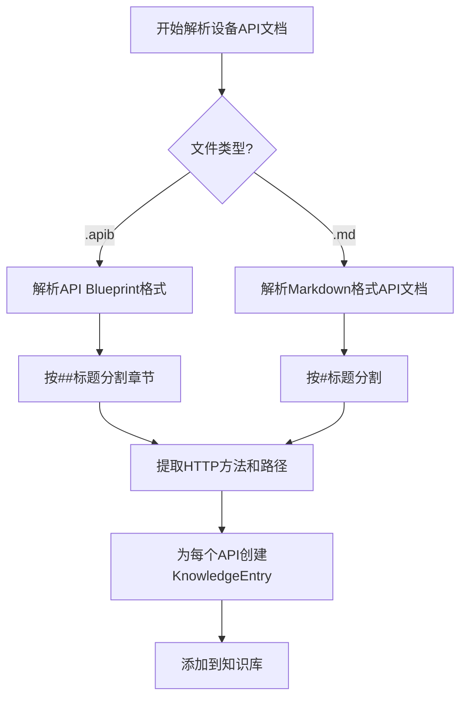
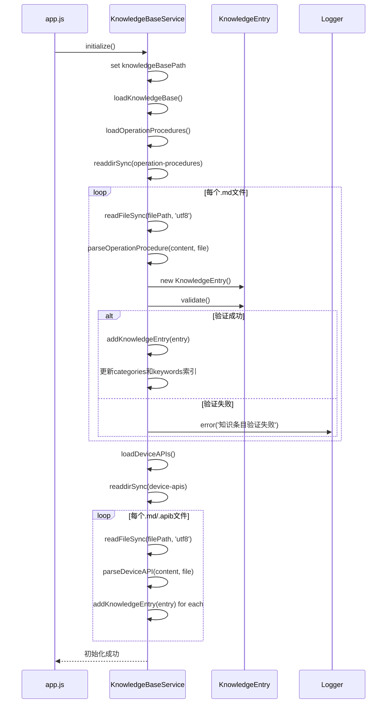

# 知识库加载异常

<cite>
**本文档引用的文件**
- [KnowledgeBaseService.js](file://backend\src\services\KnowledgeBaseService.js)
- [KnowledgeEntry.js](file://backend\src\models\KnowledgeEntry.js)
- [app.js](file://backend\src\app.js)
- [knowledgeController.js](file://backend\src\controllers\knowledgeController.js)
- [cpu-high-usage.md](file://knowledge-base\operation-procedures\cpu-high-usage.md)
- [database-management-api.md](file://knowledge-base\device-apis\database-management-api.md)
</cite>

## 目录
1. [问题排查流程](#问题排查流程)
2. [路径解析逻辑](#路径解析逻辑)
3. [语法解析错误处理](#语法解析错误处理)
4. [缓存加载顺序](#缓存加载顺序)
5. [文件结构完整性检查](#文件结构完整性检查)
6. [元数据格式规范](#元数据格式规范)
7. [典型加载中断案例](#典型加载中断案例)
8. [fs模块调试脚本](#fs模块调试脚本)

## 问题排查流程

当知识库初始化失败或内容无法检索时，应按照以下步骤进行系统性排查：

1. **检查服务启动日志**：查看`KnowledgeBaseService.initialize()`方法的日志输出，确认是否出现"知识库服务初始化失败"等错误信息
2. **验证知识库根目录**：确认`knowledge-base`目录是否存在且路径正确
3. **检查子目录结构**：验证`operation-procedures`和`device-apis`子目录是否存在
4. **审查Markdown文件**：检查`.md`文件是否存在、可读且符合元数据格式要求
5. **验证文件编码**：确保所有文件使用UTF-8编码
6. **检查文件权限**：确认应用程序有读取知识库文件的权限
7. **测试文件可读性**：使用调试脚本验证单个文件的可读性

**本节来源**
- [KnowledgeBaseService.js](file://backend\src\services\KnowledgeBaseService.js#L26-L40)
- [app.js](file://backend\src\app.js#L30-L45)

## 路径解析逻辑

`KnowledgeBaseService`在启动时通过以下逻辑解析Markdown文件路径：



**图示来源**
- [KnowledgeBaseService.js](file://backend\src\services\KnowledgeBaseService.js#L44-L94)

**本节来源**
- [KnowledgeBaseService.js](file://backend\src\services\KnowledgeBaseService.js#L44-L94)

## 语法解析错误处理

`KnowledgeBaseService`对Markdown文件的语法解析采用分层错误处理机制：

### 运维处置文档解析


### 设备API文档解析


**图示来源**
- [KnowledgeBaseService.js](file://backend\src\services\KnowledgeBaseService.js#L131-L175)
- [KnowledgeBaseService.js](file://backend\src\services\KnowledgeBaseService.js#L300-L350)

**本节来源**
- [KnowledgeBaseService.js](file://backend\src\services\KnowledgeBaseService.js#L131-L175)
- [KnowledgeBaseService.js](file://backend\src\services\KnowledgeBaseService.js#L300-L350)

## 缓存加载顺序

知识库服务的缓存加载遵循严格的顺序和依赖关系：



**图示来源**
- [KnowledgeBaseService.js](file://backend\src\services\KnowledgeBaseService.js#L44-L94)
- [KnowledgeEntry.js](file://backend\src\models\KnowledgeEntry.js#L43-L71)

**本节来源**
- [KnowledgeBaseService.js](file://backend\src\services\KnowledgeBaseService.js#L44-L94)
- [KnowledgeEntry.js](file://backend\src\models\KnowledgeEntry.js#L43-L71)

## 文件结构完整性检查

必须确保`knowledge-base`目录下的文件结构完整，具体检查要点如下：

### 目录结构要求
- `knowledge-base/` (根目录)
  - `operation-procedures/` (运维处置知识库)
    - `*.md` (Markdown格式的运维处置文档)
  - `device-apis/` (设备操作API知识库)
    - `*.md` (Markdown格式的API文档)
    - `*.apib` (API Blueprint格式的API文档)

### 存在性验证代码
```javascript
// 检查运维处置目录
const proceduresPath = path.join(this.knowledgeBasePath, 'operation-procedures');
if (!fs.existsSync(proceduresPath)) {
  logger.warn(`运维处置知识库目录不存在: ${proceduresPath}`);
  return;
}

// 检查设备API目录
const apisPath = path.join(this.knowledgeBasePath, 'device-apis');
if (!fs.existsSync