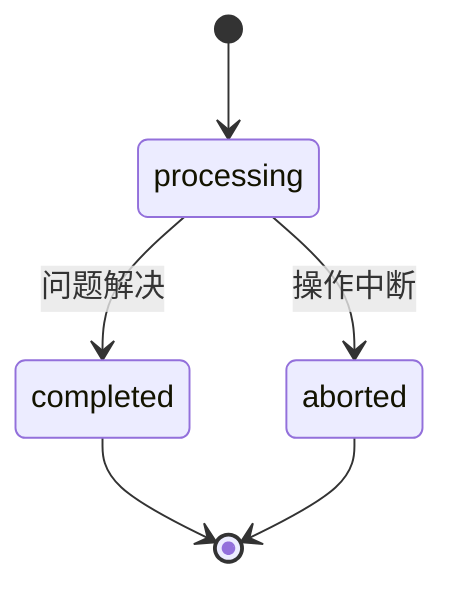
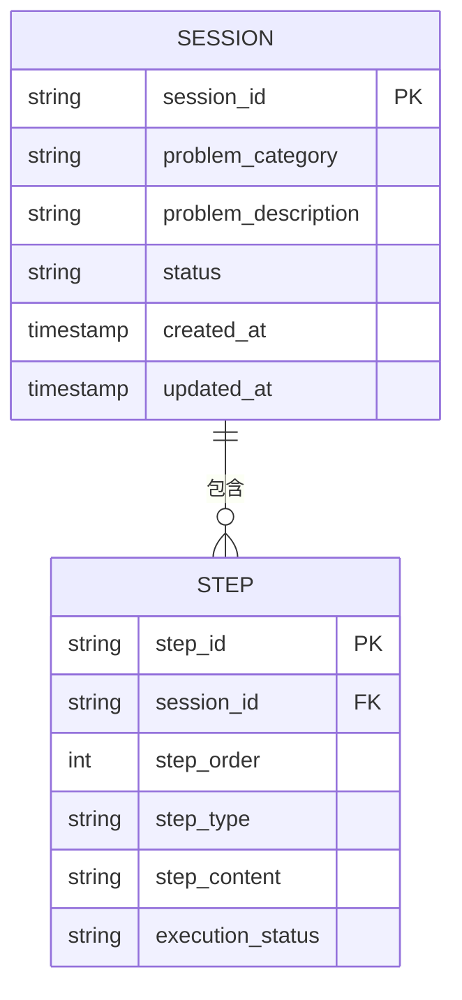
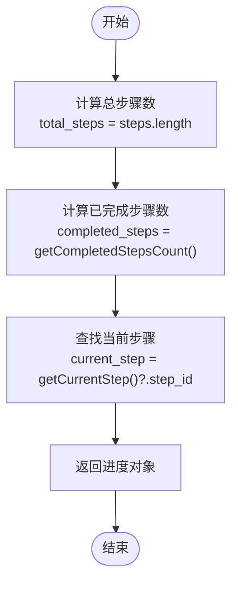

# 会话模型

<cite>
**本文档引用的文件**
- [Session.js](file://backend/src/models/Session.js)
- [Step.js](file://backend/src/models/Step.js)
- [index.ts](file://frontend/src/types/index.ts)
- [SessionManagementService.js](file://backend/src/services/SessionManagementService.js)
- [sessionController.js](file://backend/src/controllers/sessionController.js)
- [useSession.ts](file://frontend/src/hooks/useSession.ts)
</cite>

## 目录
1. [简介](#简介)
2. [核心字段定义](#核心字段定义)
3. [状态流转逻辑](#状态流转逻辑)
4. [会话与步骤关系](#会话与步骤关系)
5. [进度计算机制](#进度计算机制)
6. [关键方法说明](#关键方法说明)
7. [序列化模式](#序列化模式)
8. [典型实例数据](#典型实例数据)
9. [实际应用场景](#实际应用场景)

## 简介
会话（Session）数据模型是智能运维助手系统的核心组成部分，用于管理问题处置的完整生命周期。该模型通过结构化的数据设计，支持从问题创建到解决的全过程跟踪。会话模型不仅包含问题的基本信息和状态，还维护了详细的处置步骤序列，并提供了丰富的元数据支持。

本模型在前后端保持一致性，后端使用JavaScript类实现业务逻辑，前端使用TypeScript接口定义数据结构，确保了系统的类型安全和开发效率。会话管理服务负责会话的创建、更新、查询和持久化操作，为整个系统提供稳定的数据支撑。

**Section sources**
- [Session.js](file://backend/src/models/Session.js#L7-L119)
- [index.ts](file://frontend/src/types/index.ts#L1-L16)

## 核心字段定义
会话模型包含多个核心字段，每个字段都有明确的业务含义和约束条件：

- **session_id**: 会话唯一标识符，采用UUID格式生成，确保全局唯一性
- **problem_category**: 问题分类，限定为预定义的枚举值，如"performance"、"network"等
- **problem_description**: 问题描述，详细说明问题的具体情况和上下文
- **status**: 会话状态，表示当前会话的处理阶段，包括processing、completed、aborted三种状态
- **created_at**: 会话创建时间，记录会话初始化的时间戳
- **updated_at**: 会话更新时间，每次会话状态变更时都会更新此时间戳
- **user_id**: 用户标识，关联创建会话的用户
- **metadata**: 元数据，存储额外的上下文信息，采用键值对形式
- **steps**: 步骤列表，包含该会话下的所有处置步骤
- **progress**: 进度信息，动态计算并反映当前会话的执行进展

这些字段共同构成了完整的会话数据结构，支持系统的各种功能需求。

**Section sources**
- [Session.js](file://backend/src/models/Session.js#L7-L20)
- [index.ts](file://frontend/src/types/index.ts#L1-L16)

## 状态流转逻辑
会话状态在生命周期中遵循严格的流转规则，确保系统行为的一致性和可预测性：

**Diagram sources**
- [Session.js](file://backend/src/models/Session.js#L44-L52)
- [sessionController.js](file://backend/src/controllers/sessionController.js#L150-L175)

会话初始状态为"processing"，表示正在处理中。当问题成功解决时，状态变更为"completed"；如果操作过程中出现不可恢复的错误或用户主动取消，则状态变更为"aborted"。状态变更通过`updateStatus()`方法进行，该方法会对新状态进行验证，确保只接受预定义的有效状态值。

状态流转具有单向性特点，一旦会话进入"completed"或"aborted"状态，就不能再变回"processing"状态，这保证了问题处置过程的完整性。这种设计避免了状态混乱，便于后续的审计和分析。

**Section sources**
- [Session.js](file://backend/src/models/Session.js#L44-L52)
- [sessionController.js](file://backend/src/controllers/sessionController.js#L150-L175)

## 会话与步骤关系
会话与步骤之间存在明确的一对多关系，一个会话可以包含多个处置步骤：

**Diagram sources**
- [Session.js](file://backend/src/models/Session.js#L7-L119)
- [Step.js](file://backend/src/models/Step.js#L7-L200)

在数据模型中，会话对象通过`steps`数组属性直接维护其关联的步骤列表。每个步骤都包含指向其所属会话的`session_id`外键，形成双向关联。这种设计既保证了数据的完整性，又提高了查询效率。

步骤按照`step_order`字段进行排序，确保处置流程的有序执行。步骤类型分为自动执行（auto）、手动执行（manual）、分支（branch）和条件判断（conditional）四种，支持复杂的处置逻辑。每个步骤的状态独立管理，但整体上服务于会话的最终目标。

**Section sources**
- [Session.js](file://backend/src/models/Session.js#L7-L119)
- [Step.js](file://backend/src/models/Step.js#L7-L200)

## 进度计算机制
会话的进度信息通过`progress`字段动态计算，实时反映当前的执行状态：

**Diagram sources**
- [Session.js](file://backend/src/models/Session.js#L85-L103)

`progress`字段包含三个子字段：`total_steps`、`completed_steps`和`current_step`。`total_steps`等于会话中步骤列表的长度；`completed_steps`通过`getCompletedStepsCount()`方法统计执行状态为"completed"的步骤数量；`current_step`通过`getCurrentStep()`方法获取当前正在执行或待执行的第一个步骤ID。

这些计算都是在`toJSON()`方法调用时动态完成的，确保返回给前端的数据始终是最新的。这种设计避免了冗余数据的存储，同时保证了进度信息的实时性和准确性。

**Section sources**
- [Session.js](file://backend/src/models/Session.js#L85-L103)

## 关键方法说明
会话模型提供了多个关键方法来支持业务操作：

### 验证方法
`validate()`方法用于检查会话数据的完整性和有效性，确保必需字段不为空且符合预期格式。该方法返回包含验证结果和错误信息的对象，为前端提供清晰