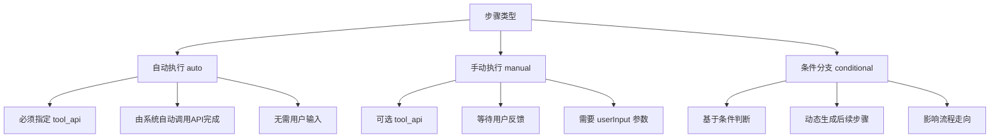
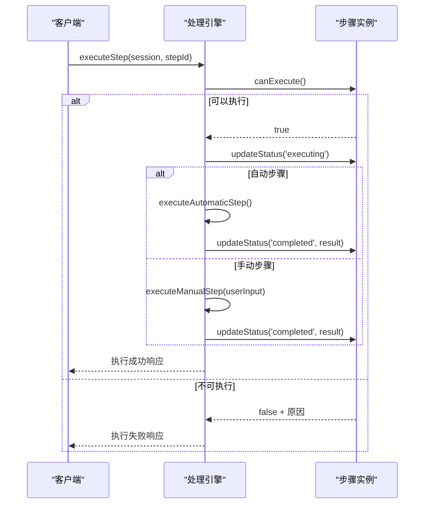

# 步骤模型

<cite>
**本文档中引用的文件**
- [Step.js](file://backend/src/models/Step.js)
- [ProcessingEngine.js](file://backend/src/services/ProcessingEngine.js)
- [ToolExecutionService.js](file://backend/src/services/ToolExecutionService.js)
- [index.ts](file://frontend/src/types/index.ts)
</cite>

## 目录
1. [简介](#简介)
2. [核心数据结构](#核心数据结构)
3. [步骤类型与执行行为](#步骤类型与执行行为)
4. [依赖管理与执行控制](#依赖管理与执行控制)
5. [核心方法逻辑分析](#核心方法逻辑分析)
6. [处理引擎中的调用流程](#处理引擎中的调用流程)
7. [性能监控与持续追踪](#性能监控与持续追踪)

## 简介
步骤模型是智能运维助手系统的核心组成部分，负责定义和管理问题处置过程中的每一个具体操作单元。该模型不仅承载了步骤的基本信息（如内容、顺序），还包含了复杂的执行控制逻辑，支持自动化执行、手动干预、条件分支等多种处置模式。通过精细的状态管理和时间追踪机制，系统能够准确反映每个步骤的执行情况，并为后续的性能分析和优化提供数据支持。

## 核心数据结构
步骤模型的数据结构设计旨在平衡灵活性与严谨性，确保既能适应多样化的运维场景，又能保证系统的稳定运行。

### 字段定义
| 字段名 | 类型 | 必填 | 默认值 | 说明 |
|--------|------|------|--------|------|
| step_id | string | 是 | UUID | 步骤唯一标识符 |
| session_id | string | 是 | - | 所属会话ID |
| step_order | number | 是 | - | 步骤在会话中的执行顺序 |
| step_type | enum | 否 | 'manual' | 步骤类型：auto/manual/branch/conditional |
| step_content | string | 是 | - | 步骤描述或指令内容 |
| tool_api | string | 否 | null | 自动化执行时调用的工具API ID |
| execution_status | enum | 否 | 'pending' | 执行状态：pending/executing/completed/failed/skipped |
| dependencies | array | 否 | [] | 依赖的前置步骤ID列表 |
| timeout | number | 否 | 30000 | 超时时间（毫秒） |
| retry_count | number | 否 | 0 | 当前重试次数 |
| max_retries | number | 否 | 3 | 最大允许重试次数 |
| created_at | string | 是 | ISO8601 | 创建时间戳 |
| updated_at | string | 是 | ISO8601 | 更新时间戳 |
| started_at | string | 否 | null | 开始执行时间戳 |
| completed_at | string | 否 | null | 完成执行时间戳 |

**Section sources**
- [Step.js](file://backend/src/models/Step.js#L7-L49)
- [index.ts](file://frontend/src/types/index.ts#L19-L38)

## 步骤类型与执行行为
不同的步骤类型对应着不同的执行策略和用户交互方式，这是实现灵活处置流程的基础。

### 类型差异对比


**Diagram sources**
- [Step.js](file://backend/src/models/Step.js#L20-L22)
- [ProcessingEngine.js](file://backend/src/services/ProcessingEngine.js#L305-L374)

### tool_api 在自动化执行中的作用
`tool_api` 字段是连接步骤模型与外部系统的关键桥梁。当一个步骤被标记为 `auto` 类型时，`tool_api` 必须指向知识库中定义的一个有效设备API。在执行过程中，处理引擎会根据此ID查找对应的API定义，构建请求并调用工具执行服务完成自动化操作。

**Section sources**
- [Step.js](file://backend/src/models/Step.js#L24-L25)
- [ProcessingEngine.js](file://backend/src/services/ProcessingEngine.js#L328-L331)

## 依赖管理与执行控制
步骤模型通过依赖关系和高级控制特性实现了复杂的工作流编排能力。

### 依赖管理
步骤间的依赖关系通过 `dependencies` 数组进行声明，系统在执行前会检查所有依赖步骤是否已完成。这种机制确保了处置流程的正确性和安全性。

### 重试机制
重试机制通过 `retry_count` 和 `max_retries` 两个字段实现：
- `retry_count` 记录当前已尝试的次数
- `max_retries` 定义最大允许重试次数
当步骤执行失败且未达到最大重试次数时，系统可自动或手动触发重试。

### 超时控制
`timeout` 字段用于设置步骤执行的超时限制。虽然当前实现中尚未完全集成超时中断功能，但该字段为未来扩展提供了基础支持。

**Section sources**
- [Step.js](file://backend/src/models/Step.js#L30-L33)

## 核心方法逻辑分析
步骤模型封装了一系列核心方法，用于维护其生命周期和业务规则。

### canExecute() 方法
该方法检查步骤是否满足执行条件：
1. 验证所有依赖步骤是否已完成
2. 检查当前状态是否为 'pending'
3. 返回可执行性判断及原因

```javascript
// 伪代码表示
function canExecute(completedSteps) {
  if (有未完成的依赖 && !completedStepIds.includes(depId)) {
    return { canExecute: false, reason: '依赖步骤未完成' };
  }
  if (execution_status !== 'pending') {
    return { canExecute: false, reason: `步骤状态为 ${this.execution_status}` };
  }
  return { canExecute: true };
}
```

**Section sources**
- [Step.js](file://backend/src/models/Step.js#L118-L137)

### shouldRetry() 方法
判断步骤是否需要重试：
- 当前状态为 'failed'
- 重试次数小于最大限制

```javascript
shouldRetry() {
  return this.execution_status === 'failed' && 
         this.retry_count < this.max_retries;
}
```

**Section sources**
- [Step.js](file://backend/src/models/Step.js#L142-L145)

### updateStatus() 方法
统一的状态更新入口，负责：
- 验证新状态的有效性
- 更新时间戳（started_at/completed_at）
- 设置执行结果
- 维护 updated_at 时间戳

**Section sources**
- [Step.js](file://backend/src/models/Step.js#L84-L105)

## 处理引擎中的调用流程
步骤模型在处理引擎的上下文中被实际使用，形成了完整的执行闭环。

### 执行流程序列图


**Diagram sources**
- [ProcessingEngine.js](file://backend/src/services/ProcessingEngine.js#L305-L374)
- [Step.js](file://backend/src/models/Step.js#L84-L105)

## 性能监控与持续追踪
步骤模型内置了完善的执行时间追踪机制，为系统性能分析提供关键数据。

### duration 计算方式
`duration` 并非直接存储的字段，而是通过 `getExecutionDuration()` 方法动态计算得出：
- 基于 `started_at` 和 `completed_at` 两个时间戳
- 单位为毫秒
- 若任一时间戳为空，则返回 null

该值在 `toJSON()` 方法中被包含，随步骤状态一起返回给前端。

### 性能监控价值
执行耗时数据可用于：
- 识别性能瓶颈步骤
- 评估自动化效率
- 生成处置报告
- 优化流程设计

**Section sources**
- [Step.js](file://backend/src/models/Step.js#L158-L163)
- [Step.js](file://backend/src/models/Step.js#L180-L202)