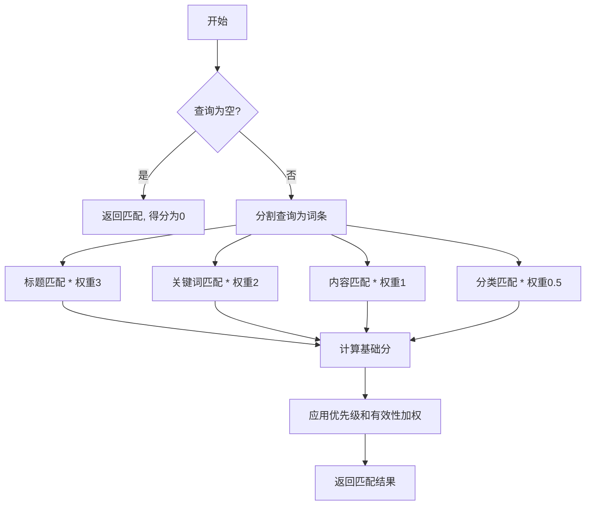
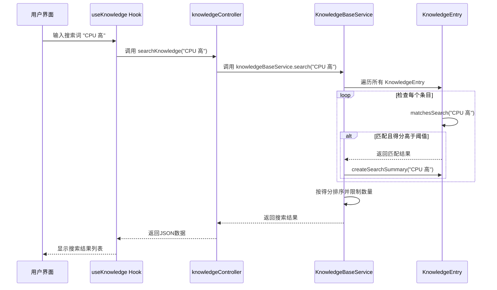

# 知识条目模型

<cite>
**Referenced Files in This Document **   
- [KnowledgeEntry.js](file://backend/src/models/KnowledgeEntry.js)
- [cpu-high-usage.md](file://knowledge-base/operation-procedures/cpu-high-usage.md)
- [database-management-api.md](file://knowledge-base/device-apis/database-management-api.md)
- [KnowledgeBaseService.js](file://backend/src/services/KnowledgeBaseService.js)
- [knowledgeController.js](file://backend/src/controllers/knowledgeController.js)
- [useKnowledge.ts](file://frontend/src/hooks/useKnowledge.ts)
</cite>

## 目录
1. [引言](#引言)
2. [核心数据结构与字段设计](#核心数据结构与字段设计)
3. [知识类型区分：operation-procedure 与 device-api](#知识类型区分operation-procedure-与-device-api)
4. [智能检索机制](#智能检索机制)
5. [自我优化机制](#自我优化机制)
6. [核心方法详解](#核心方法详解)
7. [实际应用案例](#实际应用案例)
8. [结论](#结论)

## 引言

`KnowledgeEntry` 模型是智能运维助手系统的核心数据实体，它统一管理着两类关键的运维知识：操作处置流程（operation-procedure）和设备API接口文档（device-api）。该模型不仅定义了知识的静态结构，还内建了动态的搜索、评分和摘要生成等行为逻辑。通过精细化的字段设计和算法实现，`KnowledgeEntry` 支撑起了一个能够根据上下文进行智能推荐的故障诊断系统。

**Section sources**
- [KnowledgeEntry.js](file://backend/src/models/KnowledgeEntry.js#L1-L20)

## 核心数据结构与字段设计

`KnowledgeEntry` 类采用构造函数模式初始化，其属性设计兼顾了信息完整性与检索效率。

### 关键字段及其作用

| 字段名 | 数据类型 | 描述 |
| :--- | :--- | :--- |
| `knowledge_id` | string | 唯一标识符，由UUIDv4生成，确保全局唯一性 |
| `knowledge_type` | string | 区分知识条目的类型，限定为 'operation-procedure' 或 'device-api' |
| `title` | string | 知识条目的标题，用于快速识别内容主题 |
| `content` | string | 知识的详细内容，通常为Markdown格式的文本 |
| `keywords` | string[] | 用于增强搜索匹配度的关键词条数组 |
| `category` | string | 对知识进行分类，如 "performance"、"network" 等 |
| `priority` | number | 优先级，范围0-10，影响最终的排序得分 |
| `usage_count` | number | 记录该知识条目被使用的总次数 |
| `effectiveness_score` | number | 有效性评分，范围0-1，反映用户对知识有效性的反馈 |
| `metadata` | object | 存储额外的元数据，如作者、版本、来源文件等 |

这些字段共同构成了一个可扩展且语义丰富的知识表示框架。

**Section sources**
- [KnowledgeEntry.js](file://backend/src/models/KnowledgeEntry.js#L6-L20)

## 知识类型区分：operation-procedure 与 device-api

`knowledge_type` 字段是区分不同知识应用场景的核心。系统通过此字段实现了两种截然不同的知识管理模式。

### operation-procedure (操作处置流程)

此类知识条目描述的是解决特定问题的步骤指南。例如，在 `cpu-high-usage.md` 文件中，详细记录了从“确认CPU使用率”到“长期优化方案”的完整处置流程。这类知识的特点是：
- **内容结构化**：通常包含“问题现象”、“处置步骤”、“注意事项”等固定章节。
- **行动导向**：提供明确的操作指令，指导运维人员一步步解决问题。
- **场景驱动**：针对具体的故障场景（如CPU高、内存不足）而创建。

### device-api (设备API接口)

此类知识条目则聚焦于设备或服务提供的编程接口。以 `database-management-api.md` 为例，它详尽地列出了数据库管理API的各个端点，包括请求方法、参数、示例和响应格式。这类知识的特点是：
- **技术规范性**：严格遵循RESTful API的设计原则，提供精确的技术细节。
- **机器可读**：内容格式高度标准化，便于程序解析和集成。
- **工具集成**：可直接作为自动化脚本或工具调用的参考依据。

这种二元分类使得知识库既能服务于需要人工介入的复杂故障排查，也能支持自动化工具的开发与集成。

**Section sources**
- [KnowledgeEntry.js](file://backend/src/models/KnowledgeEntry.js#L12)
- [cpu-high-usage.md](file://knowledge-base/operation-procedures/cpu-high-usage.md#L1-L97)
- [database-management-api.md](file://knowledge-base/device-apis/database-management-api.md#L1-L329)

## 智能检索机制

`matchesSearch()` 方法是整个知识库智能检索的核心引擎，它通过一套加权评分策略来确定知识条目与搜索查询的相关性。

### 加权评分策略

该算法将搜索过程分解为多个维度，并为每个维度分配不同的权重：



**Diagram sources **
- [KnowledgeEntry.js](file://backend/src/models/KnowledgeEntry.js#L108-L162)

#### 评分权重说明
- **标题匹配 (权重3)**：标题是知识最核心的概括，因此匹配时给予最高权重。
- **关键词匹配 (权重2)**：关键词是用户手动添加的索引，重要性仅次于标题。
- **内容匹配 (权重1)**：在正文中找到匹配项，表明相关性存在但不如前两者直接。
- **分类匹配 (权重0.5)**：分类匹配提供辅助信息，权重最低。

### 相关性排序逻辑

最终的排序并非仅基于上述基础分，而是引入了两个动态因子进行加权：
`最终得分 = 基础分 × (1 + priority / 10) × (1 + effectiveness_score)`

这个公式体现了知识库的“智慧”：
- **优先级 (`priority`)**：管理员可以为重要的知识（如核心业务系统的处置流程）设置更高的优先级，使其在搜索结果中排名靠前。
- **有效性评分 (`effectiveness_score`)**：这是一个动态指标，反映了历史用户对该知识有效性的评价。一个被多次成功使用的知识，其得分会越来越高。

这种设计确保了最常用、最有效的知识能够被优先推荐给用户。

**Section sources**
- [KnowledgeEntry.js](file://backend/src/models/KnowledgeEntry.js#L108-L162)

## 自我优化机制

`KnowledgeEntry` 模型通过 `usage_count` 和 `effectiveness_score` 两个字段，实现了知识库的持续自我进化。

### 使用计数 (`usage_count`)

每当一个知识条目被访问或使用时，其 `usage_count` 就会递增。这一机制在 `KnowledgeBaseService.getKnowledgeEntry()` 方法中被触发：

```javascript
getKnowledgeEntry(knowledgeId) {
    // ... 查找条目
    entry.incrementUsage(); // 使用次数+1
    return entry.toJSON();
}
```

高频使用的知识自然会在排序中占据优势，这符合“越多人用过的解决方案越可靠”的经验法则。

### 有效性评分 (`effectiveness_score`)

`effectiveness_score` 是一个更精细的反馈信号。它允许系统根据用户的后续反馈（例如，问题是否真正得到解决）来调整知识的评分。`updateEffectivenessScore()` 方法提供了更新此评分的接口：

```javascript
updateEffectivenessScore(score) {
    if (score < 0 || score > 1) {
      throw new Error('有效性评分必须在0-1之间');
    }
    this.effectiveness_score = score;
    this.last_updated = new Date().toISOString();
}
```

结合前端 `useKnowledge.ts` 中的 `updateEffectivenessScore` 函数，可以构建一个闭环：用户使用知识 -> 解决问题 -> 给出评分 -> 更新模型 -> 影响未来排序。长此以往，知识库中低效的知识会被边缘化，而高效的知识会脱颖而出。

**Section sources**
- [KnowledgeEntry.js](file://backend/src/models/KnowledgeEntry.js#L76-L90)
- [KnowledgeBaseService.js](file://backend/src/services/KnowledgeBaseService.js#L434-L446)
- [useKnowledge.ts](file://frontend/src/hooks/useKnowledge.ts#L125-L181)

## 核心方法详解

### `addKeywords()` 最佳实践

`addKeywords()` 方法允许向现有知识条目动态添加关键词。最佳实践包括：
- **保持小写**：方法内部会自动转换为小写，避免重复。
- **去重处理**：方法会检查关键词是否已存在，防止冗余。
- **批量添加**：支持传入字符串数组，提高效率。

```javascript
// 推荐做法
entry.addKeywords(['性能优化', 'CPU占用过高', '服务器卡顿']);
```

### `createSearchSummary()` 摘要生成

`createSearchSummary()` 方法负责生成与搜索查询相关的摘要片段。其工作流程如下：
1. 如果有查询词，则在内容中寻找第一个匹配的位置。
2. 围绕该位置前后截取指定长度的文本。
3. 在截取的文本两端添加省略号（...），形成上下文感知的摘要。

这种方法生成的摘要不是简单的开头几句话，而是直接展示与用户查询最相关的部分，极大地提升了用户体验。

**Section sources**
- [KnowledgeEntry.js](file://backend/src/models/KnowledgeEntry.js#L95-L103)
- [KnowledgeEntry.js](file://backend/src/models/KnowledgeEntry.js#L218-L250)

## 实际应用案例

`KnowledgeEntry` 模型在系统中的调用是一个典型的后端-前端协作流程。

### 故障诊断推荐流程



**Diagram sources **
- [knowledgeController.js](file://backend/src/controllers/knowledgeController.js#L0-L52)
- [KnowledgeBaseService.js](file://backend/src/services/KnowledgeBaseService.js#L345-L400)
- [KnowledgeEntry.js](file://backend/src/models/KnowledgeEntry.js#L108-L162)
- [useKnowledge.ts](file://frontend/src/hooks/useKnowledge.ts#L0-L50)

1.  **用户发起搜索**：用户在前端输入“CPU 高”进行搜索。
2.  **前端调用**：`useKnowledge` Hook 调用 `searchKnowledge` 函数。
3.  **API路由**：`knowledgeController` 接收HTTP GET请求，提取查询参数。
4.  **服务层处理**：`KnowledgeBaseService.search()` 方法遍历所有加载的 `KnowledgeEntry` 实例。
5.  **模型匹配**：每个 `KnowledgeEntry` 的 `matchesSearch()` 方法被调用，计算相关性得分。
6.  **结果聚合**：服务层收集所有匹配的结果，按得分排序，并调用 `createSearchSummary()` 生成摘要。
7.  **返回前端**：最终的JSON结果返回给前端，展示给用户。

在这个过程中，`cpu-high-usage.md` 这个 `operation-procedure` 类型的知识条目，因其标题和关键词中都包含“