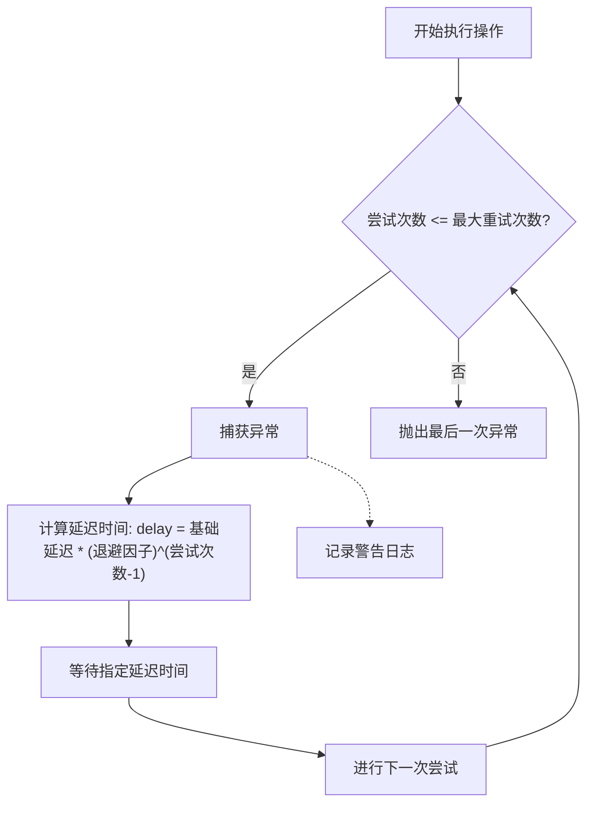
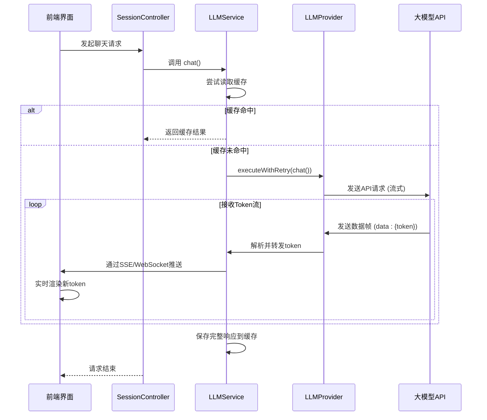

# LLM交互协议与流式响应处理

<cite>
**本文档引用文件**
- [LLMService.js](file://backend/src/services/LLMService.js)
- [LLMProvider.js](file://backend/src/services/LLMProvider.js)
- [sessionController.js](file://backend/src/controllers/sessionController.js)
</cite>

## 目录
1. [核心交互流程](#核心交互流程)
2. [重试机制与容错设计](#重试机制与容错设计)
3. [缓存策略实现](#缓存策略实现)
4. [流式响应与SSE传输](#流式响应与sse传输)
5. [错误处理与可靠性](#错误处理与可靠性)
6. [数据流动全景](#数据流动全景)

## 核心交互流程

`LLMService` 的 `chat()` 方法作为大模型交互的核心入口，封装了完整的请求处理链路。该方法首先通过 `generateCacheKey()` 生成唯一缓存键，尝试从本地缓存获取结果以提升响应速度和降低API调用成本。若缓存未命中，则通过 `executeWithRetry()` 安全地调用底层 `LLMProvider` 实例的 `chat()` 方法，并将成功响应持久化到缓存中。

此设计实现了业务逻辑与具体提供商（如OpenAI、Azure OpenAI、Ollama）的完全解耦，`LLMProvider` 作为一个抽象基类，定义了统一的接口规范，其子类负责实现特定平台的API细节。

**Section sources**
- [LLMService.js](file://backend/src/services/LLMService.js#L147-L198)
- [LLMProvider.js](file://backend/src/services/LLMProvider.js#L0-L57)

## 重试机制与容错设计

系统在网络不稳定场景下的容错能力由 `executeWithRetry()` 方法保障，其实现了经典的指数退避（Exponential Backoff）重试算法。



**Diagram sources**
- [LLMService.js](file://backend/src/services/LLMService.js#L103-L154)

**Section sources**
- [LLMService.js](file://backend/src/services/LLMService.js#L103-L154)
- [LLMConfigManager.js](file://backend/src/services/LLMConfigManager.js#L200-L220)

该机制的关键参数（最大重试次数、基础延迟、退避因子）均来自配置中心 `llmConfig.getRetryConfig()`，默认值为3次重试、1秒基础延迟和2倍退避因子。每次重试前会根据公式 `delay = retry_delay * Math.pow(backoff_factor, attempt - 1)` 计算动态延迟，例如第一次重试等待1秒，第二次等待2秒，第三次等待4秒，有效避免了对后端服务的“雪崩”式冲击。

## 缓存策略实现

为了优化高并发场景下的性能，系统采用了基于LRU（Least Recently Used）思想的内存缓存淘汰策略。

### 缓存键生成算法

`generateCacheKey()` 方法通过将影响模型输出的所有关键参数序列化并编码为Base64字符串来生成唯一键值。

```mermaid
flowchart LR
A[输入消息数组] --> B[JSON.stringify]
C[模型名称] --> B
D[温度参数] --> B
E[最大Token数] --> B
B --> F[原始JSON字符串]
F --> G[Buffer.from().toString('base64')]
G --> H[最终缓存键]
```

**Diagram sources**
- [LLMService.js](file://backend/src/services/LLMService.js#L69-L77)

**Section sources**
- [LLMService.js](file://backend/src/services/LLMService.js#L69-L77)

此算法确保了相同输入参数的请求必然产生相同的键，从而保证了缓存的有效性。同时，Base64编码解决了特殊字符在作为Map键时可能引发的问题。

### LRU-like缓存淘汰

缓存本身是一个 `Map` 结构，当缓存条目数量达到 `max_size` 上限时，系统会删除最先进入缓存的条目（通过 `this.cache.keys().next().value` 获取），这模拟了LRU的行为。此外，每个缓存条目都带有时间戳，当访问一个条目时，如果其存活时间超过 `ttl`（Time To Live），则会被自动清除，确保了数据的新鲜度。

**Section sources**
- [LLMService.js](file://backend/src/services/LLMService.js#L85-L108)

## 流式响应与SSE传输

尽管当前代码库中的 `LLMProvider` 子类（如 `OpenAIProvider`）尚未实现流式响应，但其架构已为此功能预留了空间。`OllamaProvider` 在其请求数据中明确包含了 `stream: false` 字段，表明其原生支持流模式。

### 数据帧格式与SSE应用

一旦实现流式响应，前端将通过Server-Sent Events (SSE) 协议接收数据。SSE是一种基于HTTP的单向通信协议，非常适合LLM的token流式输出。其数据帧格式如下：
- 每个数据块以 `data:` 开头，后跟一个或多个JSON对象。
- 多行数据块使用换行符分隔。
- 消息结束以 `\n\n` 标记。

前端JavaScript可以通过 `EventSource` API监听这些事件，实时地将接收到的token片段拼接并渲染到界面上，实现类似打字机效果的逐字显示。

### 消息推送链路

虽然 `sessionController.js` 当前主要处理RESTful请求，但其路由设计（如 `/api/v1/session/:id/status`）为长轮询或WebSocket等实时通信方式提供了集成点。未来可在此基础上构建一个消息推送服务，将LLM返回的每一个token通过WebSocket推送给前端，完成从LLM原始token流到前端界面逐字显示的完整数据流动。



**Diagram sources**
- [LLMService.js](file://backend/src/services/LLMService.js#L147-L198)
- [sessionController.js](file://backend/src/controllers/sessionController.js#L0-L241)
- [LLMProvider.js](file://backend/src/services/LLMProvider.js#L111-L151)

**