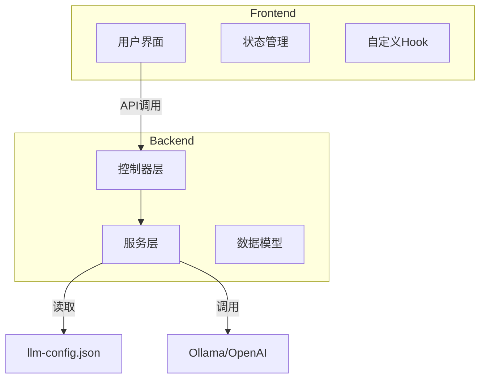
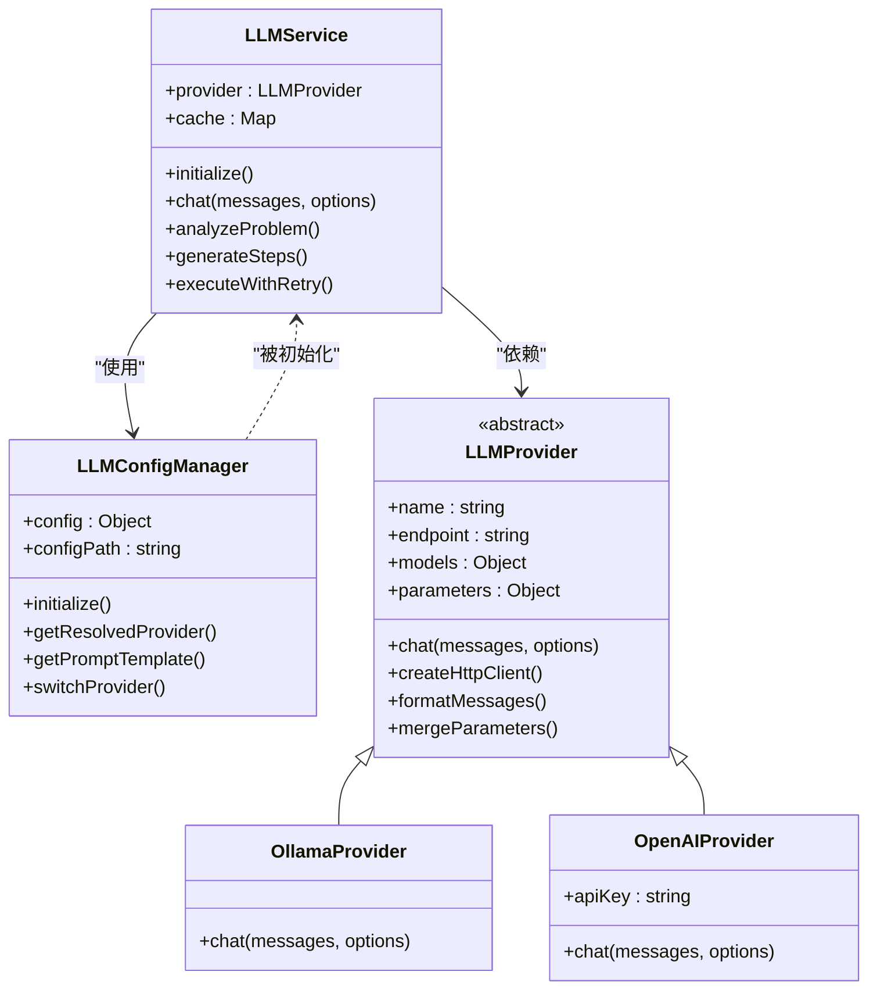
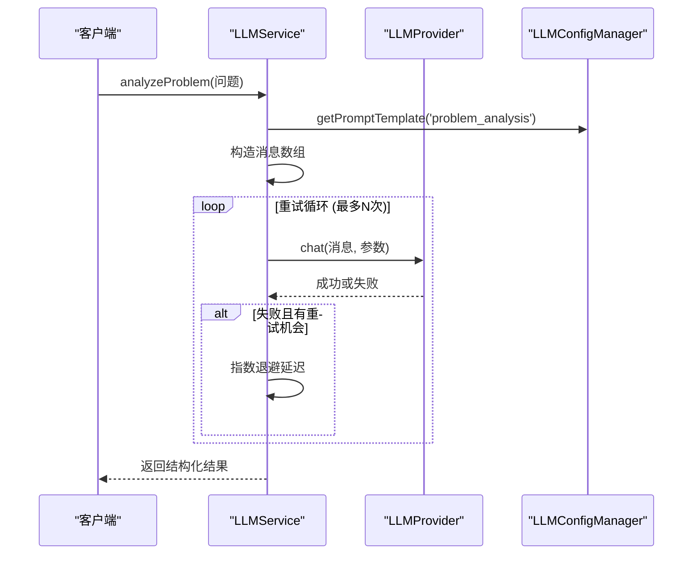
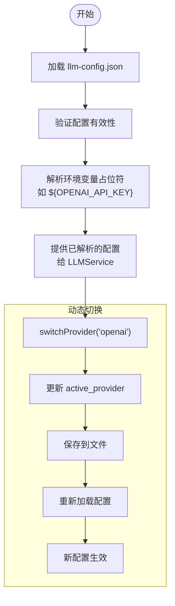
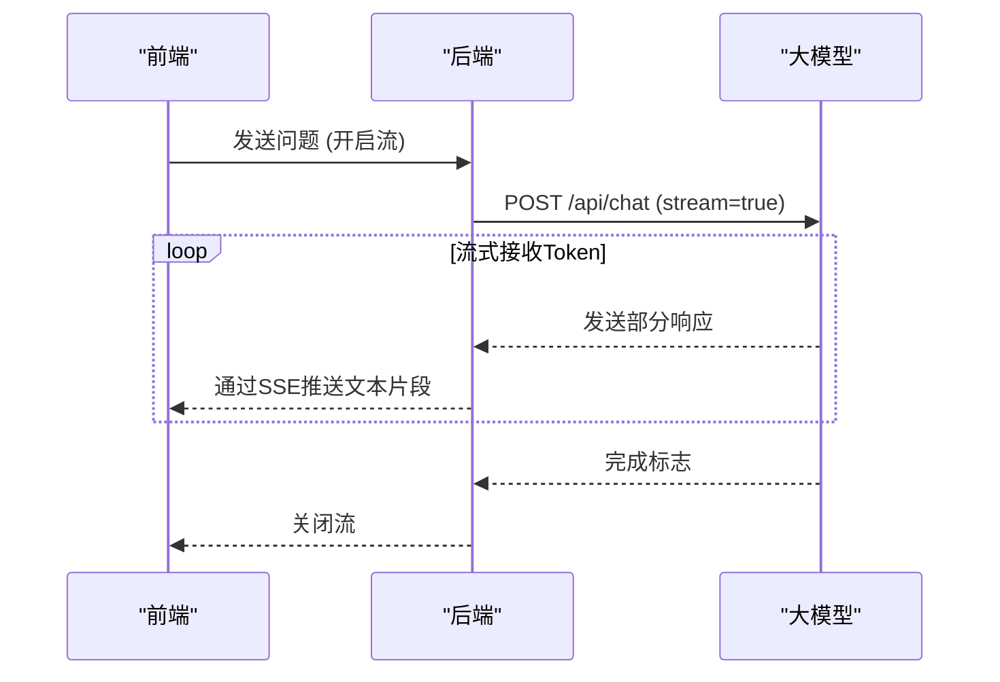
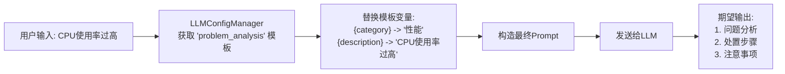
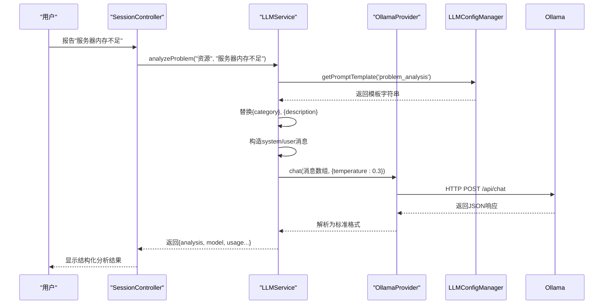
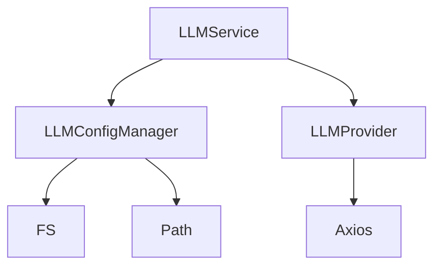

# LLM服务

<cite>
**本文档引用的文件**
- [LLMService.js](file://backend/src/services/LLMService.js)
- [LLMConfigManager.js](file://backend/src/services/LLMConfigManager.js)
- [LLMProvider.js](file://backend/src/services/LLMProvider.js)
- [llm-config.json](file://configs/llm-config.json)
</cite>

## 目录
1. [简介](#简介)
2. [项目结构](#项目结构)
3. [核心组件](#核心组件)
4. [架构概述](#架构概述)
5. [详细组件分析](#详细组件分析)
6. [依赖分析](#依赖分析)
7. [性能考虑](#性能考虑)
8. [故障排除指南](#故障排除指南)
9. [结论](#结论)

## 简介
本系统为智能运维助手，其核心是通过大语言模型（LLM）实现自动化问题分析与处置。该文档重点阐述 `LLMService` 如何封装对 Ollama、OpenAI 等多种 LLM 提供商的 API 调用，`LLMConfigManager` 如何动态管理配置和模型参数，以及流式响应处理和提示词工程的具体实践。

## 项目结构
系统采用前后端分离架构，后端使用 Node.js 实现核心服务，前端使用 React 构建用户界面。关键配置文件集中存放在 `configs` 目录下。

**Diagram sources**
- [llm-config.json](file://configs/llm-config.json)
- [LLMService.js](file://backend/src/services/LLMService.js)

**Section sources**
- [LLMService.js](file://backend/src/services/LLMService.js)
- [LLMConfigManager.js](file://backend/src/services/LLMConfigManager.js)

## 核心组件
核心功能由 `LLMService`、`LLMConfigManager` 和 `LLMProvider` 三个服务类协同完成。`LLMService` 是业务逻辑的入口，`LLMConfigManager` 负责配置管理，`LLMProvider` 的具体子类则负责与不同 LLM 厂商的 API 进行通信。

**Section sources**
- [LLMService.js](file://backend/src/services/LLMService.js#L9-L366)
- [LLMConfigManager.js](file://backend/src/services/LLMConfigManager.js#L13-L314)
- [LLMProvider.js](file://backend/src/services/LLMProvider.js#L8-L97)

## 架构概述
系统采用分层设计模式，将配置管理、服务封装和底层通信分离，确保了高内聚低耦合。

**Diagram sources**
- [LLMService.js](file://backend/src/services/LLMService.js#L9-L366)
- [LLMConfigManager.js](file://backend/src/services/LLMConfigManager.js#L13-L314)
- [LLMProvider.js](file://backend/src/services/LLMProvider.js#L8-L97)

## 详细组件分析

### LLM服务封装与错误重试机制
`LLMService` 类作为统一的服务接口，封装了所有与 LLM 交互的复杂性。它通过 `executeWithRetry` 方法实现了健壮的错误重试机制。

**Diagram sources**
- [LLMService.js](file://backend/src/services/LLMService.js#L128-L147)
- [LLMService.js](file://backend/src/services/LLMService.js#L178-L214)

**Section sources**
- [LLMService.js](file://backend/src/services/LLMService.js#L128-L147)

### 配置管理与动态参数切换
`LLMConfigManager` 负责加载和管理 `llm-config.json` 文件，支持动态切换提供商和解析环境变量。

**Diagram sources**
- [LLMConfigManager.js](file://backend/src/services/LLMConfigManager.js#L13-L314)
- [llm-config.json](file://configs/llm-config.json)

**Section sources**
- [LLMConfigManager.js](file://backend/src/services/LLMConfigManager.js#L288-L313)

### 流式响应处理
虽然当前代码未直接展示流式处理，但 `OllamaProvider` 的请求体中包含 `stream: false` 字段，表明其具备扩展流式响应的能力。前端可通过 SSE 或 WebSocket 接收实时输出。

**Diagram sources**
- [LLMProvider.js](file://backend/src/services/LLMProvider.js#L108-L156)

### 提示词工程实践
系统通过预定义的模板进行提示词工程，确保输出格式的一致性和专业性。

**Diagram sources**
- [LLMConfigManager.js](file://backend/src/services/LLMConfigManager.js#L198-L203)
- [LLMService.js](file://backend/src/services/LLMService.js#L178-L214)

### 请求构造与结构化输出流程
结合实际场景，展示从用户输入到结构化输出的完整过程。

**Diagram sources**
- [LLMService.js](file://backend/src/services/LLMService.js#L178-L214)
- [LLMProvider.js](file://backend/src/services/LLMProvider.js#L108-L156)

## 依赖分析
系统依赖关系清晰，各组件职责分明。

**Diagram sources**
- [LLMService.js](file://backend/src/services/LLMService.js#L9-L366)
- [LLMConfigManager.js](file://backend/src/services/LLMConfigManager.js#L13-L314)

**Section sources**
- [LLMService.js](file://backend/src/services/LLMService.js#L9-L366)

## 性能考虑
系统内置了缓存机制以减少重复请求，并通过配置化的重试策略提高稳定性。

**Section sources**
- [LLMService.js](file://backend/src/services/LLMService.js#L36-L63)
- [LLMService.js](file://backend/src/services/LLMService.js#L128-L147)

## 故障排除指南
当 LLM 服务出现问题时，应首先检查配置文件路径和内容，然后确认所选提供商的网络连通性和 API 密钥有效性。

**Section sources**
- [LLMConfigManager.js](file://backend/src/services/LLMConfigManager.js#L78-L100)
- [LLMProvider.js](file://backend/src/services/LLMProvider.js#L68-L90)

## 结论
该 LLM 服务设计良好，通过分层和工厂模式实现了对多提供商的支持，配置驱动的方式使其具有高度的灵活性和可维护性。未来可进一步完善流式响应功能，提升用户体验。