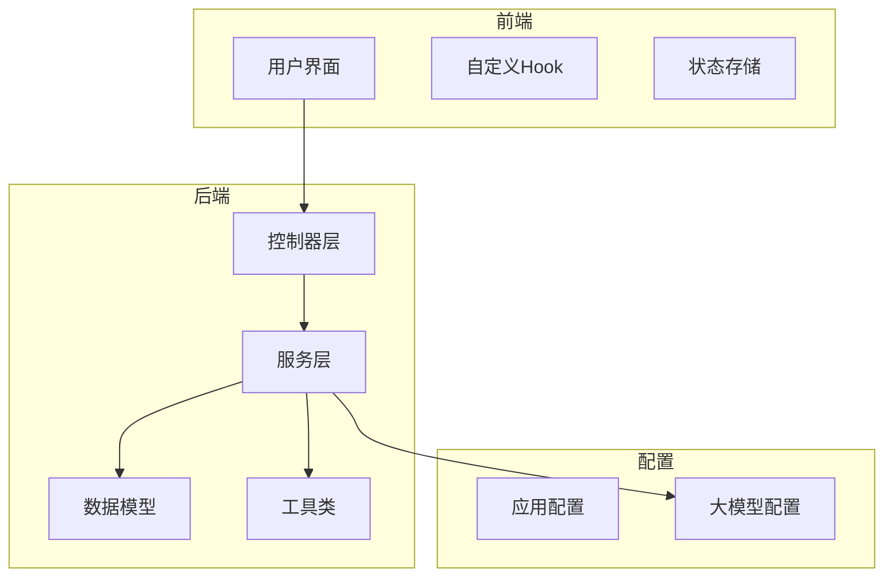
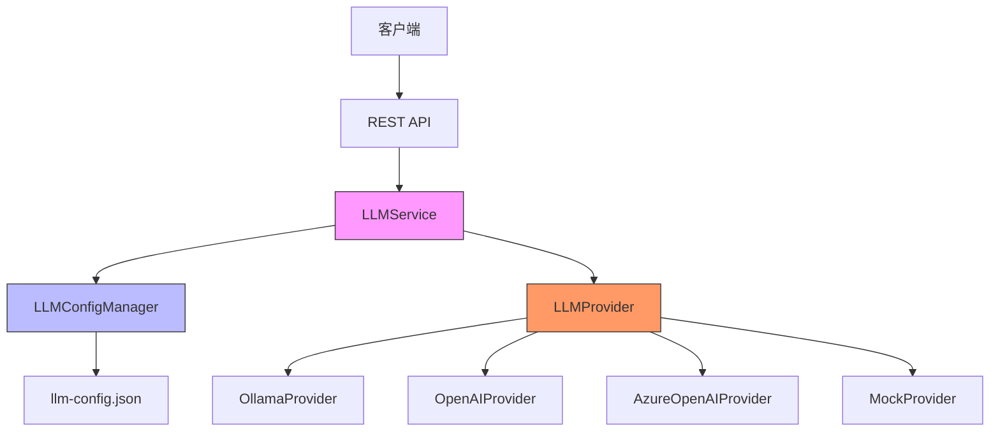
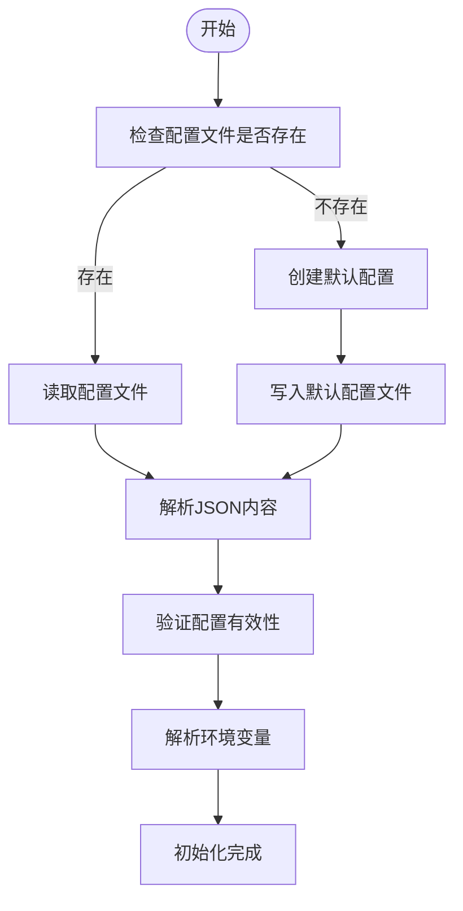
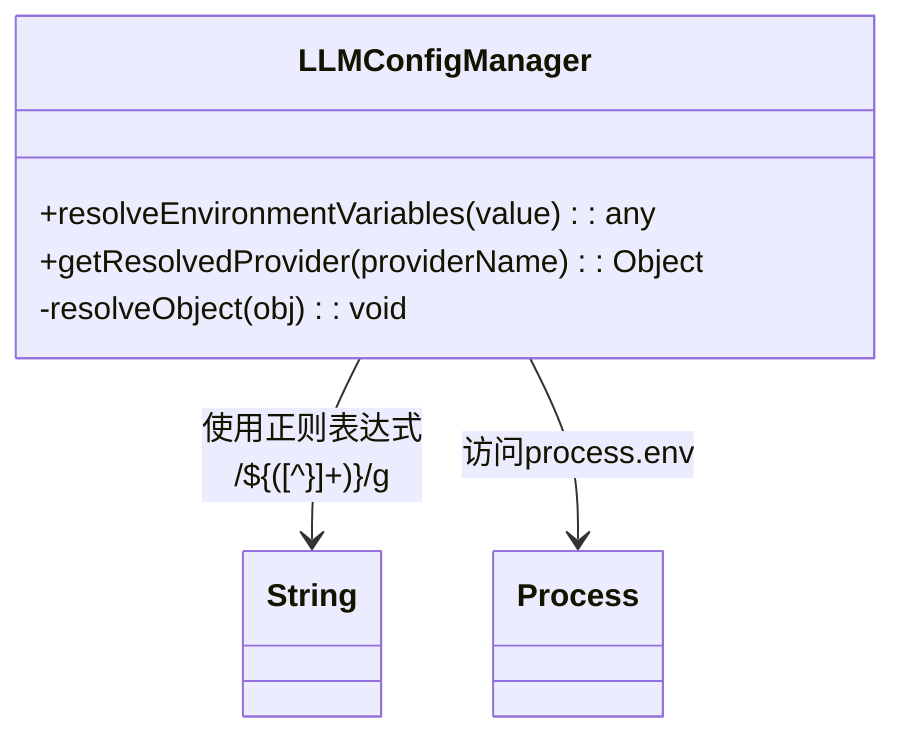
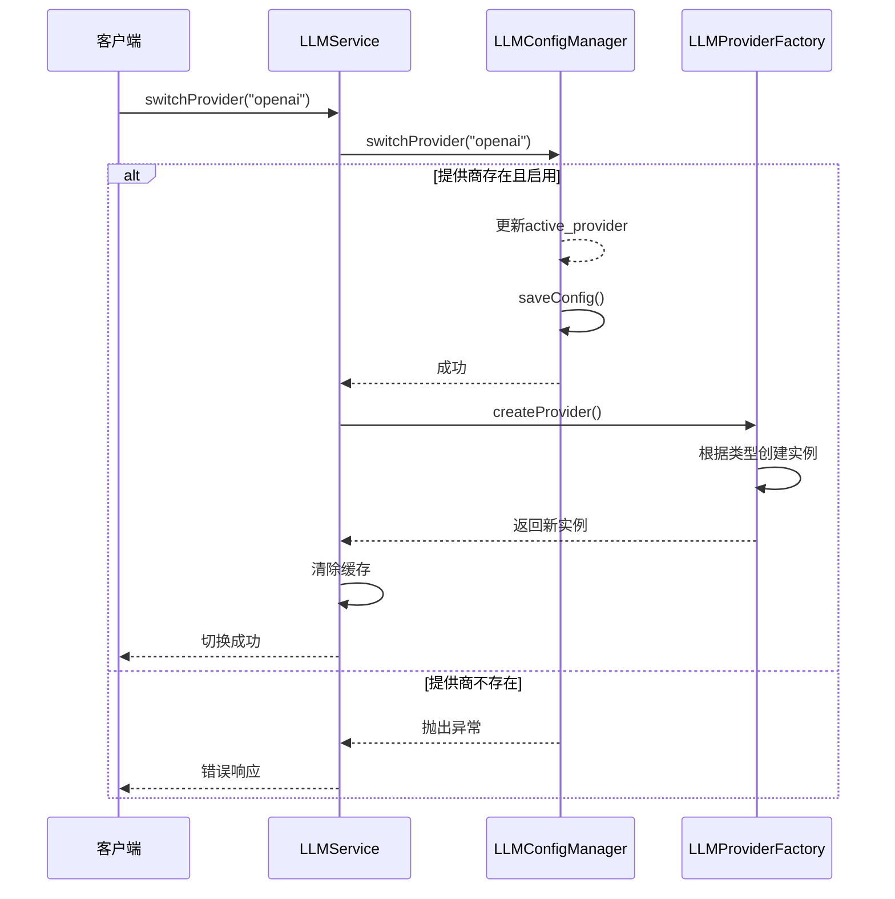
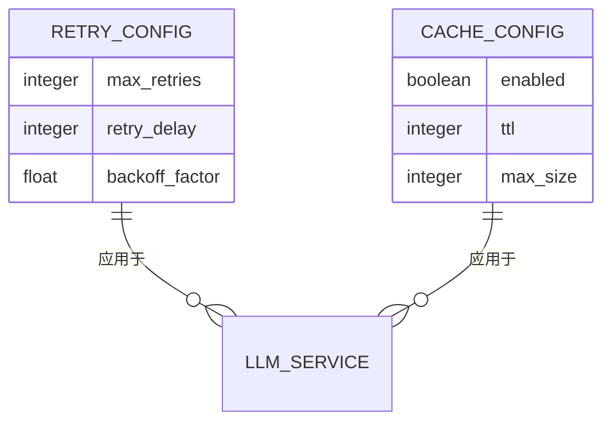
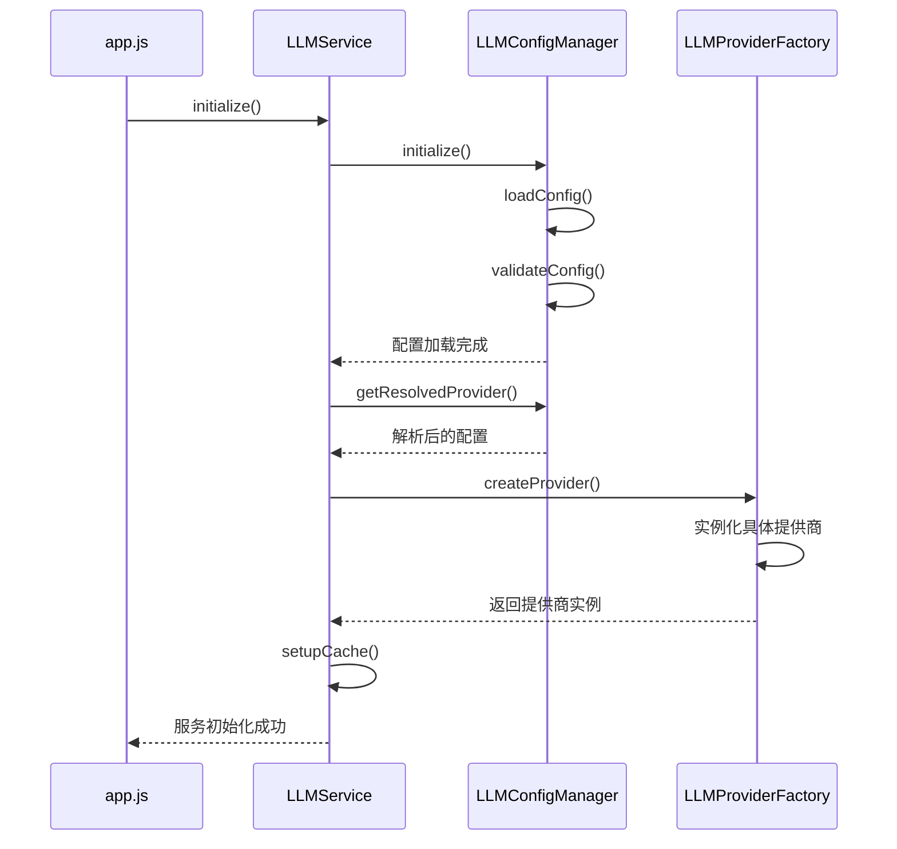
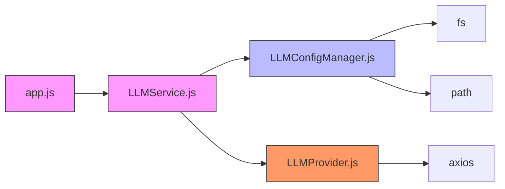

# LLM配置管理与请求调度

<cite>
**本文档引用的文件**
- [llm-config.json](file://configs/llm-config.json)
- [LLMConfigManager.js](file://backend/src/services/LLMConfigManager.js)
- [LLMService.js](file://backend/src/services/LLMService.js)
- [LLMProvider.js](file://backend/src/services/LLMProvider.js)
- [app.js](file://backend/src/app.js)
</cite>

## 目录
1. [项目结构](#项目结构)
2. [核心组件](#核心组件)
3. [架构概述](#架构概述)
4. [详细组件分析](#详细组件分析)
5. [依赖分析](#依赖分析)
6. [性能考虑](#性能考虑)
7. [故障排除指南](#故障排除指南)
8. [结论](#结论)

## 项目结构

系统采用前后端分离架构，后端服务位于`backend`目录，前端位于`frontend`目录。配置文件集中存放在根目录下的`config`和`configs`目录中。



**图示来源**
- [app.js](file://backend/src/app.js#L1-L147)
- [LLMConfigManager.js](file://backend/src/services/LLMConfigManager.js#L1-L320)

**本节来源**
- [app.js](file://backend/src/app.js#L1-L147)
- [project_structure](file://PROJECT_SUMMARY.md)

## 核心组件

系统核心由三个主要服务类构成：`LLMConfigManager`负责配置管理，`LLMService`提供统一的调用接口，`LLMProvider`实现具体的大模型提供商适配。

**本节来源**
- [LLMConfigManager.js](file://backend/src/services/LLMConfigManager.js#L1-L320)
- [LLMService.js](file://backend/src/services/LLMService.js#L1-L372)
- [LLMProvider.js](file://backend/src/services/LLMProvider.js#L1-L412)

## 架构概述

系统采用分层架构设计，通过配置驱动的方式实现灵活的大模型服务集成。



**图示来源**
- [LLMService.js](file://backend/src/services/LLMService.js#L19-L30)
- [LLMConfigManager.js](file://backend/src/services/LLMConfigManager.js#L23-L33)
- [LLMProvider.js](file://backend/src/services/LLMProvider.js#L384-L401)

## 详细组件分析

### 配置加载与解析机制

`LLMConfigManager`实现了完整的配置生命周期管理，包括默认配置创建、环境变量替换和动态更新。

#### 配置初始化流程


**图示来源**
- [LLMConfigManager.js](file://backend/src/services/LLMConfigManager.js#L23-L33)
- [LLMConfigManager.js](file://backend/src/services/LLMConfigManager.js#L50-L98)

#### 环境变量替换实现


**图示来源**
- [LLMConfigManager.js](file://backend/src/services/LLMConfigManager.js#L275-L283)
- [LLMConfigManager.js](file://backend/src/services/LLMConfigManager.js#L288-L313)

**本节来源**
- [LLMConfigManager.js](file://backend/src/services/LLMConfigManager.js#L23-L33)
- [LLMConfigManager.js](file://backend/src/services/LLMConfigManager.js#L50-L98)
- [LLMConfigManager.js](file://backend/src/services/LLMConfigManager.js#L275-L313)

### 活跃提供商切换逻辑

系统通过`active_provider`字段控制当前使用的大模型服务，切换过程涉及配置更新和实例重建。

#### 切换流程时序图


**图示来源**
- [LLMConfigManager.js](file://backend/src/services/LLMConfigManager.js#L230-L242)
- [LLMService.js](file://backend/src/services/LLMService.js#L301-L306)
- [LLMProvider.js](file://backend/src/services/LLMProvider.js#L384-L401)

#### 重试策略与缓存配置

系统实现了完善的容错机制和性能优化策略。



**图示来源**
- [llm-config.json](file://configs/llm-config.json#L50-L58)
- [llm-config.json](file://configs/llm-config.json#L59-L63)
- [LLMService.js](file://backend/src/services/LLMService.js#L128-L147)
- [LLMService.js](file://backend/src/services/LLMService.js#L49-L55)

**本节来源**
- [LLMConfigManager.js](file://backend/src/services/LLMConfigManager.js#L230-L242)
- [LLMService.js](file://backend/src/services/LLMService.js#L301-L306)
- [LLMProvider.js](file://backend/src/services/LLMProvider.js#L384-L401)
- [llm-config.json](file://configs/llm-config.json#L50-L63)

### 配置热重载功能

系统支持运行时配置重新加载，无需重启服务即可应用新的配置。

#### 热重载应用场景
```mermaid
flowchart LR
A[修改llm-config.json] --> B[调用reload()方法]
B --> C[重新加载配置文件]
C --> D[验证新配置]
D --> E[应用环境变量替换]
E --> F[保持现有连接]
F --> G[新请求使用新配置]
style A fill:#ffcccc,stroke:#333
style G fill:#ccffcc,stroke:#333
```

**图示来源**
- [LLMConfigManager.js](file://backend/src/services/LLMConfigManager.js#L260-L263)
- [llm-config.json](file://configs/llm-config.json#L1-L68)

### LLM服务初始化流程

`LLMService.initialize()`方法协调多个组件完成服务启动。



**图示来源**
- [app.js](file://backend/src/app.js#L35-L44)
- [LLMService.js](file://backend/src/services/LLMService.js#L19-L30)
- [LLMConfigManager.js](file://backend/src/services/LLMConfigManager.js#L23-L33)

**本节来源**
- [LLMService.js](file://backend/src/services/LLMService.js#L19-L30)
- [app.js](file://backend/src/app.js#L35-L44)
- [LLMConfigManager.js](file://backend/src/services/LLMConfigManager.js#L23-L33)

## 依赖分析

系统各组件之间存在明确的依赖关系，形成了清晰的服务调用链。



**图示来源**
- [app.js](file://backend/src/app.js#L1-L147)
- [LLMService.js](file://backend/src/services/LLMService.js#L1-L372)
- [LLMConfigManager.js](file://backend/src/services/LLMConfigManager.js#L1-L320)
- [LLMProvider.js](file://backend/src/services/LLMProvider.js#L1-L41