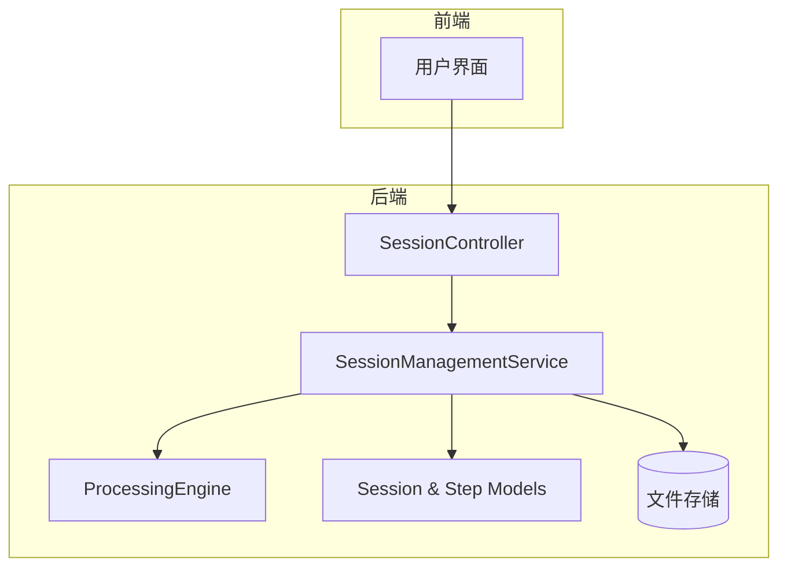
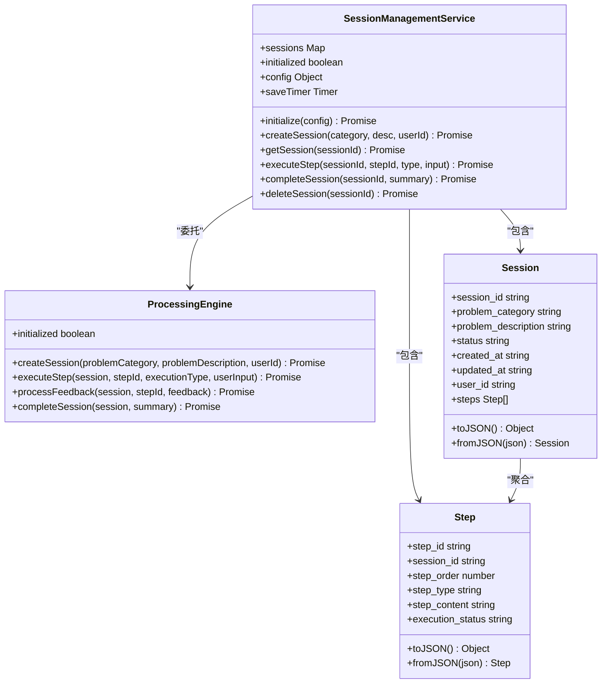
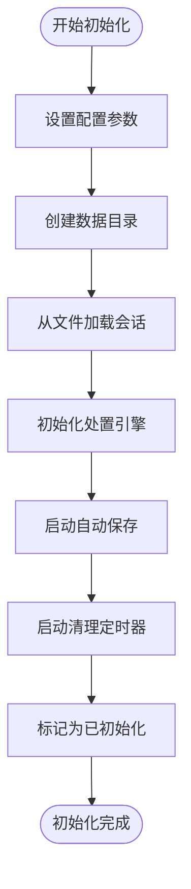
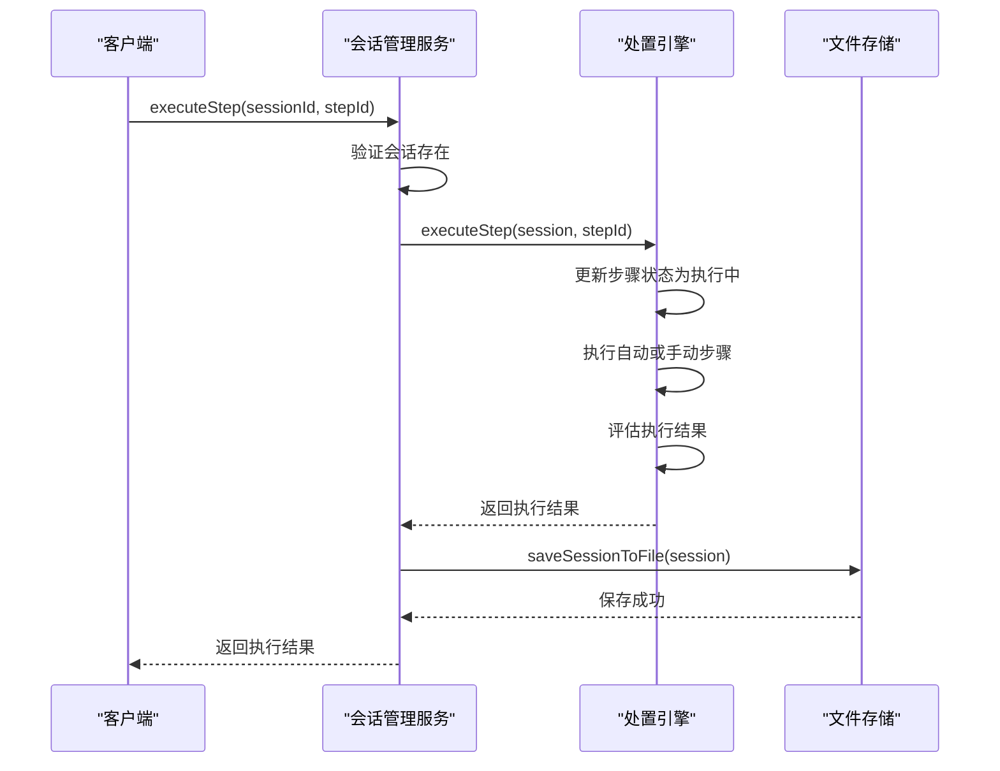
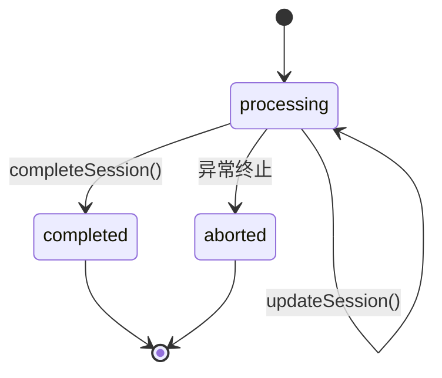
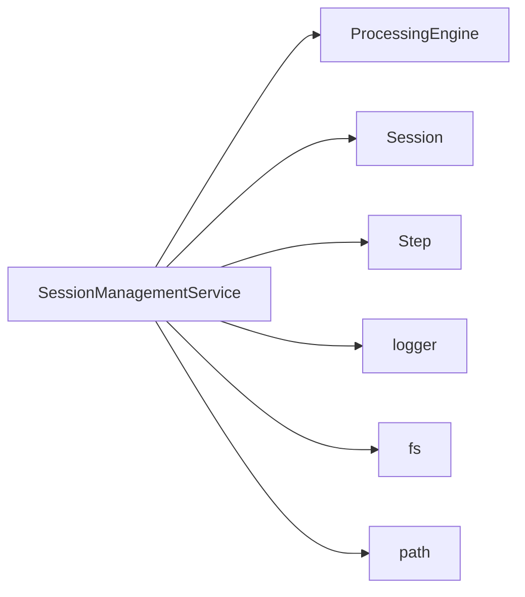

# 会话管理服务

<cite>
**本文档引用的文件**
- [SessionManagementService.js](file://backend/src/services/SessionManagementService.js)
- [ProcessingEngine.js](file://backend/src/services/ProcessingEngine.js)
- [Session.js](file://backend/src/models/Session.js)
- [Step.js](file://backend/src/models/Step.js)
</cite>

## 目录
1. [简介](#简介)
2. [项目结构](#项目结构)
3. [核心组件](#核心组件)
4. [架构概述](#架构概述)
5. [详细组件分析](#详细组件分析)
6. [依赖分析](#依赖分析)
7. [性能考虑](#性能考虑)
8. [故障排除指南](#故障排除指南)
9. [结论](#结论)

## 简介
会话管理服务是智能运维系统的核心组件，负责维护处置会话的完整生命周期。该服务通过内存中的Map结构高效管理会话状态，并结合文件系统实现持久化存储，确保数据在系统重启后不丢失。服务支持自动保存、过期清理和内存控制等高级功能，与处置引擎紧密协作，为用户提供可靠的自动化问题处置能力。

## 项目结构
会话管理服务位于`backend/src/services/SessionManagementService.js`，作为独立的服务模块被控制器调用。它依赖于模型层（Session.js和Step.js）进行数据建模，并与处置引擎（ProcessingEngine.js）协同工作以执行复杂的业务逻辑。

**图表来源**
- [SessionManagementService.js](file://backend/src/services/SessionManagementService.js#L0-L673)
- [ProcessingEngine.js](file://backend/src/services/ProcessingEngine.js#L0-L639)

**章节来源**
- [SessionManagementService.js](file://backend/src/services/SessionManagementService.js#L0-L673)

## 核心组件
会话管理服务使用Map数据结构在内存中维护所有活动会话，每个会话包含问题分类、描述、状态和处置步骤等信息。服务通过JSON格式将完整的会话数据序列化到文件系统，实现了内存与磁盘的双重存储机制。配置参数如`maxSessionsInMemory`和`sessionTTL`允许灵活调整内存使用和会话生命周期。

**章节来源**
- [SessionManagementService.js](file://backend/src/services/SessionManagementService.js#L16-L668)

## 架构概述
会话管理服务采用分层架构设计，上层提供REST API接口，中层处理业务逻辑，底层负责数据持久化。服务初始化时会加载所有历史会话到内存，并启动定时器执行自动保存和过期清理任务。这种设计平衡了访问性能和数据安全，确保高并发场景下的稳定运行。

**图表来源**
- [SessionManagementService.js](file://backend/src/services/SessionManagementService.js#L16-L668)
- [ProcessingEngine.js](file://backend/src/services/ProcessingEngine.js#L12-L634)

## 详细组件分析

### 会话创建与初始化流程
会话管理服务的初始化流程包括设置数据目录、从文件加载历史会话、确保处置引擎已初始化、启动自动保存和过期清理定时器等关键步骤。当创建新会话时，服务首先检查内存使用情况，必要时驱逐最旧的会话以腾出空间，然后委托处置引擎生成初始处置方案。

#### 初始化流程图

**图表来源**
- [SessionManagementService.js](file://backend/src/services/SessionManagementService.js#L43-L94)

**章节来源**
- [SessionManagementService.js](file://backend/src/services/SessionManagementService.js#L16-L668)

### 核心方法调用链路
会话管理服务的核心方法通过清晰的调用链路与处置引擎交互。例如，`executeStep`方法接收请求后，先验证会话存在性，然后调用处置引擎的对应方法执行具体操作，最后将更新后的会话状态保存到文件系统。异常处理策略确保即使在执行失败的情况下，会话的错误状态也能被正确记录和持久化。

#### 执行步骤序列图

**图表来源**
- [SessionManagementService.js](file://backend/src/services/SessionManagementService.js#L368-L424)
- [ProcessingEngine.js](file://backend/src/services/ProcessingEngine.js#L49-L97)

**章节来源**
- [SessionManagementService.js](file://backend/src/services/SessionManagementService.js#L368-L424)

### 会话生命周期管理
会话生命周期涵盖创建、更新、删除和完成四个主要阶段。创建时分配唯一ID并设置初始状态；更新时修改会话属性并刷新时间戳；删除时从内存和文件系统中移除；完成时记录总结信息并更新状态。这些操作都遵循严格的业务规则，确保数据的一致性和完整性。

#### 会话状态转换图

**图表来源**
- [Session.js](file://backend/src/models/Session.js#L0-L121)
- [SessionManagementService.js](file://backend/src/services/SessionManagementService.js#L421-L476)

**章节来源**
- [SessionManagementService.js](file://backend/src/services/SessionManagementService.js#L421-L476)

### 内存控制策略
当内存中的会话数量达到`maxSessionsInMemory`阈值时，服务会触发`evictOldestSessions`机制，按更新时间排序并移除10%最旧的会话。这一策略有效防止内存溢出，同时通过先保存到文件再从内存删除的方式，确保数据不会丢失。该机制在高负载场景下对系统性能有显著影响，需要根据实际硬件配置进行调优。

**章节来源**
- [SessionManagementService.js](file://backend/src/services/SessionManagementService.js#L232-L272)

## 依赖分析
会话管理服务依赖多个关键组件：处置引擎提供核心业务逻辑，会话和步骤模型定义数据结构，日志服务记录运行状态，文件系统实现持久化存储。这些依赖关系形成了一个稳定的生态系统，各组件职责分明，耦合度低，便于维护和扩展。

**图表来源**
- [SessionManagementService.js](file://backend/src/services/SessionManagementService.js#L0-L47)

**章节来源**
- [SessionManagementService.js](file://backend/src/services/SessionManagementService.js#L0-L47)

## 性能考虑
会话管理服务的性能受多个因素影响：自动保存间隔影响I/O频率，内存限制决定缓存效率，会话TTL设置影响清理开销。建议在生产环境中根据实际负载调整这些参数，例如在高并发场景下适当增加保存间隔以减少磁盘压力，在内存充足的服务器上提高会话容量以提升响应速度。

## 故障排除指南
常见问题包括会话无法创建（通常因内存不足或配置错误）、步骤执行失败（可能由于依赖服务异常）和数据不同步（多实例部署时可能出现）。排查时应首先检查日志输出，确认服务初始化状态，验证文件存储权限，并监控内存使用情况。对于持久化问题，可检查数据目录是否存在且可写。

**章节来源**
- [SessionManagementService.js](file://backend/src/services/SessionManagementService.js#L612-L673)

## 结论
会话管理服务通过精巧的设计实现了内存与持久化存储的平衡，为智能运维系统提供了可靠的状态管理能力。其模块化的架构和清晰的接口定义使得功能扩展和维护变得简单。未来可通过引入数据库替代文件存储、增加分布式锁支持多实例部署等方式进一步提升系统的可扩展性和可靠性。