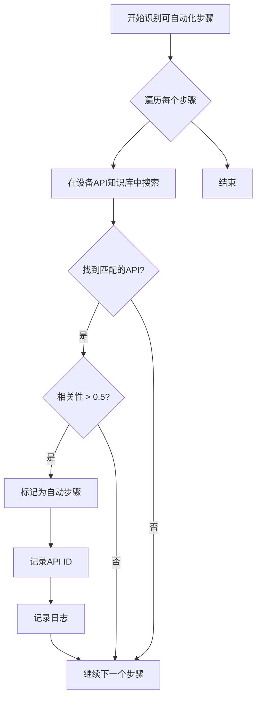
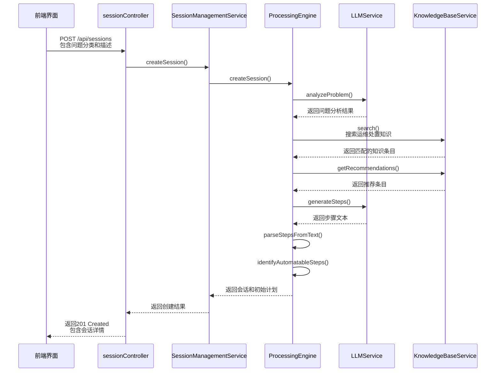

# 处置流程初始化

<cite>
**本文档中引用的文件**
- [SessionManagementService.js](file://backend/src/services/SessionManagementService.js)
- [ProcessingEngine.js](file://backend/src/services/ProcessingEngine.js)
- [LLMService.js](file://backend/src/services/LLMService.js)
- [KnowledgeBaseService.js](file://backend/src/services/KnowledgeBaseService.js)
- [Session.js](file://backend/src/models/Session.js)
- [Step.js](file://backend/src/models/Step.js)
- [sessionController.js](file://backend/src/controllers/sessionController.js)
</cite>

## 目录
1. [引言](#引言)
2. [createSession方法作为处置流程起点](#createsession方法作为处置流程起点)
3. [问题分析与初始方案生成](#问题分析与初始方案生成)
4. [步骤生成机制解析](#步骤生成机制解析)
5. [非结构化文本到结构化步骤的转换](#非结构化文本到结构化步骤的转换)
6. [可自动化步骤识别机制](#可自动化步骤识别机制)
7. [会话状态管理与addStep调用影响](#会话状态管理与addstep调用影响)
8. [完整数据流序列图](#完整数据流序列图)

## 引言
`createSession` 方法是整个故障处理生命周期的起点，负责初始化一个全新的处置会话。该方法不仅创建了会话的基本信息，还触发了一系列核心服务的协同工作，包括大模型推理、知识库检索和处置步骤生成。通过这一过程，系统能够为用户提交的问题描述生成一套完整的、可执行的处置方案。

## createSession方法作为处置流程起点

`createSession` 方法位于 `SessionManagementService` 服务中，是整个处置流程的入口点。当用户通过前端界面提交问题分类和描述后，该方法被调用以启动新的处置会话。

该方法首先检查内存使用情况，确保不会超出最大会话数限制。然后，它委托给核心处置引擎 `processingEngine.createSession` 来实际创建会话并生成初始处置计划。创建完成后，会话对象被存储在内存中，并持久化到文件系统，同时记录日志以便追踪。

此方法的成功执行标志着一个新处置周期的开始，后续的所有操作都将基于这个已创建的会话进行。

**Section sources**
- [SessionManagementService.js](file://backend/src/services/SessionManagementService.js#L223-L257)

## 问题分析与初始方案生成

在会话创建过程中，`analyzeProblemAndCreatePlan` 方法扮演着关键角色。该方法整合了 LLMService 的大模型推理能力和 KnowledgeBaseService 的知识检索功能，共同生成初始处置方案。

首先，LLMService 使用预定义的提示模板对问题进行深度分析，理解问题的本质和上下文。接着，KnowledgeBaseService 根据问题分类和描述搜索相关的运维处置知识库条目，并获取推荐的知识条目。这些信息被综合起来，作为生成具体处置步骤的上下文输入。

这种结合大模型智能推理和结构化知识库检索的方式，确保了生成的处置方案既具有专业性又具备实用性。

**Section sources**
- [ProcessingEngine.js](file://backend/src/services/ProcessingEngine.js#L95-L140)

## 步骤生成机制解析

`generateProcessingSteps` 方法实现了基于上下文构建的步骤生成机制。该方法接收会话信息、问题分析结果、知识库匹配项和推荐条目作为输入参数，构建一个丰富的上下文环境。

在此基础上，系统调用 LLMService 的 `generateSteps` 接口，传入精心设计的提示词（prompt），要求大模型根据当前状态生成具体的处置步骤。生成的步骤文本随后被传递给 `parseStepsFromText` 方法，将其转换为结构化的 `Step` 对象数组。

这一机制充分利用了大模型的语言理解和生成能力，同时通过结构化上下文引导其输出符合预期格式的内容。

**Section sources**
- [ProcessingEngine.js](file://backend/src/services/ProcessingEngine.js#L142-L191)

## 非结构化文本到结构化步骤的转换

`parseStepsFromText` 方法负责将大模型生成的非结构化文本转换为结构化的 `Step` 对象。该方法采用行分割和正则表达式匹配技术来识别步骤边界。

支持多种常见的步骤标记格式，如数字加点号（"1. "）、中文“步骤”前缀或“第X步”等。对于每一行文本，方法会判断是否为新步骤的开始，并相应地创建新的 `Step` 实例或向当前步骤追加内容。

如果未能解析出任何有效步骤，则会创建一个包含原始文本的默认手动步骤。最终返回的是一组有序的、带有会话ID关联的 `Step` 对象，为后续处理提供了标准化的数据结构。

**Section sources**
- [ProcessingEngine.js](file://backend/src/services/ProcessingEngine.js#L193-L260)

## 可自动化步骤识别机制

`identifyAutomatableSteps` 方法通过语义匹配技术识别可自动化执行的操作步骤。该方法遍历已生成的步骤列表，针对每个步骤的内容在设备API知识库中进行搜索。

搜索时限定类型为 'device-api'，并设置最低相关性阈值。如果找到匹配度较高的API条目（相关性 > 0.5），则将对应步骤的 `step_type` 标记为 'auto'，并记录匹配的API ID。

这一机制使得系统能够智能地区分哪些操作可以自动执行，哪些需要人工干预，从而优化处置流程的效率和准确性。

**Diagram sources**
- [ProcessingEngine.js](file://backend/src/services/ProcessingEngine.js#L265-L300)

## 会话状态管理与addStep调用影响

`Session.addStep` 方法是维护会话状态的核心接口之一。每当有新的处置步骤生成时，都会调用此方法将其添加到会话的步骤列表中。

该方法的主要作用有两个：一是将新的 `Step` 对象推入 `this.steps` 数组；二是更新会话的 `updated_at` 时间戳，反映最新的修改时间。这种设计保证了会话状态的实时性和一致性。

从状态管理的角度看，每次调用 `addStep` 都会使会话进入一个新的演化阶段，为后续的状态查询、进度跟踪和历史回溯提供准确的数据基础。

**Section sources**
- [Session.js](file://backend/src/models/Session.js#L68-L71)

## 完整数据流序列图

以下序列图展示了从用户提交问题描述到生成可执行步骤链的完整数据流：

**Diagram sources**
- [sessionController.js](file://backend/src/controllers/sessionController.js#L30-L50)
- [SessionManagementService.js](file://backend/src/services/SessionManagementService.js#L223-L257)
- [ProcessingEngine.js](file://backend/src/services/ProcessingEngine.js#L95-L140)
- [LLMService.js](file://backend/src/services/LLMService.js#L250-L280)
- [KnowledgeBaseService.js](file://backend/src/services/KnowledgeBaseService.js#L200-L250)