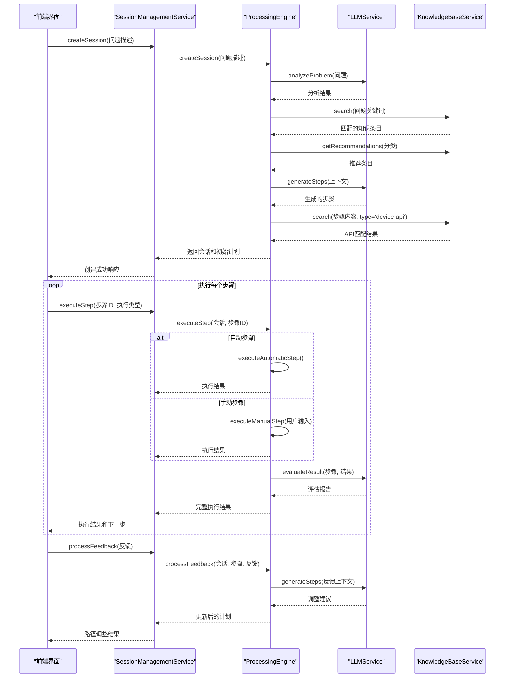

# 处置流程编排引擎

<cite>
**本文档引用的文件**
- [ProcessingEngine.js](file://backend\src\services\ProcessingEngine.js)
- [SessionManagementService.js](file://backend\src\services\SessionManagementService.js)
- [KnowledgeBaseService.js](file://backend\src\services\KnowledgeBaseService.js)
- [LLMService.js](file://backend\src\services\LLMService.js)
- [Session.js](file://backend\src\models\Session.js)
- [Step.js](file://backend\src\models\Step.js)
</cite>

## 目录
1. [引言](#引言)
2. [核心协调者角色](#核心协调者角色)
3. [初始计划生成逻辑](#初始计划生成逻辑)
4. [多阶段决策机制](#多阶段决策机制)
5. [执行结果评估与路径调整](#执行结果评估与路径调整)
6. [典型处置流程序列图](#典型处置流程序列图)
7. [状态机模型与状态变迁](#状态机模型与状态变迁)
8. [异常传播与事务一致性](#异常传播与事务一致性)

## 引言
本系统采用分层架构设计，以`ProcessingEngine`为核心协调者，整合`SessionManagementService`、`KnowledgeBaseService`和`LLMService`三大服务，实现智能化故障处置流程的自动化编排。该架构通过会话管理维护处置上下文，利用知识库提供领域专业知识支持，借助大模型实现智能分析与决策，形成闭环的自动化运维解决方案。

## 核心协调者角色
`ProcessingEngine`作为系统的核心协调者，承担着问题解析、方案规划、执行协调和监控评估的关键职责。它通过初始化方法确保所有依赖服务（LLM服务和知识库服务）正确启动，并在整个处置流程中扮演中枢神经的角色。

该引擎通过`createSession`方法创建新的处置会话，`executeStep`方法执行具体处置步骤，以及`processFeedback`方法处理用户反馈并动态调整处置方案。这种设计实现了关注点分离，使`ProcessingEngine`专注于业务逻辑编排，而将持久化存储等横切关注点交由`SessionManagementService`处理。

**Section sources**
- [ProcessingEngine.js](file://backend\src\services\ProcessingEngine.js#L12-L634)
- [SessionManagementService.js](file://backend\src\services\SessionManagementService.js#L16-L531)

## 初始计划生成逻辑
当调用`createSession`方法创建新会话时，`ProcessingEngine`启动初始计划生成流程。此过程首先验证输入参数的有效性，然后调用`analyzeProblemAndCreatePlan`方法进行深度分析。

该方法执行四步分析流程：首先使用`LLMService.analyzeProblem`对问题进行语义理解和根本原因分析；其次通过`KnowledgeBaseService.search`在知识库中检索相关处置规程；再次获取推荐的知识条目作为参考；最后基于这些信息调用`generateProcessingSteps`生成具体的处置步骤。

生成的步骤经过结构化解析后被添加到会话中，同时通过`identifyAutomatableSteps`方法识别可自动执行的步骤（匹配设备API），从而形成包含手动和自动步骤的完整初始处置计划。

**Section sources**
- [ProcessingEngine.js](file://backend\src\services\ProcessingEngine.js#L95-L188)
- [LLMService.js](file://backend\src\services\LLMService.js#L9-L366)
- [KnowledgeBaseService.js](file://backend\src\services\KnowledgeBaseService.js#L14-L577)

## 多阶段决策机制
`executeStep`方法实现了复杂的多阶段决策机制，根据步骤类型和执行类型选择不同的执行路径。对于自动步骤，系统会验证是否存在关联的工具API，然后调用`executeAutomaticStep`进行执行；对于手动步骤，则通过`executeManualStep`等待用户输入。

在执行过程中，系统首先检查步骤的前置条件是否满足（通过`canExecute`方法验证依赖关系和当前状态），然后更新步骤状态为"executing"。执行完成后，无论成功与否都会更新最终状态，并调用`evaluateStepResult`方法利用大模型对执行结果进行智能评估。

这一机制体现了决策的层次性：基础的执行可行性检查由本地逻辑完成，而复杂的语义评估则委托给大模型服务，实现了效率与智能的平衡。

**Section sources**
- [ProcessingEngine.js](file://backend\src\services\ProcessingEngine.js#L305-L374)
- [Step.js](file://backend\src\models\Step.js#L118-L137)

## 执行结果评估与路径调整
`processFeedback`方法负责处理用户反馈并对处置路径进行动态调整。当接收到用户反馈后，系统首先将其记录在对应步骤中，然后根据`adjustPlan`标志决定是否调用`adjustProcessingPlan`进行方案调整。

方案调整过程充分利用了大模型的能力：将已完成的步骤、当前步骤和用户反馈作为上下文，调用`LLMService.generateSteps`生成新的处置建议。新生成的步骤会被解析、分配序号、识别自动化潜力，并插入到原有步骤序列中，从而实现处置路径的智能重构。

这种反馈驱动的调整机制使系统能够适应复杂多变的实际场景，在初始计划不适用时能够灵活变通，体现了系统的自适应能力。

**Section sources**
- [ProcessingEngine.js](file://backend\src\services\ProcessingEngine.js#L493-L530)
- [LLMService.js](file://backend\src\services\LLMService.js#L9-L366)

## 典型处置流程序列图

**Diagram sources**
- [ProcessingEngine.js](file://backend\src\services\ProcessingEngine.js#L12-L634)
- [SessionManagementService.js](file://backend\src\services\SessionManagementService.js#L16-L531)

## 状态机模型与状态变迁
系统采用状态机模型管理处置流程的状态变迁，主要涉及`step.status`的生命周期管理。步骤状态包括"pending"（待执行）、"executing"（执行中）、"completed"（已完成）、"failed"（失败）和"skipped"（跳过）五种。

状态变迁遵循严格的规则：从"pending"到"executing"表示开始执行；从"executing"到"completed"表示成功完成；从"executing"到"failed"表示执行失败。这些变迁通过`updateStatus`方法统一管理，该方法不仅更新状态值，还设置相应的时间戳（如`started_at`和`completed_at`）并记录执行结果。

`canExecute`方法实现了状态机的守卫逻辑，确保只有处于"pending"状态且所有依赖步骤都已完成的步骤才能被执行，防止了非法的状态转换，保证了流程的有序性。

**Section sources**
- [Step.js](file://backend\src\models\Step.js#L84-L105)
- [Step.js](file://backend\src\models\Step.js#L118-L137)

## 异常传播与事务一致性
系统通过多层次的异常处理机制保障事务一致性。在`ProcessingEngine`的各个方法中，都采用了try-catch结构捕获异常，并在catch块中进行适当的错误处理和日志记录。

当步骤执行失败时，系统不仅将步骤状态更新为"failed"，还会在事务上下文中标记整个操作的失败状态，确保不会产生部分成功的结果。同时，异常信息会被包装并向上层服务（如`SessionManagementService`）传播，最终返回给客户端。

为了保证数据一致性，`SessionManagementService`在关键操作前后都会调用`saveSessionToFile`方法，即使在发生异常的情况下也会尝试保存最新的