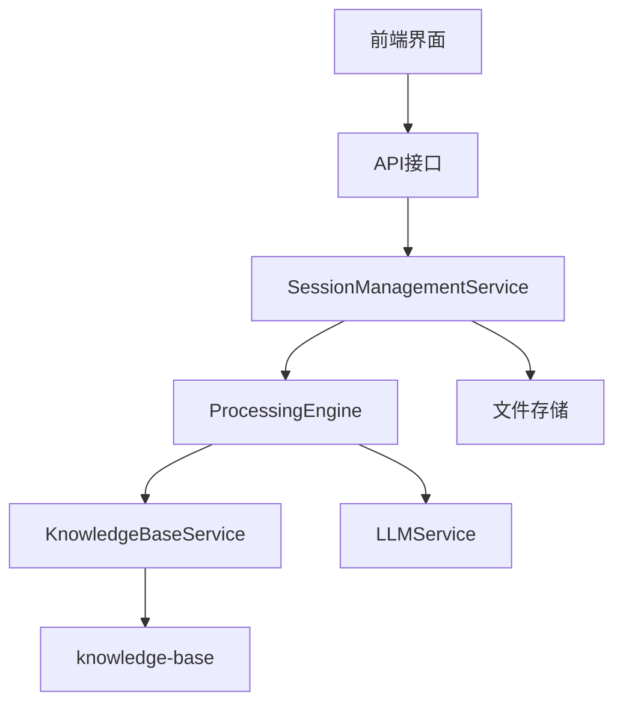
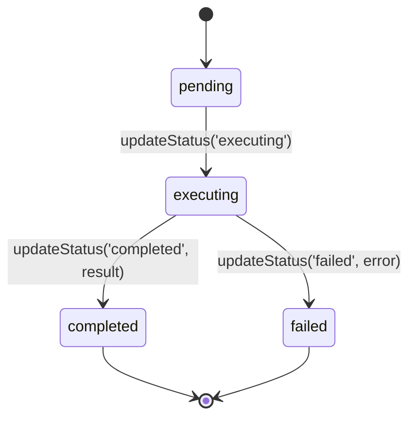
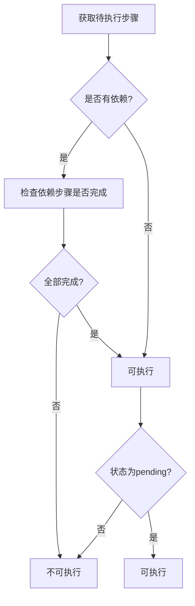

<cite>
**本文档中引用的文件**
- [ProcessingEngine.js](file://backend/src/services/ProcessingEngine.js)
- [Step.js](file://backend/src/models/Step.js)
- [SessionManagementService.js](file://backend/src/services/SessionManagementService.js)
- [Session.js](file://backend/src/models/Session.js)
- [KnowledgeBaseService.js](file://backend/src/services/KnowledgeBaseService.js)
- [KnowledgeEntry.js](file://backend/src/models/KnowledgeEntry.js)
</cite>

# 步骤执行与状态管理

## 项目结构
本系统采用前后端分离架构，核心业务逻辑集中在后端服务中。步骤执行与状态管理的核心组件位于 `backend/src` 目录下，主要包括：

- **services**: 核心服务层，包含 `ProcessingEngine.js`（处理引擎）、`SessionManagementService.js`（会话管理）和 `KnowledgeBaseService.js`（知识库服务）
- **models**: 数据模型层，包含 `Step.js`（步骤模型）、`Session.js`（会话模型）和 `KnowledgeEntry.js`（知识条目模型）



**Diagram sources**
- [ProcessingEngine.js](file://backend/src/services/ProcessingEngine.js)
- [SessionManagementService.js](file://backend/src/services/SessionManagementService.js)
- [KnowledgeBaseService.js](file://backend/src/services/KnowledgeBaseService.js)

**Section sources**
- [ProcessingEngine.js](file://backend/src/services/ProcessingEngine.js)
- [Step.js](file://backend/src/models/Step.js)

## 核心组件

### executeStep 执行协调器
`executeStep` 是整个处置流程的核心协调器，负责统一调度自动与手动两种执行模式。该方法首先验证步骤是否存在，并通过 `canExecute` 方法检查前置条件是否满足。一旦校验通过，它会将步骤状态更新为 "executing"，然后根据 `executionType` 参数选择相应的执行路径。

当执行类型为 'auto' 且步骤类型也为 'auto' 时，系统调用 `executeAutomaticStep` 进行自动化操作；若执行类型为 'manual'，则调用 `executeManualStep` 处理用户输入。无论哪种模式，执行结果都会被记录在 `execution_result` 中，并最终更新步骤状态为 "completed" 或 "failed"。

**Section sources**
- [ProcessingEngine.js](file://backend/src/services/ProcessingEngine.js#L305-L374)

### 自动化执行机制
`executeAutomaticStep` 实现了基于知识库的自动化操作触发。其核心是通过 `tool_api` 字段关联设备API知识条目，具体流程如下：首先从 `knowledgeBaseService` 中获取对应的知识条目信息，如果未找到则抛出异常。目前由于工具服务尚未实现，系统返回一个模拟结果，其中包含了API标题、执行时间戳等信息。未来将在此处集成真实的工具执行服务，实现真正的自动化运维操作。

```javascript
// 模拟执行结果结构
const mockResult = {
  success: true,
  message: '自动执行完成',
  data: {
    api: apiInfo.title,
    executedAt: new Date().toISOString(),
    mockExecution: true
  }
};
```

**Section sources**
- [ProcessingEngine.js](file://backend/src/services/ProcessingEngine.js#L379-L409)
- [KnowledgeBaseService.js](file://backend/src/services/KnowledgeBaseService.js#L444-L451)

### 手动执行与用户交互
`executeManualStep` 负责处理需要人工干预的手动步骤。该方法要求必须提供 `userInput` 参数，否则会抛出错误。接收到用户反馈后，系统通过 `addUserFeedback` 方法将其记录到步骤对象中，并生成包含用户反馈内容的执行结果。这种设计确保了所有人工决策都有据可查，为后续的流程优化和审计提供了数据支持。

**Section sources**
- [ProcessingEngine.js](file://backend/src/services/ProcessingEngine.js#L414-L440)
- [Step.js](file://backend/src/models/Step.js#L110-L113)

## 架构概述

### 步骤状态机设计
`Step` 模型实现了完整的状态机设计，定义了 `pending → executing → completed/failed` 的生命周期。状态变迁由 `updateStatus` 方法控制，该方法不仅验证新状态的有效性，还负责维护相关的时间戳和执行结果。

- **pending → executing**: 当开始执行步骤时，设置 `started_at` 时间戳
- **executing → completed/failed**: 执行完成后，设置 `completed_at` 时间戳并记录执行结果
- **副作用控制**: 状态变更会自动更新 `updated_at` 时间戳，确保数据一致性



**Diagram sources**
- [Step.js](file://backend/src/models/Step.js#L84-L105)

**Section sources**
- [Step.js](file://backend/src/models/Step.js#L84-L105)

### 依赖校验与流程推进
`canExecute` 方法确保了步骤依赖关系的正确性。它检查两个关键条件：一是所有依赖步骤都已完成（状态为 'completed'），二是当前步骤处于 'pending' 状态。只有同时满足这两个条件，步骤才允许被执行。

`getNextStep` 方法结合优先级排序算法推进流程。它首先筛选出所有状态为 'pending' 的步骤，按 `step_order` 排序后逐个检查是否可执行，返回第一个满足条件的步骤。这种设计保证了处置流程按照预定顺序有序进行。



**Diagram sources**
- [Step.js](file://backend/src/models/Step.js#L118-L137)
- [ProcessingEngine.js](file://backend/src/services/ProcessingEngine.js#L470-L488)

**Section sources**
- [Step.js](file://backend/src/models/Step.js#L118-L137)
- [ProcessingEngine.js](file://backend/src/services/ProcessingEngine.js#L470-L488)

## 详细组件分析

### 异常处理与错误传播
系统在异常处理方面采用了分层捕获与传播机制。在 `executeStep` 方法中，任何执行过程中的错误都会被捕获，系统会将步骤状态更新为 "failed" 并记录错误信息。同时，原始异常会被重新抛出，确保上层调用者能够感知到执行失败。

对于 `executeAutomaticStep` 和 `executeManualStep`，它们各自捕获特定于该执行模式的异常。例如，手动执行模式会特别检查用户输入是否为空，而自动执行模式则关注API知识条目的存在性。这种精细化的错误处理提高了系统的健壮性和用户体验。

**Section sources**
- [ProcessingEngine.js](file://backend/src/services/ProcessingEngine.js#L305-L374)
- [ProcessingEngine.js](file://backend/src/services/ProcessingEngine.js#L379-L409)
- [ProcessingEngine.js](file://backend/src/services/ProcessingEngine.js#L414-L440)

### 会话管理集成
`SessionManagementService` 作为外部访问入口，封装了 `ProcessingEngine` 的复杂性。当接收到执行步骤请求时，它首先从内存或文件中获取会话对象，然后委托给 `processingEngine.executeStep` 进行实际处理。执行完成后，无论成功与否，都会调用 `saveSessionToFile` 持久化会话状态，确保数据不丢失。

这种设计实现了业务逻辑与数据持久化的解耦，使得核心处理引擎可以专注于流程编排，而会话管理服务则负责状态管理和存储。

**Section sources**
- [SessionManagementService.js](file://backend/src/services/SessionManagementService.js#L348-L368)
- [ProcessingEngine.js](file://backend/src/services/ProcessingEngine.js#L305-L374)