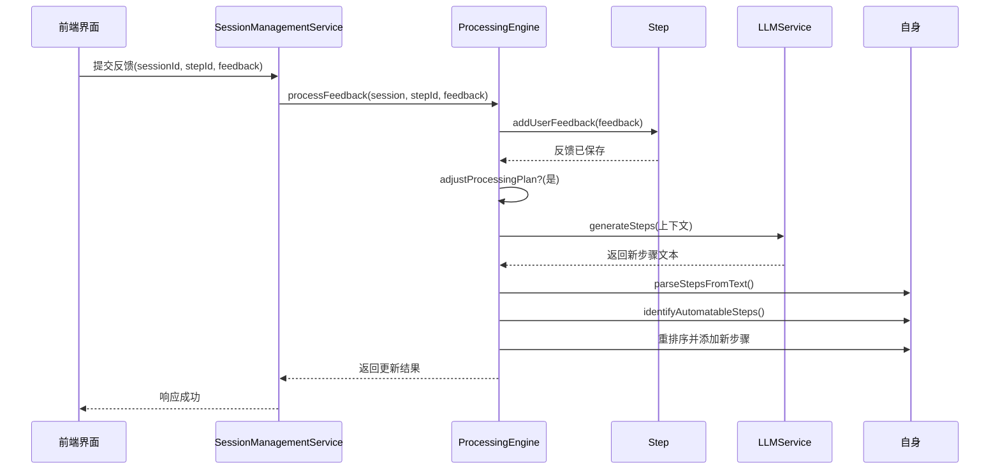
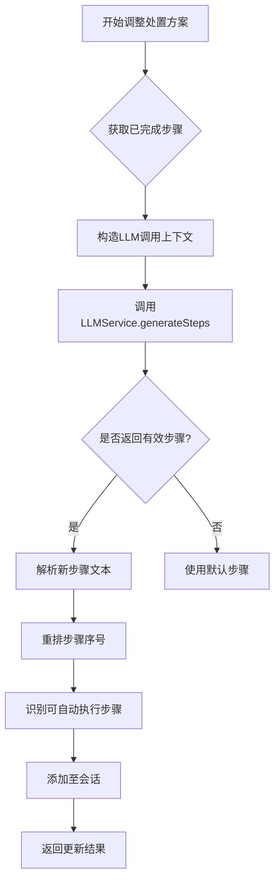
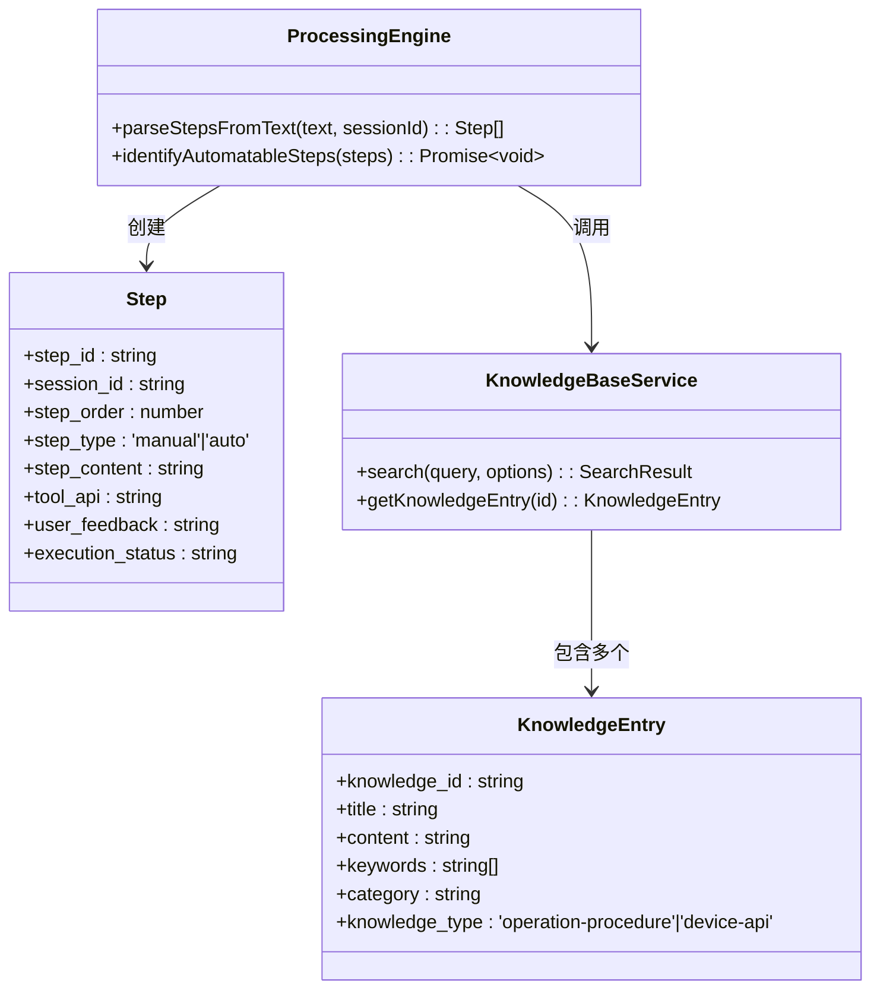

# 用户反馈与流程调整

<cite>
**本文档引用的文件**
- [ProcessingEngine.js](file://backend/src/services/ProcessingEngine.js)
- [LLMService.js](file://backend/src/services/LLMService.js)
- [Step.js](file://backend/src/models/Step.js)
- [Session.js](file://backend/src/models/Session.js)
- [KnowledgeBaseService.js](file://backend/src/services/KnowledgeBaseService.js)
- [memory-shortage.md](file://knowledge-base/operation-procedures/memory-shortage.md)
- [server-monitoring-api.md](file://knowledge-base/device-apis/server-monitoring-api.md)
- [llm-config.json](file://configs/llm-config.json)
</cite>

## 目录
1. [引言](#引言)
2. [用户反馈处理机制](#用户反馈处理机制)
3. [处置方案动态调整](#处置方案动态调整)
4. [步骤解析与自动化识别](#步骤解析与自动化识别)
5. [增量更新与序号重排](#增量更新与序号重排)
6. [决策追溯与评估反馈](#决策追溯与评估反馈)
7. [案例分析：内存未释放问题](#案例分析：内存未释放问题)
8. [结论](#结论)

## 引言
本系统通过闭环反馈机制实现智能运维处置路径的动态优化。当用户在执行过程中提供反馈时，系统能够实时接收并整合这些信息，重新评估当前状态，并生成新的处置建议。整个过程以`processFeedback`为核心入口，结合大模型服务（LLMService）和知识库服务（KnowledgeBaseService），实现了从反馈接收、上下文构造、新步骤生成到流程重组的完整闭环。

该机制不仅支持对已完成步骤的历史进行回溯分析，还能根据用户的实际操作结果调整后续策略，确保处置路径始终贴合真实场景需求。同时，系统通过结构化存储用户反馈和评估结果，为后续的决策追溯与效果验证提供了数据基础。

## 用户反馈处理机制

系统通过`ProcessingEngine.processFeedback`方法接收用户交互信息，并将其整合至当前会话中。该方法首先定位对应的处置步骤，然后调用`addUserFeedback`将反馈内容附加到指定步骤上，最后根据配置决定是否触发处置方案的调整。



**图示来源**
- [ProcessingEngine.js](file://backend/src/services/ProcessingEngine.js#L493-L530)
- [Step.js](file://backend/src/models/Step.js#L110-L113)

**本节来源**
- [ProcessingEngine.js](file://backend/src/services/ProcessingEngine.js#L493-L530)
- [Step.js](file://backend/src/models/Step.js#L110-L113)

## 处置方案动态调整

`adjustProcessingPlan`方法负责基于已完成步骤历史和当前用户反馈，调用LLMService生成新的处置建议。其核心在于构建一个包含多维度信息的上下文环境，使大模型能够理解当前状态并做出合理推断。

### 上下文构造策略

该方法构造的上下文包括：
- **已完成步骤列表**：通过`session.steps.filter(s => s.execution_status === 'completed')`获取所有已完成步骤的JSON表示。
- **当前反馈内容**：直接作为`userFeedback`参数传入。
- **当前步骤详情**：包括步骤内容、类型等元数据。
- **问题分类与描述**：维持原始问题背景的一致性。

此上下文被注入预定义提示模板`step_generation`中，引导大模型生成符合逻辑的下一步操作。



**图示来源**
- [ProcessingEngine.js](file://backend/src/services/ProcessingEngine.js#L535-L580)
- [LLMService.js](file://backend/src/services/LLMService.js#L219-L256)

**本节来源**
- [ProcessingEngine.js](file://backend/src/services/ProcessingEngine.js#L535-L580)
- [LLMService.js](file://backend/src/services/LLMService.js#L219-L256)
- [llm-config.json](file://configs/llm-config.json#L60-L62)

## 步骤解析与自动化识别

在LLM返回原始文本后，系统需将其转换为结构化的步骤对象，并判断哪些步骤可由系统自动执行。

### parseStepsFromText 实现逻辑

`parseStepsFromText`方法采用行扫描方式解析文本，识别以下格式的步骤标记：
- 数字加标点：`1. 检查内存`
- 中文标记：`步骤一：检查内存` 或 `第一步：检查内存`

每识别到一个新步骤，即创建一个新的`Step`实例，并累积后续行作为其内容。若无明确编号，则整体视为单一通用步骤。

### identifyAutomatableSteps 协同机制

`identifyAutomatableSteps`遍历新生成的步骤，在设备API知识库中搜索匹配项。其工作流程如下：

1. 对每个步骤内容调用`knowledgeBaseService.search(type='device-api')`
2. 若最高匹配项的相关性得分超过0.5，则标记为自动步骤
3. 记录匹配的API ID（`tool_api`字段）

两者在增量更新场景下协同工作：`parseStepsFromText`负责结构化解析，`identifyAutomatableSteps`则赋予语义执行能力，共同完成从“文本建议”到“可执行指令”的转化。



**图示来源**
- [ProcessingEngine.js](file://backend/src/services/ProcessingEngine.js#L193-L300)
- [KnowledgeBaseService.js](file://backend/src/services/KnowledgeBaseService.js#L362-L429)

**本节来源**
- [ProcessingEngine.js](file://backend/src/services/ProcessingEngine.js#L193-L300)
- [KnowledgeBaseService.js](file://backend/src/services/KnowledgeBaseService.js#L362-L429)

## 增量更新与序号重排

为保证执行顺序一致性，系统在插入新步骤时实施严格的序号管理策略。

### 新步骤序号重排算法

1. 计算现有步骤中的最大序号：`Math.max(...session.steps.map(s => s.step_order))`
2. 为每个新步骤分配递增序号：`maxOrder + index + 1`
3. 将新步骤批量添加至会话的`steps`数组

此策略确保新步骤始终追加在原计划之后，避免打乱已有执行顺序。同时，由于步骤执行依赖`step_order`排序而非插入时间，因此能准确反映预期执行序列。

### 执行顺序保障机制

`getNextStep`方法依据`step_order`升序排列待执行步骤，并逐个检查其可执行性（通过`canExecute`方法）。只有状态为`pending`且依赖步骤均已完成后，才会返回该步骤供执行。

```mermaid
flowchart TB
A[获取待执行步骤] --> B[按step_order排序]
B --> C{遍历每个步骤}
C --> D[调用canExecute()]
D --> E{可执行?}
E --> |是| F[返回该步骤]
E --> |否| G[继续下一个]
F --> H[结束]
G --> C
```

**图示来源**
- [ProcessingEngine.js](file://backend/src/services/ProcessingEngine.js#L552-L552)
- [ProcessingEngine.js](file://backend/src/services/ProcessingEngine.js#L470-L488)

**本节来源**
- [ProcessingEngine.js](file://backend/src/services/ProcessingEngine.js#L552-L552)
- [ProcessingEngine.js](file://backend/src/services/ProcessingEngine.js#L470-L488)
- [Step.js](file://backend/src/models/Step.js#L118-L137)

## 决策追溯与评估反馈

系统通过多层次记录机制支持完整的决策追溯与因果关联分析。

### addUserFeedback 的追溯作用

`addUserFeedback`方法将用户输入直接绑定到具体步骤实例上，形成“步骤-反馈”一对一关系。这使得后续可以精确回溯：
- 哪个步骤收到了何种反馈
- 反馈如何影响了后续决策
- 是否导致了处置路径变更

所有反馈均随步骤持久化存储，便于审计与复盘。

### evaluationResult 与后续步骤的因果关联

每次步骤执行后，系统调用`LLMService.evaluateResult`对结果进行评估。该评估结果虽未直接用于生成下一步骤，但作为`context`的一部分可能间接影响未来决策。更重要的是，它构成了一个质量反馈环，可用于：
- 统计高失败率步骤
- 优化知识条目有效性评分
- 改进提示模板设计

```mermaid
sequenceDiagram
    participant 执行引擎 as ProcessingEngine
    participant LLM服务 as LLMService
