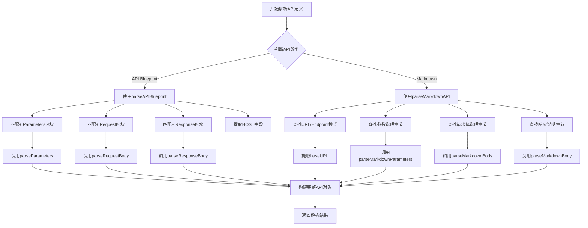
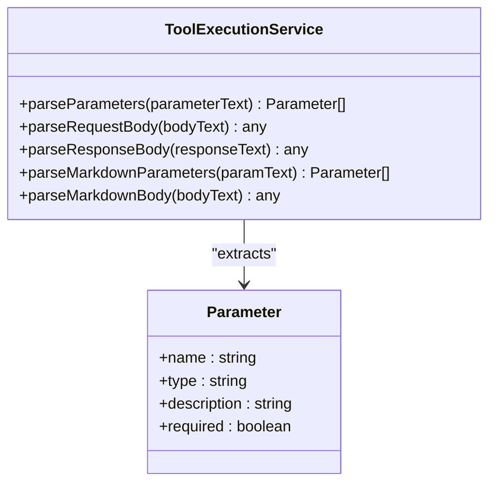
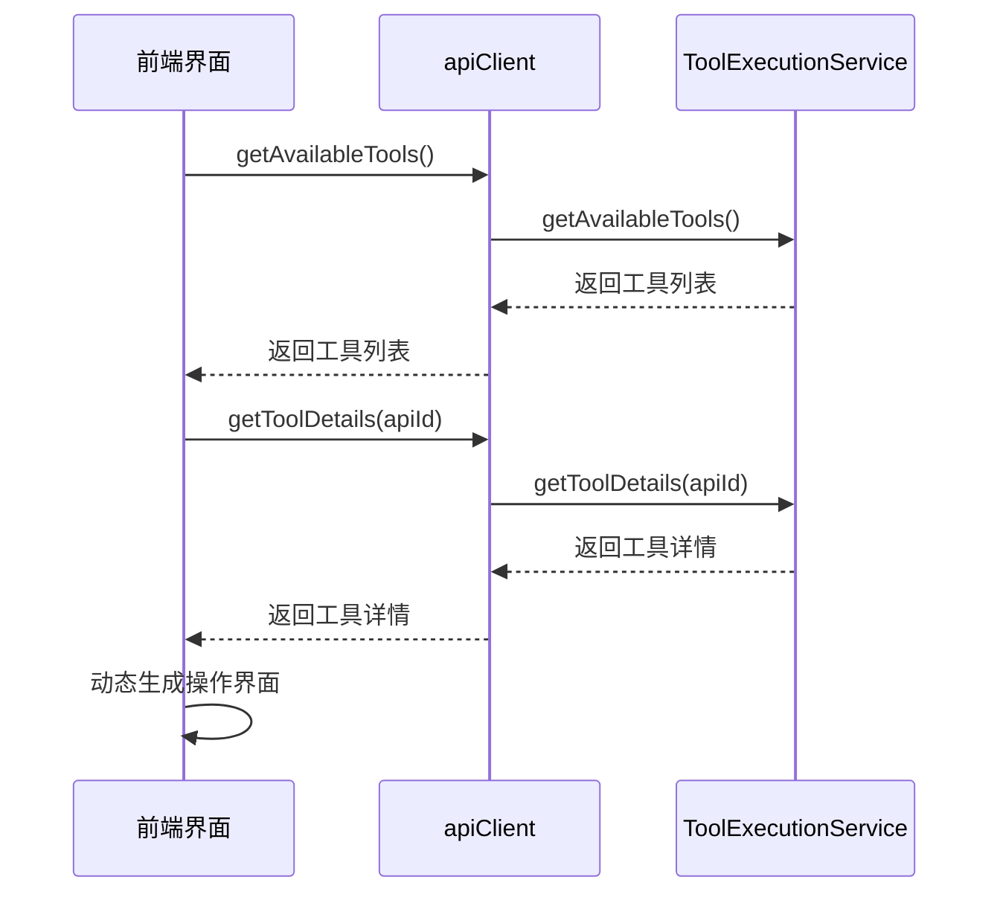

# 外部工具集成与扩展

<cite>
**Referenced Files in This Document**   
- [ToolExecutionService.js](file://backend/src/services/ToolExecutionService.js)
- [toolController.js](file://backend/src/controllers/toolController.js)
- [database-management-api.md](file://knowledge-base/device-apis/database-management-api.md)
- [api.ts](file://frontend/src/utils/api.ts)
- [useKnowledge.ts](file://frontend/src/hooks/useKnowledge.ts)
</cite>

## 目录
1. [外部工具动态解析与注册机制](#外部工具动态解析与注册机制)
2. [API文档格式解析逻辑](#api文档格式解析逻辑)
3. [接口契约信息提取方法](#接口契约信息提取方法)
4. [工具发现能力](#工具发现能力)
5. [REST接口集成流程](#rest接口集成流程)
6. [设备API文档规范示例](#设备api文档规范示例)
7. [初始化加载机制](#初始化加载机制)

## 外部工具动态解析与注册机制

`ToolExecutionService` 服务通过知识库中的API文档（如 `database-management-api.md`）实现外部工具的动态解析和注册。该服务在初始化过程中，首先确保知识库服务已正确初始化，然后调用 `preloadDeviceAPIs` 方法预加载所有设备API定义。

服务使用 `toolCache` Map结构缓存已解析的API定义，每个API定义包含唯一ID、标题、HTTP方法、路径、描述等基本信息。当从知识库检索到API文档后，服务根据文档元数据中的 `apiType` 字段决定采用何种解析策略：若为 `blueprint` 类型则使用API Blueprint解析器，否则使用Markdown解析器。

这种设计实现了外部工具的无代码集成，运维人员只需将符合规范的API文档存入知识库，系统即可自动识别并注册为可执行工具，无需修改任何程序代码。

**Section sources**
- [ToolExecutionService.js](file://backend/src/services/ToolExecutionService.js#L9-L615)

## API文档格式解析逻辑

`ToolExecutionService` 提供了对API Blueprint和Markdown两种格式的解析支持，通过 `parseAPIDefinition` 方法统一入口，根据文档类型分发到相应的解析器。

对于API Blueprint格式，解析器使用正则表达式匹配特定的语法模式：
- `\+ Parameters` 区块用于提取请求参数
- `\+ Request` 区块用于提取请求体内容和类型
- `\+ Response` 区块用于提取响应状态码和响应体
- `HOST:` 字段用于提取基础URL

对于Markdown格式，解析器采用更灵活的文本匹配策略：
- 使用 `(?:URL|Endpoint|接口地址)` 正则模式查找API端点
- 使用 `(?:参数|Parameters|请求参数)` 模式定位参数说明章节
- 使用 `(?:请求体|Request Body|Body)` 模式定位请求体说明
- 使用 `(?:响应|Response|返回)` 模式定位响应说明章节

这种双格式支持确保了系统能够兼容不同团队和供应商提供的API文档，提高了系统的适应性和可用性。



**Diagram sources**
- [ToolExecutionService.js](file://backend/src/services/ToolExecutionService.js#L113-L189)

**Section sources**
- [ToolExecutionService.js](file://backend/src/services/ToolExecutionService.js#L113-L189)

## 接口契约信息提取方法

`ToolExecutionService` 通过一系列辅助方法精确提取API文档中的接口契约信息，确保生成的工具定义准确反映实际API行为。

`parseParameters` 方法负责解析API Blueprint格式的参数定义，它逐行分析参数文本，使用正则表达式 `[\+\-\*]\s*([^:\(]+)[\:\(]?\s*([^)]*)\)?\s*-?\s*(.*)` 匹配参数名称、类型和描述，并根据行内是否包含"required"或"必需"字样判断参数是否必填。

`parseRequestBody` 方法专门处理请求体内容，优先尝试匹配 ```json``` 代码块并进行JSON解析，若解析失败则返回原始文本内容。这种方法既支持结构化数据提取，又能处理非JSON格式的请求体。

`parseMarkdownParameters` 方法针对Markdown文档中的表格格式参数说明，通过匹配管道符分隔的表格行，提取各列对应的参数名称、类型、描述和是否必填等信息。

这些精细化的提取方法共同构成了强大的API契约解析能力，能够准确捕捉API的输入输出规范，为后续的工具执行提供可靠依据。



**Diagram sources**
- [ToolExecutionService.js](file://backend/src/services/ToolExecutionService.js#L191-L254)

**Section sources**
- [ToolExecutionService.js](file://backend/src/services/ToolExecutionService.js#L191-L254)

## 工具发现能力

`ToolExecutionService` 提供了 `getAvailableTools` 和 `getToolDetails` 两个核心方法，支持前端动态生成操作界面所需的工具发现能力。

`getAvailableTools` 方法返回所有可用工具的精简列表，包含工具ID、标题、HTTP方法、路径、描述和参数列表等基本信息。特别的是，该方法还包含 `usage_count` 字段，记录每个工具的历史使用次数，使得工具列表可以按使用频率排序，常用工具排在前面，提升用户体验。

`getToolDetails` 方法提供特定工具的详细信息，除了基本API信息外，还包括丰富的统计信息：
- 执行统计：总执行次数、成功执行次数、成功率
- 最近执行记录：最近10次执行的时间戳、成功状态、耗时和参数
- 最后一次执行时间

前端通过调用这些方法，可以动态生成工具选择下拉框、工具详情弹窗、执行历史面板等UI组件，实现完全基于配置的界面生成，无需硬编码任何工具信息。



**Diagram sources**
- [ToolExecutionService.js](file://backend/src/services/ToolExecutionService.js#L487-L543)
- [api.ts](file://frontend/src/utils/api.ts#L179-L187)
- [useKnowledge.ts](file://frontend/src/hooks/useKnowledge.ts#L226-L245)

**Section sources**
- [ToolExecutionService.js](file://backend/src/services/ToolExecutionService.js#L487-L543)
- [api.ts](file://frontend/src/utils/api.ts#L179-L187)
- [useKnowledge.ts](file://frontend/src/hooks/useKnowledge.ts#L226-L245)

## REST接口集成流程

`toolController` 暴露了一系列REST接口，完整展示了从工具列表获取到具体API调用的集成流程。

流程始于前端调用 `/tools/list` GET接口获取可用工具列表，该接口委托给 `ToolExecutionService.getAvailableTools()` 方法。用户选择特定工具后，前端通过 `/tools/{apiId}` GET接口获取工具详情，用于渲染参数输入表单。

当用户填写参数并提交时，前端调用 `/tools/execute` POST接口执行工具，该接口接收 `apiId`、`parameters` 和可选的 `options` 参数，委托给 `ToolExecutionService.executeAPI()` 方法执行实际的API调用。

整个流程还包括工具连接测试(`/tools/{apiId}/test`)、执行历史查询(`/tools/history/{apiId}?`)和清除历史(`/tools/history/{apiId}?`)等辅助功能，形成了完整的工具管理闭环。

```mermaid
sequenceDiagram
    participant Client as 客户端
    participant Controller as toolController
    participant Service as ToolExecutionService
    
    Client->>Controller: GET /tools/list
    Controller->>Service: getAvailableTools()
    Service-->>Controller: 工具列表
    Controller-->>Client: 返回工具列表
    
    Client->>Controller: GET /tools/{apiId}
   