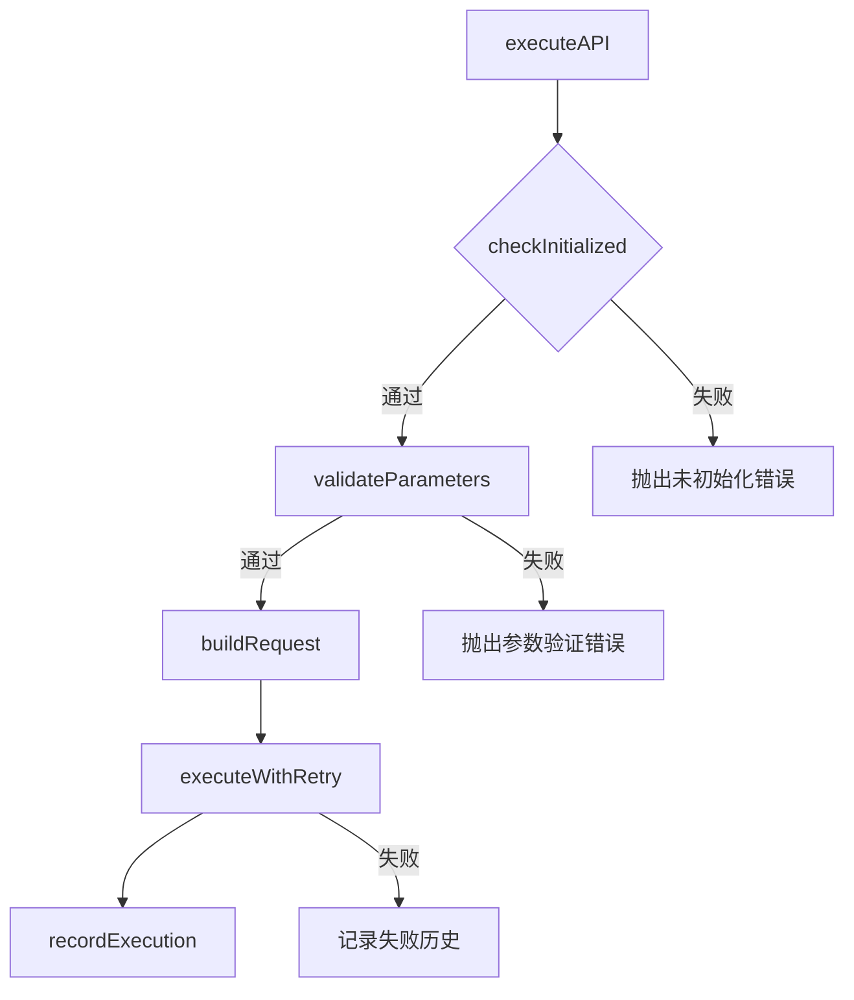
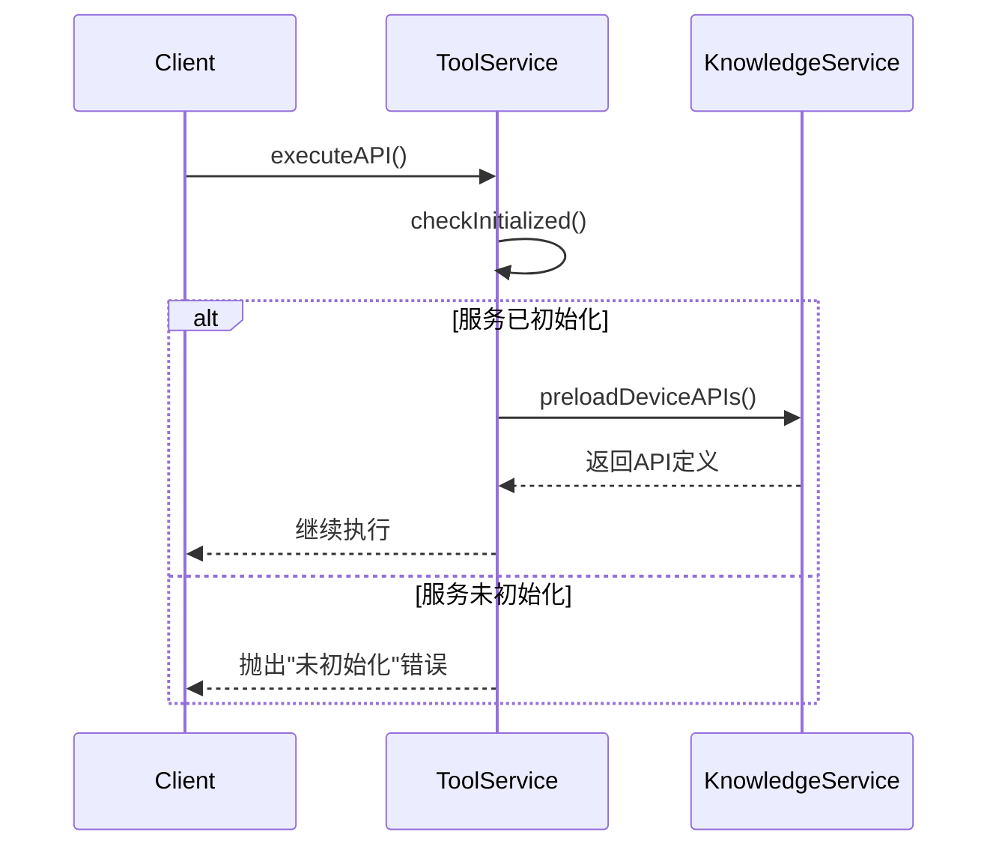
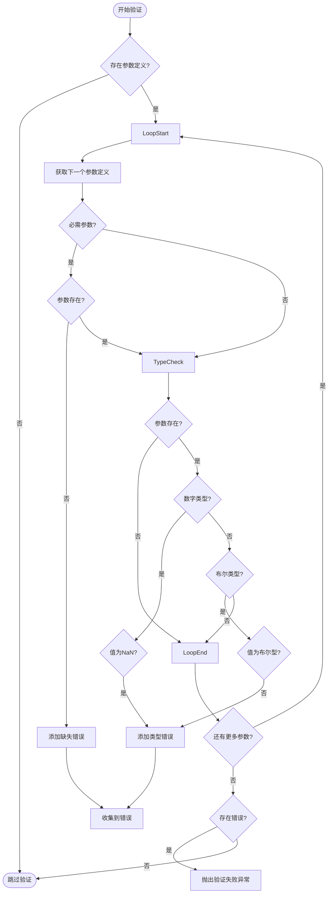
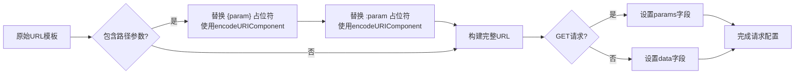

# 工具执行安全机制

<cite>
**本文档引用的文件**
- [ToolExecutionService.js](file://backend/src/services/ToolExecutionService.js)
- [default.json](file://config/default.json)
- [app-config.json](file://configs/app-config.json)
- [security.js](file://backend/src/middleware/security.js)
- [validation.js](file://backend/src/middleware/validation.js)
</cite>

## 目录
1. [简介](#简介)
2. [核心安全控制机制](#核心安全控制机制)
3. [权限校验与初始化流程](#权限校验与初始化流程)
4. [输入参数验证实现](#输入参数验证实现)
5. [请求构建与安全编码](#请求构建与安全编码)
6. [超时与重试策略](#超时与重试策略)
7. [异常处理与日志记录](#异常处理与日志记录)
8. [操作审计与执行历史](#操作审计与执行历史)
9. [配置项安全防护机制](#配置项安全防护机制)
10. [总结](#总结)

## 简介
工具执行服务是智能运维系统的核心组件，负责安全地执行外部API调用。该服务通过多层次的安全控制机制确保系统的稳定性和安全性，包括严格的权限校验、全面的输入验证、安全的请求构建以及完善的错误处理和审计功能。

**Section sources**
- [ToolExecutionService.js](file://backend/src/services/ToolExecutionService.js#L1-L53)

## 核心安全控制机制
工具执行服务采用分层安全架构，从初始化检查到最终结果记录，每个环节都设有相应的安全控制措施。主要安全机制包括：

- **初始化状态检查**：所有敏感操作前都会验证服务是否已正确初始化
- **参数类型与必填校验**：基于API定义元数据进行严格参数验证
- **路径参数安全编码**：防止注入攻击的URL编码处理
- **可配置的超时与重试**：避免长时间阻塞和网络波动影响
- **完整的执行历史记录**：支持操作审计和性能分析



**Diagram sources**
- [ToolExecutionService.js](file://backend/src/services/ToolExecutionService.js#L295-L338)

## 权限校验与初始化流程
在执行任何API调用之前，系统会强制执行初始化状态检查，这是最基本的安全防线。

### 初始化检查机制
`checkInitialized()`方法确保服务在使用前已完成初始化。如果服务未初始化就尝试执行操作，将立即抛出错误，阻止潜在的安全风险。



**Diagram sources**
- [ToolExecutionService.js](file://backend/src/services/ToolExecutionService.js#L295-L338)
- [ToolExecutionService.js](file://backend/src/services/ToolExecutionService.js#L25-L46)

**Section sources**
- [ToolExecutionService.js](file://backend/src/services/ToolExecutionService.js#L25-L46)

## 输入参数验证实现
参数验证是防止非法输入的第一道防线，`validateParameters`方法根据API定义中的元数据进行严格的类型和必填校验。

### 验证规则详解
验证过程包含两个关键维度：

1. **必填性校验**：检查所有标记为必需的参数是否提供
2. **类型一致性校验**：验证参数值与声明的类型是否匹配



**Diagram sources**
- [ToolExecutionService.js](file://backend/src/services/ToolExecutionService.js#L343-L370)

**Section sources**
- [ToolExecutionService.js](file://backend/src/services/ToolExecutionService.js#L343-L370)

## 请求构建与安全编码
`buildRequest`方法负责安全地构建HTTP请求，特别关注路径参数和查询参数的处理，以防止常见的Web攻击。

### 安全编码处理
为了防范路径遍历和注入攻击，系统对所有路径参数进行双重模式替换和URL编码：

- 支持 `{param}` 和 `:param` 两种占位符语法
- 使用 `encodeURIComponent` 对参数值进行编码
- 智能处理URL拼接，避免重复斜杠



**Diagram sources**
- [ToolExecutionService.js](file://backend/src/services/ToolExecutionService.js#L375-L413)

**Section sources**
- [ToolExecutionService.js](file://backend/src/services/ToolExecutionService.js#L375-L413)

## 超时与重试策略
系统实现了灵活的超时控制和智能重试机制，既能保证响应及时性，又能应对临时性网络问题。

### 执行重试流程
`executeWithRetry`方法采用指数退避算法进行重试，有效避免服务雪崩。

```mermaid
sequenceDiagram
participant Client
participant Executor
participant Axios
Client->>Executor : executeWithRetry()
loop 重试循环
Executor->>Axios : 发送请求
alt 成功响应
Axios-->>Executor : 返回响应
Executor-->>Client : 返回成功结果
break 结束
else 失败响应
Axios-->>Executor : 抛出异常
Executor->>Executor : 记录最后一次错误
alt 未达最大重试次数
Executor->>Executor : 计算延迟时间<br/>delay = base * factor^(attempt-1)
Executor->>Executor : 等待延迟时间
else 达到最大重试次数
Executor-->>Client : 抛出最终错误
break 结束
end
end
end
```

**Diagram sources**
- [ToolExecutionService.js](file://backend/src/services/ToolExecutionService.js#L418-L458)

**Section sources**
- [ToolExecutionService.js](file://backend/src/services/ToolExecutionService.js#L418-L458)

## 异常处理与日志记录
系统建立了完善的异常捕获和日志记录机制，确保所有操作都有迹可循。

### 错误处理最佳实践
- **统一错误格式**：所有异常都转换为标准