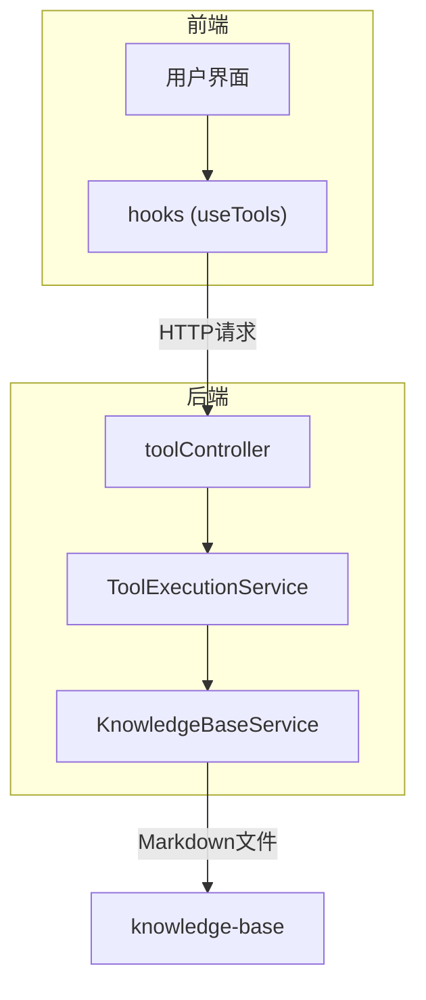
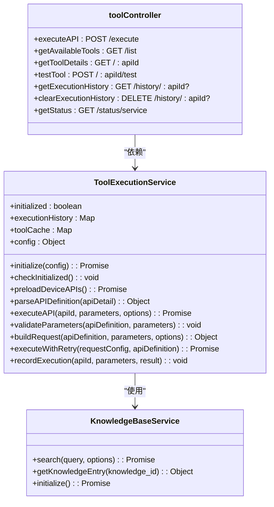
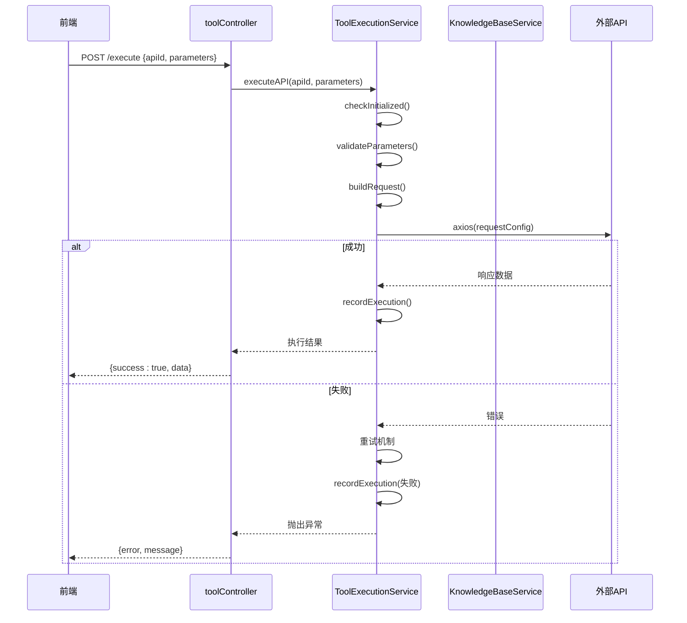
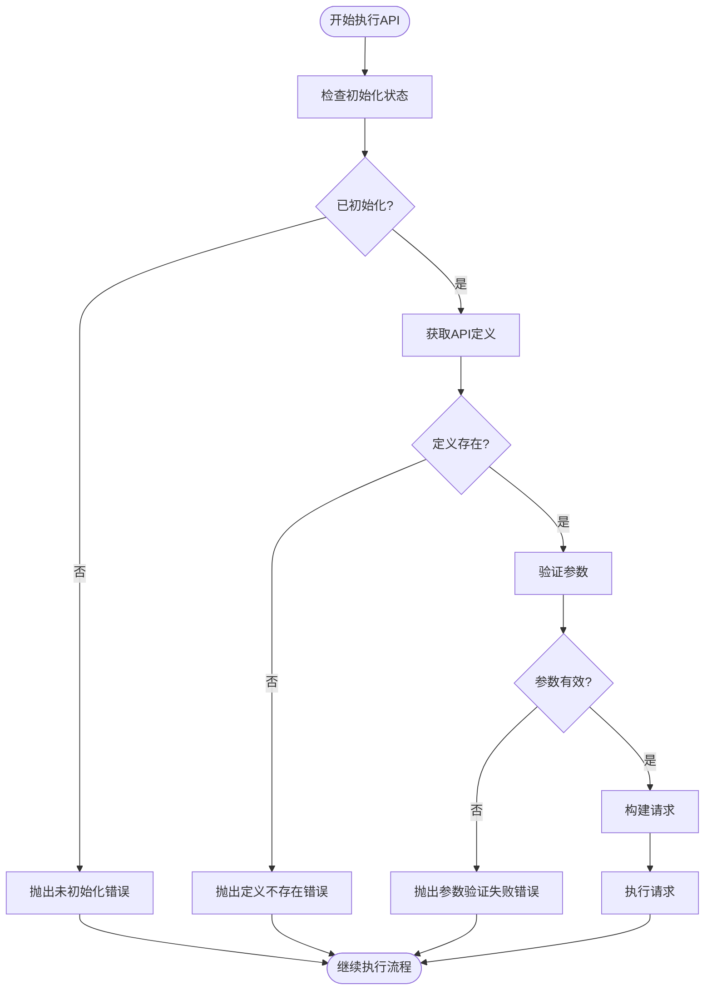

# 工具执行服务

<cite>
**本文档引用的文件**
- [ToolExecutionService.js](file://backend/src/services/ToolExecutionService.js)
- [toolController.js](file://backend/src/controllers/toolController.js)
- [useKnowledge.ts](file://frontend/src/hooks/useKnowledge.ts)
- [database-management-api.md](file://knowledge-base/device-apis/database-management-api.md)
- [server-monitoring-api.md](file://knowledge-base/device-apis/server-monitoring-api.md)
</cite>

## 目录
1. [简介](#简介)
2. [项目结构](#项目结构)
3. [核心组件](#核心组件)
4. [架构概述](#架构概述)
5. [详细组件分析](#详细组件分析)
6. [依赖分析](#依赖分析)
7. [性能考虑](#性能考虑)
8. [故障排除指南](#故障排除指南)
9. [结论](#结论)

## 简介
本技术文档深入解析了智能运维助手应用程序中的工具执行服务（ToolExecutionService）如何安全地调用外部API或执行本地命令。重点描述了executeAPI方法的权限校验、输入验证和沙箱隔离机制，以及工具注册中心的设计模式。通过分析工具描述元数据动态生成调用参数的过程，并结合toolController暴露的REST接口，展示了从前端请求到后端工具执行的完整调用链路。同时详细解释了命令注入防护、超时控制、资源限制等安全措施的实现细节，并提供了自定义工具扩展的开发指南。

## 项目结构
工具执行服务是智能运维助手的核心组件之一，负责执行外部API调用和处理执行结果。该服务位于后端服务层，通过REST API与前端交互，并从知识库中加载工具定义。系统采用分层架构，前端通过hooks调用API，后端控制器路由请求到工具执行服务，服务从知识库加载API定义并执行。



**Diagram sources**
- [toolController.js](file://backend/src/controllers/toolController.js#L0-L149)
- [ToolExecutionService.js](file://backend/src/services/ToolExecutionService.js#L0-L615)

**Section sources**
- [toolController.js](file://backend/src/controllers/toolController.js#L0-L149)
- [ToolExecutionService.js](file://backend/src/services/ToolExecutionService.js#L0-L615)

## 核心组件
工具执行服务的核心功能包括：初始化服务、预加载设备API、执行API调用、参数验证、请求构建、重试机制和执行历史记录。服务通过单例模式创建全局实例，确保在整个应用生命周期中只有一个工具执行服务实例。工具定义存储在内存缓存中，从知识库的Markdown文件动态加载，支持数据库管理和服务器监控等多种运维场景。

**Section sources**
- [ToolExecutionService.js](file://backend/src/services/ToolExecutionService.js#L0-L615)
- [database-management-api.md](file://knowledge-base/device-apis/database-management-api.md#L0-L328)
- [server-monitoring-api.md](file://knowledge-base/device-apis/server-monitoring-api.md#L0-L175)

## 架构概述
工具执行服务采用模块化设计，各组件职责分明。服务初始化时预加载所有设备API定义，将其缓存在内存中以提高访问效率。当收到执行请求时，服务首先进行权限校验和输入验证，然后构建HTTP请求，通过axios执行带重试机制的调用，最后记录执行历史。整个流程形成了一个完整的闭环，确保了工具执行的安全性和可靠性。



**Diagram sources**
- [ToolExecutionService.js](file://backend/src/services/ToolExecutionService.js#L0-L615)
- [toolController.js](file://backend/src/controllers/toolController.js#L0-L149)

## 详细组件分析

### 工具执行流程分析
工具执行服务的核心是executeAPI方法，它实现了完整的工具调用流程，包括权限校验、输入验证、请求构建、执行和历史记录等功能。该方法确保了每次工具调用都经过严格的安全检查和错误处理。

#### 执行流程序列图


**Diagram sources**
- [ToolExecutionService.js](file://backend/src/services/ToolExecutionService.js#L295-L338)
- [toolController.js](file://backend/src/controllers/toolController.js#L0-L55)

**Section sources**
- [ToolExecutionService.js](file://backend/src/services/ToolExecutionService.js#L295-L338)
- [toolController.js](file://backend/src/controllers/toolController.js#L0-L55)

### 权限校验与输入验证
工具执行服务实施了多层次的安全防护机制，确保只有经过验证的请求才能被执行。权限校验确保服务已正确初始化，而输入验证则保证传入参数的完整性和正确性。

#### 安全验证流程图


**Diagram sources**
- [ToolExecutionService.js](file://backend/src/services/ToolExecutionService.js#L343-L370)
- [ToolExecutionService.js](file://backend/src/services/ToolExecutionService.js#L60-L82)

**Section sources**
- [ToolExecutionService.js](file://backend/src/services/ToolExecutionService.js#L343-L370)

### 工具注册中心设计
工具注册中心采用基于知识库的动态加载机制，将Markdown格式的API文档转换为可执行的工具定义。这种设计模式实现了工具定义与代码的分离，使得运维人员可以轻松添加或修改工具而无需更改代码。

#### 工具注册流程图
```mermaid
flowchart TD
    Start([服务初始化]) --> Preload["预加载设备API"]
    Preload --> SearchKB["搜索知识库(type=device-api)"]
    SearchKB --> ForEachAPI["遍历每个API结果"]
    ForEachAPI --> GetEntry["获取知识条目"]
    GetEntry --> ParseDef["解析API定义"]
    ParseDef --> IsBlueprint{"API类型为blueprint?"}
    IsBlueprint -->|是| ParseBlueprint["解析API Blueprint"]
    IsBlueprint -->|否| ParseMarkdown["解析Markdown API"]
    ParseBlueprint --> StoreCache["存入toolCache"]
    ParseMarkdown --> StoreCache
    StoreCache --> NextAPI["下一个API"]
    NextAPI --> EndLoop{"所有API处理完毕?"}
    EndLoop -->|否| For