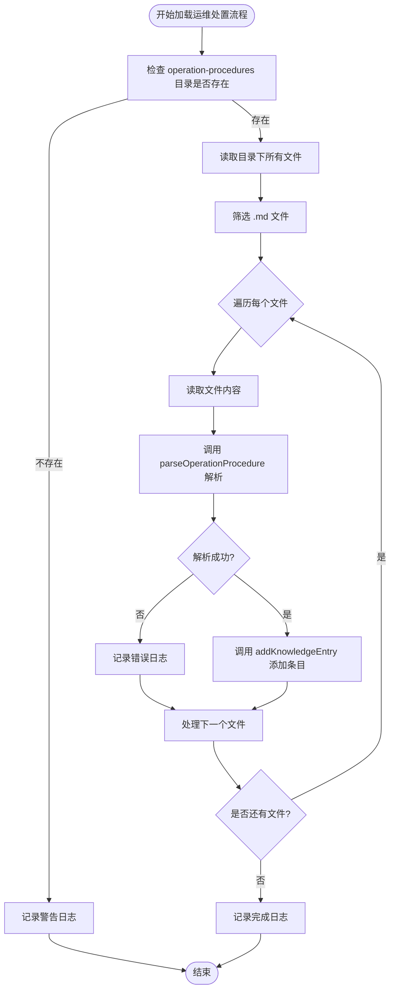
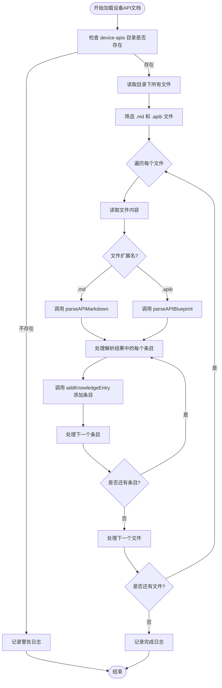
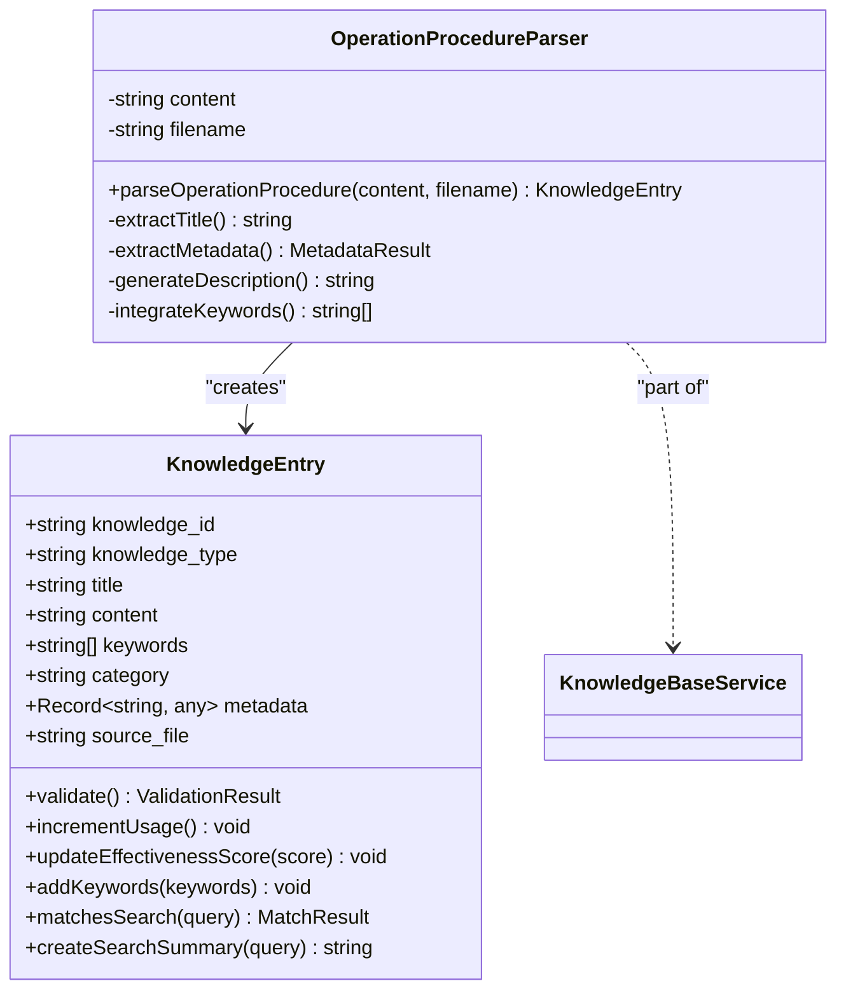
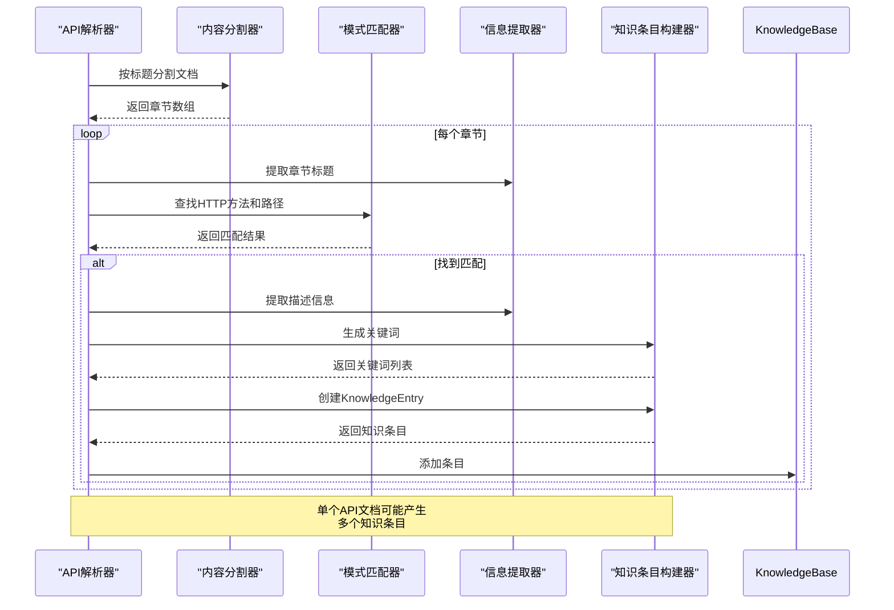

# 知识加载与解析

<cite>
**Referenced Files in This Document **   
- [KnowledgeBaseService.js](file://backend/src/services/KnowledgeBaseService.js)
- [KnowledgeEntry.js](file://backend/src/models/KnowledgeEntry.js)
- [cpu-high-usage.md](file://knowledge-base/operation-procedures/cpu-high-usage.md)
- [database-management-api.md](file://knowledge-base/device-apis/database-management-api.md)
- [server-monitoring-api.md](file://knowledge-base/device-apis/server-monitoring-api.md)
</cite>

## 目录
1. [知识库服务概述](#知识库服务概述)
2. [运维处置流程加载机制](#运维处置流程加载机制)
3. [设备API文档加载机制](#设备api文档加载机制)
4. [运维处置文档解析过程](#运维处置文档解析过程)
5. [API文档解析策略](#api文档解析策略)
6. [自动关键词提取算法](#自动关键词提取算法)
7. [知识条目验证与索引构建](#知识条目验证与索引构建)
8. [完整转换示例分析](#完整转换示例分析)

## 知识库服务概述

`KnowledgeBaseService` 是智能运维系统的核心组件，负责管理运维处置流程和设备API文档的知识库。该服务通过递归扫描 `knowledge-base` 目录下的文件，将原始的Markdown和API Blueprint格式文档转换为结构化的知识条目，并建立高效的检索索引。

服务初始化时会自动加载两个主要目录：
- `operation-procedures`: 存放运维处置流程文档
- `device-apis`: 存放设备操作API文档

每个知识条目最终被封装为 `KnowledgeEntry` 对象，包含标题、内容、关键词、分类等元数据，并通过唯一ID进行管理。

**Section sources**
- [KnowledgeBaseService.js](file://backend/src/services/KnowledgeBaseService.js#L1-L50)

## 运维处置流程加载机制

`loadOperationProcedures` 方法负责递归扫描 `operation-procedures` 目录下的所有Markdown文件，并将其转换为知识条目。该方法实现了完整的错误处理和日志记录机制，确保即使个别文件解析失败也不会影响整体加载过程。

加载流程如下：
1. 构建 `operation-procedures` 目录的完整路径
2. 检查目录是否存在，若不存在则记录警告并返回
3. 读取目录下所有文件，筛选出 `.md` 扩展名的Markdown文件
4. 遍历每个Markdown文件，同步读取其内容
5. 调用 `parseOperationProcedure` 方法解析文档内容
6. 将解析得到的知识条目添加到知识库中
7. 记录加载完成的日志信息

此方法采用同步文件操作以简化代码逻辑，适用于中小型知识库。对于大型知识库，可考虑改为异步批量处理以提高性能。

**Diagram sources **
- [KnowledgeBaseService.js](file://backend/src/services/KnowledgeBaseService.js#L79-L105)

**Section sources**
- [KnowledgeBaseService.js](file://backend/src/services/KnowledgeBaseService.js#L79-L105)

## 设备API文档加载机制

`loadDeviceAPIs` 方法专门用于加载设备相关的API文档，支持两种格式：Markdown (`.md`) 和 API Blueprint (`.apib`)。与运维处置流程类似，该方法也实现了健壮的错误处理机制。

加载流程包括：
1. 构建 `device-apis` 目录的完整路径
2. 验证目录存在性，不存在则发出警告
3. 读取目录内容，筛选出 `.md` 或 `.apib` 扩展名的文件
4. 遍历每个API文件，同步读取其内容
5. 根据文件扩展名选择相应的解析器 (`parseAPIMarkdown` 或 `parseAPIBlueprint`)
6. 将解析得到的一个或多个知识条目添加到知识库中
7. 记录加载统计信息

值得注意的是，单个API文档可能包含多个API端点，因此 `parseDeviceAPI` 方法返回的是知识条目数组，需要逐个添加到知识库中。

**Diagram sources **
- [KnowledgeBaseService.js](file://backend/src/services/KnowledgeBaseService.js#L178-L202)

**Section sources**
- [KnowledgeBaseService.js](file://backend/src/services/KnowledgeBaseService.js#L178-L202)

## 运维处置文档解析过程

`parseOperationProcedure` 方法负责将Markdown格式的运维处置文档转换为结构化的 `KnowledgeEntry` 对象。该方法实现了多层次的信息提取策略，优先使用显式定义的元数据，其次才依赖自动提取。

解析流程如下：

### 标题提取
首先从文件名推断标题（去除 `.md` 扩展名），然后在文档内容中查找第一个一级标题 (`# `)，如果找到则使用该标题覆盖文件名标题。

### 元数据解析
搜索文档中的HTML注释块 `<!-- metadata { ... } -->`，尝试将其内容解析为JSON对象。从中提取预定义的分类、关键词和描述信息。如果JSON解析失败，则记录警告但继续处理。

### 描述生成
如果元数据中未提供描述，则从文档正文中提取前三个非标题、非注释的文本行，截取前200个字符作为自动生成的描述。

### 关键词整合
结合元数据中提供的关键词和通过 `extractKeywords` 算法自动提取的关键词，去重后形成最终的关键词列表。

### 知识条目构建
使用收集到的所有信息创建 `KnowledgeEntry` 实例，设置类型为 `operation-procedure`，并填充详细的元数据信息。

**Diagram sources **
- [KnowledgeBaseService.js](file://backend/src/services/KnowledgeBaseService.js#L110-L173)
- [KnowledgeEntry.js](file://backend/src/models/KnowledgeEntry.js#L7-L251)

**Section sources**
- [KnowledgeBaseService.js](file://backend/src/services/KnowledgeBaseService.js#L110-L173)

## API文档解析策略

系统支持两种API文档格式的解析：Markdown和API Blueprint，分别由 `parseAPIMarkdown` 和 `parseAPIBlueprint` 方法处理。

### Markdown格式解析
`parseAPIMarkdown` 方法假设文档使用标题分隔不同的API端点。它执行以下步骤：
1. 使用正则表达式 `/^#+\s+/m` 按标题分割文档内容
2. 遍历每个章节，提取章节标题作为API名称
3. 在章节内容中搜索HTTP方法和路径模式 `(GET|POST|PUT|DELETE|PATCH)\s+([^\s]+)`
4. 提取匹配的HTTP方法和请求路径
5. 基于标题、方法和路径生成关键词
6. 创建 `device-api` 类型的知识条目

### API Blueprint格式解析
`parseAPIBlueprint` 方法针对API Blueprint规范进行了优化：
1. 使用 `/^##\s+/m` 正则表达式按二级标题分割文档
2. 提取每个章节的标题作为API描述
3. 在章节内容中查找HTTP方法和路径定义
4. 尝试提取第一行文本作为详细描述
5. 综合标题、方法、路径和描述生成关键词
6. 创建知识条目，特别标注 `apiType: 'blueprint'`

两种解析器都遵循"一个API端点对应一个知识条目"的原则，使得后续的检索和推荐更加精确。

**Diagram sources **
- [KnowledgeBaseService.js](file://backend/src/services/KnowledgeBaseService.js#L275-L311)
- [KnowledgeBaseService.js](file://