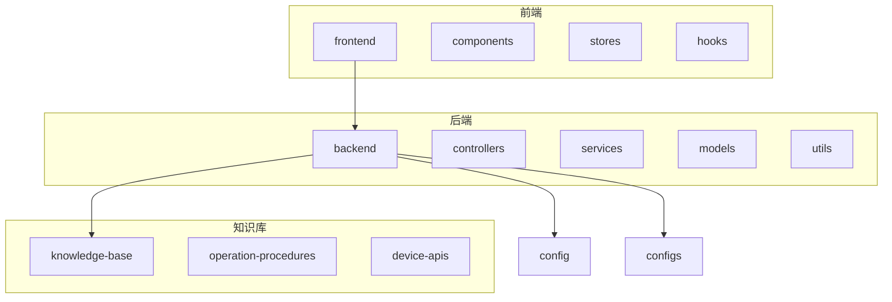
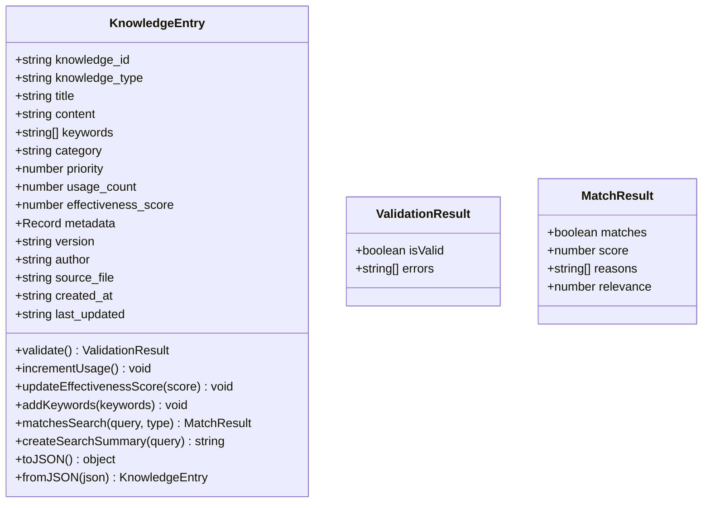
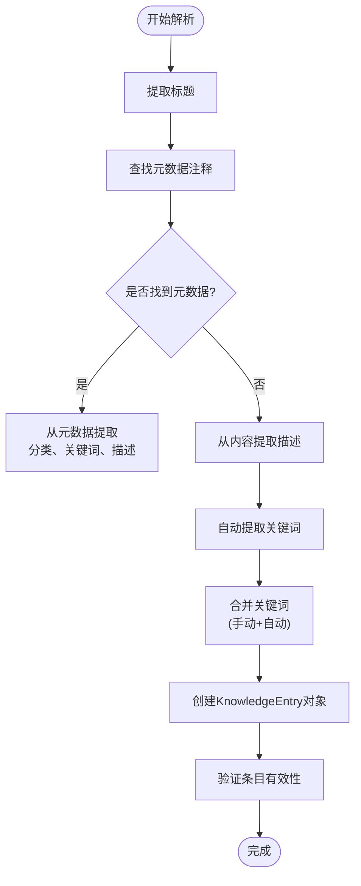
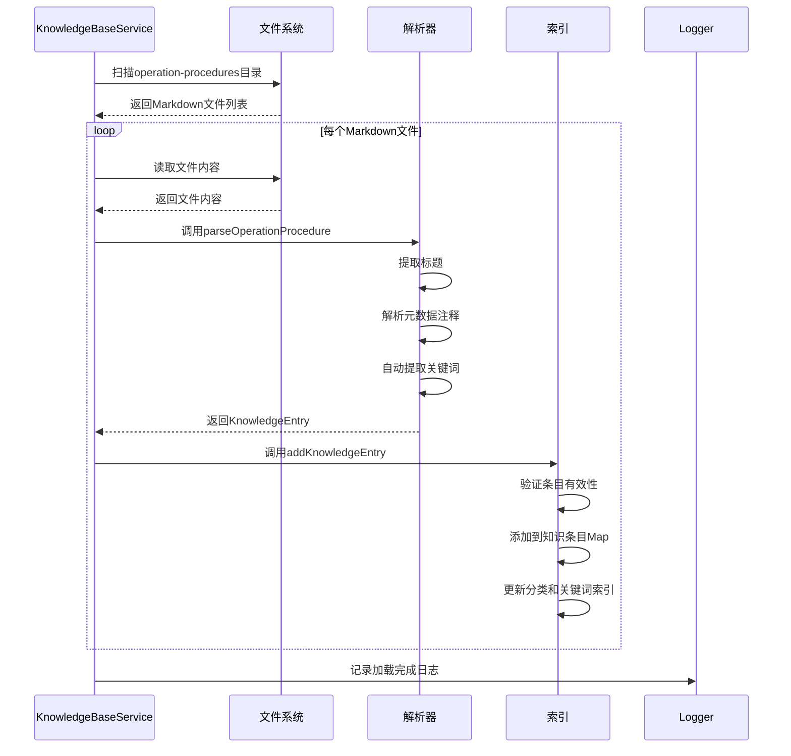
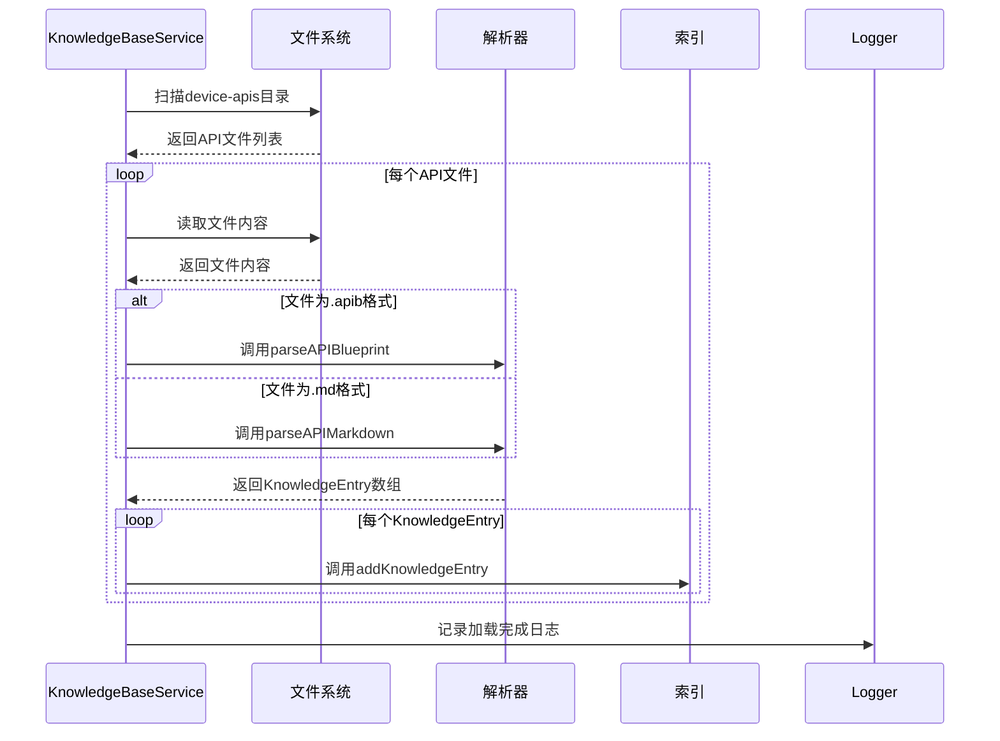
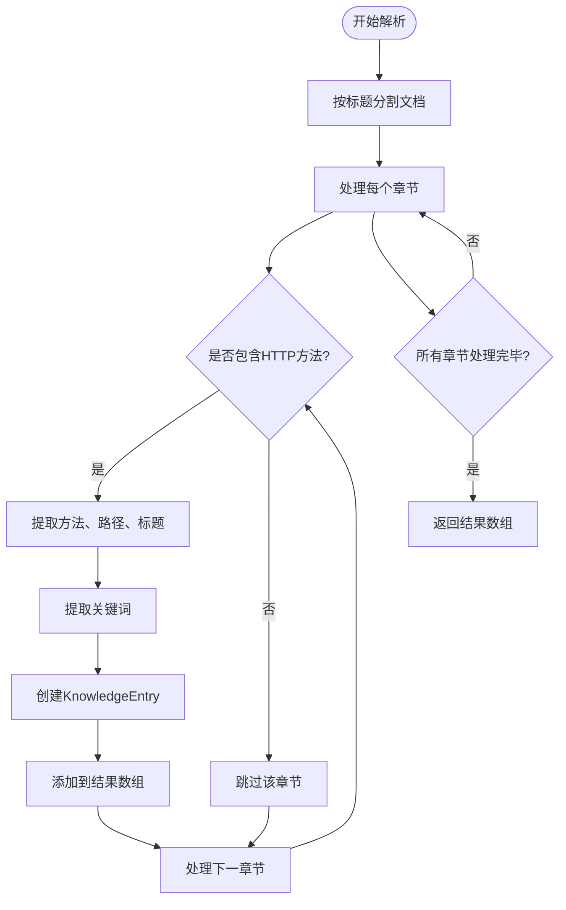
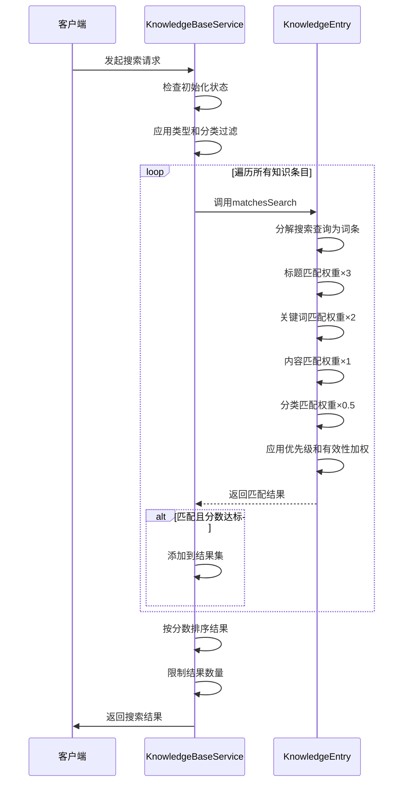
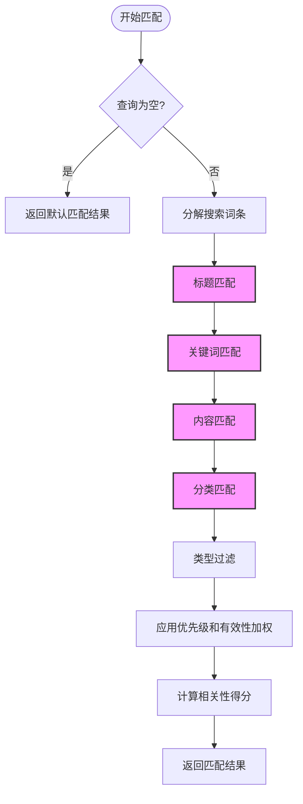
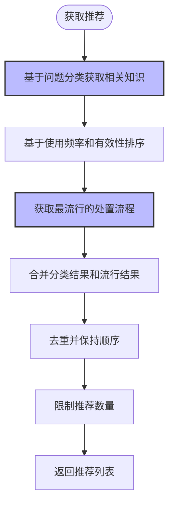
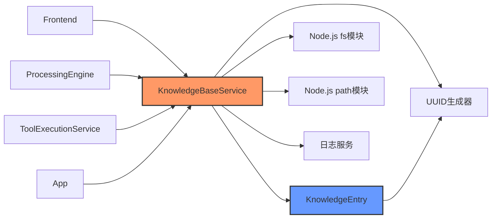

# 知识库服务

<cite>
**本文档引用的文件**
- [KnowledgeBaseService.js](file://backend\src\services\KnowledgeBaseService.js)
- [KnowledgeEntry.js](file://backend\src\models\KnowledgeEntry.js)
- [cpu-high-usage.md](file://knowledge-base\operation-procedures\cpu-high-usage.md)
- [database-management-api.md](file://knowledge-base\device-apis\database-management-api.md)
</cite>

## 目录
1. [项目结构](#项目结构)
2. [核心组件](#核心组件)
3. [知识条目构建与元数据提取](#知识条目构建与元数据提取)
4. [文档加载与解析机制](#文档加载与解析机制)
5. [搜索与推荐机制](#搜索与推荐机制)
6. [依赖分析](#依赖分析)

## 项目结构



**图示来源**
- [KnowledgeBaseService.js](file://backend\src\services\KnowledgeBaseService.js#L0-L582)

## 核心组件

知识库服务（KnowledgeBaseService）是智能运维系统的核心组件，负责管理运维处置流程和设备API文档的知识库。该服务通过递归扫描`knowledge-base`目录下的Markdown和API Blueprint格式文档，实现知识的自动加载、索引和检索。

服务主要功能包括：
- 初始化知识库并建立索引
- 加载和解析运维处置流程文档
- 加载和解析设备API文档
- 提供基于文本匹配的搜索功能
- 智能推荐相关解决方案
- 维护知识条目的使用统计和有效性评分

**本节来源**
- [KnowledgeBaseService.js](file://backend\src\services\KnowledgeBaseService.js#L14-L577)

## 知识条目构建与元数据提取

### KnowledgeEntry对象模型

KnowledgeEntry是知识库中的基本数据单元，封装了知识条目的所有相关信息：



**图示来源**
- [KnowledgeEntry.js](file://backend\src\models\KnowledgeEntry.js#L7-L251)

### 元数据提取逻辑

KnowledgeEntry对象的构建过程包含复杂的元数据提取逻辑，从原始文档中提取标题、关键词、分类等关键信息。

#### 标题提取
标题提取遵循以下优先级顺序：
1. 首先查找文档中的第一个一级标题（以`# `开头的行）
2. 如果没有找到，则使用文件名（去除.md扩展名）

#### 分类与关键词提取
分类和关键词的提取采用多源融合策略：
1. **元数据注释**：解析文档中的HTML注释块`<!-- metadata { ... } -->`
2. **内容分析**：从标题和描述中自动提取关键词
3. **关键词合并**：将手动指定的关键词与自动提取的关键词合并去重



**本节来源**
- [KnowledgeBaseService.js](file://backend\src\services\KnowledgeBaseService.js#L110-L173)
- [KnowledgeEntry.js](file://backend\src\models\KnowledgeEntry.js#L43-L71)

## 文档加载与解析机制

### 目录结构与初始化

知识库服务遵循特定的目录结构约定，从`knowledge-base`根目录下加载两类文档：
- `operation-procedures`：存放运维处置流程文档
- `device-apis`：存放设备API文档

服务初始化时会自动确定知识库路径：

```javascript
getDefaultKnowledgeBasePath() {
    return path.join(__dirname, '../../../knowledge-base');
}
```

**本节来源**
- [KnowledgeBaseService.js](file://backend\src\services\KnowledgeBaseService.js#L79-L105)

### 运维处置流程加载

`loadOperationProcedures`方法负责加载运维处置流程文档，其执行流程如下：



**图示来源**
- [KnowledgeBaseService.js](file://backend\src\services\KnowledgeBaseService.js#L79-L105)

### 设备API文档加载

`loadDeviceAPIs`方法负责加载设备API文档，支持两种格式：
- Markdown格式（.md）
- API Blueprint格式（.apib）



**图示来源**
- [KnowledgeBaseService.js](file://backend\src\services\KnowledgeBaseService.js#L178-L202)

### Markdown API文档解析

`parseAPIMarkdown`方法解析Markdown格式的API文档，将每个API端点转换为独立的知识条目：



**图示来源**
- [KnowledgeBaseService.js](file://backend\src\services\KnowledgeBaseService.js#L275-L311)

### 实际文档转换示例

以`cpu-high-usage.md`为例，展示从原始文件到可查询知识条目的转换全过程：

```markdown
# 服务器高CPU使用率问题处置

<!-- metadata
{
  "category": "performance",
  "keywords": ["CPU", "高使用率", "性能", "服务器"],
  "description": "服务器CPU使用率过高的诊断和处置方法"
}
-->

## 问题现象
...
```

转换后的KnowledgeEntry对象：

```json
{
  "knowledge_type": "operation-procedure",
  "title": "服务器高CPU使用率问题处置",
  "content": "[完整文档内容]",
  "keywords": ["cpu", "高使用率", "性能", "服务器", "问题", "处置", "使用率", "服务器高", "高cpu", "cpu使用"],
  "category": "performance",
  "source_file": "cpu-high-usage.md",
  "metadata": {
    "description": "服务器CPU使用率过高的诊断和处置方法",
    "fileSize": 3245,
    "lineCount": 97
  },
  "priority": 0,
  "usage_count": 0,
  "effectiveness_score": 0
}
```

**本节来源**
- [cpu-high-usage.md](file://knowledge-base\operation-procedures\cpu-high-usage.md)
- [KnowledgeBaseService.js](file://backend\src\services\KnowledgeBaseService.js#L110-L173)

## 搜索与推荐机制

### 搜索算法实现

`search`方法实现了基于文本匹配和评分算法的检索机制，其工作流程如下：



**图示来源**
- [KnowledgeBaseService.js](file://backend\src\services\KnowledgeBaseService.js#L362-L429)

### 匹配评分算法

KnowledgeEntry的`matchesSearch`方法采用多层次的评分算法：



各匹配项的权重分配：
- **标题匹配**：每个匹配词条×3分
- **关键词匹配**：每个匹配词条×2分  
- **内容匹配**：每个匹配词条×1分
- **分类匹配**：匹配则+0.5分
- **最终加权**：`score × (1 + priority/10) × (1 + effectiveness_score)`

**本节来源**
- [KnowledgeEntry.js](file://backend\src\models\KnowledgeEntry.js#L108-L162)

### 智能推荐机制

`getRecommendations`方法根据问题类型智能推荐解决方案，结合了分类相关性和使用流行度两个维度：



推荐算法的具体实现：

```javascript
getRecommendations(problemCategory, limit = 5) {
    // 基于问题分类推荐相关知识
    const categoryResults = this.getByCategory(problemCategory, limit * 2);
    
    // 基于使用频率和有效性推荐
    const popularEntries = Array.from(this.knowledgeEntries.values())
      .filter(entry => entry.knowledge_type === 'operation-procedure')
      .sort((a, b) => {
        const scoreA = a.usage_count * 0.4 + a.effectiveness_score * 0.6;
        const scoreB = b.usage_count * 0.4 + b.effectiveness_score * 0.6;
        return scoreB - scoreA;
      })
      .slice(0, limit)
      .map(entry => entry.toJSON());

    // 合并和去重
    const seen = new Set();
    const recommendations = [];
    
    [...categoryResults, ...popularEntries].forEach(entry => {
      if (!seen.has(entry.knowledge_id) && recommendations.length < limit) {
        seen.add(entry.knowledge_id);
        recommendations.push(entry);
      }
    });

    return recommendations;
}
```

**本节来源**
- [KnowledgeBaseService.js](file://backend\src\services\KnowledgeBaseService.js#L474-L503)

## 依赖分析

知识库服务与其他组件存在紧密的依赖关系：



**图示来源**
- [KnowledgeBaseService.js](file://backend\src\services\KnowledgeBaseService.js#L0-L582)
- [KnowledgeEntry.js](file://backend\src\models\KnowledgeEntry.js#L0-L253)