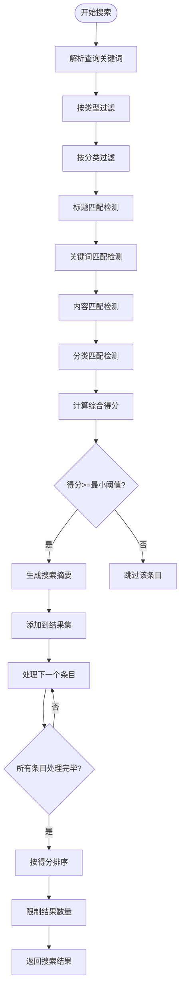
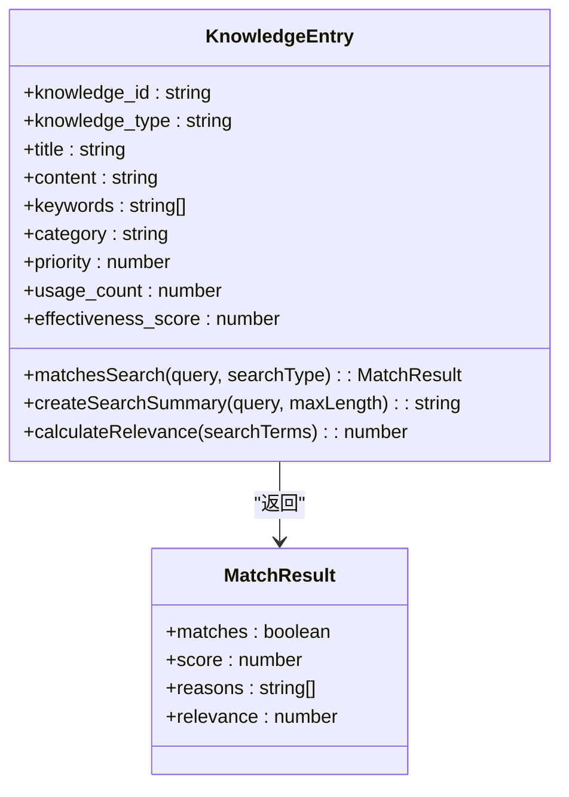
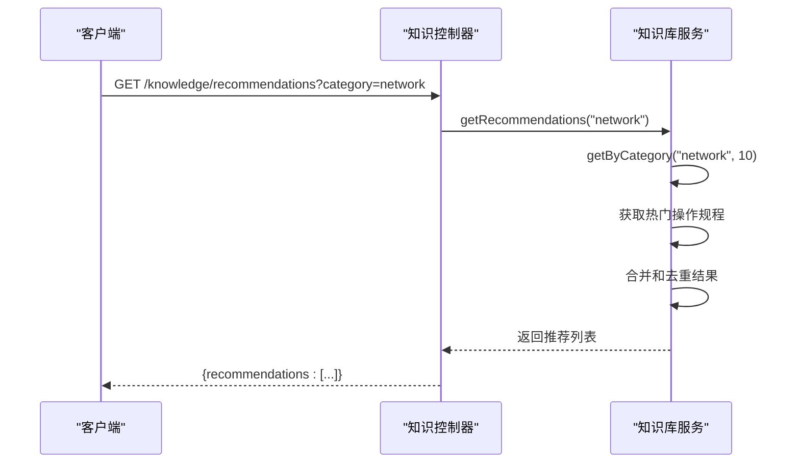
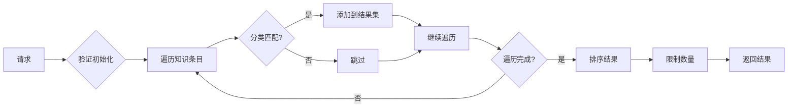
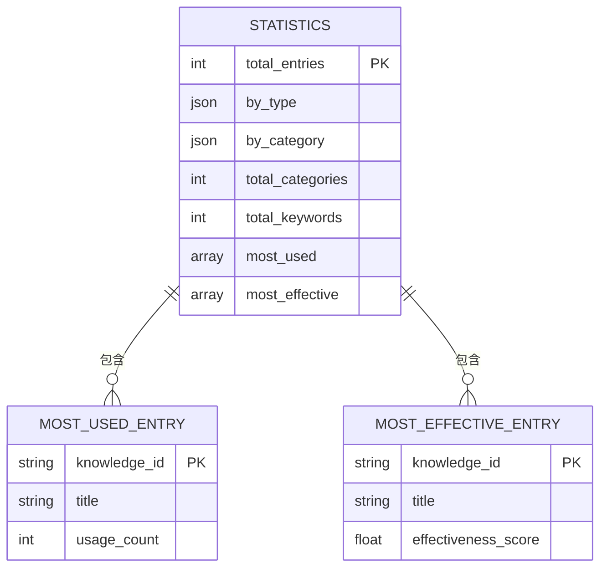

# 知识检索与推荐

<cite>
**本文档引用的文件**
- [KnowledgeBaseService.js](file://backend/src/services/KnowledgeBaseService.js)
- [KnowledgeEntry.js](file://backend/src/models/KnowledgeEntry.js)
- [knowledgeController.js](file://backend/src/controllers/knowledgeController.js)
- [api.ts](file://frontend/src/utils/api.ts)
</cite>

## 目录
1. [引言](#引言)
2. [全文检索机制](#全文检索机制)
3. [智能推荐系统](#智能推荐系统)
4. [数据访问接口](#数据访问接口)
5. [实际调用示例](#实际调用示例)
6. [性能优化建议](#性能优化建议)
7. [结论](#结论)

## 引言
本系统实现了完整的知识库管理功能，包括全文检索、智能推荐和统计分析。核心功能由KnowledgeBaseService提供，通过多种算法实现高效的知识条目搜索和推荐。系统支持基于类型和分类的过滤策略，能够根据查询关键词进行精确匹配，并结合使用频率和有效性评分进行排序。

## 全文检索机制

### 查询匹配评分算法
系统采用多维度加权评分算法来评估知识条目与查询的匹配程度。评分计算考虑了标题、关键词、内容和分类四个维度，每个维度具有不同的权重：

- **标题匹配**：权重为3，最高优先级
- **关键词匹配**：权重为2，高优先级
- **内容匹配**：权重为1，中等优先级
- **分类匹配**：权重为0.5，低优先级

此外，系统还引入了优先级和有效性评分的加权因子，最终得分计算公式为：`score = 基础分 * (1 + 优先级/10) * (1 + 有效性评分)`。



**图源**
- [KnowledgeBaseService.js](file://backend/src/services/KnowledgeBaseService.js#L362-L429)
- [KnowledgeEntry.js](file://backend/src/models/KnowledgeEntry.js#L108-L162)

**节源**
- [KnowledgeBaseService.js](file://backend/src/services/KnowledgeBaseService.js#L362-L429)
- [KnowledgeEntry.js](file://backend/src/models/KnowledgeEntry.js#L108-L162)

### 匹配理由与摘要生成
系统通过`matchesSearch`和`createSearchSummary`方法协同工作来生成搜索结果的相关信息。`matchesSearch`方法负责识别匹配项并记录匹配理由，而`createSearchSummary`方法则根据查询关键词生成上下文相关的摘要。

匹配理由包括：
- 标题匹配的具体词条
- 关键词匹配的关键词
- 内容匹配的词条数量
- 分类匹配的分类名称



**图源**
- [KnowledgeEntry.js](file://backend/src/models/KnowledgeEntry.js#L108-L162)
- [KnowledgeEntry.js](file://backend/src/models/KnowledgeEntry.js#L218-L250)

**节源**
- [KnowledgeEntry.js](file://backend/src/models/KnowledgeEntry.js#L108-L162)
- [KnowledgeEntry.js](file://backend/src/models/KnowledgeEntry.js#L218-L250)

## 智能推荐系统

### 推荐算法实现
`getRecommendations`方法结合问题类型和热门知识条目进行智能推荐。推荐系统采用双轨制策略，既考虑问题相关性，又兼顾知识条目的流行度。

推荐流程：
1. 基于问题分类获取相关知识条目
2. 基于使用频率和有效性获取热门条目
3. 合并对去重，确保推荐结果的多样性和质量



**图源**
- [KnowledgeBaseService.js](file://backend/src/services/KnowledgeBaseService.js#L474-L503)
- [knowledgeController.js](file://backend/src/controllers/knowledgeController.js)

**节源**
- [KnowledgeBaseService.js](file://backend/src/services/KnowledgeBaseService.js#L474-L503)

### 加权排序策略
推荐系统采用加权排序策略来平衡使用频率和有效性评分。对于分类推荐，使用0.3:0.7的权重比（使用次数:有效性评分）；对于热门推荐，使用0.4:0.6的权重比。

排序公式：
- 分类推荐：`score = usage_count * 0.3 + effectiveness_score * 0.7`
- 热门推荐：`score = usage_count * 0.4 + effectiveness_score * 0.6`

这种差异化权重设置确保了推荐结果既能反映实际使用情况，又能体现知识条目的质量。

## 数据访问接口

### 分类查询接口
`getByCategory`方法提供了按分类查询知识条目的功能。该接口不仅返回指定分类的所有知识条目，还按照综合评分进行排序，确保最相关的内容排在前面。

接口特点：
- 支持可配置的结果数量限制
- 自动按使用频率和有效性排序
- 返回标准化的JSON格式数据



**图源**
- [KnowledgeBaseService.js](file://backend/src/services/KnowledgeBaseService.js#L451-L469)

**节源**
- [KnowledgeBaseService.js](file://backend/src/services/KnowledgeBaseService.js#L451-L469)

### 统计分析接口
`getStatistics`方法提供了全面的知识库统计功能，包括总量统计、分类统计和排行榜信息。这些数据对于运维场景中的决策支持和性能监控具有重要价值。

统计指标包括：
- 总知识条目数
- 按类型和分类的分布
- 最常使用的知识条目
- 最有效的知识条目



**图源**
- [KnowledgeBaseService.js](file://backend/src/services/KnowledgeBaseService.js#L523-L565)

**节源**
- [KnowledgeBaseService.js](file://backend/src/services/KnowledgeBaseService.js#L523-L565)

## 实际调用示例

### 搜索API调用
前端通过api.ts中的searchKnowledge方法调用后端搜索接口，支持多种查询参数：

```typescript
// 搜索网络相关知识
await api.searchKnowledge('网络连接', {
  type: 'operation-procedure',
  category: 'network',
  limit: 5,
  minScore: 0.2
});

// 搜索所有类型的知识
await api.searchKnowledge('CPU', {
  type: 'all',
  limit: 10
});
```

### 推荐API调用
获取特定问题类型的推荐知识：

```typescript
// 获取网络问题推荐
await api.getRecommendations('network', 5);

// 获取通用热门推荐
await api.getRecommendations(undefined, 5);
```

### 统计数据获取
获取知识库整体统计信息：

```typescript
const stats = await api.getStatistics();
console.log(`总知识条目: ${stats.total_entries}`);
console.log(`最常用知识:`, stats.most_used);
```

**节源**
- [api.ts](file://frontend/src/utils/api.ts#L150-L178)

## 性能优化建议

### 缓存策略
系统已在前端实现了缓存管理机制，建议进一步完善：

1. **分层缓存**：
   -