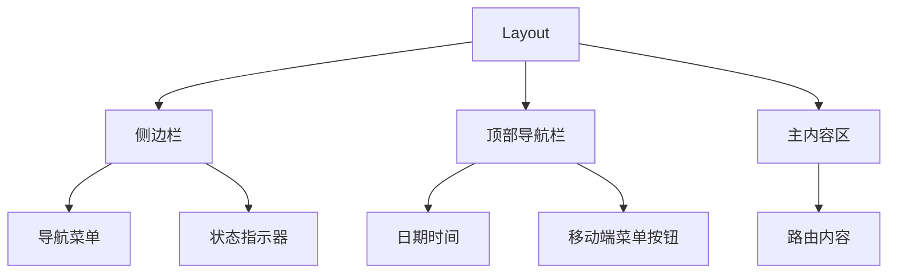
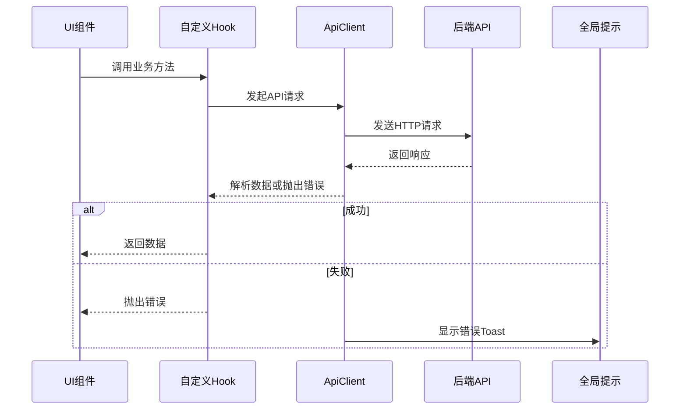

# 前端架构

<cite>
**本文档中引用的文件**  
- [vite.config.ts](file://frontend/vite.config.ts)
- [main.tsx](file://frontend/src/main.tsx)
- [App.tsx](file://frontend/src/App.tsx)
- [Layout.tsx](file://frontend/src/components/Layout.tsx)
- [api.ts](file://frontend/src/utils/api.ts)
- [tailwind.config.js](file://frontend/tailwind.config.js)
- [useKnowledge.ts](file://frontend/src/hooks/useKnowledge.ts)
- [useSession.ts](file://frontend/src/hooks/useSession.ts)
- [useSessionHistory.ts](file://frontend/src/hooks/useSessionHistory.ts)
- [dataStore.ts](file://frontend/src/stores/dataStore.ts)
- [sessionStore.ts](file://frontend/src/stores/sessionStore.ts)
- [uiStore.ts](file://frontend/src/stores/uiStore.ts)
</cite>

## 目录
1. [技术选型与构建工具](#技术选型与构建工具)
2. [应用入口与根组件结构](#应用入口与根组件结构)
3. [全局布局设计](#全局布局设计)
4. [API通信机制](#api通信机制)
5. [样式开发实践](#样式开发实践)
6. [状态管理与UI解耦](#状态管理与ui解耦)
7. [组件分层结构](#组件分层结构)

## 技术选型与构建工具

AutoOperation前端采用React + TypeScript技术栈，结合Vite作为构建工具。该技术组合提供了类型安全、高性能开发体验和现代化的工程化能力。

Vite通过原生ES模块导入实现极速冷启动，并利用Rollup进行生产环境打包优化。在`vite.config.ts`中配置了关键构建策略：设置`@`别名为`src`目录以简化路径引用；通过`server.proxy`将`/api`请求代理至后端服务（http://localhost:3000），解决开发环境跨域问题；在`build.rollupOptions`中定义手动代码分割策略，将核心依赖拆分为独立chunk（如vendor、router、state等），有效提升首屏加载性能。

此外，测试环境配置集成了Jest-like运行时（jsdom）和全局变量支持，确保单元测试的完整执行环境。

**Section sources**
- [vite.config.ts](file://frontend/vite.config.ts#L1-L42)

## 应用入口与根组件结构

应用入口`main.tsx`负责初始化React应用并挂载到DOM。使用`ReactDOM.createRoot`创建根实例，通过`React.StrictMode`启用严格模式检测潜在问题。集成`BrowserRouter`提供客户端路由功能，并引入`react-hot-toast`全局通知组件，配置统一的提示样式和持续时间策略。

`App.tsx`作为根组件，采用声明式路由组织应用结构。基于`react-router-dom`的`Routes`和`Route`组件定义四个主要路由：
- `/`：首页
- `/session/:sessionId`：会话详情页
- `/history`：历史记录页
- `/settings`：设置页

所有路由内容均被包裹在`Layout`组件内，实现一致的全局布局。

**Section sources**
- [main.tsx](file://frontend/src/main.tsx#L1-L38)
- [App.tsx](file://frontend/src/App.tsx#L1-L21)

## 全局布局设计

`Layout.tsx`实现了响应式的全局布局系统，包含侧边栏导航、顶部导航栏和主内容区三大部分。

侧边栏采用移动优先设计，在小屏幕下默认隐藏并通过汉堡菜单触发，大屏幕下固定显示。导航项包括首页、新建会话、历史记录和设置，当前激活状态通过`useLocation`钩子实时匹配路由路径进行高亮。底部显示系统运行状态指示器，增强用户感知。

顶部导航栏包含日期时间显示和移动端菜单按钮。主内容区域采用`lg:pl-64`类名实现大屏幕下的左侧留白，避免内容被固定侧边栏遮挡。

整体布局充分利用Tailwind CSS的响应式断点系统（如`lg:`前缀）和Flexbox布局模型，确保在不同设备上均有良好表现。



**Diagram sources**
- [Layout.tsx](file://frontend/src/components/Layout.tsx#L1-L140)

**Section sources**
- [Layout.tsx](file://frontend/src/components/Layout.tsx#L1-L140)

## API通信机制

前端通过`api.ts`封装统一的API通信逻辑，采用Axios作为HTTP客户端，实现类型安全的请求处理。

`ApiClient`类封装了所有API调用方法，包括会话管理、知识库搜索、工具执行等功能。核心特性包括：
- **请求拦截器**：自动注入JWT认证令牌
- **响应拦截器**：统一错误处理，根据HTTP状态码显示相应toast提示
- **类型安全**：使用泛型定义请求/响应结构，确保编译期类型检查
- **业务方法封装**：提供`createSession`、`searchKnowledge`、`executeStep`等语义化方法

错误处理机制覆盖401（认证失败）、403（权限不足）、404（资源不存在）和500（服务器错误）等常见状态码，提供用户友好的反馈信息。



**Diagram sources**
- [api.ts](file://frontend/src/utils/api.ts#L1-L235)

**Section sources**
- [api.ts](file://frontend/src/utils/api.ts#L1-L235)

## 样式开发实践

项目采用Tailwind CSS进行原子化样式开发，通过实用类直接在JSX中编写样式，实现高效的UI构建。

在`tailwind.config.js`中扩展了自定义主题颜色（primary、success、warning、error），并定义了动画效果（fadeIn、slideIn）。这些配置可在组件中直接使用，如`bg-primary-600`、`text-success-500`等。

样式实践遵循以下原则：
- 使用语义化类名组合实现复杂样式
- 利用响应式前缀（sm:、lg:）实现自适应布局
- 通过`hover:`、`focus:`等状态修饰符添加交互效果
- 使用`dark:`前缀支持暗色主题

例如，导航项同时包含基础样式、悬停效果和激活状态样式，通过条件渲染动态切换。

**Section sources**
- [tailwind.config.js](file://frontend/tailwind.config.js#L1-L89)
- [Layout.tsx](file://frontend/src/components/Layout.tsx#L1-L140)

## 状态管理与UI解耦

项目采用Zustand进行状态管理，实现UI组件与业务逻辑的彻底解耦。定义了三个核心store：

### 数据状态管理 (dataStore)
`dataStore.ts`管理知识库、工具和系统统计等全局数据状态，包含缓存机制（5分钟有效期）和自动清理策略。通过`setCacheExpiry`和`isCacheValid`方法实现智能缓存控制。

### 会话状态管理 (sessionStore)
`sessionStore.ts`管理当前会话、会话列表及分页过滤状态。使用`persist`中间件将搜索条件、分页位置等用户偏好持久化到localStorage。

### UI状态管理 (uiStore)
`uiStore.ts`管理界面状态（侧边栏展开/折叠、模态框状态）和用户设置（主题、通知偏好）。`applyTheme`方法在初始化时自动应用用户主题设置。

自定义Hook（`useKnowledge`、`useSession`、`useSessionHistory`）封装业务逻辑，通过调用`apiClient`与后端交互，并更新对应store的状态。这种模式使UI组件仅关注渲染逻辑，无需处理复杂的异步操作和状态同步。

```mermaid
classDiagram
    class useKnowledge {
        +searchKnowledge()
        +getKnowledgeEntry()
        +updateEffectivenessScore()
    }
    
    class useSession {
        +createSession()
        +loadSession()
        +executeStep()
    }
    
    class useSessionHistory {
        +loadSessions()
        +deleteSession()
        +exportSession()
    }
    
    class dataStore {
        +knowledgeEntries
        +availableTools
        +systemStats
        +setKnowledgeEntries()
        +setAvailableTools()
    }
    
    class sessionStore {
        +currentSession
        +sessions
        +setCurrentSession()
        +setSessions()
    }
    
    class uiStore {
       