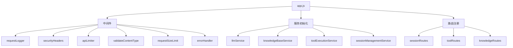
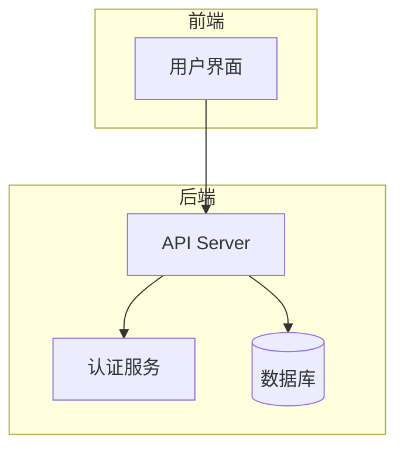
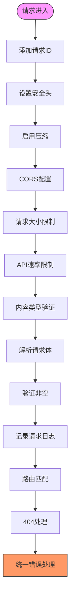
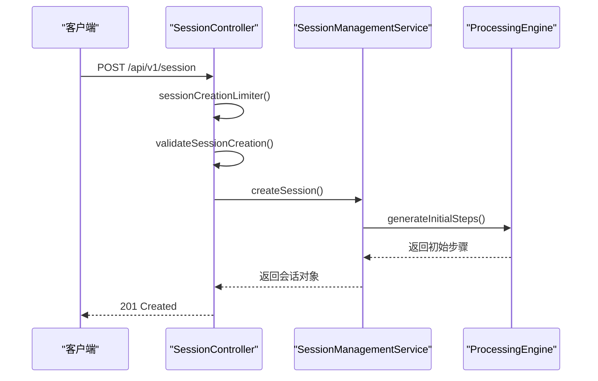
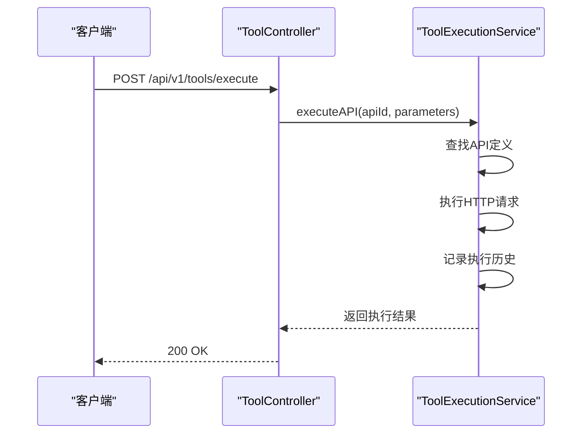
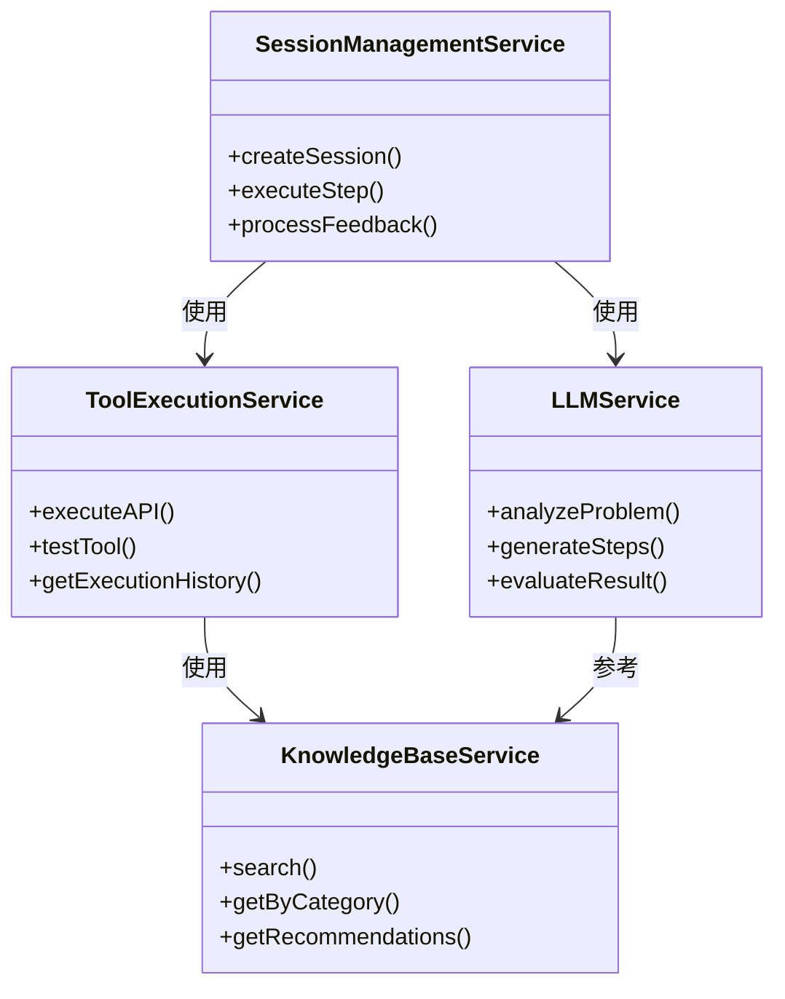

# 后端架构

<cite>
**本文档引用的文件**  
- [app.js](file://backend/src/app.js)
- [index.js](file://backend/src/middleware/index.js)
- [security.js](file://backend/src/middleware/security.js)
- [validation.js](file://backend/src/middleware/validation.js)
- [errorHandler.js](file://backend/src/middleware/errorHandler.js)
- [sessionController.js](file://backend/src/controllers/sessionController.js)
- [toolController.js](file://backend/src/controllers/toolController.js)
- [knowledgeController.js](file://backend/src/controllers/knowledgeController.js)
- [LLMService.js](file://backend/src/services/LLMService.js)
- [KnowledgeBaseService.js](file://backend/src/services/KnowledgeBaseService.js)
- [SessionManagementService.js](file://backend/src/services/SessionManagementService.js)
- [ToolExecutionService.js](file://backend/src/services/ToolExecutionService.js)
</cite>

## 目录
1. [简介](#简介)
2. [项目结构](#项目结构)
3. [核心组件](#核心组件)
4. [架构概览](#架构概览)
5. [详细组件分析](#详细组件分析)
6. [依赖分析](#依赖分析)
7. [性能考虑](#性能考虑)
8. [故障排除指南](#故障排除指南)
9. [结论](#结论)

## 简介
本项目为“智能运维助手”后端系统，基于Node.js与Express框架构建。系统旨在通过自动化手段解决常见的IT运维问题，包括性能监控、网络异常、服务中断等场景。后端采用模块化设计，包含会话管理、知识库检索、工具执行和大模型交互四大核心功能模块。

系统通过RESTful API对外提供服务，前端可通过HTTP请求创建运维处置会话、执行诊断步骤、提交反馈并获取推荐解决方案。整体架构强调安全性、可扩展性和可观测性，集成完整的日志记录、输入验证、速率限制和错误处理机制。

## 项目结构
项目采用分层架构组织代码，主要分为控制器（controllers）、中间件（middleware）、服务（services）和模型（models）四个层级。`app.js`作为应用入口，负责初始化Express实例、加载中间件、注册路由及启动服务。

**Diagram sources**
- [app.js](file://backend/src/app.js#L1-L147)

**Section sources**
- [app.js](file://backend/src/app.js#L1-L147)

## 核心组件
系统由多个协同工作的核心服务构成，各服务通过单例模式暴露全局实例，确保在整个应用生命周期内状态一致。主要服务包括：
- **LLMService**: 大语言模型服务，用于问题分析、步骤生成和结果评估。
- **KnowledgeBaseService**: 知识库服务，支持从本地Markdown文档中加载运维知识并提供语义搜索。
- **SessionManagementService**: 会话管理服务，维护用户处置会话的状态和历史。
- **ToolExecutionService**: 工具执行服务，调用外部API完成具体操作任务。

这些服务在应用启动时按依赖顺序依次初始化，并通过健康检查端点 `/health` 和状态端点 `/status` 提供运行时信息。

**Section sources**
- [app.js](file://backend/src/app.js#L20-L40)
- [LLMService.js](file://backend/src/services/LLMService.js#L9-L366)
- [KnowledgeBaseService.js](file://backend/src/services/KnowledgeBaseService.js#L14-L577)
- [SessionManagementService.js](file://backend/src/services/SessionManagementService.js#L16-L668)
- [ToolExecutionService.js](file://backend/src/services/ToolExecutionService.js#L598-L620)

## 架构概览
整个后端系统采用典型的MVC+Service架构模式，Express作为Web服务器处理HTTP请求，控制器接收请求并调用相应服务完成业务逻辑，服务层封装核心功能并与数据源或外部系统交互。

**Diagram sources**
- [app.js](file://backend/src/app.js#L1-L147)

## 详细组件分析

### Express初始化与中间件链
`app.js`中定义了完整的中间件加载顺序，该顺序直接影响请求处理流程的安全性与效率。

#### 中间件职责分工

**Diagram sources**
- [app.js](file://backend/src/app.js#L50-L100)
- [security.js](file://backend/src/middleware/security.js#L1-L199)
- [validation.js](file://backend/src/middleware/validation.js#L1-L288)
- [errorHandler.js](file://backend/src/middleware/errorHandler.js#L1-L169)

**Section sources**
- [app.js](file://backend/src/app.js#L50-L100)
- [security.js](file://backend/src/middleware/security.js#L1-L199)
- [validation.js](file://backend/src/middleware/validation.js#L1-L288)
- [errorHandler.js](file://backend/src/middleware/errorHandler.js#L1-L169)

### 路由注册与控制器调用链
系统通过模块化方式注册API路由，所有接口均以 `/api/v1/` 为前缀，遵循RESTful设计规范。

#### 会话模块调用链

**Diagram sources**
- [sessionController.js](file://backend/src/controllers/sessionController.js#L1-L241)
- [SessionManagementService.js](file://backend/src/services/SessionManagementService.js#L16-L668)

**Section sources**
- [sessionController.js](file://backend/src/controllers/sessionController.js#L1-L241)

#### 工具执行模块调用链

**Diagram sources**
- [toolController.js](file://backend/src/controllers/toolController.js#L1-L149)
- [ToolExecutionService.js](file://backend/src/services/ToolExecutionService.js#L598-L620)

**Section sources**
- [toolController.js](file://backend/src/controllers/toolController.js#L1-L149)

### RESTful API设计规范体现
各模块严格遵循RESTful原则设计资源路径与HTTP方法语义：

| 模块 | 资源 | 方法 | 描述 |
|------|------|------|------|
| session | `/api/v1/session` | POST | 创建新会话 |
| session | `/api/v1/session/:id` | GET | 获取会话详情 |
| session | `/api/v1/session/:id/step` | POST | 执行处置步骤 |
| knowledge | `/api/v1/knowledge/search` | GET | 搜索知识条目 |
| tool | `/api/v1/tools/execute` | POST | 执行自动化工具 |

**Section sources**
- [sessionController.js](file://backend/src/controllers/sessionController.js#L1-L241)
- [knowledgeController.js](file://backend/src/controllers/knowledgeController.js#L1-L166)
- [toolController.js](file://backend/src/controllers/toolController.js#L1-L149)

## 依赖分析
系统内部组件之间存在明确的依赖关系，形成清晰的服务调用链。

**Diagram sources**
- [app.js](file://backend/src/app.js#L20-L40)
- [SessionManagementService.js](file://backend/src/services/SessionManagementService.js#L16-L668)
- [ToolExecutionService.js](file://backend/src/services/ToolExecutionService.js#L598-L620)
- [LLMService.js](file://backend/src/services/LLMService.js#L9-L366)
- [KnowledgeBaseService.js](file://backend/src/services/KnowledgeBaseService.js#L14-L577)

**Section sources**
- [app.js](file://backend/src/app.js#L20-L40)

## 性能考虑
系统在设计上充分考虑了性能优化，主要体现在以下几个方面：
- **响应缓存**：LLMService内置响应缓存机制，避免重复请求相同内容。
- **异步处理**：所有I/O操作均使用async/await实现非阻塞调用。
- **自动保存**：会话数据定时持久化，平衡内存使用与数据安全。
- **连接复用**：工具执行服务使用axios实例复用HTTP连接。

此外，通过compression中间件启用Gzip压缩，减少网络传输体积；通过rate-limiting防止恶意高频请求影响系统稳定性。

## 故障排除指南
当系统出现异常时，可依据以下步骤进行排查：

1. **检查服务健康状态**：访问 `/health` 端点确认各服务初始化状态。
2. **查看日志输出**：检查控制台日志中的错误堆栈与上下文信息。
3. **验证中间件行为**：确认CORS、速率限制、内容类型验证是否阻止合法请求。
4. **测试服务独立功能**：直接调用各服务的getStatus()方法检查其内部状态。

常见错误码含义如下：
- `400`: 请求参数验证失败
- `404`: 资源未找到
- `413`: 请求