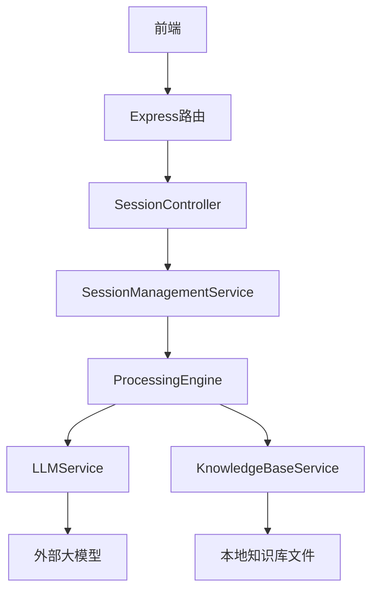
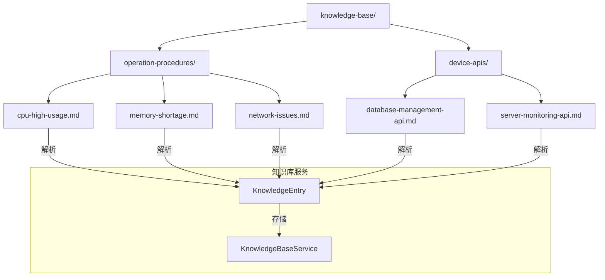
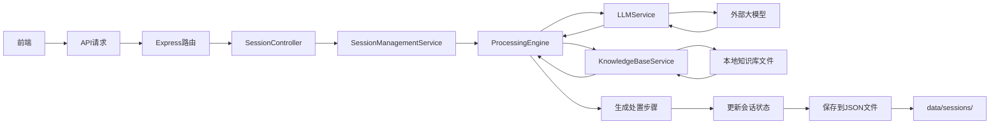

# 数据流与系统集成

<cite>
**本文档引用的文件**
- [api.ts](file://frontend/src/utils/api.ts)
- [sessionController.js](file://backend/src/controllers/sessionController.js)
- [knowledgeController.js](file://backend/src/controllers/knowledgeController.js)
- [LLMService.js](file://backend/src/services/LLMService.js)
- [KnowledgeBaseService.js](file://backend/src/services/KnowledgeBaseService.js)
- [SessionManagementService.js](file://backend/src/services/SessionManagementService.js)
- [ProcessingEngine.js](file://backend/src/services/ProcessingEngine.js)
- [Session.js](file://backend/src/models/Session.js)
- [KnowledgeEntry.js](file://backend/src/models/KnowledgeEntry.js)
</cite>

## 目录
1. [引言](#引言)
2. [前端数据流触发机制](#前端数据流触发机制)
3. [后端路由与控制器处理](#后端路由与控制器处理)
4. [服务层业务处理流程](#服务层业务处理流程)
5. [大模型服务交互机制](#大模型服务交互机制)
6. [知识库服务与本地文件读取](#知识库服务与本地文件读取)
7. [端到端数据流全景图](#端到端数据流全景图)
8. [关键集成机制](#关键集成机制)
9. [结论](#结论)

## 引言
本文档旨在全面描述智能运维助手系统的数据流动路径与外部集成机制。系统采用前后端分离架构，用户通过前端界面发起操作，触发HTTP请求经由Express路由到达后端控制器，再调用服务层完成核心业务处理。重点分析LLMService如何与外部大语言模型进行交互，以及KnowledgeBaseService如何读取和解析本地知识库文件。文档将详细阐述从前端到数据库的完整闭环数据流，并讨论异步处理、超时重试、缓存策略等关键集成机制。

## 前端数据流触发机制

前端通过`api.ts`中的ApiClient类封装所有API请求，使用Axios作为HTTP客户端。当用户在界面上执行操作（如创建会话、搜索知识）时，相应的React组件会调用ApiClient实例的方法，这些方法会构造符合后端要求的HTTP请求并发送。

ApiClient实现了请求和响应拦截器：请求拦截器自动添加认证令牌，响应拦截器统一处理错误状态码并显示相应的提示信息。所有请求都配置了30秒的超时时间，确保在后端无响应时能及时失败。

**Section sources**
- [api.ts](file://frontend/src/utils/api.ts#L1-L242)

## 后端路由与控制器处理

后端使用Express框架定义RESTful API路由。`sessionController.js`和`knowledgeController.js`分别处理会话管理和知识库相关的请求。路由中间件负责验证输入参数、限制请求频率，并将请求转发给对应的服务层。

例如，创建新会话的POST请求`/api/v1/session`会经过`sessionCreationLimiter`和`validateSessionCreation`两个中间件，然后由`sessionManagementService.createSession`方法处理。控制器层仅负责请求转发和响应包装，不包含业务逻辑。

**Section sources**
- [sessionController.js](file://backend/src/controllers/sessionController.js#L1-L242)
- [knowledgeController.js](file://backend/src/controllers/knowledgeController.js#L1-L167)

## 服务层业务处理流程

服务层是业务逻辑的核心，各服务之间存在明确的依赖关系。`SessionManagementService`管理会话的生命周期，包括创建、查询、更新和删除。它依赖于`ProcessingEngine`来执行具体的处置逻辑。

`ProcessingEngine`是核心处置引擎，协调`LLMService`和`KnowledgeBaseService`完成问题分析、步骤生成和结果评估。当创建新会话时，`ProcessingEngine`首先调用`LLMService.analyzeProblem`分析问题，然后使用`KnowledgeBaseService.search`查找相关知识，最后生成初始处置方案。



**Diagram sources**
- [sessionController.js](file://backend/src/controllers/sessionController.js#L1-L242)
- [SessionManagementService.js](file://backend/src/services/SessionManagementService.js#L1-L674)
- [ProcessingEngine.js](file://backend/src/services/ProcessingEngine.js#L1-L638)

**Section sources**
- [SessionManagementService.js](file://backend/src/services/SessionManagementService.js#L1-L674)
- [ProcessingEngine.js](file://backend/src/services/ProcessingEngine.js#L1-L638)

## 大模型服务交互机制

`LLMService`封装了与外部大语言模型的交互细节。它通过`LLMProviderFactory`根据配置创建具体的提供商实例（如Ollama、OpenAI）。服务提供了`chat`、`analyzeProblem`、`generateSteps`和`evaluateResult`等高层接口，屏蔽了底层通信的复杂性。

每次请求都会先检查初始化状态，然后生成缓存键尝试从内存缓存中获取结果。如果缓存未命中，则通过`executeWithRetry`方法执行带重试的请求，支持指数退避和最大重试次数配置。成功响应会被保存到LRU缓存中，避免重复请求相同内容。

```mermaid
sequenceDiagram
participant Frontend as 前端
participant LLMService as LLMService
participant Provider as LLMProvider
participant Model as 外部大模型
Frontend->>LLMService : analyzeProblem()
LLMService->>LLMService : generateCacheKey()
LLMService->>LLMService : getFromCache()
alt 缓存命中
LLMService-->>Frontend : 返回缓存结果
else 缓存未命中
loop 最多重试3次
LLMService->>Provider : chat()
Provider->>Model : HTTP请求
Model-->>Provider : 响应
Provider-->>LLMService : 返回响应
break 成功
end
LLMService->>LLMService : saveToCache()
LLMService-->>Frontend : 返回新结果
end
```

**Diagram sources**
- [LLMService.js](file://backend/src/services/LLMService.js#L1-L366)

**Section sources**
- [LLMService.js](file://backend/src/services/LLMService.js#L1-L366)

## 知识库服务与本地文件读取

`KnowledgeBaseService`负责加载和管理本地知识库文件。在初始化时，它会从`knowledge-base`目录下加载两类文档：运维处置知识库（位于`operation-procedures`子目录）和设备操作API知识库（位于`device-apis`子目录）。

对于Markdown格式的文档，服务会解析标题、元数据注释和内容，并提取关键词。对于API Blueprint格式的`.apib`文件，它会按章节分割并提取HTTP方法、路径和描述。每个文档被转换为`KnowledgeEntry`对象，存储在内存Map中，并建立分类和关键词索引。

知识库支持全文搜索，通过计算标题、关键词和内容的匹配分数来排序结果。搜索结果会记录使用次数，并可基于用户反馈更新有效性评分，实现知识条目的持续优化。



**Diagram sources**
- [KnowledgeBaseService.js](file://backend/src/services/KnowledgeBaseService.js#L1-L583)
- [KnowledgeEntry.js](file://backend/src/models/KnowledgeEntry.js#L1-L251)

**Section sources**
- [KnowledgeBaseService.js](file://backend/src/services/KnowledgeBaseService.js#L1-L583)
- [database-management-api.md](file://knowledge-base/device-apis/database-management-api.md)

## 端到端数据流全景图

完整的端到端数据流始于用户在前端的操作，终于数据持久化到本地文件系统。整个流程形成一个闭环，涵盖了前端、后端、外部大模型、本地知识库和会话数据存储。



该流程展示了用户创建会话后的完整处理路径：前端发起请求，后端控制器接收并转发给会话管理服务，核心处置引擎协调大模型分析和知识库检索，最终生成的会话数据以JSON格式持久化存储在`data/sessions/`目录下。

**Diagram sources**
- [api.ts](file://frontend/src/utils/api.ts#L1-L242)
- [sessionController.js](file://backend/src/controllers/sessionController.js#L1-L242)
- [SessionManagementService.js](file://backend/src/services/SessionManagementService.js#L1-L674)
- [ProcessingEngine.js](file://backend/src/services/ProcessingEngine.js#L1-L638)
- [LLMService.js](file://backend/src/services/LLMService.js#L1-L366)
- [KnowledgeBaseService.js](file://backend/src/services/KnowledgeBaseService.js#L1-L583)

## 关键集成机制

### 异步处理
系统广泛使用异步编程模式。所有服务方法都返回Promise，允许非阻塞执行。事件循环可以同时处理多个会话的请求，而不会因单个长时间运行的操作而阻塞。

### 超时重试
`LLMService`实现了健壮的重试机制。`executeWithRetry`方法支持配置最大重试次数、基础延迟时间和退避因子。每次失败后，延迟时间会指数增长，避免对不稳定的服务造成过大压力。

### 缓存策略
`LLMService`使用内存Map实现响应缓存。缓存键由消息、模型、温度和最大token数等参数决定。缓存条目有过期时间（TTL），并且整体大小受限制，超过上限时会删除最旧的条目，防止内存无限增长。

### 错误处理
系统实现了分层错误处理。前端通过响应拦截器统一处理HTTP错误并显示Toast通知。后端使用中间件捕获未处理的异常，记录错误日志并返回适当的HTTP状态码。服务层方法通常会捕获特定异常并转换为更有意义的错误信息。

**Section sources**
