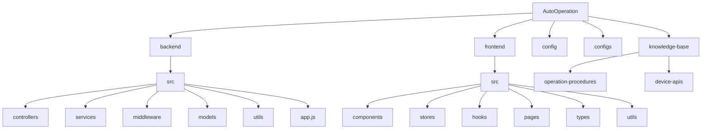
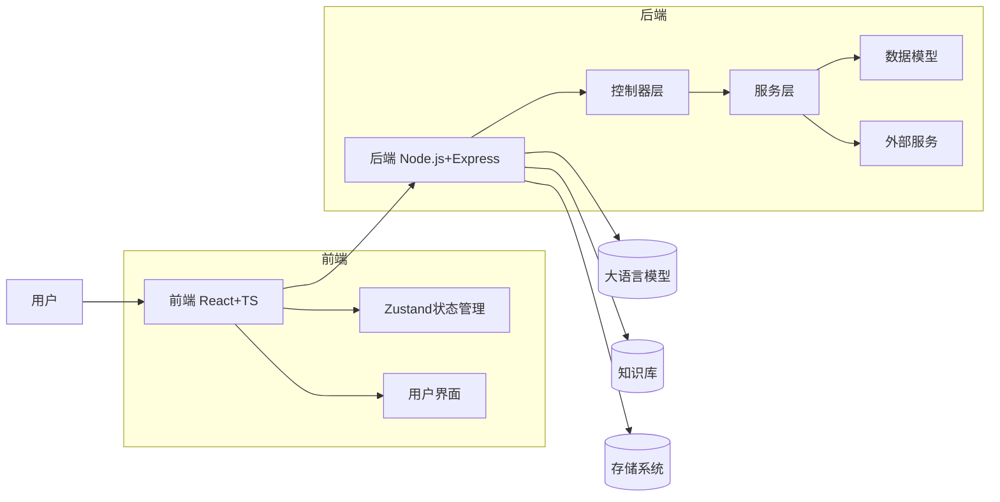

# 架构设计

<cite>
**本文档引用的文件**
- [app.js](file://backend/src/app.js)
- [sessionController.js](file://backend/src/controllers/sessionController.js)
- [SessionManagementService.js](file://backend/src/services/SessionManagementService.js)
- [ProcessingEngine.js](file://backend/src/services/ProcessingEngine.js)
- [LLMService.js](file://backend/src/services/LLMService.js)
- [LLMConfigManager.js](file://backend/src/services/LLMConfigManager.js)
- [KnowledgeBaseService.js](file://backend/src/services/KnowledgeBaseService.js)
- [middleware/index.js](file://backend/src/middleware/index.js)
- [default.json](file://config/default.json)
- [development.json](file://config/development.json)
- [production.json](file://config/production.json)
- [llm-config.json](file://configs/llm-config.json)
- [app-config.json](file://configs/app-config.json)
</cite>

## 目录
1. [简介](#简介)
2. [项目结构](#项目结构)
3. [核心组件](#核心组件)
4. [架构概览](#架构概览)
5. [详细组件分析](#详细组件分析)
6. [依赖分析](#依赖分析)
7. [性能考量](#性能考量)
8. [故障排除指南](#故障排除指南)
9. [结论](#结论)

## 简介
智能运维助手是一个基于大语言模型的智能化运维处置系统，采用现代化的技术栈实现了前后端分离的微服务架构。该系统通过人机协作的方式提供渐进式的问题处置流程，支持从问题分析到自动化执行的完整工作流。前端使用React + TypeScript构建响应式用户界面，后端采用Node.js + Express框架实现RESTful API服务，整体架构设计注重可扩展性、安全性和企业级就绪。

## 项目结构
本项目采用清晰的分层目录结构，将前后端代码、配置文件和知识库资源进行有效隔离和组织。



**图示来源**
- [README.md](file://README.md)

**本节来源**
- [README.md](file://README.md)
- [PROJECT_SUMMARY.md](file://PROJECT_SUMMARY.md)

## 核心组件
系统由多个核心组件构成，包括会话管理服务、大模型服务、知识库服务、处理引擎等。这些组件协同工作，共同完成从问题输入到解决方案生成再到执行反馈的完整闭环。前端通过Zustand状态管理库维护全局状态，后端通过Express路由和中间件体系处理API请求，各组件之间通过明确定义的接口进行通信。

**本节来源**
- [README.md](file://README.md)
- [PROJECT_SUMMARY.md](file://PROJECT_SUMMARY.md)

## 架构概览
系统采用典型的前后端分离架构，前端负责用户交互和界面展示，后端提供RESTful API服务支撑业务逻辑。整个系统围绕大语言模型（LLM）构建智能决策能力，结合知识库驱动的专家系统，形成强大的运维问题处置能力。



**图示来源**
- [README.md](file://README.md)
- [PROJECT_SUMMARY.md](file://PROJECT_SUMMARY.md)

**本节来源**
- [README.md](file://README.md)
- [PROJECT_SUMMARY.md](file://PROJECT_SUMMARY.md)

## 详细组件分析

### 前后端分离设计模式
系统采用前后端完全分离的设计模式，前端基于React 18 + TypeScript技术栈，使用Vite作为构建工具，具备快速热更新和高效打包的能力。状态管理采用轻量级的Zustand库，相比Redux更加简洁易用。后端采用Node.js + Express框架，提供标准化的RESTful API接口，两者通过HTTP协议进行通信，实现了关注点分离和独立部署。

#### 前端状态管理
```mermaid
classDiagram
    class sessionStore {
        +sessionId: string
        +currentStep: Step
        +steps: Step[]
        +createSession(problem: Problem): Promise~Session~
        +executeStep(stepId: string, type: 'auto'|'manual'): Promise~StepResult~
        +submitFeedback(feedback: string): Promise~PlanUpdate~
    }
    
    class dataStore {
        +sessions: Session[]
        +knowledge: KnowledgeEntry[]
        +fetchSessions(): Promise~void~
        +searchKnowledge(query: string): Promise~KnowledgeSearchResult~
    }
    
    class uiStore {
        +isLoading: boolean
        +