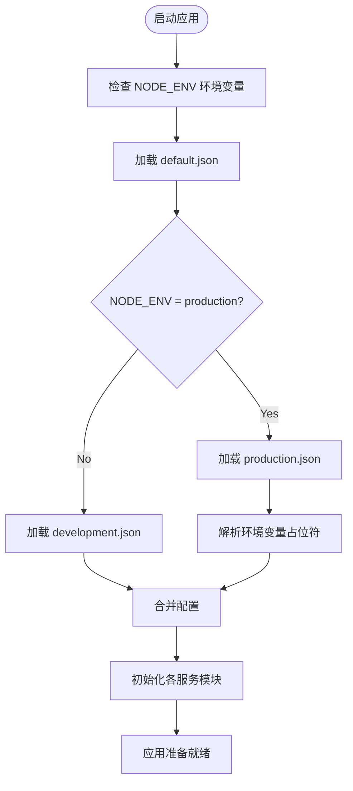
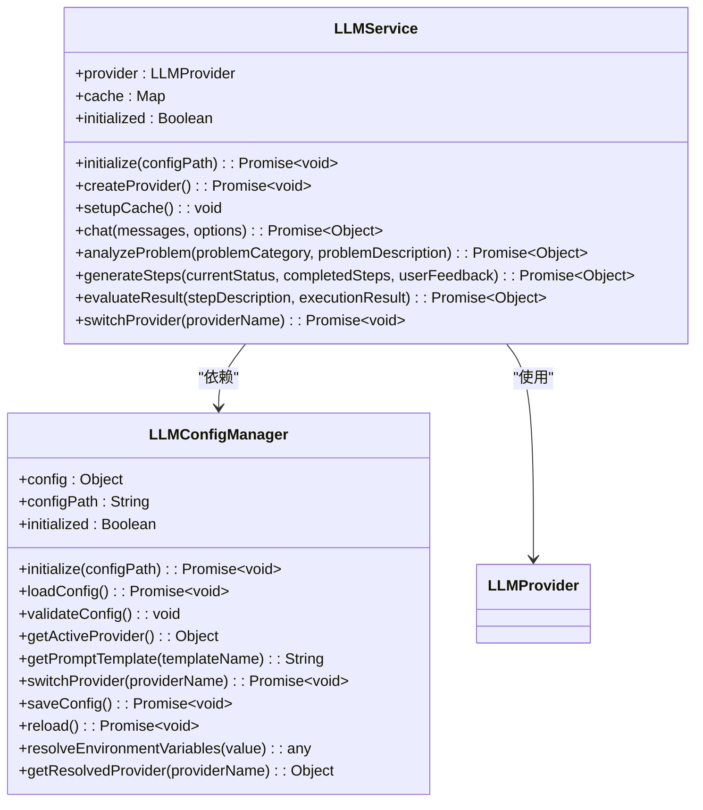

# 配置管理

<cite>
**本文档引用的文件**
- [default.json](file://config/default.json)
- [development.json](file://config/development.json)
- [production.json](file://config/production.json)
- [app-config.json](file://configs/app-config.json)
- [llm-config.json](file://configs/llm-config.json)
- [LLMConfigManager.js](file://backend/src/services/LLMConfigManager.js)
- [LLMService.js](file://backend/src/services/LLMService.js)
- [app.js](file://backend/src/app.js)
</cite>

## 目录
1. [多环境配置方案](#多环境配置方案)
2. [配置加载优先级与动态合并机制](#配置加载优先级与动态合并机制)
3. [应用级参数管理](#应用级参数管理)
4. [大模型服务集中控制](#大模型服务集中控制)
5. [配置文件与代码分离设计原则](#配置文件与代码分离设计原则)
6. [配置变更影响分析](#配置变更影响分析)

## 多环境配置方案

本系统采用分层配置策略，通过 `config` 目录下的三个核心JSON文件实现多环境适配：

- **default.json**: 定义所有配置项的默认值，作为基础配置模板。包含应用名称、版本、端口、主机地址等基本信息，以及大模型服务提供商（默认为Ollama）、知识库路径、会话存储设置、安全策略和日志级别等通用配置。

- **development.json**: 开发环境专用配置，覆盖 `default.json` 中的部分参数。例如将应用端口调整为3001，启用调试日志级别，关闭文件日志记录以提升开发效率，并扩展CORS允许的源列表以支持多种本地开发场景。

- **production.json**: 生产环境专用配置，使用环境变量占位符 `${}` 实现灵活部署。关键参数如端口、LLM提供商、API密钥、知识库路径、会话存储方式等均从环境变量读取，确保敏感信息不硬编码在配置文件中，同时支持不同生产环境的差异化部署需求。

这种分层结构使得系统能够在不同环境中无缝切换，既保证了配置的一致性，又提供了足够的灵活性来适应各环境的特殊要求。

**Section sources**
- [default.json](file://config/default.json)
- [development.json](file://config/development.json)
- [production.json](file://config/production.json)

## 配置加载优先级与动态合并机制

系统在启动时遵循严格的配置加载优先级顺序：首先加载 `default.json` 作为基础配置，然后根据当前运行环境（由 `NODE_ENV` 环境变量决定）加载对应的 `development.json` 或 `production.json` 文件，后者中的同名配置项会覆盖前者。

对于 `production.json` 中的环境变量占位符（如 `${PORT:3000}`），系统会在运行时解析并替换。冒号后的值表示默认值，当对应环境变量未设置时使用该默认值。这一机制通过 `LLMConfigManager` 类中的 `resolveEnvironmentVariables` 方法实现，确保了配置的动态性和安全性。

配置的动态合并不仅发生在系统启动时，还支持运行时重新加载。`LLMConfigManager` 提供了 `reload()` 方法，允许在不重启服务的情况下更新配置，这对于需要频繁调整大模型参数或切换服务提供商的场景尤为重要。

**Diagram sources**
- [default.json](file://config/default.json)
- [development.json](file://config/development.json)
- [production.json](file://config/production.json)
- [LLMConfigManager.js](file://backend/src/services/LLMConfigManager.js#L280-L295)

## 应用级参数管理

`app-config.json` 文件专门用于管理应用级别的核心参数，包括服务器端口、主机地址、API前缀等网络相关配置。此外，它还定义了跨域资源共享（CORS）策略、请求频率限制规则、日志记录级别及文件轮转策略、会话管理参数（如自动保存间隔、最大内存会话数、会话生存时间）以及工具执行超时和重试机制。

这些参数直接影响系统的性能、安全性和用户体验。例如，通过调整 `rate_limiting` 中的 `max_requests` 值可以控制API调用频率，防止滥用；设置 `logging.level` 可以在不同环境下输出不同详细程度的日志信息，便于问题排查。

虽然 `app-config.json` 在项目中存在，但其具体参数主要被 `app.js` 和中间件系统所使用，而核心服务的初始化更多依赖于 `config` 目录下的环境配置文件。

**Section sources**
- [app-config.json](file://configs/app-config.json)
- [app.js](file://backend/src/app.js)

## 大模型服务集中控制

`llm-config.json` 是系统的核心配置文件之一，负责集中管理所有与大语言模型（LLM）相关的参数。该文件定义了以下关键内容：

- **活跃提供商**: 通过 `active_provider` 字段指定当前使用的模型提供商（如Ollama、OpenAI）。
- **提供商配置**: `providers` 对象包含了每个支持的提供商的详细信息，包括类型（本地/远程）、端点URL、API密钥（使用环境变量）、可用模型及调用参数（温度、最大token数、top_p等）。
- **重试策略**: `retry_config` 定义了请求失败后的重试次数、延迟时间和退避因子，确保在网络不稳定时仍能可靠地调用LLM服务。
- **缓存策略**: `cache_config` 启用响应缓存，提高重复查询的性能。
- **提示模板**: `prompt_templates` 存储了用于问题分析、步骤生成和结果评估的标准提示词模板，确保与LLM交互的一致性和有效性。

`LLMConfigManager` 类负责加载、验证和管理此配置文件。它提供了诸如 `getActiveProvider()`、`getPromptTemplate()`、`switchProvider()` 等方法，使其他服务能够方便地获取所需配置。`LLMService` 在初始化时会调用 `LLMConfigManager` 来获取解析后的提供商配置，并据此创建相应的 `LLMProvider` 实例。

**Diagram sources**
- [llm-config.json](file://configs/llm-config.json)
- [LLMConfigManager.js](file://backend/src/services/LLMConfigManager.js)
- [LLMService.js](file://backend/src/services/LLMService.js)

## 配置文件与代码分离设计原则

本系统严格遵循配置与代码分离的设计原则，将所有可变的、环境相关的参数从源代码中剥离，集中存储在独立的JSON配置文件中。这一设计带来了显著优势：

1. **提升部署灵活性**: 无需修改代码即可通过更改配置文件或环境变量来适应不同部署环境（开发、测试、生产）。
2. **增强安全性**: 敏感信息（如API密钥）不会出现在代码仓库中，而是通过环境变量注入，降低了泄露风险。
3. **简化维护**: 配置变更无需重新编译或构建应用，只需更新配置文件并重启服务（或动态重载）。
4. **促进团队协作**: 开发人员可以专注于业务逻辑，运维人员则负责配置管理，职责分明。

`LLMConfigManager` 作为配置管理的中心枢纽，封装了所有与配置文件交互的复杂性，向其他服务提供简洁的接口。这不仅实现了关注点分离，也使得配置管理逻辑易于测试和维护。

**Section sources**
- [default.json](file://config/default.json)
- [production.json](file://config/production.json)
- [llm-config.json](file://configs/llm-config.json)
- [LLMConfigManager.js](file://backend/src/services/LLMConfigManager.js)

## 配置变更影响分析

### 切换LLM供应商的服务适配流程

当需要从一个LLM供应商（如Ollama）切换到另一个（如OpenAI）时，系统通过以下流程实现平滑过渡：

1. **配置更新**: 修改 `llm-config.json` 文件，将 `active_provider` 从 `"ollama"` 改为 `"openai"`，并确保 `providers.openai.api_key` 的环境变量已正确设置。
2. **服务重启或动态重载**: 如果是重启，`app.js` 在初始化 `LLMService` 时会触发 `LLMConfigManager` 重新加载配置；如果是动态重载，则调用 `LLMService` 的 `switchProvider()` 方法。
3. **提供商实例重建**: `LLMService` 调用 `LLMConfigManager.getResolvedProvider()` 获取新的提供商配置，然后通过 `LLMProviderFactory.createProvider()` 创建对应的 `OpenAIProvider` 实例。
4. **缓存清理**: 切换后，`LLMService` 会清除内部的响应缓存，因为新提供商的响应可能与旧的不同。
5. **后续请求路由**: 所有新的LLM调用请求都将通过 `OpenAIProvider` 发送到OpenAI的API端点。

此流程确保了服务的连续性，避免了因硬编码导致的供应商锁定问题，体现了系统良好的可扩展性和适应性。

**Section sources**
- [llm-config.json](file://configs/llm-config.json)
- [LLMConfigManager.js](file://backend/src/services/LLMConfigManager.js#L230-L250)
- [LLMService.js](file://backend/src/services/LLMService.js#L330-L340)
- [LLMProvider.js](file://backend/src/services/LLMProvider.js#L313-L329)