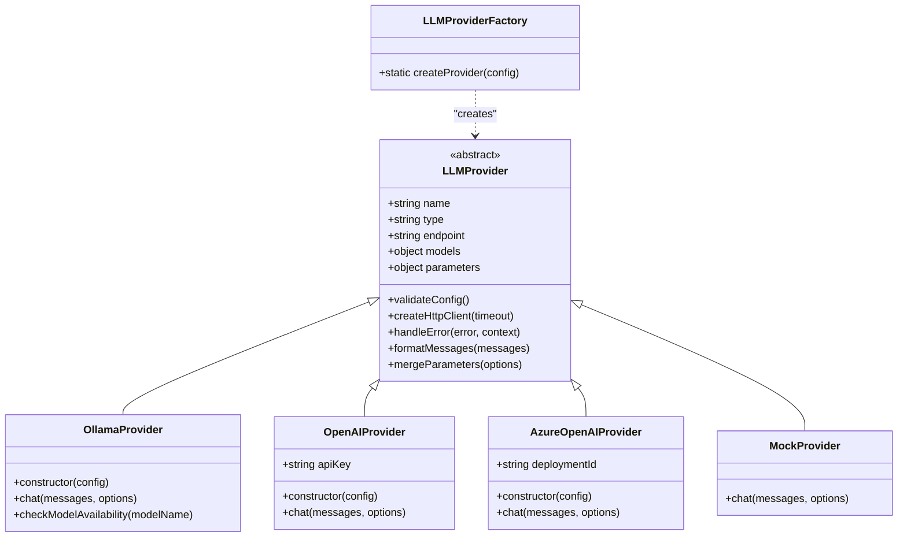
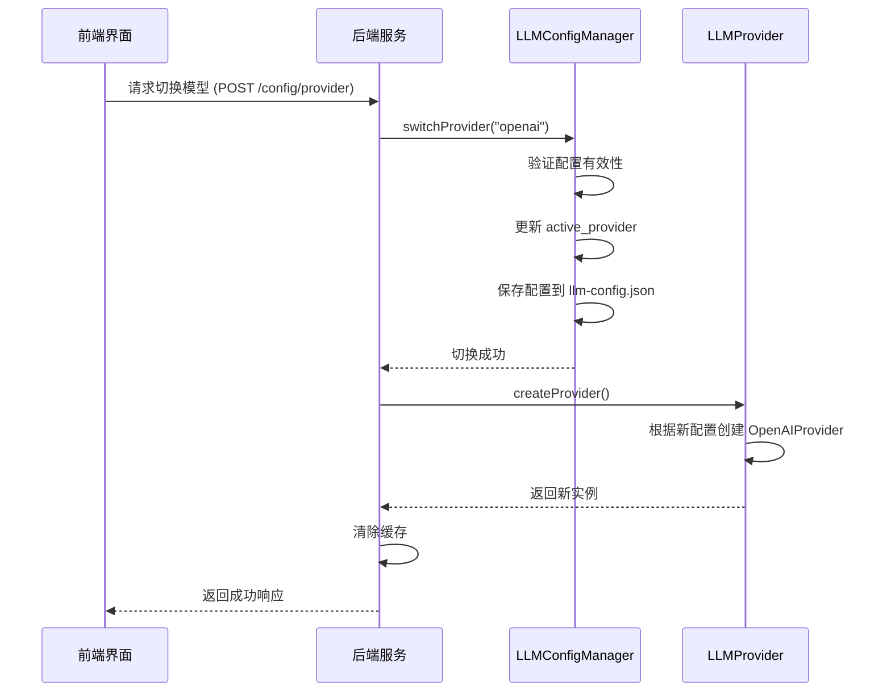

# 工具集成

<cite>
**本文档引用文件**  
- [LLMProvider.js](file://backend/src/services/LLMProvider.js)
- [LLMConfigManager.js](file://backend/src/services/LLMConfigManager.js)
- [llm-config.json](file://configs/llm-config.json)
- [useSession.ts](file://frontend/src/hooks/useSession.ts)
- [validation.js](file://backend/src/middleware/validation.js)
- [toolController.js](file://backend/src/controllers/toolController.js)
</cite>

## 目录
1. [引言](#引言)
2. [大模型服务适配架构](#大模型服务适配架构)
3. [配置驱动的模型切换机制](#配置驱动的模型切换机制)
4. [前端会话交互封装](#前端会话交互封装)
5. [输入验证与安全防护](#输入验证与安全防护)
6. [自定义工具接入流程](#自定义工具接入流程)
7. [插件化扩展能力](#插件化扩展能力)
8. [总结](#总结)

## 引言
本系统设计了一套完整的工具集成架构，支持灵活的大模型服务适配、安全的API调用控制和可扩展的工具管理机制。通过标准化接口抽象、配置化管理、前后端协同封装和多层次验证体系，实现了智能化运维助手的核心功能。

## 大模型服务适配架构

系统采用面向对象的继承结构实现对不同大模型服务的统一适配。核心基类 `LLMProvider` 定义了所有模型提供商必须实现的接口规范，包括聊天请求、配置验证、HTTP客户端创建等通用方法。

具体服务商如 `OpenAIProvider` 和 `OllamaProvider` 继承自基类，并根据各自API特性实现具体的通信协议。例如，`OpenAIProvider` 在构造函数中校验API密钥，在 `chat` 方法中设置Bearer认证头；而 `OllamaProvider` 则适配其流式响应格式并解析token统计信息。

工厂模式 `LLMProviderFactory` 负责根据配置动态创建对应的提供商实例，屏蔽了底层差异，使上层服务无需关心具体实现细节。



**图示来源**
- [LLMProvider.js](file://backend/src/services/LLMProvider.js#L8-L97)
- [LLMProvider.js](file://backend/src/services/LLMProvider.js#L102-L183)
- [LLMProvider.js](file://backend/src/services/LLMProvider.js#L188-L243)
- [LLMProvider.js](file://backend/src/services/LLMProvider.js#L383-L402)

**本节来源**
- [LLMProvider.js](file://backend/src/services/LLMProvider.js#L8-L402)

## 配置驱动的模型切换机制

系统通过 `llm-config.json` 配置文件实现大模型服务的灵活切换。该文件采用JSON格式定义多个提供商的详细参数，包括端点地址、模型名称、调用参数、启用状态等。

`LLMConfigManager` 服务负责加载和管理此配置文件。它提供了初始化、重新加载、保存配置等功能，并能自动替换环境变量占位符（如 `${OPENAI_API_KEY}`）。通过 `switchProvider(providerName)` 方法可动态切换活跃的模型提供商，系统将自动重建相应的 `LLMProvider` 实例并清除缓存。

当前配置支持本地运行的Ollama、远程的OpenAI以及Azure OpenAI等多种服务类型，便于在开发测试与生产环境间无缝迁移。



**图示来源**
- [LLMConfigManager.js](file://backend/src/services/LLMConfigManager.js#L13-L314)
- [llm-config.json](file://configs/llm-config.json)

**本节来源**
- [LLMConfigManager.js](file://backend/src/services/LLMConfigManager.js#L13-L314)
- [llm-config.json](file://configs/llm-config.json)

## 前端会话交互封装

前端通过 `useSession` 自定义Hook封装了与后端会话API的交互逻辑。该Hook基于React的 `useCallback` 和 `useEffect` 实现，提供了一组简洁易用的操作方法。

Hook内部整合了状态管理（`sessionStore`）和UI反馈（`uiStore`），并在调用API前后自动处理加载状态和错误提示。所有网络请求通过统一的 `apiClient` 发起，该客户端包含请求拦截器（添加认证头）和响应拦截器（全局错误处理）。

关键操作如创建会话、执行步骤、提交反馈等均被封装为独立函数，并使用TypeScript严格定义参数类型，确保类型安全。同时实现了会话状态的自动轮询刷新机制，保证用户界面实时同步最新进展。

```mermaid
flowchart TD
A[useSession Hook] --> B[状态管理]
A --> C[API调用封装]
A --> D[副作用处理]
B --> B1[当前会话 currentSession]
B --> B2[加载状态 isSessionLoading]
B --> B3[错误信息 sessionError]
C --> C1[createSession]
C --> C2[loadSession]
C --> C3[executeStep]
C --> C4[provideFeedback]
C --> C5[completeSession]
D --> D1[自动刷新状态]
D --> D2[异常捕获与提示]
D --> D3[全局加载指示]
C1 --> E[apiClient.createSession]
C3 --> F[apiClient.executeStep]
E --> G[后端/session API]
F --> H[后端/session/{id}/step API]
```

**图示来源**
- [useSession.ts](file://frontend/src/hooks/useSession.ts)
- [api.ts](file://frontend/src/utils/api.ts)

**本节来源**
- [useSession.ts](file://frontend/src/hooks/useSession.ts#L1-L175)
- [api.ts](file://frontend/src/utils/api.ts#L1-L241)

## 输入验证与安全防护

系统通过中间件 `validation.js` 实现全面的输入合法性检查，防止恶意payload传递至底层工具。该中间件提供了一系列细粒度的验证函数：

- `validateRequired`: 检查必需字段是否存在
- `validateTypes`: 验证数据类型匹配
- `validateLength`: 限制字符串长度范围
- `validateEnum`: 确保值属于允许的枚举集合
- `validateUUID`: 格式化校验UUID参数

这些验证规则被应用于各个关键API端点。例如，创建会话时强制要求问题描述不少于10个字符且分类必须是预定义值之一；执行步骤时需验证执行类型是否为"auto"或"manual"；提交反馈时限制内容长度不超过2000字符。

此外还包含 `validateNotEmpty` 和 `validateContentType` 等通用保护措施，确保请求体非空且内容类型正确，形成多层防御体系。

```mermaid
flowchart LR
    A[客户端请求] --> B{验证中间件}
    B --> C[检查Content-Type]
    B --> D[检查请求体非空]
    B --> E[字段必填性验证]
    B --> F[数据类型验证]
    B --> G[长度范围验证]
    B --> H[枚举值验证]
    B --> I[参数格式验证]
    
    C --> J{符合application/json?}
    D --> K{请求体存在且非空?}
    E --> L{必需字段齐全?}
    F --> M{类型匹配schema?}
    G --> N{长度在限定内?}
    H --> O{值在允许列表中?}
    I --> P{如UUID格式正确?}
    
    J -->|否| Q[返回400错误]
    K -->|否| Q
    L -->|否| Q
    M -->|否| Q
    N -->|否| Q
    O -->|否| Q
    P -->|否| Q
    
    J -->|是