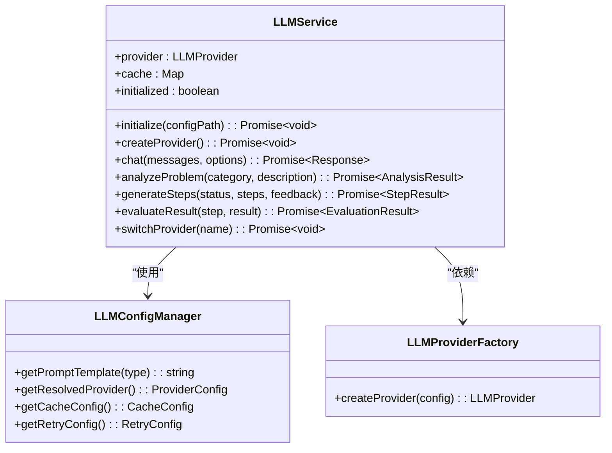
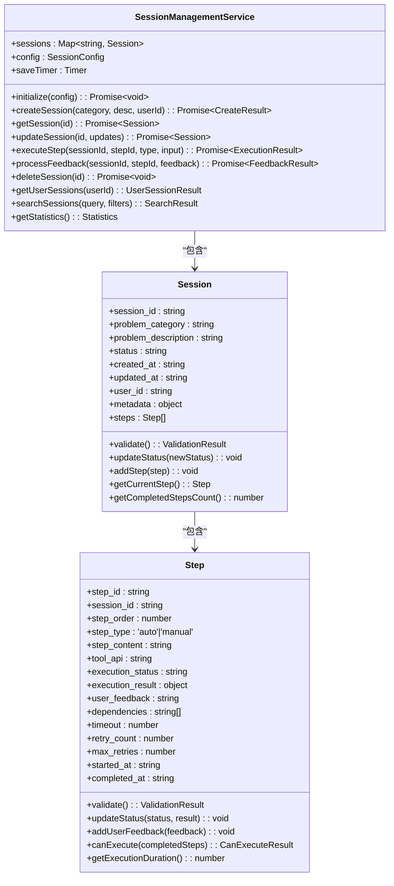
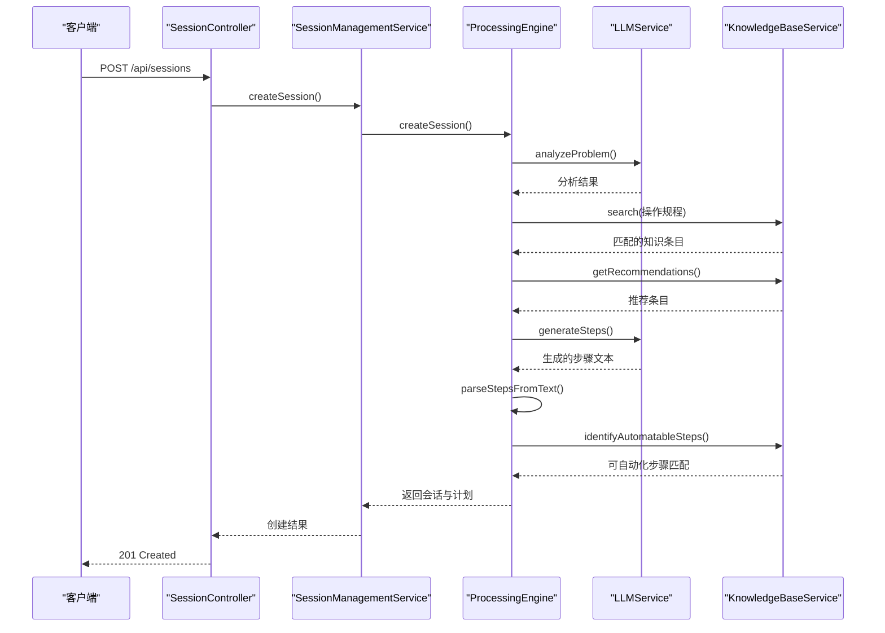

# 智能问题诊断

<cite>
**本文档引用文件**   
- [LLMService.js](file://backend/src/services/LLMService.js)
- [SessionManagementService.js](file://backend/src/services/SessionManagementService.js)
- [ProcessingEngine.js](file://backend/src/services/ProcessingEngine.js)
- [KnowledgeBaseService.js](file://backend/src/services/KnowledgeBaseService.js)
- [sessionController.js](file://backend/src/controllers/sessionController.js)
- [llm-config.json](file://configs/llm-config.json)
- [cpu-high-usage.md](file://knowledge-base/operation-procedures/cpu-high-usage.md)
</cite>

## 目录
1. [功能概述](#功能概述)
2. [核心组件分析](#核心组件分析)
3. [请求处理流程](#请求处理流程)
4. [系统架构与集成](#系统架构与集成)
5. [常见诊断失败场景及解决方案](#常见诊断失败场景及解决方案)
6. [优化建议](#优化建议)

## 功能概述
智能问题诊断功能通过大语言模型（LLM）对用户输入的运维问题进行语义理解与根因分析。系统结合会话上下文和知识库中的操作规程，生成初步诊断结论，并通过会话管理服务维护诊断状态。该功能支持从问题识别、步骤生成到结果评估的完整处置流程。

**Section sources**
- [LLMService.js](file://backend/src/services/LLMService.js#L9-L366)
- [ProcessingEngine.js](file://backend/src/services/ProcessingEngine.js#L12-L634)

## 核心组件分析

### LLM服务模块
LLMService 是核心的大模型交互服务，负责初始化模型提供商、执行带重试机制的请求、响应缓存管理以及具体的运维问题分析任务。其 `analyzeProblem` 方法接收问题分类和描述，构造提示词并调用大模型进行分析。

**Diagram sources**
- [LLMService.js](file://backend/src/services/LLMService.js#L9-L366)
- [llm-config.json](file://configs/llm-config.json#L1-L54)

**Section sources**
- [LLMService.js](file://backend/src/services/LLMService.js#L9-L366)

### 会话管理服务
SessionManagementService 负责会话的全生命周期管理，包括创建、存储、更新和删除。它将内存存储与文件持久化相结合，确保会话数据在系统重启后仍可恢复，并通过定时器实现自动保存和过期清理。

**Diagram sources**
- [SessionManagementService.js](file://backend/src/services/SessionManagementService.js#L16-L668)
- [Session.js](file://backend/src/models/Session.js#L7-L119)
- [Step.js](file://backend/src/models/Step.js#L7-L200)

**Section sources**
- [SessionManagementService.js](file://backend/src/services/SessionManagementService.js#L16-L668)

### 处置引擎
ProcessingEngine 是业务逻辑的核心协调者，它串联 LLM 服务、知识库服务和会话管理服务，完成从问题分析到步骤生成的全过程。其 `analyzeProblemAndCreatePlan` 方法实现了多源信息融合的决策流程。

**Diagram sources**
- [ProcessingEngine.js](file://backend/src/services/ProcessingEngine.js#L12-L634)
- [sessionController.js](file://backend/src/controllers/sessionController.js#L1-L242)

**Section sources**
- [ProcessingEngine.js](file://backend/src/services/ProcessingEngine.js#L12-L634)

## 请求处理流程

### 输入预处理与会话创建
当用户提交“