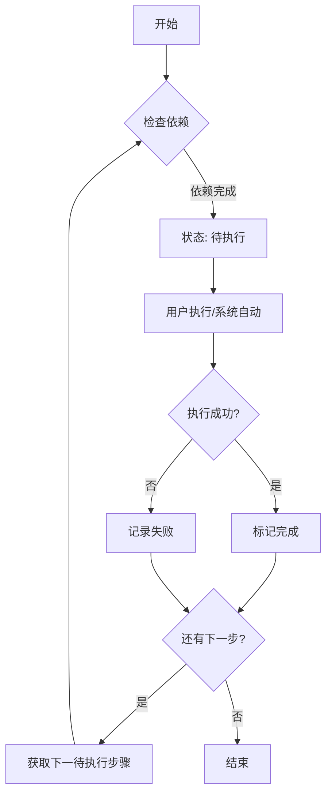
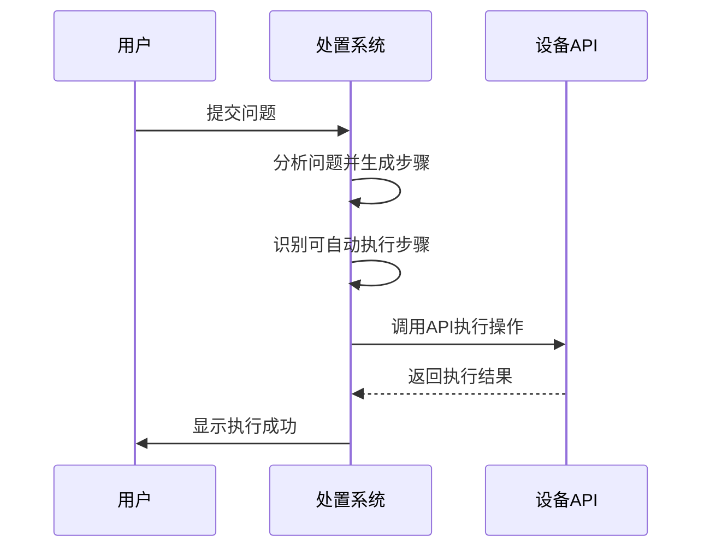
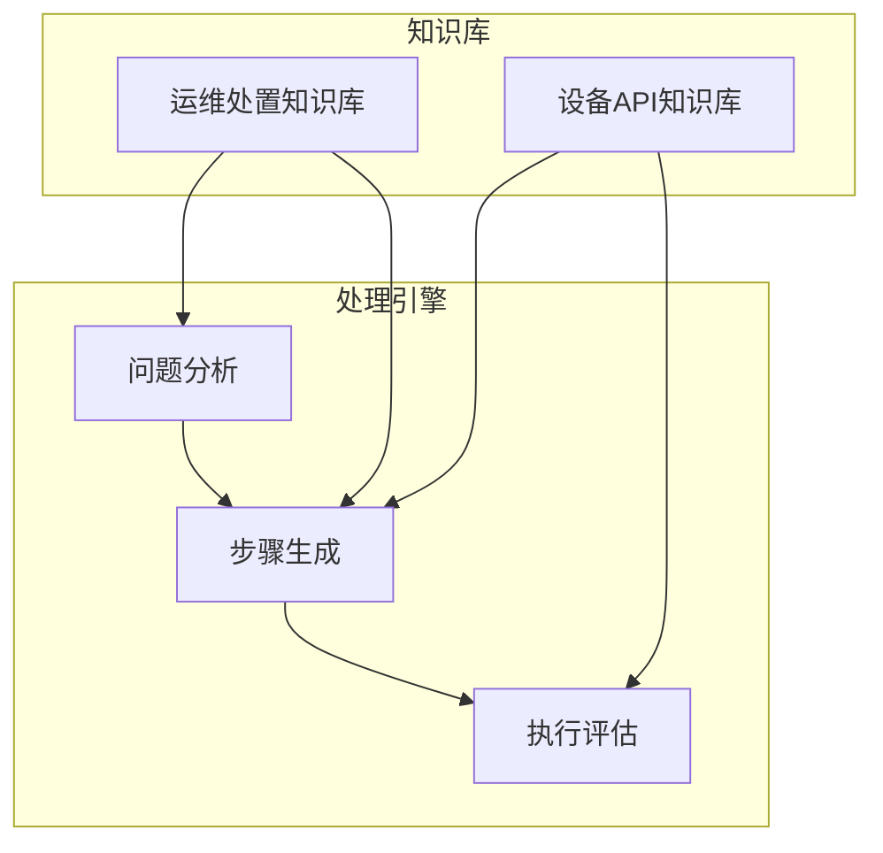
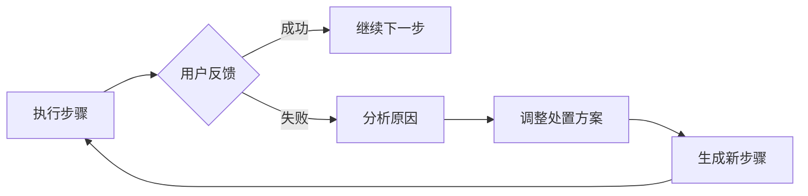
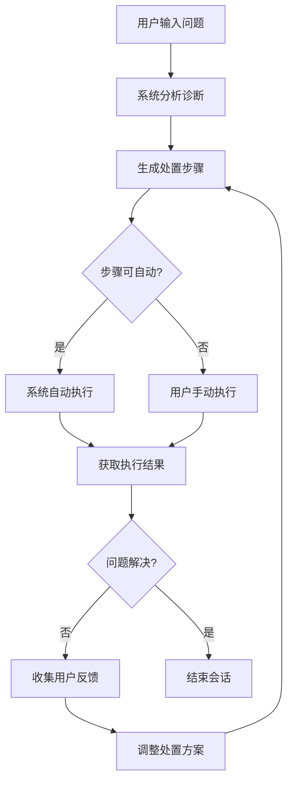

# 核心功能

<cite>
**本文档引用的文件**
- [ProcessingEngine.js](file://backend/src/services/ProcessingEngine.js)
- [KnowledgeBaseService.js](file://backend/src/services/KnowledgeBaseService.js)
- [LLMService.js](file://backend/src/services/LLMService.js)
- [Step.js](file://backend/src/models/Step.js)
- [Session.js](file://backend/src/models/Session.js)
- [memory-shortage.md](file://knowledge-base/operation-procedures/memory-shortage.md)
- [database-management-api.md](file://knowledge-base/device-apis/database-management-api.md)
- [llm-config.json](file://configs/llm-config.json)
</cite>

## 目录
1. [智能问题诊断](#智能问题诊断)
2. [渐进式处置引导](#渐进式处置引导)
3. [自动化执行](#自动化执行)
4. [知识库驱动](#知识库驱动)
5. [工具集成](#工具集成)
6. [用户反馈循环](#用户反馈循环)
7. [完整闭环流程案例](#完整闭环流程案例)

## 智能问题诊断

系统通过大语言模型（LLM）对输入的问题现象进行深度分析，生成结构化的诊断结果。当用户提交"CPU高使用率"等问题时，系统调用`LLMService.analyzeProblem`方法，结合问题分类和描述，利用预设的提示模板生成详细的分析报告。

该过程首先创建一个会话对象，然后启动问题分析流程。系统将问题信息传递给大模型，获取包括问题原因、影响范围和初步处置建议在内的综合分析结果。整个诊断过程由`ProcessingEngine`核心引擎协调完成，确保分析的准确性和一致性。

**Section sources**
- [ProcessingEngine.js](file://backend/src/services/ProcessingEngine.js#L95-L140)
- [LLMService.js](file://backend/src/services/LLMService.js#L178-L214)
- [llm-config.json](file://configs/llm-config.json#L45-L47)

## 渐进式处置引导

系统采用分步引导的方式帮助用户解决问题，每个处置步骤都经过精心设计和排序。`ProcessingEngine.generateProcessingSteps`方法负责将大模型生成的文本步骤解析为结构化的`Step`对象，并按顺序组织成处置计划。

每一步骤包含详细的操作说明、执行类型（手动或自动）和依赖关系。系统通过`getNextStep`方法确定下一个可执行的步骤，确保处置流程的逻辑性和连贯性。用户界面会清晰展示当前步骤、已完成步骤和后续步骤，提供直观的进度指引。

**Diagram sources**
- [ProcessingEngine.js](file://backend/src/services/ProcessingEngine.js#L470-L488)
- [Step.js](file://backend/src/models/Step.js#L118-L137)

**Section sources**
- [ProcessingEngine.js](file://backend/src/services/ProcessingEngine.js#L145-L188)
- [Step.js](file://backend/src/models/Step.js#L118-L137)

## 自动化执行

对于具备API支持的处置步骤，系统能够实现自动化执行。`identifyAutomatableSteps`方法会扫描生成的处置步骤，在设备API知识库中搜索匹配的接口。当找到匹配度超过阈值的API时，系统将步骤类型标记为"auto"并关联相应的API端点。

在执行阶段，`executeAutomaticStep`方法调用关联的工具API完成操作。例如，当需要终止数据库连接时，系统可以自动调用`DELETE /api/database/connections/{connection_id}`接口。这种自动化能力大大提高了处置效率，减少了人为操作错误。

**Diagram sources**
- [ProcessingEngine.js](file://backend/src/services/ProcessingEngine.js#L265-L300)
- [database-management-api.md](file://knowledge-base/device-apis/database-management-api.md#L45-L58)

**Section sources**
- [ProcessingEngine.js](file://backend/src/services/ProcessingEngine.js#L305-L374)
- [database-management-api.md](file://knowledge-base/device-apis/database-management-api.md#L45-L58)

## 知识库驱动

系统的核心决策能力来源于两个关键知识库：运维处置知识库和设备API知识库。`KnowledgeBaseService`负责加载和管理这些知识资源。

运维处置知识库包含如`memory-shortage.md`等Markdown文档，记录了各种问题的标准处置流程。设备API知识库则包含`database-management-api.md`等接口文档，定义了可调用的自动化操作。系统通过`search`方法在知识库中查找与当前问题相关的信息，为决策提供支持。

**Diagram sources**
- [KnowledgeBaseService.js](file://backend/src/services/KnowledgeBaseService.js#L79-L105)
- [memory-shortage.md](file://knowledge-base/operation-procedures/memory-shortage.md)
- [database-management-api.md](file://knowledge-base/device-apis/database-management-api.md)

**Section sources**
- [KnowledgeBaseService.js](file://backend/src/services/KnowledgeBaseService.js#L362-L429)
- [memory-shortage.md](file://knowledge-base/operation-procedures/memory-shortage.md)

## 工具集成

系统通过统一的工具集成框架将知识库中的API文档转化为可执行的操作。当`identifyAutomatableSteps`方法在知识库中找到匹配的API时，会将API端点信息存储在步骤的`tool_api`字段中。

这种集成方式使得系统能够灵活支持各种设备和系统。例如，`database-management-api.md`中定义的备份管理、性能优化等API都可以被系统识别和调用。配置文件`llm-config.json`还支持灵活配置不同的大模型提供商，增强了系统的可扩展性。

**Section sources**
- [ProcessingEngine.js](file://backend/src/services/ProcessingEngine.js#L265-L300)
- [database-management-api.md](file://knowledge-base/device-apis/database-management-api.md)
- [llm-config.json](file://configs/llm-config.json)

## 用户反馈循环

系统建立了完善的用户反馈机制，通过`processFeedback`方法接收用户对处置步骤的反馈。用户可以在执行手动步骤后提供结果信息，系统会根据反馈调整后续处置方案。

`adjustProcessingPlan`方法利用大模型分析用户反馈，动态生成新的处置步骤。这种闭环反馈机制使得系统能够适应复杂多变的实际场景，不断优化处置策略。反馈信息还会更新到会话状态中，为后续分析提供数据支持。

**Diagram sources**
- [ProcessingEngine.js](file://backend/src/services/ProcessingEngine.js#L493-L530)

**Section sources**
- [ProcessingEngine.js](file://backend/src/services/ProcessingEngine.js#L493-L530)
- [Session.js](file://backend/src/models/Session.js#L76-L80)

## 完整闭环流程案例

以"内存不足"问题为例，演示从问题输入到最终解决的完整闭环流程：

1. **问题输入**：用户提交"服务器内存不足"问题
2. **智能诊断**：系统调用大模型分析问题，参考`memory-shortage.md`知识库
3. **生成步骤**：生成检查内存使用、识别高占用进程等步骤
4. **自动执行**：对"清理缓存"等操作自动调用系统API
5. **人工处置**：用户执行需要判断的操作，如重启应用
6. **反馈调整**：用户反馈执行结果，系统评估效果
7. **持续优化**：根据反馈调整后续步骤，直到问题解决

整个流程体现了人机协同的特点，系统负责提供专业指导和自动化支持，用户负责关键决策和验证，共同完成复杂问题的处置。

**Diagram sources**
- [ProcessingEngine.js](file://backend/src/services/ProcessingEngine.js#L95-L140)
- [memory-shortage.md](file://knowledge-base/operation-procedures/memory-shortage.md)

**Section sources**
- [ProcessingEngine.js](file://backend/src/services/ProcessingEngine.js#L95-L140)
- [memory-shortage.md](file://knowledge-base/operation-procedures/memory-shortage.md)
- [database-management-api.md](file://knowledge-base/device-apis/database-management-api.md)