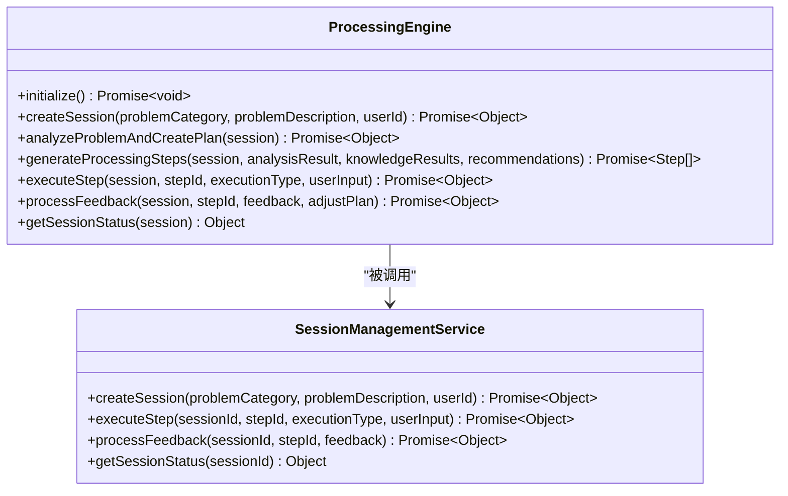
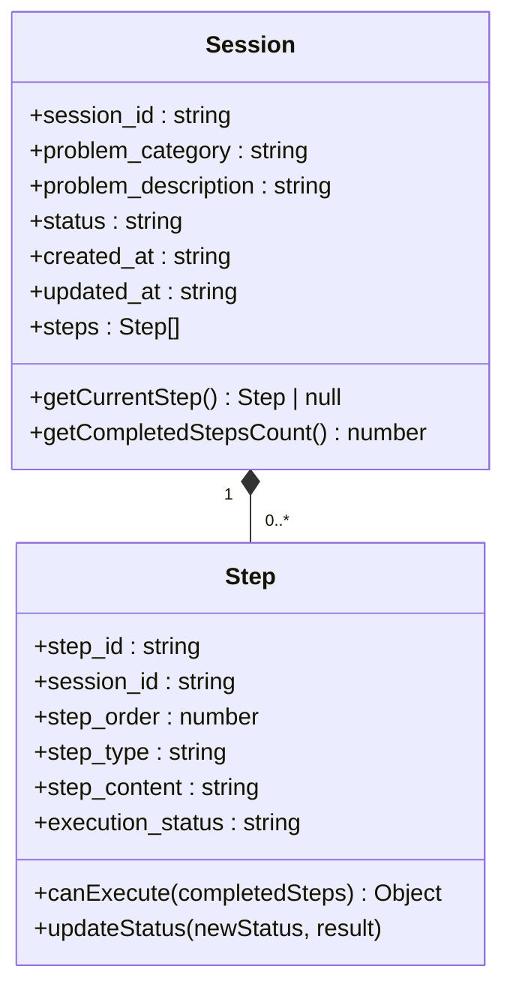
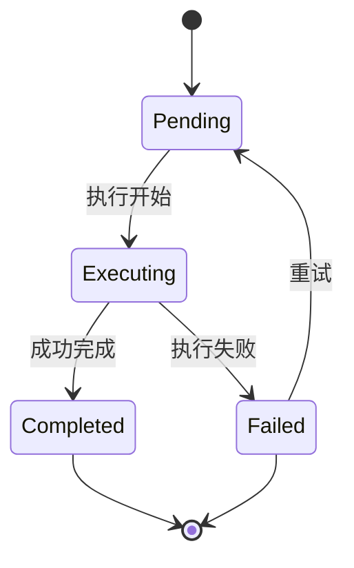
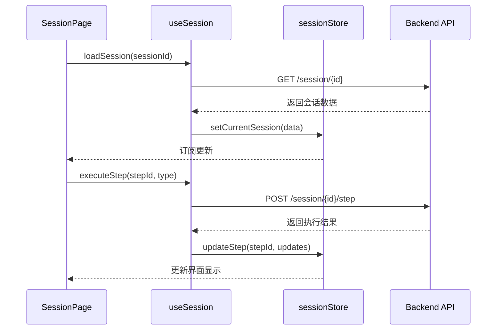
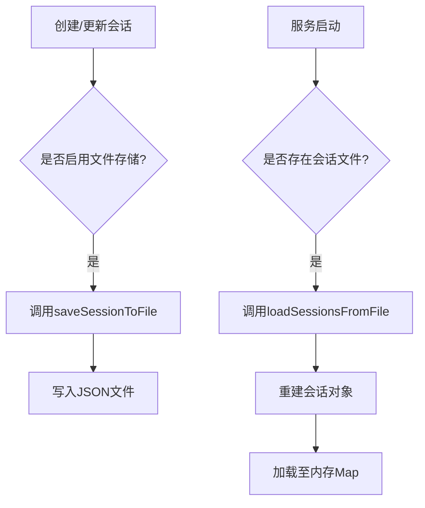

# 渐进式处置引导

<cite>
**本文档引用的文件**
- [ProcessingEngine.js](file://backend/src/services/ProcessingEngine.js)
- [SessionManagementService.js](file://backend/src/services/SessionManagementService.js)
- [Step.js](file://backend/src/models/Step.js)
- [Session.js](file://backend/src/models/Session.js)
- [sessionStore.ts](file://frontend/src/stores/sessionStore.ts)
- [SessionPage.tsx](file://frontend/src/pages/SessionPage.tsx)
- [useSession.ts](file://frontend/src/hooks/useSession.ts)
- [memory-shortage.md](file://knowledge-base/operation-procedures/memory-shortage.md)
</cite>

## 目录
1. [引言](#引言)
2. [核心组件设计](#核心组件设计)
3. [状态机与步骤流转](#状态机与步骤流转)
4. [前端会话页面实现](#前端会话页面实现)
5. [具体案例分析：内存短缺处理](#具体案例分析：内存短缺处理)
6. [用户确认与回退机制](#用户确认与回退机制)
7. [异常恢复策略](#异常恢复策略)
8. [用户体验优化](#用户体验优化)

## 引言
渐进式处置引导系统旨在将复杂的运维任务分解为一系列有序、可管理的步骤，通过智能化的流程驱动帮助用户逐步解决问题。该系统结合大模型分析能力与知识库检索技术，自动生成针对特定问题的处置方案，并支持自动执行和手动确认相结合的操作模式。本系统特别适用于需要严格操作顺序和安全验证的场景，如服务器故障排查、性能调优等。

## 核心组件设计

### 处置引擎（ProcessingEngine）
处置引擎是整个系统的中枢，负责创建会话、生成处置计划、执行步骤以及处理反馈。它通过集成大模型服务（LLMService）和知识库服务（KnowledgeBaseService），能够智能地分析问题并生成相应的处置步骤。

当用户提交一个问题时，`createSession`方法首先创建一个会话对象，然后调用`analyzeProblemAndCreatePlan`进行问题分析。这一过程包括使用大模型分析问题本质、搜索相关知识库条目、获取推荐解决方案，并最终生成具体的处置步骤序列。

**图示来源**
- [ProcessingEngine.js](file://backend/src/services/ProcessingEngine.js#L12-L634)
- [SessionManagementService.js](file://backend/src/services/SessionManagementService.js#L16-L531)

### 会话与步骤模型
会话（Session）和步骤（Step）是系统中的两个核心数据模型。会话代表一次完整的处置过程，包含问题分类、描述、状态及关联的步骤列表；而每个步骤则记录了具体的操作指令、执行状态、结果等信息。

**图示来源**
- [Session.js](file://backend/src/models/Session.js#L7-L119)
- [Step.js](file://backend/src/models/Step.js#L7-L200)

## 状态机与步骤流转

### 步骤状态生命周期
每个处置步骤在其生命周期中经历多个状态转换：从初始的“待执行”（pending）到“执行中”（executing），再到“已完成”（completed）或“失败”（failed）。这些状态由`updateStatus`方法统一管理，并确保只有处于正确状态的步骤才能被触发执行。

**图示来源**
- [Step.js](file://backend/src/models/Step.js#L7-L200)

### 步骤依赖与执行条件
系统支持步骤间的依赖关系管理。通过`dependencies`字段定义前置依赖步骤ID列表，`canExecute`方法检查所有依赖步骤是否已完成。这保证了复杂流程中各步骤的正确执行顺序。

例如，在重启服务前必须先停止旧进程，这种逻辑可以通过设置依赖来实现。此外，步骤还具备超时控制（timeout）、重试机制（retry_count/max_retries）等特性，增强了系统的健壮性。

**节段来源**
- [Step.js](file://backend/src/models/Step.js#L7-L200)
- [ProcessingEngine.js](file://backend/src/services/ProcessingEngine.js#L305-L374)

## 前端会话页面实现

### 会话存储与订阅
前端使用Zustand状态管理库维护会话状态。`sessionStore`定义了当前会话、步骤列表及相关操作方法。`useSession`自定义Hook封装了API调用逻辑，使得`SessionPage`组件可以方便地订阅会话状态变化。

**图示来源**
- [sessionStore.ts](file://frontend/src/stores/sessionStore.ts#L1-L163)
- [useSession.ts](file://frontend/src/hooks/useSession.ts#L1-L175)
- [SessionPage.tsx](file://frontend/src/pages/SessionPage.tsx#L1-L351)

### 动态渲染引导界面
`SessionPage`组件根据当前会话的状态动态渲染处置引导界面。它遍历`session.steps`数组，为每个步骤显示相应的内容、状态图标和操作按钮。对于待执行的手动步骤，提供文本输入框供用户填写操作结果；对于自动步骤，则显示“自动执行”按钮。

进度条组件可视化展示整体处置进度，基于`currentSessionStatus.progress.percentage`值实时更新。同时，页面每10秒轮询一次会话状态，确保界面与后端保持同步。

**节段来源**
- [SessionPage.tsx](file://frontend/src/pages/SessionPage.tsx#L1-L351)
- [useSession.ts](file://frontend/src/hooks/useSession.ts#L1-L175)

## 具体案例分析：内存短缺处理

以“内存不足”问题为例，系统如何生成并执行处置方案：

1. **问题识别**：用户选择“性能”类别并描述“服务器响应缓慢，疑似内存不足”。
2. **方案生成**：系统调用大模型分析问题，结合知识库中`memory-shortage.md`文档生成以下步骤：
   - 检查内存使用情况
   - 识别高内存占用进程
   - 查看OOM日志
   - 清理缓存（自动步骤）
   - 重启非关键服务（手动步骤）

3. **步骤执行**：
   - 第一步“清理缓存”标记为自动步骤，因匹配到设备API `/proc/sys/vm/drop_caches`
   - 用户点击“自动执行”后，系统调用对应API完成操作
   - 第二步“重启服务”需用户手动确认，输入具体服务名称后提交

4. **跳转逻辑**：每完成一步，`getNextStep`方法返回下一个待执行步骤。若某步失败且达到最大重试次数，则终止流程并提示错误。

**节段来源**
- [memory-shortage.md](file://knowledge-base/operation-procedures/memory-shortage.md)
- [ProcessingEngine.js](file://backend/src/services/ProcessingEngine.js#L470-L488)

## 用户确认与回退机制

### 安全确认流程
所有手动步骤均需用户显式确认才能继续。在`SessionPage`中，手动步骤下方显示文本输入框和“确认完成”按钮。用户必须输入内容后方可提交，防止误操作。

对于敏感操作（如删除数据、重启核心服务），系统可在步骤内容中添加警告提示，并要求二次确认。虽然当前实现未强制区分，但可通过扩展`step_type`类型（如`critical-manual`）来增强安全性。

### 回退至上一步
系统目前不直接支持“撤销”功能，但提供了灵活的反馈机制实现类似效果。用户可在任意步骤提交反馈，说明遇到的问题。`processFeedback`方法接收到反馈后，会调用大模型重新评估当前状况，并可能生成新的调整方案，从而间接实现回退和修正路径。

例如，若用户在重启服务时发现依赖异常，可反馈“服务A无法启动，报错依赖缺失”。系统据此可能生成新步骤：“检查服务A依赖项”、“安装缺失组件”，形成新的处置路径。

**节段来源**
- [ProcessingEngine.js](file://backend/src/services/ProcessingEngine.js#L493-L530)
- [SessionPage.tsx](file://frontend/src/pages/SessionPage.tsx#L1-L351)

## 异常恢复策略

### 会话持久化
为防止系统崩溃导致会话丢失，`SessionManagementService`实现了文件存储机制。每次会话创建、更新或删除时，都会调用`saveSessionToFile`将其序列化保存至本地JSON文件。重启服务后，`loadSessionsFromFile`会自动恢复内存中的会话数据。

**图示来源**
- [SessionManagementService.js](file://backend/src/services/SessionManagementService.js#L16-L531)

### 自动保存与清理
系统配置了定时任务，每隔30秒执行一次`saveAllSessionsToFile`，确保最新状态得以保存。同时，设置了最大内存会话数限制（默认1000个），超出时自动驱逐最久未更新的会话，避免内存溢出。

过期会话（默认24小时无活动）也会被定期清理，释放存储空间。这些机制共同保障了系统的稳定性和可靠性。

**节段来源**
- [SessionManagementService.js](file://backend/src/services/SessionManagementService.js#L16-L531)

## 用户体验优化

### 进度可视化
`SessionPage`顶部显示进度条，直观反映处置进展。百分比计算公式为：已完成步骤数 ÷ 总步骤数 × 100%。旁边附有详细统计：“X/Y 步骤”，让用户清晰了解当前所处位置。

### 超时提醒
尽管当前代码未实现前端超时提醒，但`Step`模型已内置`timeout`字段（默认30秒）。未来可在此基础上扩展：
- 当步骤进入“执行中”状态时启动倒计时
- 接近超时时发出视觉/声音警告
- 超时后自动标记为失败并通知用户

### 其他优化建议
1. **步骤预览**：在会话开始前展示完整步骤列表，让用户对整体流程有预期
2. **快捷操作**：为常用命令提供一键复制功能，减少输入负担
3. **上下文帮助**：在步骤旁显示相关知识库链接，便于查阅细节
4. **多终端同步**：支持移动端查看和确认步骤，提升灵活性

**节段来源**
- [SessionPage.tsx](file://frontend/src/pages/SessionPage.tsx#L1-L351)
- [Step.js](file://backend/src/models/Step.js#L7-L200)