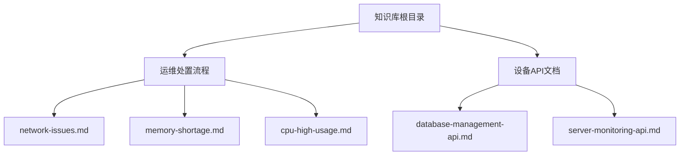
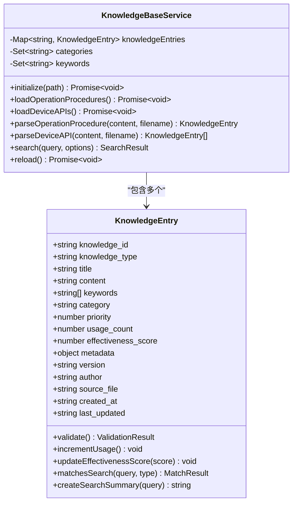
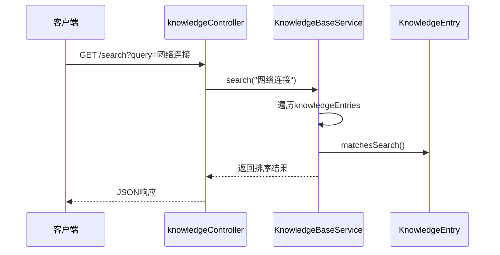
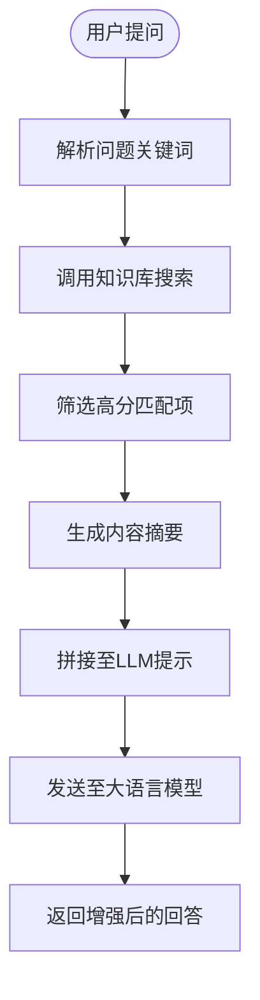

# 知识库驱动

<cite>
**本文档中引用的文件**
- [KnowledgeBaseService.js](file://backend/src/services/KnowledgeBaseService.js)
- [knowledgeController.js](file://backend/src/controllers/knowledgeController.js)
- [KnowledgeEntry.js](file://backend/src/models/KnowledgeEntry.js)
- [network-issues.md](file://knowledge-base/operation-procedures/network-issues.md)
- [database-management-api.md](file://knowledge-base/device-apis/database-management-api.md)
</cite>

## 目录
1. [引言](#引言)
2. [知识库加载与索引机制](#知识库加载与索引机制)
3. [搜索接口与全文匹配算法](#搜索接口与全文匹配算法)
4. [上下文增强与诊断应用](#上下文增强与诊断应用)
5. [性能优化策略](#性能优化策略)
6. [版本管理与扩展性](#版本管理与扩展性)

## 引言
本系统通过构建本地知识库驱动机制，实现对运维处置流程和设备操作API文档的结构化管理。系统基于Markdown等格式的知识文档，自动解析并建立可检索的知识图谱，为大语言模型（LLM）提供精准的上下文支持。该机制显著提升了智能诊断系统的准确性与实用性。

## 知识库加载与索引机制

### 知识源目录结构
系统从`knowledge-base`目录加载两类核心知识：
- `operation-procedures`：存放运维处置流程文档（如网络问题、CPU高使用率等）
- `device-apis`：存放设备操作API接口文档（支持Markdown和API Blueprint格式）

**Diagram sources**
- [KnowledgeBaseService.js](file://backend/src/services/KnowledgeBaseService.js#L79-L202)

### 文档解析与条目创建
`KnowledgeBaseService`在初始化时调用`loadOperationProcedures()`和`loadDeviceAPIs()`方法，遍历对应目录下的`.md`或`.apib`文件，并通过`parseOperationProcedure()`和`parseAPIMarkdown()`等方法进行解析。

解析过程包括：
- 提取标题（以`# `开头的行）
- 解析元数据注释块中的分类、关键词和描述
- 自动生成补充关键词
- 构建`KnowledgeEntry`实例

**Diagram sources**
- [KnowledgeBaseService.js](file://backend/src/services/KnowledgeBaseService.js#L110-L224)
- [KnowledgeEntry.js](file://backend/src/models/KnowledgeEntry.js#L10-L50)

### 关键词提取逻辑
系统采用基于词频统计的方法自动提取关键词：
1. 将标题与描述合并为文本输入
2. 转换为小写并去除标点符号
3. 按空格分割成单词，过滤停用词和单字符
4. 统计词频并按频率降序排列
5. 返回前10个高频词汇作为关键词

此机制确保即使文档未显式标注关键词，也能被有效检索。

**Section sources**
- [KnowledgeBaseService.js](file://backend/src/services/KnowledgeBaseService.js#L316-L336)

## 搜索接口与全文匹配算法

### 搜索接口设计
`knowledgeController`提供了RESTful API用于知识检索：

| 接口 | 方法 | 功能 |
|------|------|------|
| `/api/knowledge/search` | GET | 全文搜索知识条目 |
| `/api/knowledge/:id` | GET | 获取指定知识详情 |
| `/api/knowledge/category/:category` | GET | 按分类获取知识 |
| `/api/knowledge/recommendations/:category` | GET | 获取推荐知识 |
| `/api/knowledge/reload` | POST | 重新加载知识库 |

**Diagram sources**
- [knowledgeController.js](file://backend/src/controllers/knowledgeController.js#L5-L166)
- [KnowledgeBaseService.js](file://backend/src/services/KnowledgeBaseService.js#L345-L400)

### 多维度评分匹配算法
`KnowledgeEntry.matchesSearch()`方法实现了一套加权评分机制：

- **标题匹配**：每个命中词条+3分（权重最高）
- **关键词匹配**：每个命中词条+2分（高权重）
- **内容匹配**：每个命中词条+1分（中等权重）
- **分类匹配**：完全匹配+0.5分（低权重）
- **优先级与有效性加权**：最终得分乘以 `(1 + priority/10) * (1 + effectiveness_score)`

此外，还支持类型过滤（`operation-procedure`, `device-api`）和最小分数阈值控制。

**Section sources**
- [KnowledgeEntry.js](file://backend/src/models/KnowledgeEntry.js#L108-L162)

## 上下文增强与诊断应用

### 检索结果摘要生成
为避免将整篇文档送入LLM提示，系统使用`createSearchSummary()`方法生成上下文摘要：
1. 在内容中定位首个查询词出现位置
2. 以此为中心前后截取最多200字符
3. 添加省略号表示截断
4. 若无匹配则返回全文开头部分

这保证了传递给LLM的信息既相关又简洁。

**Diagram sources**
- [KnowledgeEntry.js](file://backend/src/models/KnowledgeEntry.js#L218-L250)

### 实际应用场景示例
当用户提出“数据库连接超时怎么办”时：
1. 系统提取关键词：“数据库”、“连接”、“超时”
2. 匹配到`network-issues.md`中关于连接异常的章节
3. 提取相关处置步骤作为上下文
4. 结合LLM推理能力生成结构化解决方案

此机制使系统不仅能回答静态知识，还能结合动态情境进行推理。

**Section sources**
- [network-issues.md](file://knowledge-base/operation-procedures/network-issues.md)
- [database-management-api.md](file://knowledge-base/device-apis/database-management-api.md)

## 性能优化策略

### 缓存热点知识条目
虽然当前实现未集成外部缓存，但可通过以下方式优化：
- 对高频访问的知识条目（`usage_count`高）进行内存缓存
- 使用LRU策略管理缓存容量
- 设置TTL防止长期不一致

建议引入Redis或Memory Cache中间件实现分布式缓存。

### 增量更新索引
目前`reload()`方法会清空所有缓存并重新加载全部文档。建议改进为增量更新：
- 监听知识库文件变化（inotify或fs.watch）
- 仅重新解析被修改的文件
- 更新对应`KnowledgeEntry`实例而非重建整个索引

此举可大幅降低热重启开销。

**Section sources**
- [KnowledgeBaseService.js](file://backend/src/services/KnowledgeBaseService.js#L570-L576)

## 版本管理与扩展性

### 多格式支持扩展
系统已具备良好的多格式解析能力：
- 支持标准Markdown文档
- 支持API Blueprint（`.apib`）格式
- 可通过`parseDeviceAPI()`分支逻辑轻松扩展新格式

未来可扩展支持Swagger/OpenAPI、YAML配置说明等更多技术文档格式。

### 版本控制建议
当前`KnowledgeEntry`模型包含`version`字段，可用于版本追踪。建议进一步实现：
- Git集成：将知识库目录纳入版本控制
- 变更审计：记录每次`reload`的操作人与时间
- 回滚机制：保存历史版本快照以便恢复

这些措施将提升知识库的可维护性与可靠性。

**Section sources**
- [KnowledgeEntry.js](file://backend/src/models/KnowledgeEntry.js#L30-L35)