# 自动化执行

<cite>
**本文档引用的文件**  
- [ToolExecutionService.js](file://backend/src/services/ToolExecutionService.js)
- [toolController.js](file://backend/src/controllers/toolController.js)
- [security.js](file://backend/src/middleware/security.js)
- [SettingsPage.tsx](file://frontend/src/pages/SettingsPage.tsx)
- [api.ts](file://frontend/src/utils/api.ts)
- [server-monitoring-api.md](file://knowledge-base/device-apis/server-monitoring-api.md)
</cite>

## 目录
1. [引言](#引言)
2. [核心组件分析](#核心组件分析)
3. [自动化执行流程详解](#自动化执行流程详解)
4. [权限控制与安全校验机制](#权限控制与安全校验机制)
5. [API接口设计与参数验证](#api接口设计与参数验证)
6. [前端联动配置：SettingsPage](#前端联动配置settingspage)
7. [完整执行链路示例：服务器监控API](#完整执行链路示例服务器监控api)
8. [执行日志记录与错误重试策略](#执行日志记录与错误重试策略)
9. [潜在风险与防护措施](#潜在风险与防护措施)
10. [结论](#结论)

## 引言
本系统实现了基于大模型决策结果的自动化工具执行能力，支持对预定义工具（如重启服务、查询数据库）的安全调用。通过`ToolExecutionService`服务实现工具解析、参数验证、请求构建和执行重试等核心功能，并结合中间件层的安全校验机制防止误操作。前端`SettingsPage`页面提供可视化配置界面，实现与后端工具系统的联动管理。

## 核心组件分析

### ToolExecutionService 服务类
该服务是自动化执行的核心引擎，负责加载并执行知识库中定义的设备API工具。

**Section sources**
- [ToolExecutionService.js](file://backend/src/services/ToolExecutionService.js#L9-L615)

#### 初始化与API预加载
服务启动时会从知识库中加载所有设备API定义，并缓存到内存中以提高执行效率。

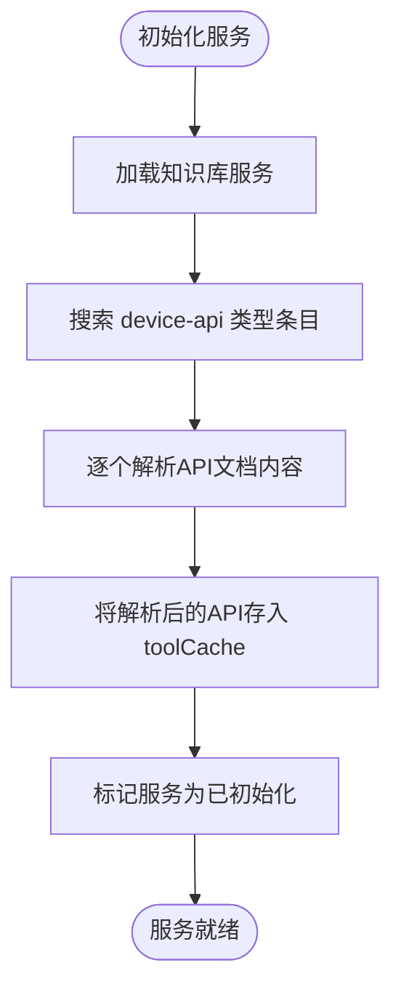

**Diagram sources**
- [ToolExecutionService.js](file://backend/src/services/ToolExecutionService.js#L15-L60)

#### 工具执行主流程
描述了从接收到执行请求到返回结果的完整处理过程。

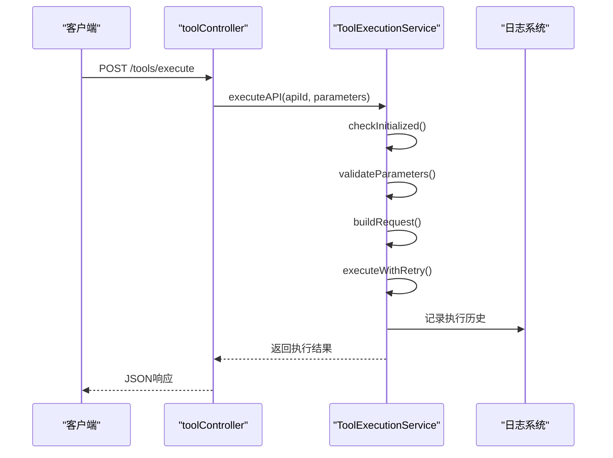

**Diagram sources**
- [ToolExecutionService.js](file://backend/src/services/ToolExecutionService.js#L295-L338)
- [toolController.js](file://backend/src/controllers/toolController.js#L6-L22)

## 自动化执行流程详解

### API定义解析机制
系统支持两种格式的API文档解析：API Blueprint 和 Markdown 格式。

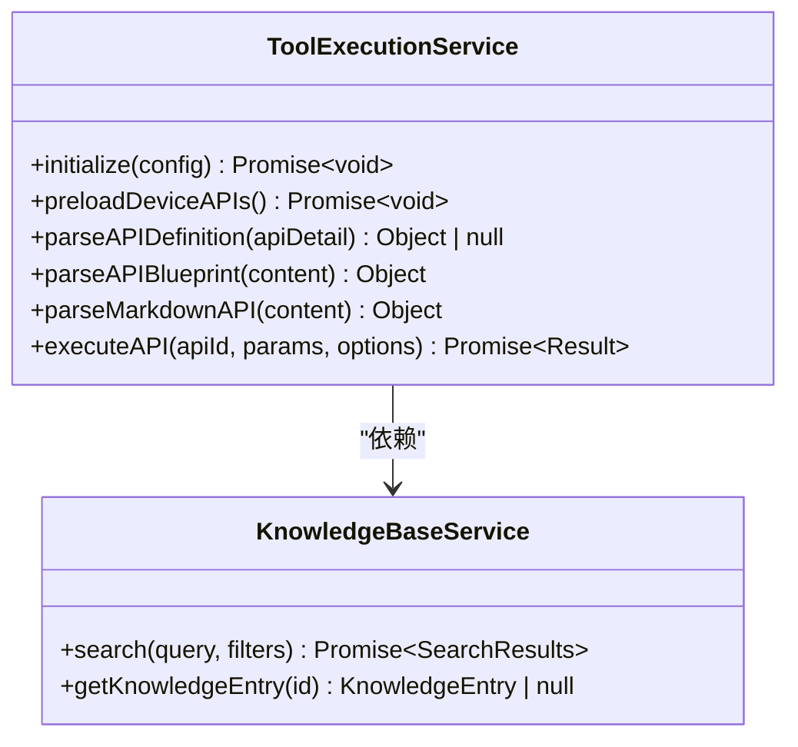

**Diagram sources**
- [ToolExecutionService.js](file://backend/src/services/ToolExecutionService.js#L9-L615)

### 请求构建逻辑
根据API定义动态构建HTTP请求配置对象。

```mermaid
flowchart TD
A[开始构建请求] --> B{获取 baseURL 和 path}
B --> C[拼接完整URL]
C --> D[替换路径参数 {param} 或 :param]
D --> E[设置请求方法 method]
E --> F[设置超时时间 timeout]
F --> G[添加默认请求头]
G --> H{GET请求?}
H --> |是| I[将参数放入 params]
H --> |否| J[将参数放入 data]
J --> K[返回 requestConfig]
I --> K
```

**Diagram sources**
- [ToolExecutionService.js](file://backend/src/services/ToolExecutionService.js#L375-L413)

## 权限控制与安全校验机制

### 安全中间件体系
系统采用多层安全防护机制保障API调用安全。

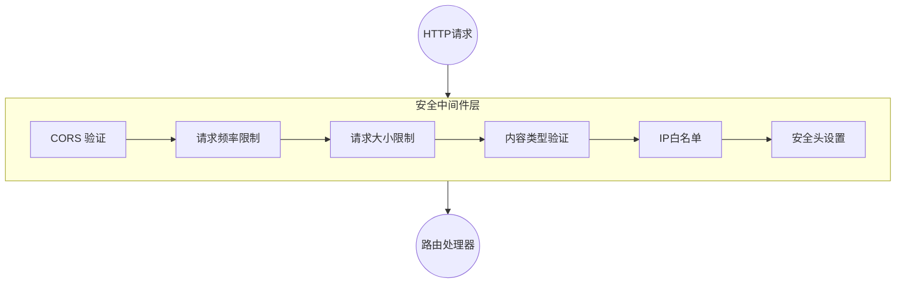

**Diagram sources**
- [security.js](file://backend/src/middleware/security.js#L1-L200)

### 中间件职责说明
| 中间件 | 职责 |
|--------|------|
| `corsOptions` | 控制跨域访问源列表 |
| `apiLimiter` | 限制每个IP每15分钟最多50次API请求 |
| `requestSizeLimit` | 限制请求体最大为10MB |
| `validateContentType` | 确保Content-Type为application/json |
| `ipWhitelist` | 仅允许特定IP访问敏感接口 |

**Section sources**
- [security.js](file://backend/src/middleware/security.js#L1-L200)

## API接口设计与参数验证

### 工具控制器接口
`toolController`暴露RESTful API供外部调用。

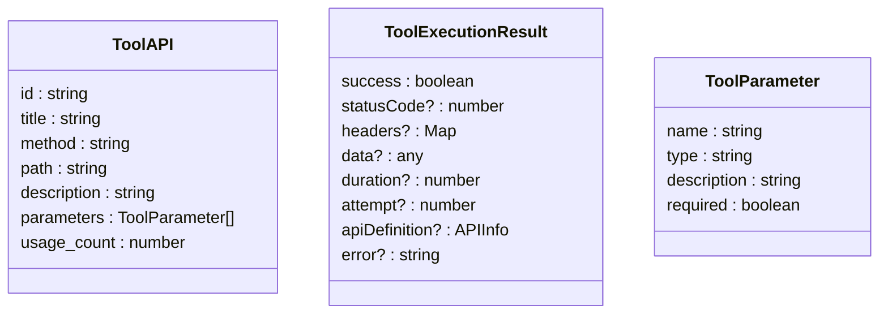

**Diagram sources**
- [toolController.js](file://backend/src/controllers/toolController.js#L6-L149)
- [index.ts](file://frontend/src/types/index.ts#L60-L68)

### 参数验证规则
在执行前对输入参数进行严格校验。

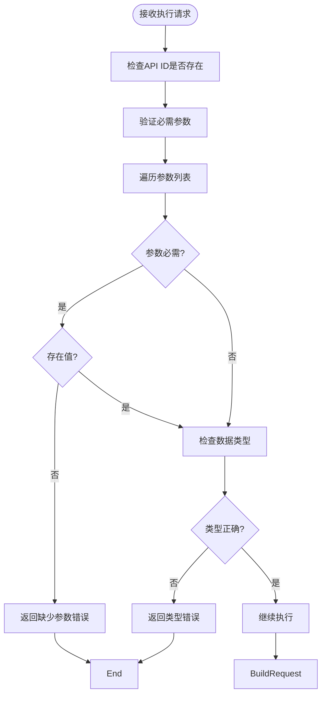

**Section sources**
- [ToolExecutionService.js](file://backend/src/services/ToolExecutionService.js#L340-L370)

## 前端联动配置：SettingsPage

### 设置页面功能结构
前端设置页面与工具执行系统深度集成。

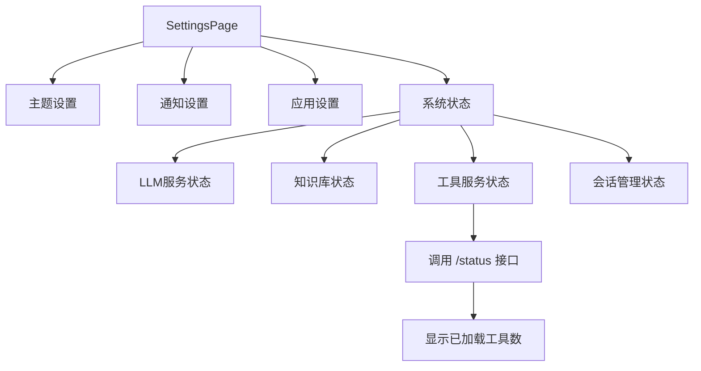

**Section sources**
- [SettingsPage.tsx](file://frontend/src/pages/SettingsPage.tsx#L1-L358)

### 前后端交互流程
展示前端如何获取系统状态信息。

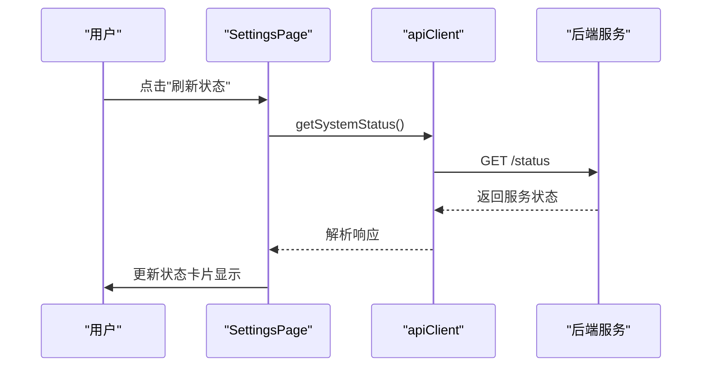

**Diagram sources**
- [SettingsPage.tsx](file://frontend/src/pages/SettingsPage.tsx#L78-L94)
- [api.ts](file://frontend/src/utils/api.ts#L200-L210)

## 完整执行链路示例：服务器监控API

### 执行服务器监控API全流程
以获取服务器信息为例说明完整执行链路。

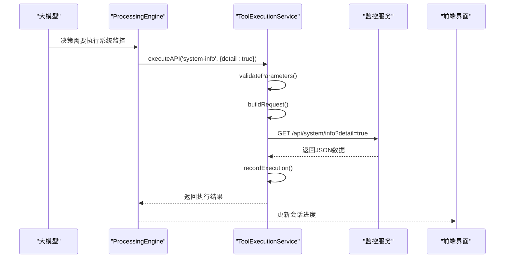

**Section sources**
- [server-monitoring-api.md](file://knowledge-base/device-apis/server-monitoring-api.md#L1-L175)
- [ToolExecutionService.js](file://backend/src/services/ToolExecutionService.js#L295-L338)

## 执行日志记录与错误重试策略

### 执行历史管理
系统维护每个工具的执行历史记录。

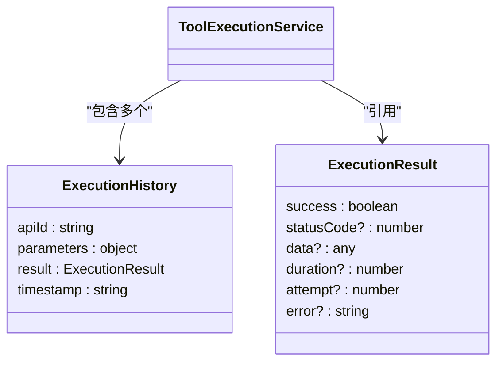

**Diagram sources**
- [ToolExecutionService.js](file://backend/src/services/ToolExecutionService.js#L463-L482)

### 错误重试机制
采用指数退避算法进行失败重试。

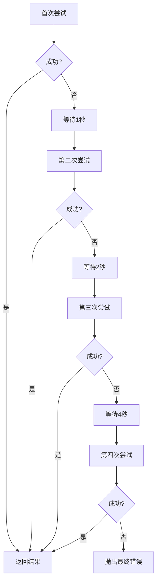

**Section sources**
- [ToolExecutionService.js](file://backend/src/services/ToolExecutionService.js#L418-L458)

##