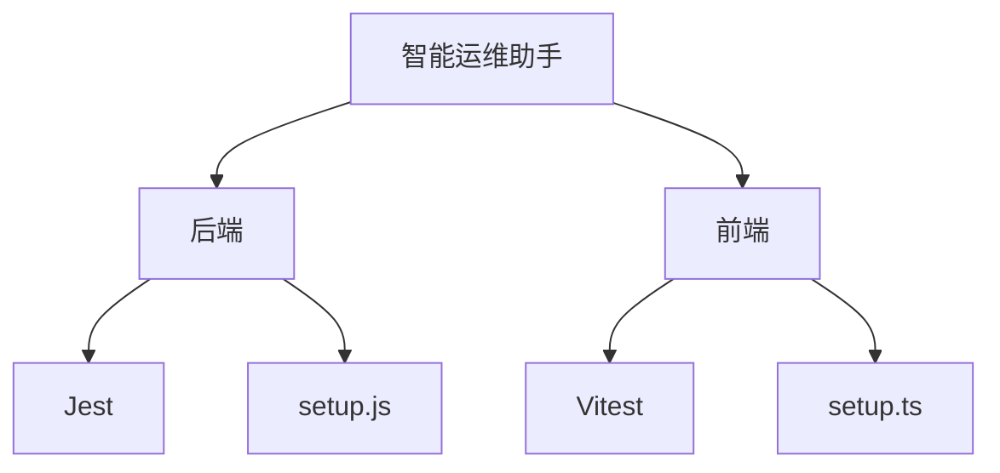
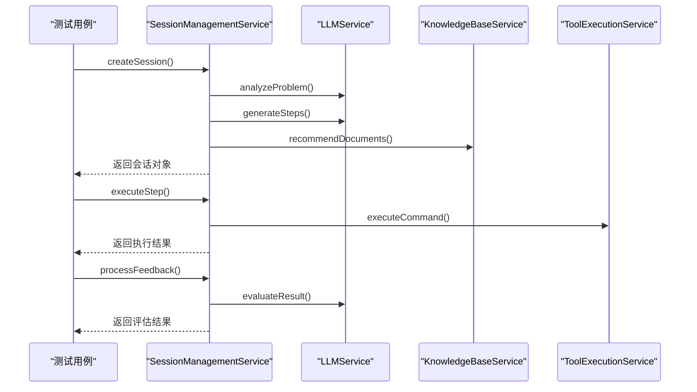
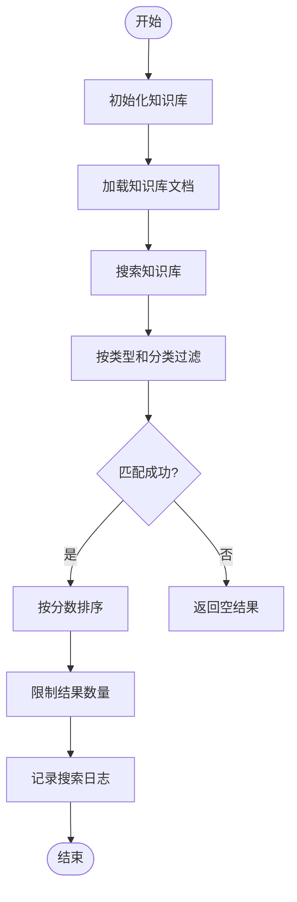
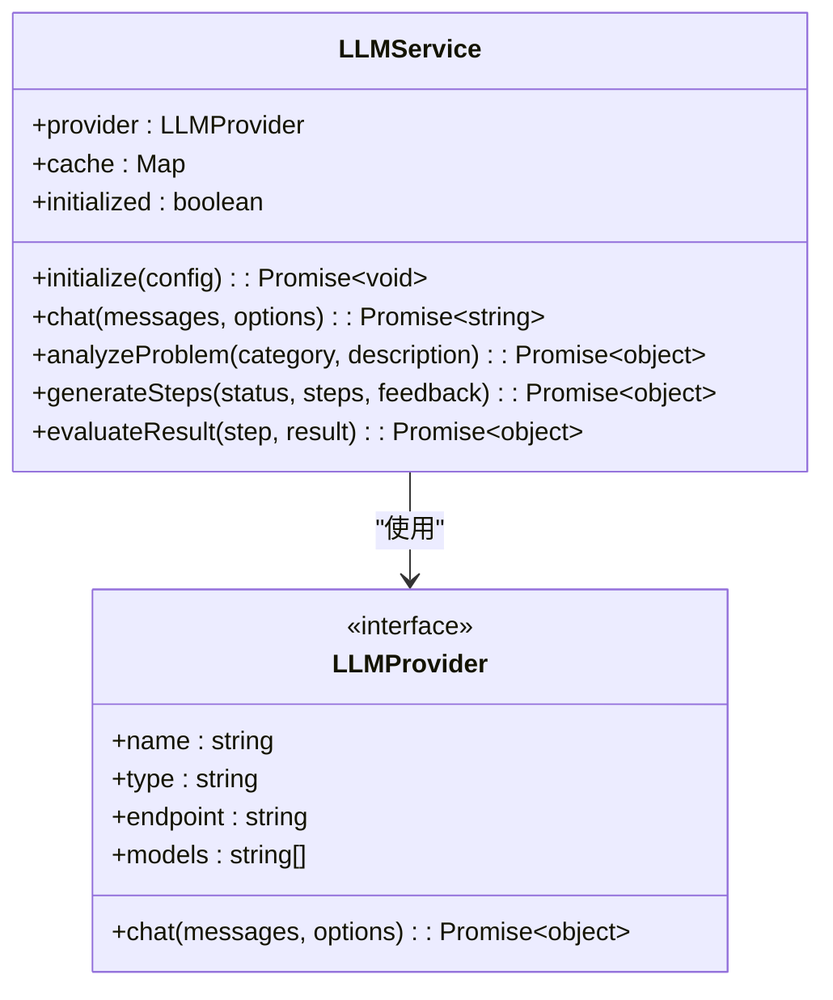
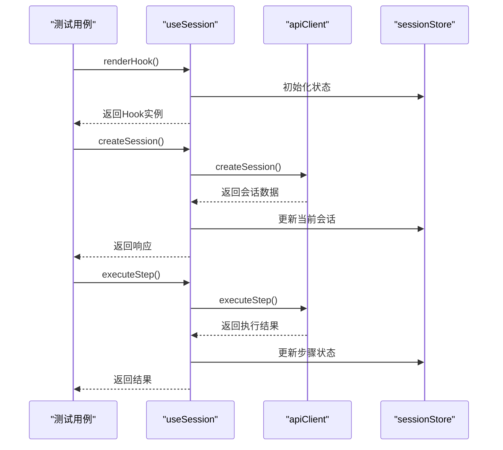

# 单元测试

<cite>
**本文档引用的文件**
- [SessionManagementService.js](file://backend/src/services/SessionManagementService.js)
- [KnowledgeBaseService.js](file://backend/src/services/KnowledgeBaseService.js)
- [LLMService.js](file://backend/src/services/LLMService.js)
- [useSession.ts](file://frontend/src/hooks/useSession.ts)
- [SessionManagementService.test.js](file://backend/tests/unit/services/SessionManagementService.test.js)
- [KnowledgeBaseService.test.js](file://backend/tests/unit/services/KnowledgeBaseService.test.js)
- [LLMService.test.js](file://backend/tests/unit/services/LLMService.test.js)
- [useSession.test.ts](file://frontend/tests/unit/hooks/useSession.test.ts)
- [setup.js](file://backend/tests/setup.js)
- [setup.ts](file://frontend/tests/setup.ts)
</cite>

## 目录
1. [简介](#简介)
2. [项目结构与测试框架](#项目结构与测试框架)
3. 核心服务单元测试
   1. [会话管理服务测试](#会话管理服务测试)
   2. [知识库服务测试](#知识库服务测试)
   3. [大模型服务测试](#大模型服务测试)
4. 前端自定义Hook测试
   1. [useSession Hook测试](#usesession-hook测试)
5. 测试环境初始化
   1. [后端Jest配置](#后端jest配置)
   2. [前端Vitest配置](#前端vitest配置)
6. 测试用例设计原则
   1. [依赖项模拟策略](#依赖项模拟策略)
   2. [断言逻辑验证](#断言逻辑验证)
   3. [异步操作处理](#异步操作处理)
7. 常见问题解决方案
   1. [状态泄漏](#状态泄漏)
   2. [超时错误](#超时错误)
   3. [Mock失效](#mock失效)
8. 性能优化建议
9. 结论

## 简介
本单元测试文档详细介绍了如何使用Jest和Vitest对智能运维助手应用程序的后端服务（如SessionManagementService、KnowledgeBaseService、LLMService）和前端自定义Hook（如useSession）进行隔离测试。文档涵盖了测试用例的设计原则，包括依赖项模拟、断言逻辑验证以及异步操作的处理，并提供了来自实际代码库的具体示例。同时，文档还解释了setup.js中的测试环境初始化机制，展示了如何通过mock实现高覆盖率，并涵盖常见问题解决方案及性能优化建议。

## 项目结构与测试框架
智能运维助手应用程序采用前后端分离架构，后端使用Node.js和Express框架，前端使用React和TypeScript。测试框架方面，后端采用Jest进行单元测试和集成测试，前端采用Vitest进行单元测试。测试文件分别位于`backend/tests`和`frontend/tests`目录下，遵循与源代码相同的目录结构。

**Diagram sources**
- [backend/tests/setup.js](file://backend/tests/setup.js)
- [frontend/tests/setup.ts](file://frontend/tests/setup.ts)

**Section sources**
- [backend/tests](file://backend/tests)
- [frontend/tests](file://frontend/tests)

## 核心服务单元测试

### 会话管理服务测试
会话管理服务（SessionManagementService）负责创建、更新、删除和查询会话。其单元测试主要验证会话的生命周期管理、步骤执行、用户反馈处理等功能。

**Diagram sources**
- [SessionManagementService.js](file://backend/src/services/SessionManagementService.js)
- [SessionManagementService.test.js](file://backend/tests/unit/services/SessionManagementService.test.js)

**Section sources**
- [SessionManagementService.js](file://backend/src/services/SessionManagementService.js)
- [SessionManagementService.test.js](file://backend/tests/unit/services/SessionManagementService.test.js)

### 知识库服务测试
知识库服务（KnowledgeBaseService）负责加载和搜索运维处置知识库和设备操作API知识库。其单元测试主要验证知识库的初始化、文档搜索、分类搜索和相关文档推荐等功能。

**Diagram sources**
- [KnowledgeBaseService.js](file://backend/src/services/KnowledgeBaseService.js)
- [KnowledgeBaseService.test.js](file://backend/tests/unit/services/KnowledgeBaseService.test.js)

**Section sources**
- [KnowledgeBaseService.js](file://backend/src/services/KnowledgeBaseService.js)
- [KnowledgeBaseService.test.js](file://backend/tests/unit/services/KnowledgeBaseService.test.js)

### 大模型服务测试
大模型服务（LLMService）负责与大语言模型交互，执行聊天、问题分析、步骤生成和结果评估等任务。其单元测试主要验证服务的初始化、聊天功能、问题分析、步骤生成和结果评估等功能。

**Diagram sources**
- [LLMService.js](file://backend/src/services/LLMService.js)
- [LLMService.test.js](file://backend/tests/unit/services/LLMService.test.js)

**Section sources**
- [LLMService.js](file://backend/src/services/LLMService.js)
- [LLMService.test.js](file://backend/tests/unit/services/LLMService.test.js)

## 前端自定义Hook测试

### useSession Hook测试
useSession Hook封装了与会话相关的业务逻辑，包括创建会话、加载会话、执行步骤和提供反馈。其单元测试主要验证Hook的各个功能是否正常工作，以及状态管理是否正确。

**Diagram sources**
- [useSession.ts](file://frontend/src/hooks/useSession.ts)
- [useSession.test.ts](file://frontend/tests/unit/hooks/useSession.test.ts)

**Section sources**
- [useSession.ts](file://frontend/src/hooks/useSession.ts)
- [useSession.test.ts](file://frontend/tests/unit/hooks/useSession.test.ts)

## 测试环境初始化

### 后端Jest配置
后端Jest配置在`backend/tests/setup.js`中定义，主要包括设置测试超时时间、模拟console方法以获得更清晰的测试输出、全局模拟fetch函数、清理所有mocks以及设置环境变量。

**Section sources**
- [setup.js](file://backend/tests/setup.js)

### 前端Vitest配置
前端Vitest配置在`frontend/tests/setup.ts`中定义，主要包括导入测试库、每个测试后清理、全局模拟IntersectionObserver、ResizeObserver、matchMedia、localStorage和sessionStorage，以及模拟console方法。

**Section sources**
- [setup.ts](file://frontend/tests/setup.ts)

## 测试用例设计原则

### 依赖项模拟策略
在单元测试中，通过模拟（mock）外部依赖项来实现隔离测试。例如，在测试会话管理服务时，模拟LLMService、KnowledgeBaseService和ToolExecutionService，确保测试只关注被测单元的行为。

**Section sources**
- [SessionManagementService.test.js](file://backend/tests/unit/services/SessionManagementService.test.js)

### 断言逻辑验证
测试用例应包含明确的断言，验证被测单元的行为是否符合预期。例如，验证返回值是否正确、调用的依赖项方法是否正确、参数是否正确等。

**Section sources**
- [SessionManagementService.test.js](file://backend/tests/unit/services/SessionManagementService.test.js)

### 异步操作处理
由于大多数服务方法都是异步的，测试用例需要正确处理异步操作。使用async/await语法或Promise链来等待异步操作完成，并在适当的时候进行断言。

**Section sources**
- [SessionManagementService.test.js](file://backend/tests/unit/services/SessionManagementService.test.js)

## 常见问题解决方案

### 状态泄漏
为了避免状态泄漏，每个测试用例执行前都应重置所有mocks，确保测试之间的独立性。

**Section sources**
- [setup.js](file://backend/tests/setup.js)
- [setup.ts](file://frontend/tests/setup.ts)

### 超时错误
通过设置合理的测试超时时间（如30秒），避免因异步操作耗时过长而导致测试失败。

**Section sources**
- [setup.js](file://backend/tests/setup.js)

### Mock失效
确保mock的返回值和行为符合测试需求，避免因mock配置不当导致测试结果不准确。

**Section sources**
- [SessionManagementService.test.js](file://backend/tests/unit/services/SessionManagementService.test.js)

## 性能优化建议
- 使用缓存减少重复计算和I/O操作。
- 优化数据库查询，避免N+1查询问题。
- 使用连接池管理数据库连接，提高连接复用率。
- 对频繁访问的数据进行预加载。

## 结论
通过详细的单元测试，可以有效保证智能运维助手应用程序的核心服务和前端Hook的稳定性和可靠性。遵循良好的测试用例设计原则，合理使用mock技术，能够显著提高代码质量和开发效率。