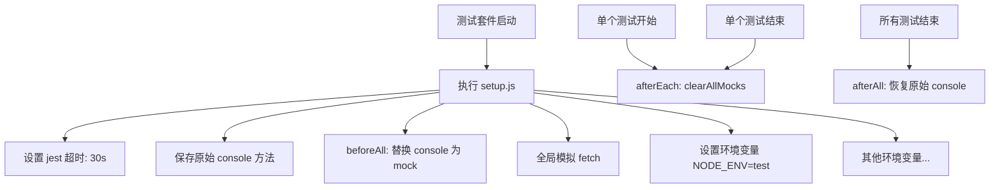
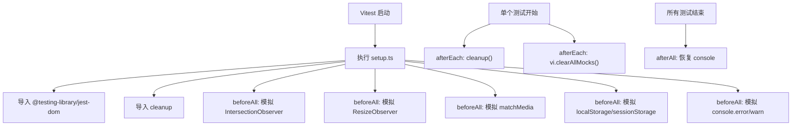
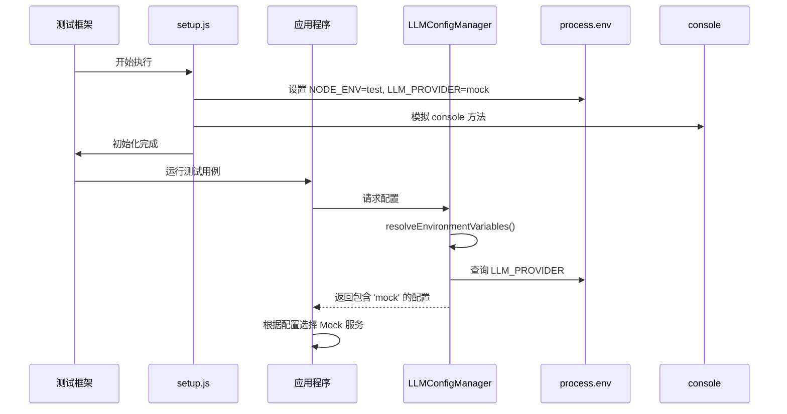

# 测试环境配置

<cite>
**本文档引用的文件**
- [setup.js](file://backend/tests/setup.js)
- [setup.ts](file://frontend/tests/setup.ts)
- [default.json](file://config/default.json)
- [development.json](file://config/development.json)
- [production.json](file://config/production.json)
- [LLMConfigManager.js](file://backend/src/services/LLMConfigManager.js)
- [package.test.json](file://backend/package.test.json)
</cite>

## 目录
1. [全局测试上下文初始化](#全局测试上下文初始化)
2. [环境配置文件加载与合并规则](#环境配置文件加载与合并规则)
3. [环境变量控制测试行为](#环境变量控制测试行为)
4. [测试隔离性与可重复性保障](#测试隔离性与可重复性保障)
5. [常见问题诊断步骤](#常见问题诊断步骤)
6. [最佳实践建议](#最佳实践建议)

## 全局测试上下文初始化

后端和前端的测试框架分别通过 `setup.js` 和 `setup.ts` 文件在测试运行前进行全局上下文的初始化。这些设置确保了测试环境的一致性和稳定性。

### 后端测试初始化 (Jest)

在 `backend/tests/setup.js` 中，Jest 框架通过 `beforeAll`、`afterEach` 和 `afterAll` 钩子函数执行以下操作：

- **超时设置**：将 Jest 的默认超时时间设置为 30 秒，以适应可能较慢的集成测试。
- **日志级别控制**：在所有测试开始前 (`beforeAll`)，将 `console.error`、`console.warn` 和 `console.log` 方法替换为 Jest 的模拟函数 (`jest.fn()`)，从而抑制测试过程中的日志输出，使测试报告更清晰。在所有测试结束后 (`afterAll`)，恢复原始的 console 方法。
- **全局模拟**：对 `global.fetch` 进行模拟，防止测试期间发出真实的网络请求。
- **清理机制**：在每个测试用例之后 (`afterEach`)，调用 `jest.clearAllMocks()` 来清除所有模拟函数的调用记录和实现，保证测试间的独立性。
- **环境变量注入**：在初始化阶段，明确设置了 `NODE_ENV=test`、`LLM_PROVIDER=mock` 和 `MOCK_MODE=true` 等关键环境变量，强制应用进入测试模式并使用模拟的大模型服务。



**Diagram sources**
- [setup.js](file://backend/tests/setup.js#L1-L35)

### 前端测试初始化 (Vitest)

在 `frontend/tests/setup.ts` 中，Vitest 框架进行了类似的初始化，但针对的是浏览器环境：

- **DOM 清理**：利用 `@testing-library/react` 提供的 `cleanup` 函数，在每个测试后 (`afterEach`) 自动清理渲染的 DOM，避免内存泄漏和状态污染。
- **浏览器 API 模拟**：在所有测试开始前 (`beforeAll`)，对多个现代浏览器 API 进行了全面的模拟：
  - `IntersectionObserver`：用于懒加载等场景。
  - `ResizeObserver`：用于响应式布局检测。
  - `matchMedia`：用于媒体查询（如暗黑模式）。
  - `localStorage` 和 `sessionStorage`：提供可追踪的模拟存储对象，允许测试验证数据持久化逻辑。
- **日志控制**：与后端类似，通过 `vi.fn()` 模拟 `console.error` 和 `console.warn`，并在测试结束后恢复。
- **依赖库导入**：引入了 `@testing-library/jest-dom` 以扩展 Jest 的匹配器，支持更直观的 DOM 断言。



**Diagram sources**
- [setup.ts](file://frontend/tests/setup.ts#L1-L84)

**Section sources**
- [setup.js](file://backend/tests/setup.js#L1-L35)
- [setup.ts](file://frontend/tests/setup.ts#L1-L84)

## 环境配置文件加载与合并规则

项目采用基于 Node.js 的 `config` 库来管理多环境配置，其核心位于 `config/` 目录下的 JSON 文件。

### 配置文件优先级与合并

配置系统遵循一个严格的加载和合并顺序，确保特定环境的设置能够覆盖通用设置：

1.  **基础配置 (`default.json`)**：这是所有环境的基础。它定义了应用的所有默认值，例如服务器端口、日志级别、会话存储路径等。任何未被后续文件覆盖的配置都将沿用此文件的设定。
2.  **环境特定配置**：根据当前 `NODE_ENV` 环境变量的值，系统会加载对应的文件：
    -   `NODE_ENV=development` -> 加载 `development.json`
    -   `NODE_ENV=production` -> 加载 `production.json`
    -   `NODE_ENV=test` -> 加载 `test.json` (本项目中未显式提供，但系统会尝试查找)。
3.  **深度合并**：系统会对 `default.json` 和匹配的环境配置文件进行**深度合并**。这意味着不是简单地替换整个对象，而是递归地合并嵌套的对象属性。例如，`default.json` 定义了完整的 `logging` 对象，而 `development.json` 只修改了其中的 `level` 和 `file.enabled` 字段，最终的配置将是两者的结合。

#### 示例：开发环境配置
当 `NODE_ENV=development` 时，实际生效的配置是 `default.json` 和 `development.json` 的合并结果：
-   `app.port`: `3001` (来自 `development.json`)
-   `llm.provider`: `"mock"` (来自 `development.json`)
-   `logging.level`: `"debug"` (来自 `development.json`)
-   `logging.file.enabled`: `false` (来自 `development.json`)
-   `security.cors.origin`: 包含 `localhost` 和 `127.0.0.1` 的数组 (来自 `development.json` 扩展了 `default.json`)

### 生产环境的动态配置

`production.json` 展示了一种更高级的模式——**环境变量占位符**。它使用 `${ENV_VAR_NAME:default_value}` 的语法，允许配置项从操作系统环境变量中获取值，如果环境变量不存在，则使用冒号后的默认值。

例如：
```json
"port": "${PORT:3000}"
"apiKey": "${LLM_API_KEY:}"
"cors": {
  "origin": "${CORS_ORIGINS:https://yourdomain.com}".split(",")
}
```
这种设计使得生产环境的部署更加灵活，无需修改代码或配置文件即可通过 Docker 或云平台的环境变量注入来调整应用行为。

**Section sources**
- [default.json](file://config/default.json#L1-L87)
- [development.json](file://config/development.json#L1-L45)
- [production.json](file://config/production.json#L1-L53)

## 环境变量控制测试行为

环境变量是连接测试脚本与应用逻辑的关键桥梁，它们决定了应用在测试期间的行为模式。

### 关键环境变量及其作用

| 环境变量 | 设置位置 | 主要作用 |
| :--- | :--- | :--- |
| `NODE_ENV` | `backend/tests/setup.js` | 告知应用当前处于 `test` 模式。许多中间件（如错误处理、安全策略）会根据此变量调整行为，例如在非生产环境下显示详细的错误堆栈。 |
| `LLM_PROVIDER` | `backend/tests/setup.js` | 强制大模型服务使用 `mock` 提供商。这会跳过所有与真实 AI 服务（如 Ollama 或 OpenAI）的网络通信，返回预设的模拟响应，极大地提高测试速度和可靠性。 |
| `MOCK_MODE` | `backend/tests/setup.js` | 一个自定义标志，可用于在代码中开启额外的模拟逻辑或简化流程，确保测试环境的纯净。 |

### 环境变量解析机制

后端的 `LLMConfigManager.js` 实现了一个名为 `resolveEnvironmentVariables` 的方法，专门用于处理配置文件中的占位符。该方法使用正则表达式 `\$\{([^}]+)\}` 来匹配形如 `${VAR_NAME}` 的字符串，并将其替换为 `process.env['VAR_NAME']` 的值。这个机制不仅用于生产环境，也确保了即使在测试中，配置系统也能正确解析任何潜在的占位符。



**Diagram sources**
- [setup.js](file://backend/tests/setup.js#L33-L34)
- [LLMConfigManager.js](file://backend/src/services/LLMConfigManager.js#L268-L275)

**Section sources**
- [setup.js](file://backend/tests/setup.js#L33-L34)
- [LLMConfigManager.js](file://backend/src/services/LLMConfigManager.js#L268-L275)

## 测试隔离性与可重复性保障

为了确保测试的可靠性和可维护性，项目采取了多项措施来保障测试的隔离性与可重复性。

### 隔离性 (Isolation)

-   **Mocking**：这是最核心的手段。通过模拟外部依赖（如数据库、API、浏览器 API），每个测试都运行在一个受控的“沙箱”中。后端的 `supertest` 和 `jest.mock`，前端的 `vi.mock` 和 `Object.defineProperty` 都是为了实现这一点。
-   **状态清理**：`afterEach` 钩子是保证隔离性的关键。`jest.clearAllMocks()` 清除模拟状态，`cleanup()` 清理 DOM，确保下一个测试不会受到前一个测试残留状态的影响。
-   **独立的数据路径**：虽然在 `setup.js` 中没有直接体现，但从 `development.json` 中可以看到 `session.dataPath` 被设置为 `./data/sessions-dev`。可以推断，在 `test` 环境下，会话数据会被写入一个独立的目录（如 `./data/sessions-test`），从而避免污染开发或生产数据。

### 可重复性 (Repeatability)

-   **确定性输入**：测试用例使用固定的、预定义的输入数据（如 `session.test.js` 中的 `problem_description`）。这保证了每次运行都能得到相同的初始条件。
-   **模拟的确定性响应**：模拟的服务（如 `fetch` 或 `apiClient`）被配置为返回固定的、预期的响应。这消除了因网络延迟、第三方服务故障或随机性导致的测试失败。
-   **统一的初始化**：`setup.js` 和 `setup.ts` 为所有测试提供了完全一致的起点，消除了因环境差异导致的不确定性。

**Section sources**
- [setup.js](file://backend/tests/setup.js#L1-L35)
- [setup.ts](file://frontend/tests/setup.ts#L1-L84)
- [session.test.js](file://backend