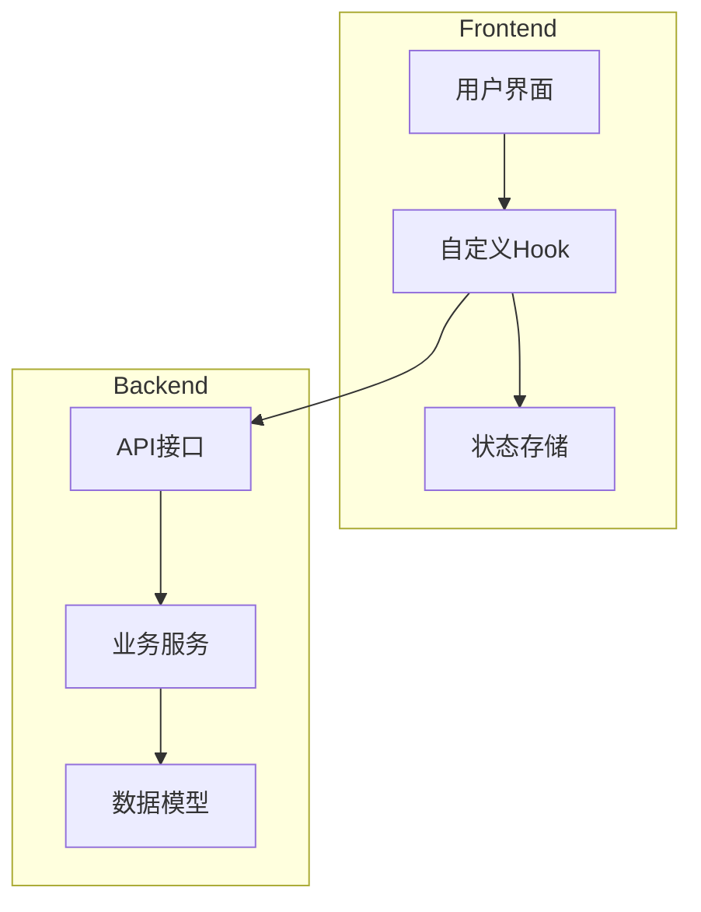
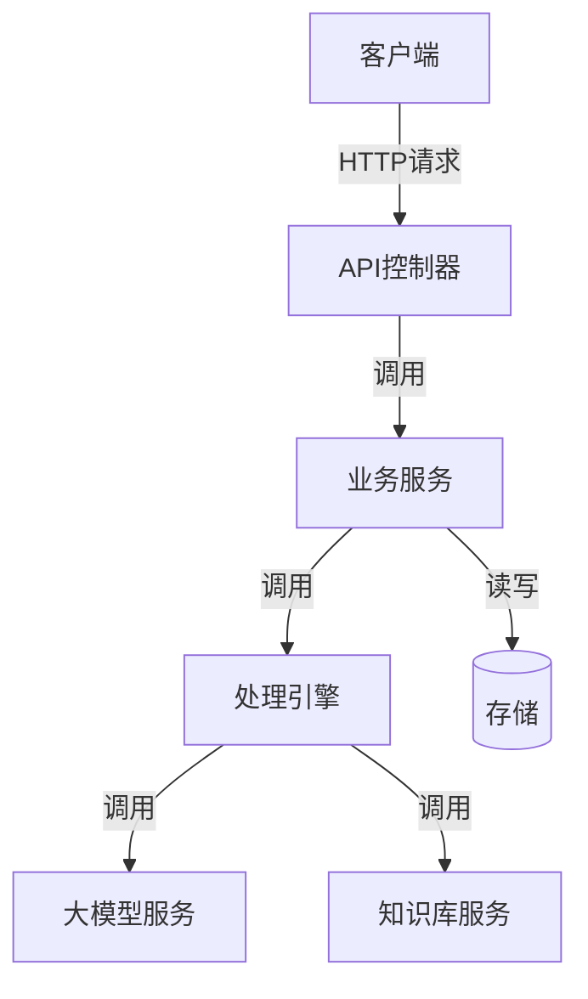
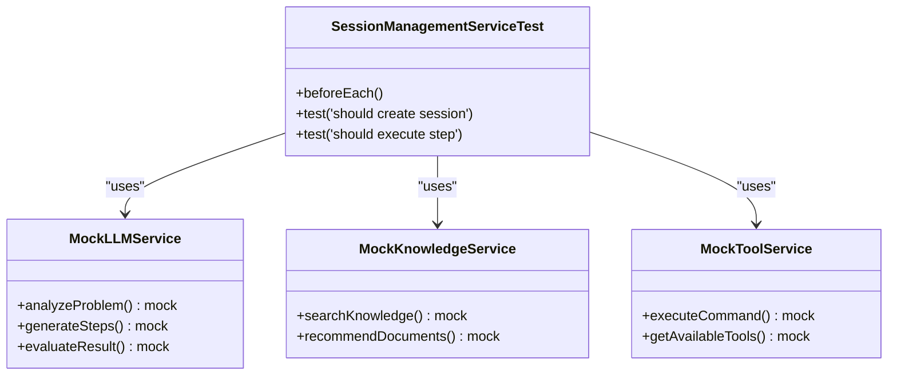

# 测试策略

<cite>
**本文档引用的文件**
- [SessionManagementService.js](file://backend/src/services/SessionManagementService.js)
- [useSession.ts](file://frontend/src/hooks/useSession.ts)
- [SessionManagementService.test.js](file://backend/tests/unit/services/SessionManagementService.test.js)
- [session.test.js](file://backend/tests/integration/api/session.test.js)
- [useSession.test.ts](file://frontend/tests/unit/hooks/useSession.test.ts)
- [session-flow.test.js](file://backend/tests/integration/e2e/session-flow.test.js)
- [user-flow.test.tsx](file://frontend/tests/integration/user-flow.test.tsx)
- [app.js](file://backend/src/app.js)
- [api.ts](file://frontend/src/utils/api.ts)
- [sessionController.js](file://backend/src/controllers/sessionController.js)
- [sessionStore.ts](file://frontend/src/stores/sessionStore.ts)
- [index.ts](file://frontend/src/types/index.ts)
</cite>

## 目录
1. [引言](#引言)
2. [项目结构概述](#项目结构概述)
3. [核心组件分析](#核心组件分析)
4. [架构概览](#架构概览)
5. [详细组件分析](#详细组件分析)
6. [依赖关系分析](#依赖关系分析)
7. [性能考量](#性能考量)
8. [故障排除指南](#故障排除指南)
9. [结论](#结论)

## 引言
本测试策略文档旨在全面阐述智能运维助手应用程序的系统性测试方法。文档涵盖了从单元测试、集成测试到端到端测试的完整实施框架，重点说明了如何利用Jest和Supertest等工具对后端服务进行验证，以及如何通过Vitest测试前端自定义Hook的行为。此外，文档还介绍了模拟LLM响应、验证会话状态转换、CI/CD集成方式以及编写高质量测试用例的最佳实践。

## 项目结构概述
智能运维助手应用程序采用前后端分离的微服务架构。后端基于Node.js和Express框架构建，位于`backend`目录下，其核心功能包括会话管理、大模型（LLM）交互、知识库检索和工具执行。`src/services`目录包含了业务逻辑的核心服务，如`SessionManagementService`和`LLMService`。前端则使用React框架，位于`frontend`目录下，通过Zustand进行状态管理，并利用自定义Hook（如`useSession`）封装与后端的交互逻辑。测试代码被清晰地组织在各自的`tests`目录中，分为`unit`（单元测试）、`integration`（集成测试）和`e2e`（端到端测试）三个层级，确保了测试的层次化和可维护性。

**图源**
- [app.js](file://backend/src/app.js#L1-L147)
- [api.ts](file://frontend/src/utils/api.ts#L1-L234)

**章节来源**
- [app.js](file://backend/src/app.js#L1-L147)
- [api.ts](file://frontend/src/utils/api.ts#L1-L234)

## 核心组件分析
本系统的两大核心是后端的`SessionManagementService`和前端的`useSession` Hook。`SessionManagementService`负责管理运维问题处置的整个生命周期，包括创建会话、执行步骤、处理反馈和完成会话。它通过调用`ProcessingEngine`来协调LLM分析、知识库搜索和自动工具执行。该服务实现了内存与文件的双重存储机制，并具备自动保存和过期清理功能，确保了数据的持久性和系统稳定性。前端的`useSession` Hook则是连接UI与后端API的桥梁，它封装了所有与会话相关的异步操作（如创建、加载、执行步骤），并利用`useSessionStore`统一管理应用状态，使得UI组件可以简洁地消费这些状态和行为。

**章节来源**
- [SessionManagementService.js](file://backend/src/services/SessionManagementService.js#L16-L668)
- [useSession.ts](file://frontend/src/hooks/useSession.ts#L7-L175)

## 架构概览
系统的整体架构遵循分层设计原则。前端通过HTTP请求与后端RESTful API进行通信。后端API层（由`sessionController.js`等控制器实现）接收请求，经过中间件（如身份验证、输入验证）处理后，将业务逻辑委派给相应的服务层（如`SessionManagementService`）。服务层是业务规则的核心，它可能进一步调用其他服务或访问数据模型。这种清晰的分层确保了关注点分离，为不同层面的测试提供了便利。

**图源**
- [sessionController.js](file://backend/src/controllers/sessionController.js#L1-L241)
- [SessionManagementService.js](file://backend/src/services/SessionManagementService.js#L16-L668)

## 详细组件分析

### 后端服务单元测试分析
后端单元测试主要针对`services`目录下的核心业务逻辑。以`SessionManagementService.test.js`为例，测试通过Jest的`jest.mock()`功能对`LLMService`、`KnowledgeBaseService`等外部依赖进行模拟，从而隔离被测单元。测试用例覆盖了会话创建、步骤执行、反馈处理和状态管理等关键路径。例如，在“应该成功创建会话”测试中，通过断言`mockLLMService.analyzeProblem`和`mockLLMService.generateSteps`等模拟服务的方法是否被正确调用，来验证`createSession`方法的内部流程。这确保了即使在没有真实LLM的情况下，也能可靠地测试服务的逻辑正确性。

#### 服务依赖模拟类图

**图源**
- [SessionManagementService.test.js](file://backend/tests/unit/services/SessionManagementService.test.js#L1-L450)

**章节来源**
- [SessionManagementService.test.js](file://backend/tests/unit/services/SessionManagementService.test.js#L1-L450)

### 前端Hook单元测试分析
前端单元测试聚焦于`hooks`目录下的自定义Hook，特别是`useSession.test.ts`。测试使用`@testing-library/react`的`renderHook`来渲染Hook，并通过`jest.mock()`模拟