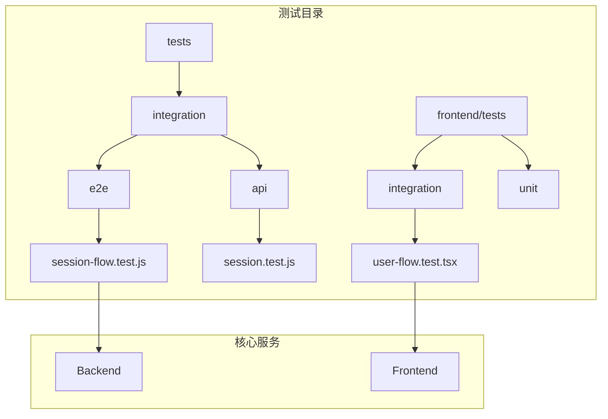
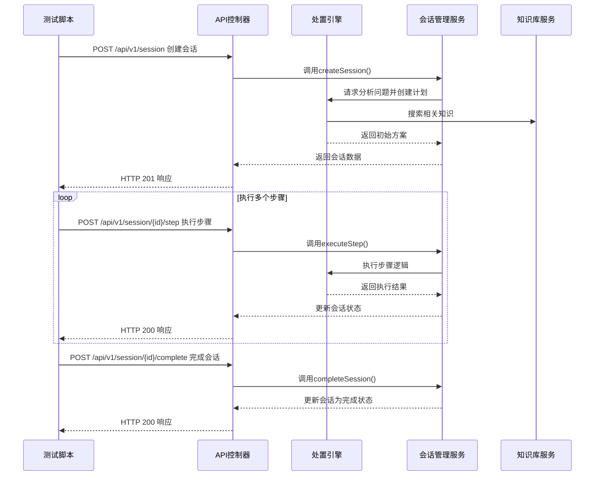
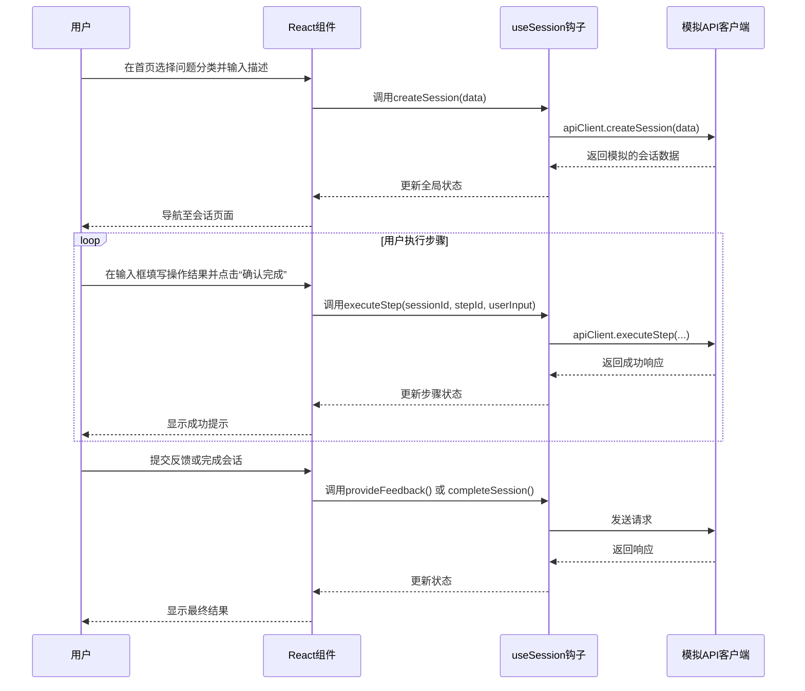

# 端到端测试

<cite>
**本文档引用的文件**   
- [session-flow.test.js](file://backend/tests/integration/e2e/session-flow.test.js)
- [user-flow.test.tsx](file://frontend/tests/integration/user-flow.test.tsx)
- [useSession.ts](file://frontend/src/hooks/useSession.ts)
- [api.ts](file://frontend/src/utils/api.ts)
- [ProcessingEngine.js](file://backend/src/services/ProcessingEngine.js)
- [SessionManagementService.js](file://backend/src/services/SessionManagementService.js)
- [vite.config.ts](file://frontend/vite.config.ts)
- [vitest.config.ts](file://frontend/vitest.config.ts)
- [package.test.json](file://backend/package.test.json)
- [package.test.json](file://frontend/package.test.json)
</cite>

## 目录
1. [简介](#简介)
2. [项目结构与测试布局](#项目结构与测试布局)
3. [核心测试流程分析](#核心测试流程分析)
4. [测试环境配置](#测试环境配置)
5. [异步等待与重试机制](#异步等待与重试机制)
6. [故障排查指南](#故障排查指南)
7. [测试稳定性与可维护性提升技巧](#测试稳定性与可维护性提升技巧)
8. [总结](#总结)

## 简介
本专项文档旨在全面阐述智能运维助手系统的端到端测试策略，重点说明如何通过自动化测试脚本验证从用户问题输入到最终解决方案生成的完整工作流。文档以 `session-flow.test.js` 和 `user-flow.test.tsx` 两个核心测试文件为例，深入剖析测试用例的设计思路、执行流程和验证机制。

**Section sources**
- [session-flow.test.js](file://backend/tests/integration/e2e/session-flow.test.js)
- [user-flow.test.tsx](file://frontend/tests/integration/user-flow.test.tsx)

## 项目结构与测试布局
系统采用前后端分离架构，其测试体系也相应地分为后端API集成测试和前端UI集成测试两大部分。



**Diagram sources **
- [session-flow.test.js](file://backend/tests/integration/e2e/session-flow.test.js)
- [user-flow.test.tsx](file://frontend/tests/integration/user-flow.test.tsx)

**Section sources**
- [session-flow.test.js](file://backend/tests/integration/e2e/session-flow.test.js)
- [user-flow.test.tsx](file://frontend/tests/integration/user-flow.test.tsx)

## 核心测试流程分析
端到端测试的核心目标是模拟真实用户的操作行为，验证整个处置流程的正确性和健壮性。`session-flow.test.js` 和 `user-flow.test.tsx` 分别从API层和UI层对这一流程进行了完整的覆盖。

### 后端API端到端测试 (session-flow.test.js)
该测试文件位于 `backend/tests/integration/e2e/` 目录下，使用 `supertest` 库直接调用Express应用实例，模拟HTTP请求来驱动整个会话流程。



**Diagram sources **
- [session-flow.test.js](file://backend/tests/integration/e2e/session-flow.test.js)
- [ProcessingEngine.js](file://backend/src/services/ProcessingEngine.js)
- [SessionManagementService.js](file://backend/src/services/SessionManagementService.js)

### 前端UI集成测试 (user-flow.test.tsx)
该测试文件位于 `frontend/tests/integration/` 目录下，使用Vitest和Testing Library来渲染React组件，并模拟用户在浏览器中的交互行为。



**Diagram sources **
- [user-flow.test.tsx](file://frontend/tests/integration/user-flow.test.tsx)
- [useSession.ts](file://frontend/src/hooks/useSession.ts)
- [api.ts](file://frontend/src/utils/api.ts)

**Section sources**
- [session-flow.test.js](file://backend/tests/integration/e2e/session-flow.test.js)
- [user-flow.test.tsx](file://frontend/tests/integration/user-flow.test.tsx)

## 测试环境配置
为了确保测试的稳定性和独立性，项目通过专门的配置文件和初始化脚本来搭建测试环境。

### 配置文件加载
项目使用独立的 `package.test.json` 文件来定义测试专用的npm脚本，避免与开发和生产环境冲突。

```json
{
  "scripts": {
    "test": "jest",
    "test:integration": "jest --testPathPattern=integration"
  },
  "jest": {
    "setupFilesAfterEnv": ["<rootDir>/tests/setup.js"],
    "testEnvironment": "node"
  }
}
```
此配置指定了Jest的设置文件和测试环境。

### 数据库快照与内存存储
由于系统使用内存+文件存储作为数据库，测试时通过以下方式保证数据隔离：
1.  **环境变量**: 在 `backend/tests/setup.js` 中设置 `process.env.NODE_ENV = 'test'`。
2.  **Mock模式**: 设置 `process.env.MOCK_MODE = 'true'`，使LLM服务返回预设的模拟响应。
3.  **独立数据路径**: 会话管理服务 (`SessionManagementService`) 在测试环境下会使用独立的数据存储路径，避免污染开发数据。

**Section sources**
- [package.test.json](file://backend/package.test.json)
- [setup.js](file://backend/tests/setup.js)
- [SessionManagementService.js](file://backend/src/services/SessionManagementService.js)

## 异步等待与重试机制
端到端测试中充满了异步操作，如API调用、状态更新和UI渲染。正确的等待和重试策略是保证测试稳定的关键。

### 使用 `waitFor` 进行异步断言
在前端测试 `user-flow.test.tsx` 中，大量使用了 `@testing-library/react` 提供的 `waitFor` 函数。它会持续检查某个条件是否满足，直到超时为止，非常适合处理由异步操作引起的延迟。

```javascript
// 示例：等待API调用被触发
await waitFor(() => {
  expect(mockApiClient.createSession).toHaveBeenCalledWith({
    problem_category: 'network',
    problem_description: '服务器无法连接外部API，连接超时'
  });
});
```

### Vitest 的 `vi.fn()` 与 Mock 实现
通过 `vi.fn()` 创建的Mock函数可以记录调用历史，结合 `waitFor` 可以精确地验证异步操作的结果。

### Jest 的 `async/await` 与 Promise
后端测试 `session-flow.test.js` 主要依赖 `supertest` 返回的Promise链，并配合 `async/await` 语法进行同步化处理，确保每个HTTP请求都按顺序执行和验证。

**Section sources**
- [user-flow.test.tsx](file://frontend/tests/integration/user-flow.test.tsx)
- [session-flow.test.js](file://backend/tests/integration/e2e/session-flow.test.js)

## 故障排查指南
当端到端测试失败时，需要系统性地定位问题根源。

### 页面渲染失败
*   **现象**: 测试脚本找不到预期的DOM元素。
*   **排查方法**:
    1.  检查 `renderApp()` 函数是否正确渲染了包含路由的 `<BrowserRouter>`。
    2.  使用 `screen.debug()` 输出当前渲染的HTML，确认组件是否已挂载。
    3.  检查 `waitFor` 的超时时间是否足够长，网络请求或状态更新可能比预期慢。

### 状态不同步
*   **现象**: 组件的状态没有按预期更新。
*   **排查方法**:
    1.  确认自定义Hook（如 `useSession`）中的 `useCallback` 和依赖数组是否正确，避免产生陈旧的闭包。
    2.  检查Mock API的响应数据格式是否与实际API完全一致。
    3.  利用 `console.log` 或 `debugger` 语句，在关键的 `setState` 调用前后打印状态值，追踪状态变化。

### API调用未触发
*   **现象**: Mock函数的调用次数为0。
*   **排查方法**:
    1.  确保 `vi.mock('../src/utils/api')` 的路径正确无误。
    2.  检查被测组件中调用API的方法是否真的被执行（例如，按钮是否被正确点击）。
    3.  在 `beforeEach` 中使用 `vi.clearAllMocks()` 清除之前的调用记录。

**Section sources**
- [user-flow.test.tsx](file://frontend/tests/integration/user-flow.test.tsx)
- [useSession.ts](file://frontend/src/hooks/useSession.ts)

## 测试稳定性与可维护性提升技巧
为了构建一个长期可靠的测试套件，采用了以下最佳实践。

### 全局Mock简化测试
在 `frontend/tests/setup.ts` 中，对 `localStorage`、`sessionStorage`、`IntersectionObserver` 等浏览器API进行了全局Mock。这消除了这些API在Node.js环境中不可用或行为不一致带来的不确定性，极大地提高了测试的稳定性。

### 清晰的测试分组与命名
测试用例使用 `describe` 和 `test` 进行了清晰的分组，例如 `describe('完整的用户交互流程', ...)`。测试名称也力求描述性，如 `'用户可以在会话页面执行步骤'`，使得测试报告一目了然。

### 关注核心业务流程
测试的重点放在了核心的业务流程上，如“创建会话”、“执行步骤”、“提交反馈”，而不是去测试每一个细小的UI样式或非关键功能。这保证了测试的效率和价值。

### 并发与边界条件测试
`session-flow.test.js` 中包含了“并发会话处理”的测试场景，验证了系统在高负载下的表现。同时，也测试了错误处理（如健康检查），确保系统具备良好的容错能力。

**Section sources**
- [setup.ts](file://frontend/tests/setup.ts)
- [user-flow.test.tsx](file://frontend/tests/integration/user-flow.test.tsx)
- [session-flow.test.js](file://backend/tests/integration/e2e/session-flow.test.js)

## 总结
通过对 `session-flow.test.js` 和 `user-flow.test.tsx` 的分析，我们可以看到该项目建立了一套完善的端到端测试体系。它从前端UI到后端API，完整地模拟了用户的真实操作流程。通过精心设计的测试环境、合理的异步处理策略以及详尽的故障排查指南，这套测试不仅能够有效验证系统的功能正确性，还能保障其在持续迭代过程中的稳定性和可靠性，为智能运维助手的高质量交付提供了坚实的基础。