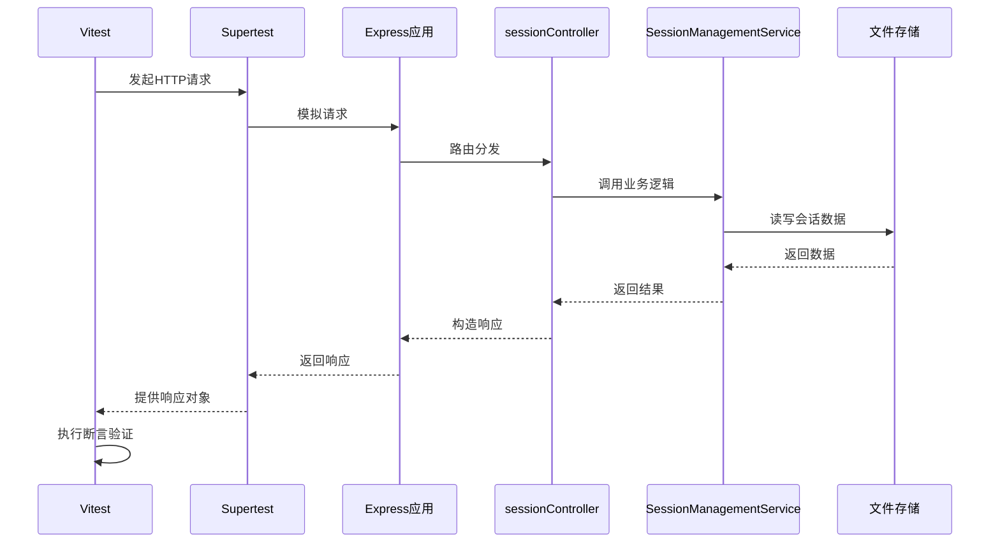
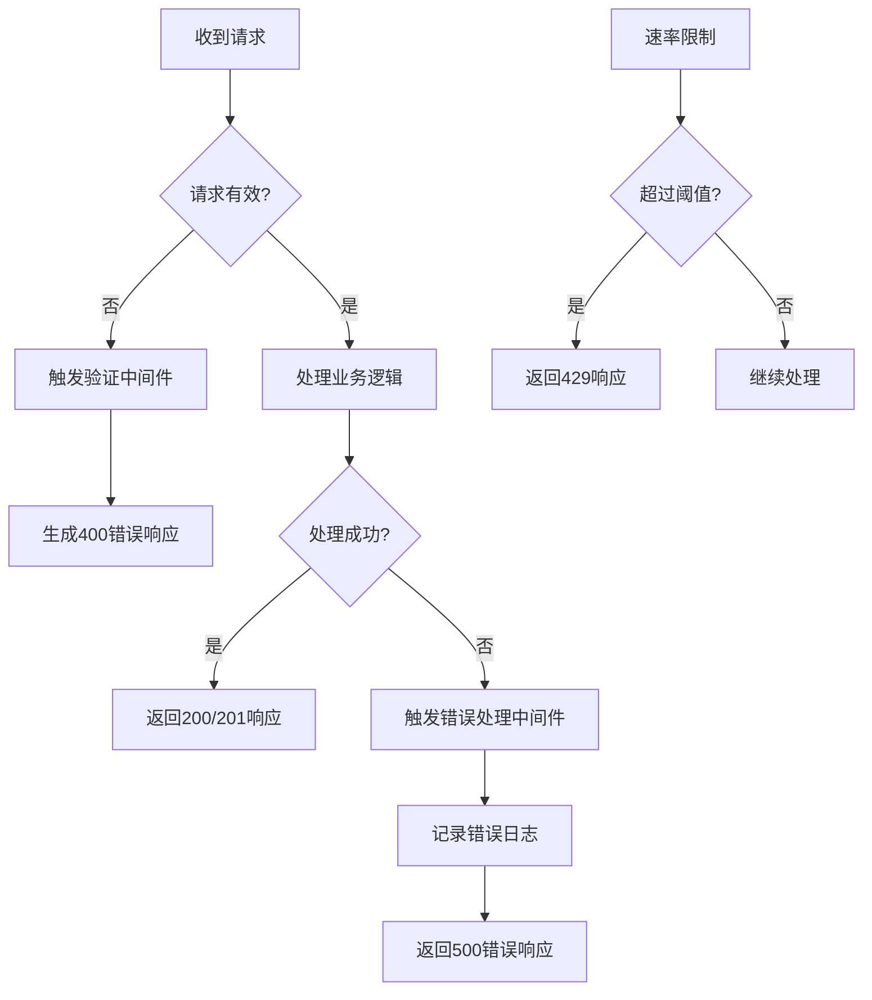
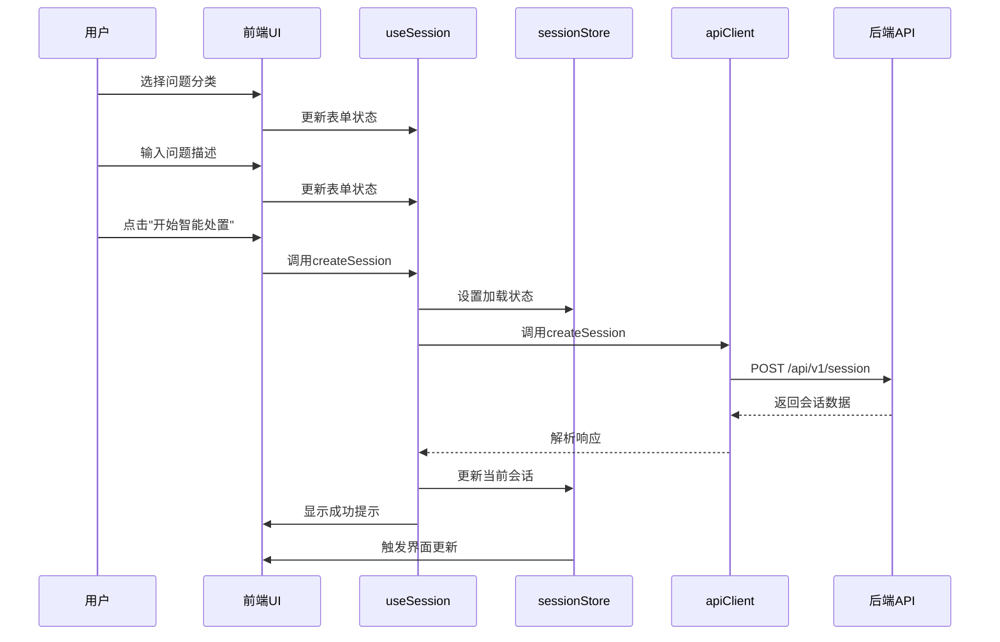
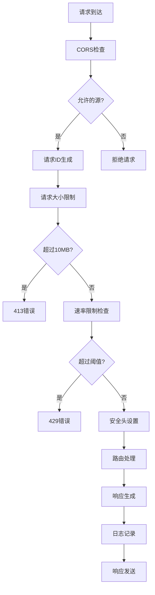
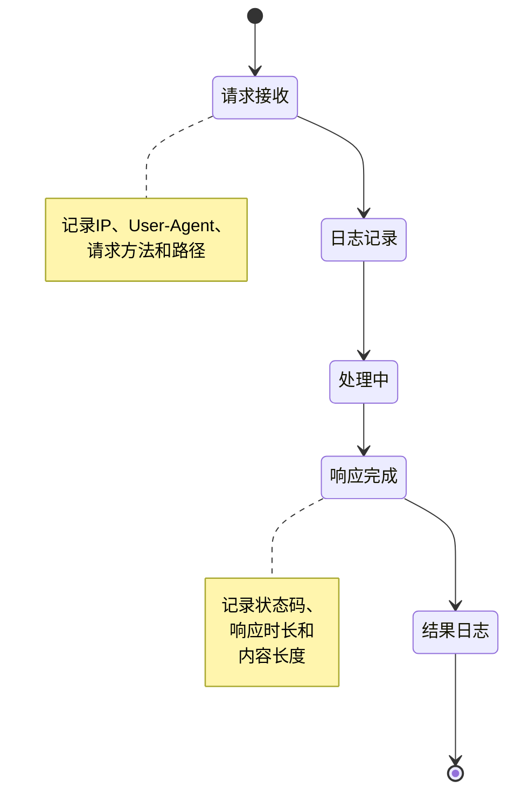

# 集成测试

<cite>
**本文档引用的文件**
- [session.test.js](file://backend/tests/integration/api/session.test.js)
- [user-flow.test.tsx](file://frontend/tests/integration/user-flow.test.tsx)
- [security.js](file://backend/src/middleware/security.js)
- [requestLogger.js](file://backend/src/middleware/requestLogger.js)
- [sessionController.js](file://backend/src/controllers/sessionController.js)
- [validation.js](file://backend/src/middleware/validation.js)
- [SessionManagementService.js](file://backend/src/services/SessionManagementService.js)
- [Session.js](file://backend/src/models/Session.js)
- [Step.js](file://backend/src/models/Step.js)
- [api.ts](file://frontend/src/utils/api.ts)
- [useSession.ts](file://frontend/src/hooks/useSession.ts)
- [sessionStore.ts](file://frontend/src/stores/sessionStore.ts)
- [index.ts](file://frontend/src/types/index.ts)
- [app.js](file://backend/src/app.js)
- [index.js](file://backend/src/middleware/index.js)
</cite>

## 目录
1. [集成测试概述](#集成测试概述)
2. [API端点交互测试](#api端点交互测试)
3. [前后端协作流程测试](#前后端协作流程测试)
4. [中间件影响分析](#中间件影响分析)
5. [数据库状态一致性检查](#数据库状态一致性检查)
6. [最佳实践总结](#最佳实践总结)

## 集成测试概述

集成测试是验证系统各组件协同工作的关键环节，重点关注API端点之间的交互以及前后端的整体协作。与单元测试不同，集成测试模拟真实环境下的完整调用链路，确保数据在不同服务和层之间正确传递。

集成测试与端到端（e2e）测试的主要区别在于测试范围和关注点：
- **集成测试**：聚焦于特定功能模块或服务间的接口交互，如API端点调用、服务间通信等，通常不涉及完整的用户界面操作。
- **端到端测试**：模拟真实用户从开始到结束的完整操作流程，覆盖前端UI、网络请求、后端处理到数据库更新的全过程。

本项目通过Supertest和Vitest框架实现多层次的集成测试策略，既保证了核心API功能的稳定性，又验证了用户实际使用场景的完整性。

## API端点交互测试

### 会话管理API测试策略

`session.test.js`文件中的测试用例全面覆盖了会话管理API的所有关键路径，采用Supertest库直接与Express应用实例进行交互，验证HTTP请求的完整生命周期。



**图示来源**
- [session.test.js](file://backend/tests/integration/api/session.test.js)
- [sessionController.js](file://backend/src/controllers/sessionController.js)
- [SessionManagementService.js](file://backend/src/services/SessionManagementService.js)

#### 请求验证过程

会话创建接口的测试用例详细验证了请求的各个方面：

1. **成功创建会话**：验证POST `/api/v1/session`端点能正确处理有效请求，返回201状态码，并包含正确的会话数据结构。
2. **参数校验**：系统性地测试各种无效输入情况，包括缺失必需字段、无效问题分类、描述长度不足等，确保返回适当的400错误响应。
3. **请求头和内容类型**：隐式验证Content-Type头的正确性，确保API能正确解析JSON请求体。
4. **状态码验证**：针对不同场景验证相应的HTTP状态码，如201（创建成功）、400（客户端错误）、404（资源未找到）等。
5. **响应结构断言**：使用expect断言验证响应体的JSON结构，包括success标志、data字段的存在性和具体内容。

**节段来源**
- [session.test.js](file://backend/tests/integration/api/session.test.js#L15-L85)
- [validation.js](file://backend/src/middleware/validation.js#L97-L135)

#### 错误处理机制

测试用例还专门验证了系统的错误处理能力：



**图示来源**
- [session.test.js](file://backend/tests/integration/api/session.test.js#L300-L366)
- [errorHandler.js](file://backend/src/middleware/errorHandler.js)
- [security.js](file://backend/src/middleware/security.js)

## 前后端协作流程测试

### 用户操作链路模拟

`user-flow.test.tsx`文件中的测试用例通过React Testing Library和Vitest模拟了用户在前端应用中的完整操作流程，展示了如何验证前后端的协作。



**图示来源**
- [user-flow.test.tsx](file://frontend/tests/integration/user-flow.test.tsx)
- [useSession.ts](file://frontend/src/hooks/useSession.ts)
- [api.ts](file://frontend/src/utils/api.ts)

#### 测试方法详解

该测试采用以下策略来模拟真实用户行为：

1. **组件渲染**：使用`renderApp`函数渲染整个应用，包含路由和状态管理上下文。
2. **用户事件模拟**：通过`userEvent`库模拟真实的用户交互，如点击、输入等。
3. **API调用验证**：使用`vi.mock`对`apiClient`进行模拟，验证前端是否按预期调用API并传递正确的参数。
4. **状态变化观察**：等待界面元素出现或状态更新，验证应用逻辑的正确性。
5. **错误处理测试**：模拟API错误情况，验证前端的错误提示和用户体验。

**节段来源**
- [user-flow.test.tsx](file://frontend/tests/integration/user-flow.test.tsx#L100-L150)
- [useSession.ts](file://frontend/src/hooks/useSession.ts#L20-L50)
- [sessionStore.ts](file://frontend/src/stores/sessionStore.ts)

## 中间件影响分析

### 安全中间件的作用

安全中间件在请求生命周期中扮演着重要角色，`security.js`文件定义了多个关键的安全措施：



**图示来源**
- [security.js](file://backend/src/middleware/security.js)
- [app.js](file://backend/src/app.js#L30-L50)

#### 关键中间件功能

1. **CORS配置**：精确控制允许访问API的源列表，开发环境中允许本地开发服务器访问。
2. **速率限制**：实施多层级的请求频率限制，保护系统免受滥用。
3. **请求ID**：为每个请求生成唯一标识，便于日志追踪和问题排查。
4. **请求大小限制**：防止过大的请求体导致服务器资源耗尽。

**节段来源**
- [security.js](file://backend/src/middleware/security.js#L15-L200)
- [app.js](file://backend/src/app.js#L40-L45)

### 日志记录中间件

`requestLogger.js`实现了详细的请求日志记录，为系统监控和调试提供重要信息：



**图示来源**
- [requestLogger.js](file://backend/src/middleware/requestLogger.js)
- [logger.js](file://backend/src/utils/logger.js)

## 数据库状态一致性检查

### 会话状态管理

`SessionManagementService.js`实现了内存与文件存储相结合的状态管理策略，确保数据的一致性和持久性。

```mermaid
classDiagram
    class SessionManagementService {
        +sessions: Map~string, Session~
        +config: Object
        +initialize(): Promise~void~
        +createSession(): Promise~Object~
        +getSession(): Promise~Object~
        +saveSessionToFile(session): Promise~void~
        +loadSessionsFromFile(): Promise~void~
        +startAutoSave(): void
        +cleanupExpiredSessions(): void
    }
