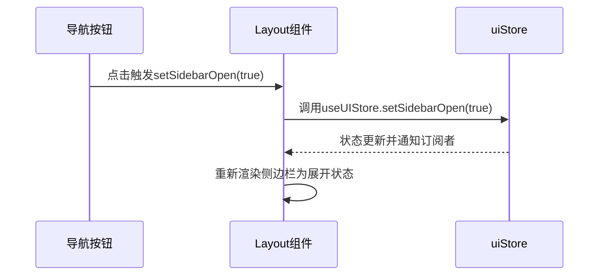
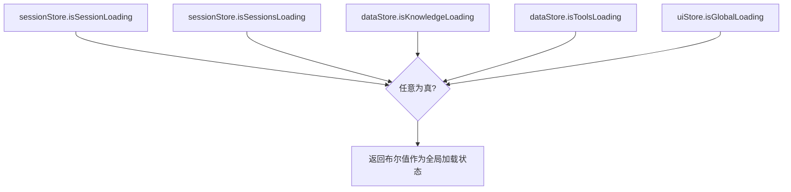
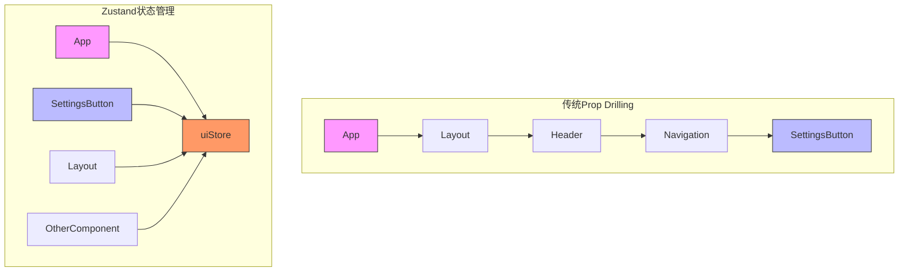

# UI状态管理

<cite>
**Referenced Files in This Document **   
- [uiStore.ts](file://frontend/src/stores/uiStore.ts)
- [Layout.tsx](file://frontend/src/components/Layout.tsx)
- [SettingsPage.tsx](file://frontend/src/pages/SettingsPage.tsx)
</cite>

## 目录
1. [简介](#简介)
2. [核心状态变量](#核心状态变量)
3. [状态同步机制](#状态同步机制)
4. [Action调用模式示例](#action调用模式示例)
5. [避免Prop Drilling的优势](#避免prop-drilling的优势)
6. [调试工具与技巧](#调试工具与技巧)

## 简介
`uiStore`是前端应用中负责集中管理系统级界面状态的核心模块。它使用Zustand库实现全局状态管理，通过单一状态树维护所有UI相关的状态变量，并利用持久化中间件将关键用户偏好设置存储在本地。该设计模式有效解决了组件间状态共享的复杂性问题。

**Section sources**
- [uiStore.ts](file://frontend/src/stores/uiStore.ts#L0-L52)

## 核心状态变量
`uiStore`集中管理以下几类系统级界面状态：

### 全局加载指示器
- `isGlobalLoading`: 布尔值，控制全局加载遮罩的显示/隐藏
- `globalLoadingText`: 字符串，用于显示当前加载过程的描述文本

### 模态框可见性
- `modals`: 对象类型，包含多个模态框的开关状态：
  - `feedbackModal`: 反馈模态框可见性
  - `settingsModal`: 设置模态框可见性  
  - `confirmModal`: 确认对话框可见性
- `confirmModalData`: 存储确认对话框的内容和回调函数

### 侧边栏状态
- `sidebarCollapsed`: 布尔值，表示侧边栏是否处于折叠状态
- `sidebarOpen`: 布尔值，表示移动端侧边栏菜单是否打开

### 用户设置与主题
- `userSettings`: 包含用户个性化配置的对象，包括主题、通知、语言等
- `currentTheme`: 当前应用的主题模式（'light' | 'dark'）
- `notifications`: 通知系统的启用状态和偏好设置

```mermaid
classDiagram
class UIState {
+userSettings : UserSettings
+sidebarCollapsed : boolean
+sidebarOpen : boolean
+currentTheme : 'light'|'dark'
+isGlobalLoading : boolean
+globalLoadingText : string
+modals : { feedbackModal, settingsModal, confirmModal }
+confirmModalData : { title, message, onConfirm, onCancel }
+notifications : { enabled, sound, desktop }
}
class Actions {
+setUserSettings(settings)
+setSidebarCollapsed(collapsed)
+setSidebarOpen(open)
+setCurrentTheme(theme)
+setGlobalLoading(loading, text)
+openModal(modalName)
+closeModal(modalName)
+showConfirmModal(title, message, onConfirm, onCancel)
+setNotifications(notifications)
+applyTheme()
+reset()
}
UIState --> Actions : "contains"
```

**Diagram sources **
- [uiStore.ts](file://frontend/src/stores/uiStore.ts#L0-L52)

**Section sources**
- [uiStore.ts](file://frontend/src/stores/uiStore.ts#L0-L52)

## 状态同步机制
`uiStore`通过订阅-发布模式实现多组件间的同步更新。当任何组件修改了状态后，所有订阅该状态的组件都会自动重新渲染。

### 侧边栏状态同步
`Layout`组件直接依赖`uiStore`中的`sidebarOpen`和`sidebarCollapsed`状态来控制侧边栏的显示行为。这种设计确保了无论用户从哪个页面触发侧边栏操作，都能获得一致的用户体验。



**Diagram sources **
- [Layout.tsx](file://frontend/src/components/Layout.tsx#L79-L118)
- [uiStore.ts](file://frontend/src/stores/uiStore.ts#L106-L146)

### 全局加载状态聚合
通过组合hook `useGlobalLoading`，将来自不同store的加载状态进行聚合，实现了更精确的全局加载指示：



**Diagram sources **
- [index.ts](file://frontend/src/stores/index.ts#L34-L54)

**Section sources**
- [uiStore.ts](file://frontend/src/stores/uiStore.ts#L0-L52)
- [Layout.tsx](file://frontend/src/components/Layout.tsx#L79-L118)

## Action调用模式示例
### 打开设置面板
当用户点击设置链接时，触发`showSettings`变化的过程如下：

1. 导航到`/settings`路由
2. `SettingsPage`组件不直接管理模态状态
3. 如需弹出特定模态框，会调用`uiStore`的相应action

虽然当前`SettingsPage`独立管理其内部状态，但遵循相同的设计模式：通过调用`uiStore`的action来影响全局UI状态。

### 控制模态框显示
打开反馈模态框的标准调用模式：
```typescript
// 在任意组件中
useUIStore.getState().openModal('feedbackModal')
```

关闭所有模态框的批量操作：
```typescript
// 关闭所有打开的模态框
useUIStore.getState().closeAllModals()
```

**Section sources**
- [uiStore.ts](file://frontend/src/stores/uiStore.ts#L142-L183)

## 避免Prop-Drilling的优势
传统的props传递方式会导致"prop drilling"问题，即状态需要逐层传递经过多个中间组件。`uiStore`的引入彻底解决了这一问题：

### 传统模式的问题
```
App → Layout → Header → Navigation → SettingsButton
                      ↓
                  (需要传递sidebar状态)
```

### 使用uiStore的解决方案
```
App → Layout    SettingsButton
     ↓              ↑
   uiStore ←────────┘
(中心化状态管理)
```

这种架构的优势包括：
- **减少组件耦合**：组件不再需要接收与其功能无关的props
- **提高可维护性**：状态逻辑集中在一处，便于修改和测试
- **增强可预测性**：所有状态变更都通过明确的action进行
- **简化组件实现**：组件只需关注自身业务逻辑，无需处理状态传递



**Diagram sources **
- [uiStore.ts](file://frontend/src/stores/uiStore.ts#L0-L52)

**Section sources**
- [uiStore.ts](file://frontend/src/stores/uiStore.ts#L0-L52)

## 调试工具与技巧
### 开发者工具集成
推荐使用浏览器开发者工具配合以下方法进行调试：

1. **状态快照检查**：在控制台执行`useUIStore.getState()`查看当前完整状态
2. **动作追踪**：通过Redux DevTools或Zustand中间件监控每个action的调用
3. **持久化数据检查**：在Application/Storage中查看localStorage里的`ui-storage`条目

### 推荐调试实践
- **初始状态验证**：检查`defaultUserSettings`是否正确应用
- **主题切换测试**：验证`applyTheme`方法是否正确更新CSS变量和DOM类名
- **边界情况测试**：测试连续快速调用`openModal`和`closeModal`的行为

### 组合Hook辅助调试
利用预定义的组合hook简化常见状态的访问：
```typescript
// 获取全局加载状态（聚合多个来源）
const isLoading = useGlobalLoading()

// 重置所有store（用于测试清理）
const resetAll = useResetAllStores()
```

**Section sources**
- [index.ts](file://frontend/src/stores/index.ts#L0-L41)